``` r
library("tidyverse")
library("stringr")
library("dplR")
library("knitr")
# library("detrendeR")
library("pander")
library('boot')
```

Read y Prepare data
===================

-   Leer datos `rwl` de SJ y CA
-   Leer datos de diametros de los focal tree

<!-- -->

    ## There does not appear to be a header in the rwl file
    ## There are 48 series
    ## 1        SNA0101      1947    2016   0.01
    ## 2        SNA0102      1947    2016   0.01
    ## 3        SNA0201      1946    2016   0.01
    ## 4        SNA0202      1948    2016   0.01
    ## 5        SNA0301      1949    2016   0.01
    ## 6        SNA0302      1948    2016   0.01
    ## 7        SNA0401      1947    2016   0.01
    ## 8        SNA0402      1947    2016   0.01
    ## 9        SNA0501      1953    2016   0.01
    ## 10       SNA0502      1948    2016   0.01
    ## 11       SNA0601      1948    2016   0.01
    ## 12       SNA0602      1957    2016   0.01
    ## 13       SNA0603      1947    2012   0.01
    ## 14       SNA0701      1954    2016   0.01
    ## 15       SNA0702      1947    2016   0.01
    ## 16       SNA0801      1949    2016   0.01
    ## 17       SNA0802      1951    2016   0.01
    ## 18       SNA0901      1947    2016   0.01
    ## 19       SNA0902      1947    2016   0.01
    ## 20       SNA0903      1947    2002   0.01
    ## 21       SNA1001      1950    2016   0.01
    ## 22       SNA1002      1953    2016   0.01
    ## 23       SNA1003      1948    2008   0.01
    ## 24       SNA1101      1940    2016   0.01
    ## 25       SNA1102      1929    2016   0.01
    ## 26       SNA1103      1942    1994   0.01
    ## 27       SNA1201      1929    2016   0.01
    ## 28       SNA1202      1929    2016   0.01
    ## 29       SNA1203      1927    1983   0.01
    ## 30       SNA1301      1960    2016   0.01
    ## 31       SNA1302      1949    2016   0.01
    ## 32       SNA1303      1949    2011   0.01
    ## 33       SNA1401      1930    2016   0.01
    ## 34       SNA1402      1949    2016   0.01
    ## 35       SNA1501      1952    2016   0.01
    ## 36       SNA1502      1948    2016   0.01
    ## 37       SNA1601      1959    2016   0.01
    ## 38       SNA1602      1927    2016   0.01
    ## 39       SNA1701      1926    2016   0.01
    ## 40       SNA1702      1930    2016   0.01
    ## 41       SNA1703      1931    2016   0.01
    ## 42       SNA1801      1937    2016   0.01
    ## 43       SNA1802      1936    2016   0.01
    ## 44       SNA1901      1921    2016   0.01
    ## 45       SNA1902      1924    2016   0.01
    ## 46       SNA2001      1932    2016   0.01
    ## 47       SNA2003      1932    2016   0.01
    ## 48       SNA2002      1934    2016   0.01

    ## There does not appear to be a header in the rwl file
    ## There are 60 series
    ## 1        SNB0101      1899    2016   0.01
    ## 2        SNB0102      1902    2016   0.01
    ## 3        SNB0201      1916    2016   0.01
    ## 4        SNB0202      1876    2016   0.01
    ## 5        SNB0301      1862    2016   0.01
    ## 6        SNB0302      1862    2016   0.01
    ## 7        SNB0401      1870    2016   0.01
    ## 8        SNB0402      1866    2016   0.01
    ## 9        SNB0501      1864    2016   0.01
    ## 10       SNB0502g     1867    2016   0.01
    ## 11       SNB0601      1860    2016   0.01
    ## 12       SNB0602      1873    2016   0.01
    ## 13       SNB0701      1851    2016   0.01
    ## 14       SNB0702g     1861    2016   0.01
    ## 15       SNB0801g     1851    2016   0.01
    ## 16       SNB0802g     1853    2016   0.01
    ## 17       SNB0901g     1836    2016   0.01
    ## 18       SNB0902      1844    2016   0.01
    ## 19       SNB1001      1868    2016   0.01
    ## 20       SNB1002      1870    2016   0.01
    ## 21       SNB1101      1949    2016   0.01
    ## 22       SNB1102      1893    2016   0.01
    ## 23       SNB1201      1867    2016   0.01
    ## 24       SNB1202      1834    2016   0.01
    ## 25       SNB1301      1865    2016   0.01
    ## 26       SNB1302      1874    2016   0.01
    ## 27       SNB1401      1843    2016   0.01
    ## 28       SNB1402      1848    2016   0.01
    ## 29       SNB1501      1898    2016   0.01
    ## 30       SNB1502      1927    2016   0.01
    ## 31       SNB1601      1846    2016   0.01
    ## 32       SNB1602      1857    2016   0.01
    ## 33       SNB1701      1856    2016   0.01
    ## 34       SNB1702      1853    2016   0.01
    ## 35       SNB1801      1827    2016   0.01
    ## 36       SNB1802      1843    2016   0.01
    ## 37       SNB1901      1888    2016   0.01
    ## 38       SNB1902      1901    2016   0.01
    ## 39       SNB2001      1830    2016   0.01
    ## 40       SNB2002g     1837    2016   0.01
    ## 41       SNB2101      1863    2016   0.01
    ## 42       SNB2102      1858    2016   0.01
    ## 43       SNB2201g     1819    2016   0.01
    ## 44       SNB2202g     1822    2016   0.01
    ## 45       SNB2301g     1832    2016   0.01
    ## 46       SNB2302      1819    2016   0.01
    ## 47       SNB2401      1829    2016   0.01
    ## 48       SNB2402      1831    2016   0.01
    ## 49       SNB2501      1831    2016   0.01
    ## 50       SNB2502      1839    2016   0.01
    ## 51       SNB2601      1872    2016   0.01
    ## 52       SNB2602      1867    2016   0.01
    ## 53       SNB2701      1865    2016   0.01
    ## 54       SNB2702g     1863    2016   0.01
    ## 55       SNB2801      1860    2016   0.01
    ## 56       SNB2802      1866    2016   0.01
    ## 57       SNB2901      1877    2016   0.01
    ## 58       SNB2902      1892    2016   0.01
    ## 59       SNB3001      1867    2016   0.01
    ## 60       SNB3002      1874    2016   0.01

``` r
source(paste0(di, 'script/R/bai_piovesan.R'))
source(paste0(di, 'script/R/rw_byTree.R'))
source(paste0(di, 'script/R/chrono_bai.R'))
source(paste0(di, 'script/R/suaviza_cronos.R'))
source(paste0(di, 'script/R/correlaBootIC.R'))
```

-   Crear dataframes `rwl` por cada sitio CA\_High, CA\_Low, SJ\_High. SJ\_Low (:red\_circle: mejorar la forma de hacerlo)
    -   :red\_circle: ojo he cambiado los nombres de las series en SJ y en CA

``` r
# Replace SNA by SJ and SNB by CA
names(ca) <- stringr::str_replace(names(ca), "SNB", "CA") 
names(sj) <- stringr::str_replace(names(sj), "SNA", "SJ")

# Remove g in name of some cores of CA. 
names(ca) <- stringr::str_replace(names(ca), "g", "")
```

``` r
# Create subset to compare between sites 
caL <- ca[,c("CA0101","CA0102","CA0201","CA0202","CA0301","CA0302","CA0401","CA0402","CA0501","CA0502",
             "CA0601","CA0602","CA0701","CA0702","CA0801","CA0802","CA0901","CA0902","CA1001","CA1002",
             "CA2601","CA2602","CA2701","CA2702","CA2801","CA2802","CA2901","CA2902","CA3001","CA3002")] 
caH <- ca[, c("CA1101","CA1102","CA1201","CA1202","CA1301","CA1302","CA1401","CA1402","CA1501","CA1502",
              "CA1601","CA1602","CA1701","CA1702","CA1801","CA1802","CA1901","CA1902","CA2001","CA2002",
              "CA2101","CA2102","CA2201","CA2202","CA2301","CA2302","CA2401","CA2402","CA2501","CA2502")]

sjL <- sj[, c("SJ0101","SJ0102","SJ0201","SJ0202","SJ0301","SJ0302","SJ0401","SJ0402","SJ0501","SJ0502",
              "SJ0601","SJ0602","SJ0603","SJ0701","SJ0702","SJ0801","SJ0802","SJ0901","SJ0902","SJ0903",
              "SJ1001","SJ1002","SJ1003")]
sjH <- sj[, c("SJ1101","SJ1102","SJ1103","SJ1201","SJ1202","SJ1203","SJ1301","SJ1302","SJ1303","SJ1401",
              "SJ1402","SJ1501","SJ1502","SJ1601","SJ1602","SJ1701","SJ1702","SJ1703","SJ1801","SJ1802",
              "SJ1901","SJ1902","SJ2001","SJ2003","SJ2002")]
```

-   Lectura y preparación de datos de diámetro

``` r
# Prepare Diameter data 

# Compute diameter (mm)
compete <- compete %>% 
  mutate(dn_mm = (perim_mm / pi))

# Change name focal according to loc
compete <- compete %>% 
  mutate(id_focalLoc = stringr::str_replace_all(id_focal, c("A" = "SJ", "B" = "CA")))

         
# Get only focal trees, and only selected variables 
ft <- compete %>% 
  filter(sp=='Focal') %>% 
  filter(id_focal!='Fresno') %>% 
  dplyr::select(id_focal, id_focalLoc, loc, dn_mm, height_cm) 

# Set levels of eleveation 
sj_lowcode  <- paste0('SJ', str_pad(1:10, 2, pad='0'))
sj_highcode <- paste0('SJ', 11:20)
ca_lowcode <- c(paste0('CA', str_pad(1:10, 2, pad='0')),
            paste0('CA', 26:30))
ca_highcode <- paste0('CA', 11:25)

ft <- ft %>% 
  mutate(elev = as.factor(
    ifelse(id_focalLoc %in% sj_lowcode, 'Low',
                       ifelse(id_focalLoc %in% sj_highcode, 'High',
                              ifelse(id_focalLoc %in% ca_lowcode, 'Low', 'High'))))) %>%
  mutate(site = as.factor(paste0(loc, '_', elev)))
```

Summary dendrochronology statistics
===================================

-   Por cada loc (ca/sj) o site (ca\_high, ca\_low, sj\_high, sj\_low) calculamos los siguientes datos:
    -   age: mean + sd (average of all series)
    -   year: min, max of all series
    -   year range
    -   autocorrelation order 1 (ar1): mean + sd
    -   seires intercorrelation (icor): mean + sd

By site
-------

``` r
objects_rwl <- c('caL','caH','sjL','sjH')

out <- c() 

for (i in objects_rwl){ 
  
  aux <- get(i)
  # Stats of singles RWL
  aux_stats <- rwl.stats(aux)
  # Add site 
  aux_stats$site <- as.factor(i)
  
  # Compute interseries correlation 
  aux_stats$interser_cor_val  <- interseries.cor(aux)$res.cor
  aux_stats$interser_cor_p  <- interseries.cor(aux)$p.val
  
  out <- rbind(out, aux_stats)
  }


rwl_by_site <- out %>% group_by(site) %>% 
  summarize(age_mean = round(mean(year),2), 
            age_sd = round(sd(year), 2),
            year_min = min(first),
            year_max = max(last), 
            year_range = year_max - year_min + 1, 
            ar1_mean = round(mean(ar1), 3),
            ar1_sd = round(sd(ar1), 3),
            icor_mean = round(mean(interser_cor_val), 3),
            icor_sd = round(sd(interser_cor_val), 3)) %>% 
  as.data.frame() 

rwl_by_site %>% 
  write.csv(file=paste(di, "data/dendro_summary/site_dendro.csv", sep=""), row.names = FALSE)

pander(rwl_by_site, caption='Dendrochronological summary by sites') 
```

<table>
<caption>Dendrochronological summary by sites (continued below)</caption>
<colgroup>
<col width="9%" />
<col width="15%" />
<col width="12%" />
<col width="15%" />
<col width="15%" />
<col width="18%" />
<col width="13%" />
</colgroup>
<thead>
<tr class="header">
<th align="center">site</th>
<th align="center">age_mean</th>
<th align="center">age_sd</th>
<th align="center">year_min</th>
<th align="center">year_max</th>
<th align="center">year_range</th>
<th align="center">ar1_mean</th>
</tr>
</thead>
<tbody>
<tr class="odd">
<td align="center">caL</td>
<td align="center">148.5</td>
<td align="center">16.54</td>
<td align="center">1836</td>
<td align="center">2016</td>
<td align="center">181</td>
<td align="center">0.799</td>
</tr>
<tr class="even">
<td align="center">caH</td>
<td align="center">161</td>
<td align="center">32.2</td>
<td align="center">1819</td>
<td align="center">2016</td>
<td align="center">198</td>
<td align="center">0.827</td>
</tr>
<tr class="odd">
<td align="center">sjL</td>
<td align="center">66.96</td>
<td align="center">3.93</td>
<td align="center">1946</td>
<td align="center">2016</td>
<td align="center">71</td>
<td align="center">0.717</td>
</tr>
<tr class="even">
<td align="center">sjH</td>
<td align="center">77.72</td>
<td align="center">13.08</td>
<td align="center">1921</td>
<td align="center">2016</td>
<td align="center">96</td>
<td align="center">0.669</td>
</tr>
</tbody>
</table>

<table style="width:42%;">
<colgroup>
<col width="12%" />
<col width="16%" />
<col width="12%" />
</colgroup>
<thead>
<tr class="header">
<th align="center">ar1_sd</th>
<th align="center">icor_mean</th>
<th align="center">icor_sd</th>
</tr>
</thead>
<tbody>
<tr class="odd">
<td align="center">0.089</td>
<td align="center">0.512</td>
<td align="center">0.086</td>
</tr>
<tr class="even">
<td align="center">0.092</td>
<td align="center">0.53</td>
<td align="center">0.081</td>
</tr>
<tr class="odd">
<td align="center">0.09</td>
<td align="center">0.657</td>
<td align="center">0.098</td>
</tr>
<tr class="even">
<td align="center">0.106</td>
<td align="center">0.589</td>
<td align="center">0.111</td>
</tr>
</tbody>
</table>

By Loc
------

``` r
objects_rwl <- c('ca','sj')

out <- c() 

for (i in objects_rwl){ 
  
  aux <- get(i)
  # Stats of singles RWL
  aux_stats <- rwl.stats(aux)
  # Add site 
  aux_stats$loc <- as.factor(i)
  
  # Compute interseries correlation 
  aux_stats$interser_cor_val  <- interseries.cor(aux)$res.cor
  aux_stats$interser_cor_p  <- interseries.cor(aux)$p.val
  
  out <- rbind(out, aux_stats)
  }


rwl_by_loc <- out %>% group_by(loc) %>% 
  summarize(age_mean = round(mean(year),2), 
            age_sd = round(sd(year), 2),
            year_min = min(first),
            year_max = max(last), 
            year_range = year_max - year_min + 1, 
            ar1_mean = round(mean(ar1), 3),
            ar1_sd = round(sd(ar1), 3),
            icor_mean = round(mean(interser_cor_val), 3),
            icor_sd = round(sd(interser_cor_val), 3)) %>% 
  as.data.frame() 

rwl_by_loc %>% 
  write.csv(file=paste(di, "data/dendro_summary/loc_dendro.csv", sep=""), row.names = FALSE)

pander(rwl_by_loc, caption='Dendrochronological summary by sites') 
```

<table style="width:100%;">
<caption>Dendrochronological summary by sites (continued below)</caption>
<colgroup>
<col width="7%" />
<col width="13%" />
<col width="11%" />
<col width="13%" />
<col width="13%" />
<col width="16%" />
<col width="13%" />
<col width="9%" />
</colgroup>
<thead>
<tr class="header">
<th align="center">loc</th>
<th align="center">age_mean</th>
<th align="center">age_sd</th>
<th align="center">year_min</th>
<th align="center">year_max</th>
<th align="center">year_range</th>
<th align="center">ar1_mean</th>
<th align="center">ar1_sd</th>
</tr>
</thead>
<tbody>
<tr class="odd">
<td align="center">ca</td>
<td align="center">154.8</td>
<td align="center">26.15</td>
<td align="center">1819</td>
<td align="center">2016</td>
<td align="center">198</td>
<td align="center">0.813</td>
<td align="center">0.091</td>
</tr>
<tr class="even">
<td align="center">sj</td>
<td align="center">72.56</td>
<td align="center">11.14</td>
<td align="center">1921</td>
<td align="center">2016</td>
<td align="center">96</td>
<td align="center">0.692</td>
<td align="center">0.101</td>
</tr>
</tbody>
</table>

<table style="width:29%;">
<colgroup>
<col width="16%" />
<col width="12%" />
</colgroup>
<thead>
<tr class="header">
<th align="center">icor_mean</th>
<th align="center">icor_sd</th>
</tr>
</thead>
<tbody>
<tr class="odd">
<td align="center">0.503</td>
<td align="center">0.087</td>
</tr>
<tr class="even">
<td align="center">0.604</td>
<td align="center">0.12</td>
</tr>
</tbody>
</table>

Aggregate RW by tree
====================

-   Agregar valores medios de RW por loc (obtenemos sj\_tree / ca\_tree) o por site (sjL\_tree, sjH\_tree / caL\_tree, caH\_tree)
-   ver fun rw\_byTree o utilizar treeMean (dplR)

``` r
# Remember snc = structure of core name SJ0101 (site | tree | core)
sj_tree <- rw_byTree(sj, snc =c(2,2,2), locname = 'SJ')
ca_tree <- rw_byTree(ca, snc =c(2,2,2), locname = 'CA')

sjL_tree <- rw_byTree(sjL, snc =c(2,2,2), locname = 'SJ')
sjH_tree <- rw_byTree(sjH, snc =c(2,2,2), locname = 'SJ')
caL_tree <- rw_byTree(caL, snc =c(2,2,2), locname = 'CA')
caH_tree <- rw_byTree(caH, snc =c(2,2,2), locname = 'CA')

# Si decido usar treeMean debería ser (solo un ejemplo)
# ids_sj <- read.ids(sj, stc = c(2, 2, 2))
# sj_meantree <- treeMean(sj, ids = ids_sj,  na.rm=TRUE)
```

-   Crear diferentes dataset de diametro por sitio

``` r
# # function to subset averaged RW 
# subsetRW <- function(rwdf, codes){ 
#   require(dplyr)
#   aux_codes <- paste0('rw_', codes)
#   mysubset <- rwdf %>% dplyr::select(one_of(aux_codes), year)
#   mysubset
#   }

# diam <- ft %>% group_by(site) %>% do(data = (.)) %>% 
#              dplyr::select(data) %>% 
#              lapply(function(x) {(x)}) 


diam <- ft %>%
  mutate(diameter = dn_mm, 
         id = id_focalLoc) %>%
  dplyr::select(id, diameter, site) %>% 
  split(.$site) 


d_caH <- diam$CA_High[,c('id','diameter')]
d_caL <- diam$CA_Low[,c('id','diameter')]
d_sjH <- diam$SJ_High[,c('id','diameter')]
d_sjL <- diam$SJ_Low[,c('id','diameter')]

diamloc <- ft %>% 
  mutate(diameter = dn_mm, 
         id = id_focalLoc) %>%
  dplyr::select(id, diameter, loc) %>% split(.$loc) 

d_ca <- diamloc$CA[,c('id','diameter')]
d_sj <- diamloc$SJ[,c('id','diameter')]
```

Cómputo del BAI por loc y/o site
================================

-   He construido una funcion para el computo del BAI, teniendo en cuenta la aproximación de (Piovesa et al. 2008). Es similar a `bai.out`

``` r
bai_sj <- bai_piovesan(rwdf = sj_tree, diam_df = d_sj)
bai_ca <- bai_piovesan(rwdf = ca_tree, diam_df = d_ca)

bai_sjH <- bai_piovesan(rwdf = sjH_tree, diam_df = d_sjH)
bai_sjL <- bai_piovesan(rwdf = sjL_tree, diam_df = d_sjL)
bai_caH <- bai_piovesan(rwdf = caH_tree, diam_df = d_caH)
bai_caL <- bai_piovesan(rwdf = caL_tree, diam_df = d_caL)

# bai_test <- round(bai.out(rwl = sj_tree, diam = d_sj), 4)
# test bai.out and bai_piovesan  
# unique(round(bai_sj$SJ03,4) == round(bai_test$SJ03,4))


# Set class to bai object 
# Esto es para que funcionen algunas otras funciones de dplR 
bais <- c('bai_sj', 'bai_ca', 'bai_sjH', 'bai_sjL', 'bai_caH', 'bai_caL')

for (i in bais){
  aux <- get(i)
  
  class(aux) <- c('rwl', 'data.frame')
  
  assign(i, aux)
}
```

Cronologías by site / loc
=========================

### Mean vs. Tukey’s Biweight Robust Mean

-   Computo la cronologia usando la función `chron`.
-   Para SJ hag una comparación de la cronologia construida con biweight (*treatment = biweigth*) o construida con la media aritmética (*treatment = No biweigth*) (calculada con la función `chron`)
-   Idem para CA, pero en CA si separo entre CA high y CA low

``` r
# Robust mean biweith or not
cro_sjb <- chron(bai_sj, prefix = "SJ", biweight = TRUE)
cro_sjnotb <- chron(bai_sj, prefix = "SJ", biweight = FALSE)

cro_b <- cro_sjb %>% 
  mutate(year = as.numeric(rownames(.))) %>% 
  mutate(treatment = as.factor('biweight')) %>% 
  dplyr::select(bai_mean = SJstd, samp.depth, year, treatment)

cro_notb <- cro_sjnotb %>% 
  mutate(year = as.numeric(rownames(.))) %>% 
  mutate(treatment = as.factor('No biweight')) %>% 
  dplyr::select(bai_mean = SJstd, samp.depth, year, treatment)

aux_cro <- rbind(cro_b, cro_notb)

aux_cro %>% ggplot(aes(x = year, y = bai_mean / 100, colour=treatment)) + 
  geom_point() + geom_line() + 
  ylab(expression(paste("BAI (", cm^2, year^-1, ")", sep=''))) + 
  theme_bw() + theme(panel.grid.major = element_blank()) +
  ggtitle('SJ chronology built using Biweight or Mean')
```

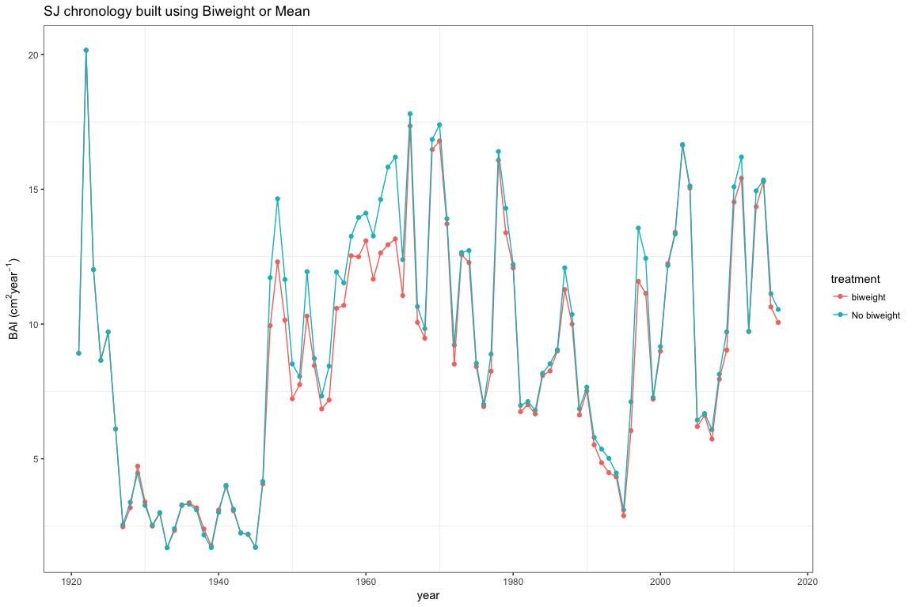

``` r
# Robust mean biweith or not
cro_cab_h <- chron(bai_caH, prefix = "CA", biweight = TRUE)
cro_canotb_h <- chron(bai_caH, prefix = "CA", biweight = FALSE)

cro_cab_h_aux <- cro_cab_h %>% 
  mutate(year = as.numeric(rownames(.))) %>% 
  mutate(treatment = as.factor('biweight')) %>% 
  dplyr::select(bai_mean = CAstd, samp.depth, year, treatment)

cro_canotb_h_aux <- cro_canotb_h  %>% 
  mutate(year = as.numeric(rownames(.))) %>% 
  mutate(treatment = as.factor('No biweight')) %>% 
  dplyr::select(bai_mean = CAstd, samp.depth, year, treatment)

aux_croca_h <- rbind(cro_cab_h_aux, cro_canotb_h_aux)
aux_croca_h$site <- 'CA High'


cro_cab_l <- chron(bai_caL, prefix = "CA", biweight = TRUE)
cro_canotb_l <- chron(bai_caL, prefix = "CA", biweight = FALSE)

cro_cab_l_aux <- cro_cab_l %>% 
  mutate(year = as.numeric(rownames(.))) %>% 
  mutate(treatment = as.factor('biweight')) %>% 
  dplyr::select(bai_mean = CAstd, samp.depth, year, treatment)

cro_canotb_l_aux <- cro_canotb_l  %>% 
  mutate(year = as.numeric(rownames(.))) %>% 
  mutate(treatment = as.factor('No biweight')) %>% 
  dplyr::select(bai_mean = CAstd, samp.depth, year, treatment)

aux_croca_l <- rbind(cro_cab_l_aux, cro_canotb_l_aux)
aux_croca_l$site <- 'CA Low'


aux_croca <- rbind(aux_croca_h, aux_croca_l)

aux_croca %>% ggplot(aes(x = year, y = bai_mean/100, colour=treatment)) + 
  geom_point() + geom_line() + 
  ylab(expression(paste("BAI (", cm^2, year^-1, ")", sep=''))) + 
  theme_bw() + theme(panel.grid.major = element_blank()) + 
  facet_wrap(~site, nrow = 2) +
    ggtitle('CA chronology built using Biweight or Mean')
```

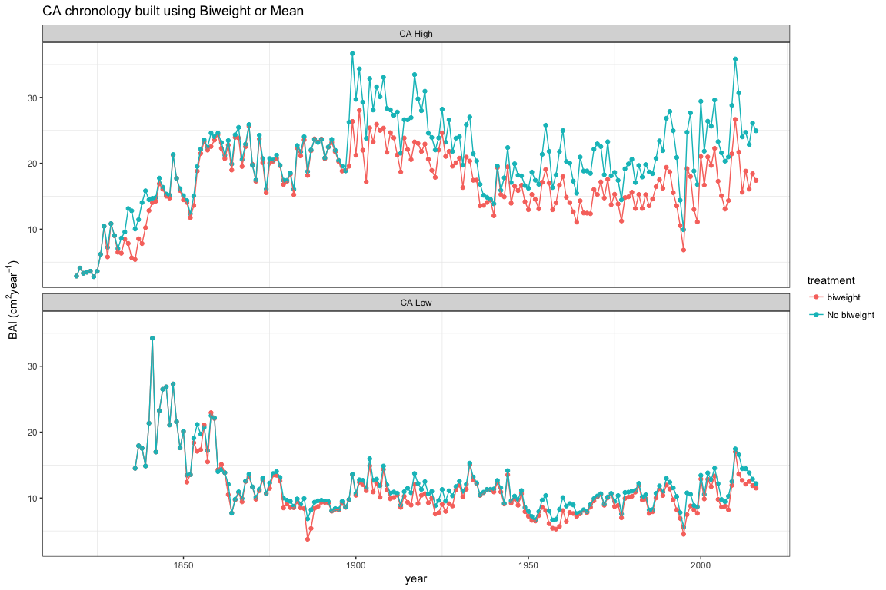

Compute Chrono
--------------

### San Juan chronologies by site

``` r
# San Juan 
cro_sjH <- chrono_bai(bai_sjH)
cro_sjH$site <- 'SJ_High'

cro_sjL <- chrono_bai(bai_sjL)
cro_sjL$site <- 'SJ_Low'

cro_sj<- rbind(cro_sjH, cro_sjL)
cro_sj$loc <- 'Norte (San Juan)'


plot_cro_sj <- cro_sj %>% ggplot(aes(x=year, y=bai_mean/100, colour=site)) + 
  theme_bw() + ylab('BAI') + 
  geom_ribbon(aes(ymin = (bai_mean - bai_se)/100,
                    ymax = (bai_mean + bai_se)/100,
                  fill=site), alpha=.2, colour=NA) +
  geom_line() + geom_point(size=1) + 
  # scale_colour_manual(values = c("red", "blue")) + 
  theme(panel.grid = element_blank()) +
  ylab(expression(paste("BAI (", cm^2, year^-1, ")", sep=''))) +
  scale_x_continuous(breaks = seq(1920, 2020, by=10))

plot_cro_sj
```

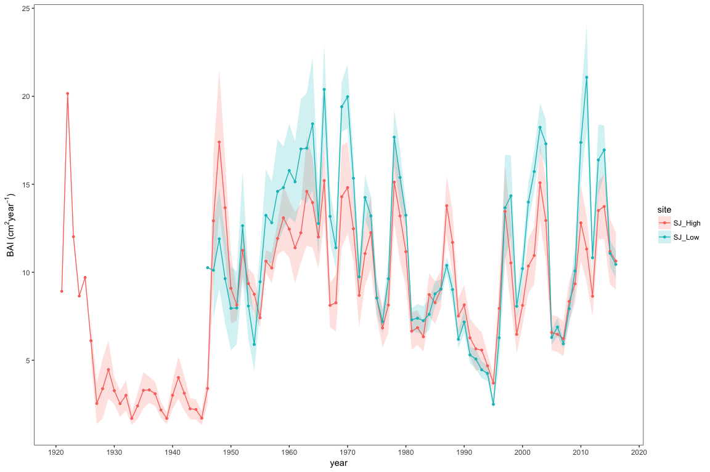

``` r
fileplot <- paste0(di, '/out/chronos/crono_compara_sj_HL.pdf') 
ggsave(filename=fileplot, plot=plot_cro_sj, width=12, height = 4) 
```

### Cañar chronologies by site

``` r
# Canar 
cro_caH <- chrono_bai(bai_caH)
cro_caH$site <- 'CA_High'

cro_caL <- chrono_bai(bai_caL)
cro_caL$site <- 'CA_Low'

cro_ca <- rbind(cro_caH,cro_caL)
cro_ca$loc <- 'Sur (Canar)'

plot_cro_ca <- cro_ca %>% 
  ggplot(aes(x=year, y=bai_mean/100, colour=site)) + 
  theme_bw() + ylab('BAI') + 
  geom_ribbon(aes(ymin = (bai_mean - bai_se)/100,
                  ymax = (bai_mean + bai_se)/100,
                  fill=site), alpha=.2, colour=NA) +
  geom_line() + 
  geom_point(size=1) + 
  # scale_colour_manual(values = c("red", "blue")) + 
  theme(panel.grid = element_blank()) +
  ylab(expression(paste("BAI (", cm^2, year^-1, ")", sep='')))+
  scale_x_continuous(breaks = seq(1815, 2020, by=10))

plot_cro_ca
```

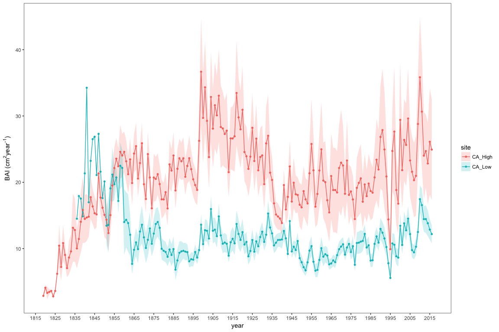

``` r
fileplot <- paste0(di, '/out/chronos/crono_compara_ca_HL.pdf') 
ggsave(filename=fileplot, plot=plot_cro_ca, width=12, height = 4) 
```

``` r
# Combine and plot 
cro_sites <- rbind(cro_ca, cro_sj)

plot_cro_sites <- cro_sites %>% ggplot(aes(x=year, y=bai_mean/100, colour=site)) + 
  theme_bw() + ylab('BAI') + 
  geom_ribbon(aes(ymin = (bai_mean - bai_se)/100,
                  ymax = (bai_mean + bai_se)/100,
                  fill=site), alpha=.2, colour=NA) +
  geom_line() + 
  geom_point(size=1) +
  theme(panel.grid = element_blank(),
        legend.position = c(0.1,.8),
        strip.background = element_blank()) + facet_wrap(~loc, nrow = 2) + 
  scale_colour_manual(values = c('#1b9e77','#d95f02','#7570b3','#e7298a')) +
  scale_fill_manual(values = c('#1b9e77','#d95f02','#7570b3','#e7298a')) +
  ylab(expression(paste("BAI (", cm^2, year^-1, ")", sep=''))) +
  scale_x_continuous(breaks = seq(1815, 2020, by=10)) 
#  geom_smooth(method= 'loess', span = 0.75, se=FALSE)
```

``` r
fileplot <- paste0(di, '/out/chronos/crono_compara_sites.pdf') 
ggsave(filename=fileplot, plot=plot_cro_sites, width=12, height = 8)
```

``` r
plot_cro_sites_collapsed <- cro_sites %>% ggplot(aes(x=year, y=bai_mean/100, colour=site)) + 
  theme_bw() + ylab('BAI') + 
  geom_ribbon(aes(ymin = (bai_mean - bai_se)/100,
                  ymax = (bai_mean + bai_se)/100,
                  fill=site), alpha=.2, colour=NA) +
  geom_line() + 
  # geom_point(size=1) +
  theme(panel.grid = element_blank(),
        legend.position = c(0.1,.8),
        strip.background = element_blank()) + 
  scale_colour_manual(values = c('#1b9e77','#d95f02','#7570b3','#e7298a')) +
  scale_fill_manual(values = c('#1b9e77','#d95f02','#7570b3','#e7298a')) +
  ylab(expression(paste("BAI (", cm^2, year^-1, ")", sep=''))) +
  scale_x_continuous(breaks = seq(1815, 2020, by=10)) 
#  geom_smooth(method= 'loess', span = 0.75, se=FALSE)
```

``` r
fileplot <- paste0(di, '/out/chronos/crono_compara_sites_collapsed.pdf') 
ggsave(filename=fileplot, plot=plot_cro_sites_collapsed, width=12, height = 4)
plot_cro_sites_collapsed
```

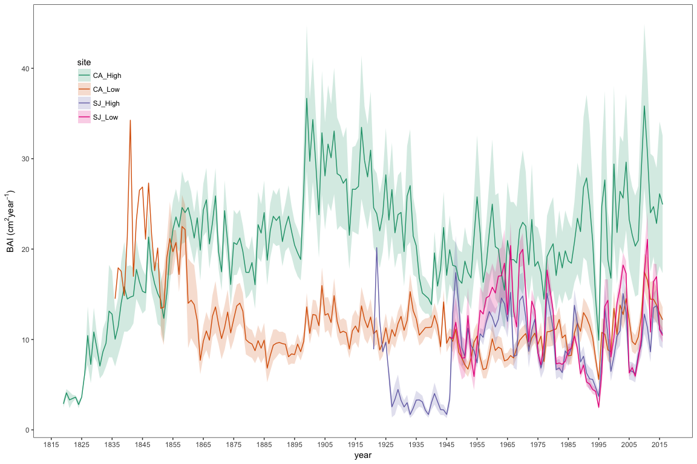

``` r
plot_cro_sites_collapsed50  <- cro_sites %>% 
  filter(year > 1949) %>% 
  ggplot(aes(x=year, y=bai_mean/100, colour=site)) + 
  theme_bw() + ylab('BAI') + 
  geom_ribbon(aes(ymin = (bai_mean - bai_se)/100,
                  ymax = (bai_mean + bai_se)/100,
                  fill=site), alpha=.2, colour=NA) +
  geom_line() + 
  # geom_point(size=1) +
  theme(panel.grid = element_blank(),
        legend.position = c(0.1,.8),
        strip.background = element_blank()) + 
  scale_colour_manual(values = c('#1b9e77','#d95f02','#7570b3','#e7298a')) +
  scale_fill_manual(values = c('#1b9e77','#d95f02','#7570b3','#e7298a')) +
  ylab(expression(paste("BAI (", cm^2, year^-1, ")", sep=''))) +
  scale_x_continuous(breaks = seq(1950, 2020, by=5)) 
#  geom_smooth(method= 'loess', span = 0.75, se=FALSE)

plot_cro_sites_collapsed50
```

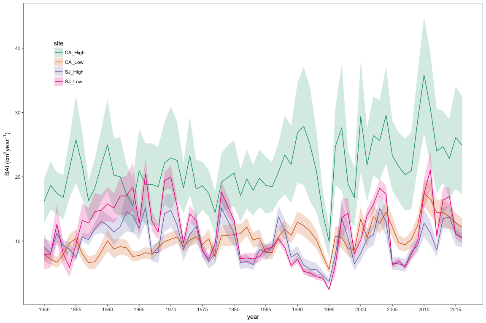

``` r
fileplot <- paste0(di, '/out/chronos/crono_compara_sites_collapsed50.pdf') 
ggsave(filename=fileplot, plot=plot_cro_sites_collapsed50, width=12, height = 4) 
plot_cro_sites_collapsed50
```

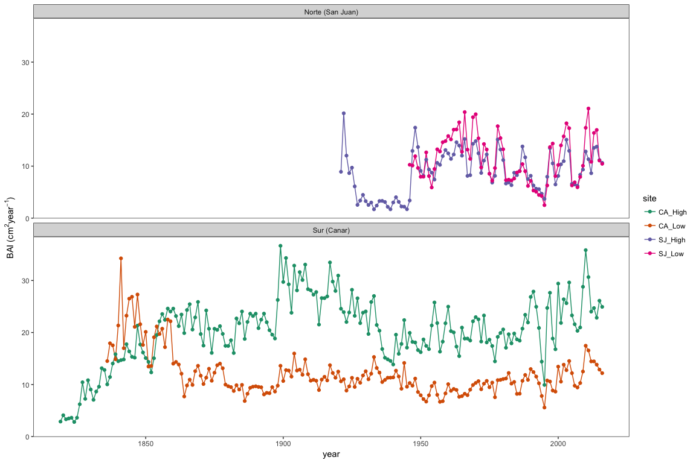

``` r
plot_cro_sites_collapsed90  <- cro_sites %>% 
  filter(year > 1989) %>% 
  ggplot(aes(x=year, y=bai_mean/100, colour=site)) + 
  theme_bw() + ylab('BAI') + 
  geom_ribbon(aes(ymin = (bai_mean - bai_se)/100,
                  ymax = (bai_mean + bai_se)/100,
                  fill=site), alpha=.2, colour=NA) +
  geom_line() + 
  # geom_point(size=1) +
  theme(panel.grid = element_blank(),
        legend.position = c(0.1,.8),
        strip.background = element_blank()) + 
  scale_colour_manual(values = c('#1b9e77','#d95f02','#7570b3','#e7298a')) +
  scale_fill_manual(values = c('#1b9e77','#d95f02','#7570b3','#e7298a')) +
  ylab(expression(paste("BAI (", cm^2, year^-1, ")", sep=''))) +
  scale_x_continuous(breaks = seq(1990, 2016, by=2)) 

plot_cro_sites_collapsed90
```

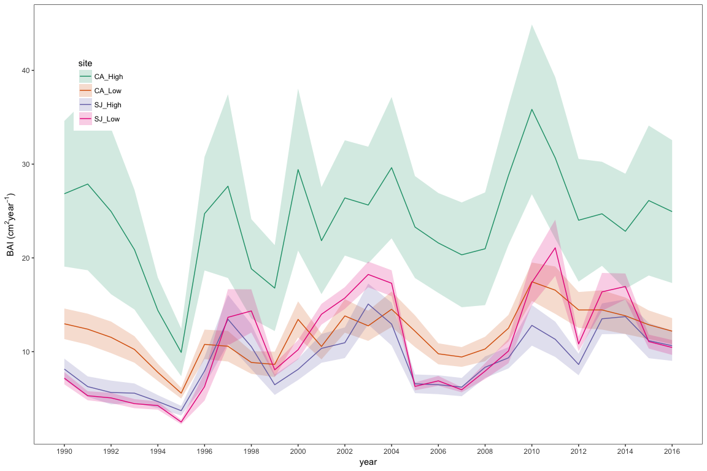

``` r
fileplot <- paste0(di, '/out/chronos/crono_compara_sites_collapsed90.pdf') 
ggsave(filename=fileplot, plot=plot_cro_sites_collapsed90, width=12, height = 4) 
plot_cro_sites_collapsed90
```


Correlation between chronos
===========================

To compute similarity between chronos we use Dorado-Liñán et al. (2017) approach.

-   Para cada chrono se realiza un suavizado, utilizando diferente tamaño de ventana (1 a 40 years). Así evaluamos la sincronía entre dos series, tanto a nivel interanual como a largo plazo.
-   Luego calculamos la correlación entre series para cada tamaño de ventana. Usamos correlaciones de Pearson o Sperman entre las series (es decir entre las zonas comunes de las cronologías). Ojo con la autocorrelación. Para ello puedo utilizar `interseries.cor()` del pkg `dplR`; o utilizar `cor.test()` (`stats`). El primero está basado en el segundo, así que utilizo el segundo.
-   Obtener IC utilizando bootstrap. Varias aproximaciones:

    -   Utilizar el pkg `boot` y conseguir IC.
    -   Aproximación de Ólafsdóttir and Mudelsee (2014). En su paper habla de correlacion entre dos series y utiliza un programa en Fortran-90. He contactado con el autor y no tiene pensado hacerlo en R. He intentado utilizar Fortran-90, pero no tengo ni idea. Asi que desisto de utilizar esta computación de los IC.

``` r
# centred moved average smooth
suaviza_caH <- suaviza_cronos(cro_caH, win_vector=seq(1,40, by=1), crononame = 'cro_caH')
suaviza_caL <- suaviza_cronos(cro_caL, win_vector=seq(1,40, by=1), crononame = 'cro_caL')
suaviza_sjH <- suaviza_cronos(cro_sjH, win_vector=seq(1,40, by=1), crononame = 'cro_sjH')
suaviza_sjL <- suaviza_cronos(cro_sjL, win_vector=seq(1,40, by=1), crononame = 'cro_sjL')
```

between sites similarity (sjH *vs* sjL; caH *vs* caL)
-----------------------------------------------------

This note is for the plot:

-   Correlation among chronologies for the common period of each site in different time-domains after pre-filtering the time-series with increasing size of the moving-average window.

``` r
# set seed
set.seed(333)

# Metodo correlation
tc <- c('spearman', 'pearson')

# SJ 
suaviza_sj <- rbind(suaviza_sjH, suaviza_sjL)
correla_sj <- correlaBootIC(suaviza_sj, tc, years_suavizado = 40, 
                            name_comparison = 'sjH-sjL') 

# CA 
suaviza_ca <- rbind(suaviza_caH, suaviza_caL)
correla_ca <- correlaBootIC(suaviza_ca, tc, years_suavizado = 40, 
                            name_comparison = 'caH-caL') 

correla <- rbind(correla_ca, correla_sj)
```

``` r
correla %>% 
  ggplot(aes(x=size, y=estimate, colour=name_comparison)) + 
  geom_line()+ theme_bw() + ylab('Correlation coefficient') +
  xlab('Smoothing (centred moving average window size)') + 
  # geom_smooth(method = 'loess', se=FALSE) + 
  theme(panel.grid = element_blank()) +
  geom_hline(yintercept = 0, colour='gray', linetype=2) + 
  geom_line(aes(x=size, y=ci_lower, colour=name_comparison), linetype = 2)  +
  geom_line(aes(x=size, y=ci_upper, colour=name_comparison), linetype = 2) + 
  facet_wrap(~metodo_correla, ncol=2) +
  theme(strip.background = element_blank())
```

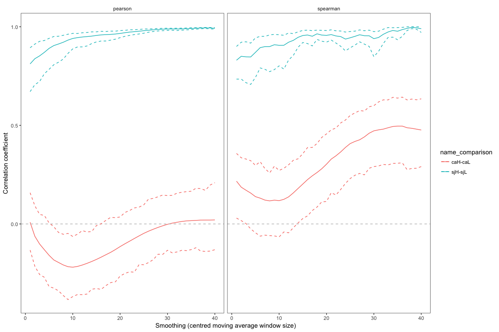

``` r
correla_sites_pearson <- correla %>% filter(metodo_correla == 'pearson') %>%
  ggplot(aes(x=size, y=estimate, colour=name_comparison)) + 
  geom_line()+ theme_bw() + ylab('Correlation coefficient') +
  xlab('Smoothing (centred moving average window size)') + 
  theme(panel.grid = element_blank()) +
  geom_hline(yintercept = 0, colour='gray', linetype=2) + 
  geom_line(aes(x=size, y=ci_lower, colour=name_comparison), linetype = 2) +
  geom_line(aes(x=size, y=ci_upper, colour=name_comparison), linetype = 2) + 
  theme(legend.position = c(.8,.7))
correla_sites_pearson
```


``` r
fileplot <- paste0(di, '/out/chronos/correla_boot_sitesHL.pdf') 
ggsave(filename=fileplot, plot=correla_sites_pearson, width=5, height = 5) 
```

between final sites similarity (sj *vs* caH; sj *vs* caL; caH *vs* caL)
-----------------------------------------------------------------------

``` r
# Metodo correlation
tc <- c('spearman', 'pearson')

set.seed(333)

# Compute the suaviza_sj desde el principio, sin diferenciar h and l. Para ello la crono la computo de nuevo 
cro_sjloc <- chrono_bai(bai_sj)
cro_sjloc$site <- 'SJ'
suaviza_sjloc <- suaviza_cronos(cro_sjloc, win_vector=seq(1,40, by=1), crononame = 'cro_sj')


# sjcaH 
suaviza_sjcaH <- rbind(suaviza_sjloc, suaviza_caH)
correla_sjcaH <- correlaBootIC(suaviza_sjcaH, tc, years_suavizado = 40, 
                            name_comparison = 'sj-caH') 

# sjcaL 
suaviza_sjcaL <- rbind(suaviza_sjloc, suaviza_caL)
correla_sjcaL <- correlaBootIC(suaviza_sjcaL, tc, years_suavizado = 40, 
                            name_comparison = 'sj-caL') 

# Join all correlations 
correla <- rbind(correla_ca, correla_sjcaL, correla_sjcaH)

correla %>% 
  ggplot(aes(x=size, y=estimate, colour=name_comparison)) + 
  geom_line()+ theme_bw() + ylab('Correlation coefficient') +
  xlab('Smoothing (centred moving average window size)') + 
  # geom_smooth(method = 'loess', se=FALSE) + 
  theme(panel.grid = element_blank()) +
  geom_hline(yintercept = 0, colour='gray', linetype=2) + 
  geom_line(aes(x=size, y=ci_lower, colour=name_comparison), linetype = 2)  +
  geom_line(aes(x=size, y=ci_upper, colour=name_comparison), linetype = 2) + 
  facet_wrap(~metodo_correla, ncol=2) +
  theme(strip.background = element_blank())
```

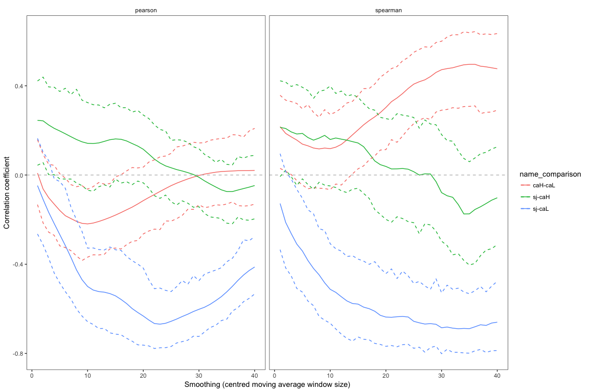

``` r
correla_sitesSJCALH  <- correla %>% 
  filter(metodo_correla == 'pearson') %>%
  ggplot(aes(x=size, y=estimate, colour=name_comparison)) + 
  geom_line()+ theme_bw() + ylab('Correlation coefficient') +
  xlab('Smoothing (centred moving average window size)') + 
  # geom_smooth(method = 'loess', se=FALSE) + 
  theme(panel.grid = element_blank()) +
  geom_hline(yintercept = 0, colour='gray', linetype=2) + 
  geom_line(aes(x=size, y=ci_lower, colour=name_comparison), linetype = 2) +
  geom_line(aes(x=size, y=ci_upper, colour=name_comparison), linetype = 2) +
  theme(legend.position = c(.8,.9), legend.title = element_blank())

correla_sitesSJCALH
```

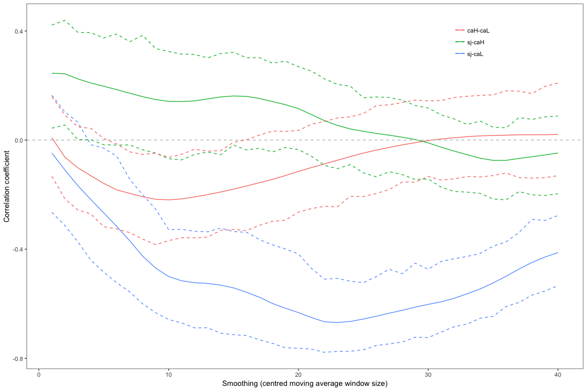

``` r
fileplot <- paste0(di, '/out/chronos/correla_boot_sitesSJCALH.pdf') 
ggsave(filename=fileplot, plot=correla_sitesSJCALH, width=5, height = 5) 
```

Chronologies by site (SJ, CAL, CAH)
===================================

``` r
# Compute la crono de SJ de nuevo y llamar al site SJ
cro_sjf <- chrono_bai(bai_sj)
cro_sjf$site <- 'SJ'
```

``` r
# Combine and plot 
cro_sites <- rbind(cro_caL, cro_caH, cro_sjf)


## Export data of bai (chro)
write.csv(cro_sites, file=paste(di, "data/cronos_medias/cronos_sites.csv", sep=""), row.names = FALSE)

plot_cro_sitesSJCALH <- cro_sites %>% ggplot(aes(x=year, y=bai_mean/100, colour=site)) + 
  theme_bw() + ylab('BAI') + 
  geom_ribbon(aes(ymin = (bai_mean - bai_se)/100,
                  ymax = (bai_mean + bai_se)/100,
                  fill=site), alpha=.2, colour=NA) +
  geom_line() + 
  geom_point(size=.8) + 
  theme(panel.grid = element_blank(),
        legend.position = c(0.1,.8),
        strip.background = element_blank()) + 
  scale_colour_manual(values = c('#7570b3','#e7298a','#1b9e77')) +
  scale_fill_manual(values = c('#7570b3','#e7298a','#1b9e77')) +
  ylab(expression(paste("BAI (", cm^2, year^-1, ")", sep=''))) +
  scale_x_continuous(breaks = seq(1815, 2020, by=10)) 

plot_cro_sitesSJCALH
```


``` r
fileplot <- paste0(di, '/out/chronos/crono_compara_sitesSJCALH.pdf') 
ggsave(filename=fileplot, plot=plot_cro_sitesSJCALH, width=12, height = 5)
plot_cro_sitesSJCALH
```


``` r
plot_cro_sitesSJCALH50 <- cro_sites %>% 
  filter(year > 1949) %>% 
  ggplot(aes(x=year, y=bai_mean/100, colour=site)) + 
  theme_bw() + ylab('BAI') + 
  geom_ribbon(aes(ymin = (bai_mean - bai_se)/100,
                  ymax = (bai_mean + bai_se)/100,
                  fill=site), alpha=.2, colour=NA) +
  geom_line() + 
  geom_point(size=.8) + 
  theme(panel.grid = element_blank(),
        legend.position = c(0.1,.8),
        strip.background = element_blank()) + 
  scale_colour_manual(values = c('#7570b3','#e7298a','#1b9e77')) +
  scale_fill_manual(values = c('#7570b3','#e7298a','#1b9e77')) +
  ylab(expression(paste("BAI (", cm^2, year^-1, ")", sep=''))) +
  scale_x_continuous(breaks = seq(1815, 2020, by=10)) 
plot_cro_sitesSJCALH50
```

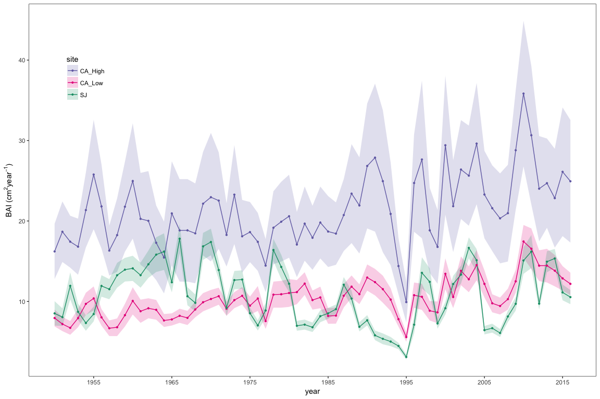

``` r
fileplot <- paste0(di, '/out/chronos/crono_compara_sitesSJCALH50.pdf') 
ggsave(filename=fileplot, plot=plot_cro_sitesSJCALH50, width=12, height = 5)
```

``` r
plot_cro_sitesSJCALH90 <- cro_sites %>% 
  filter(year > 1989) %>% 
  ggplot(aes(x=year, y=bai_mean/100, colour=site)) + 
  theme_bw() + ylab('BAI') + 
  geom_ribbon(aes(ymin = (bai_mean - bai_se)/100,
                  ymax = (bai_mean + bai_se)/100,
                  fill=site), alpha=.2, colour=NA) +
  geom_line() + 
  geom_point(size=.8) + 
  theme(panel.grid = element_blank(),
        legend.position = c(0.1,.8),
        strip.background = element_blank()) + 
  scale_colour_manual(values = c('#7570b3','#e7298a','#1b9e77')) +
  scale_fill_manual(values = c('#7570b3','#e7298a','#1b9e77')) +
  ylab(expression(paste("BAI (", cm^2, year^-1, ")", sep=''))) +
  scale_x_continuous(breaks = seq(1815, 2020, by=10))
plot_cro_sitesSJCALH90
```

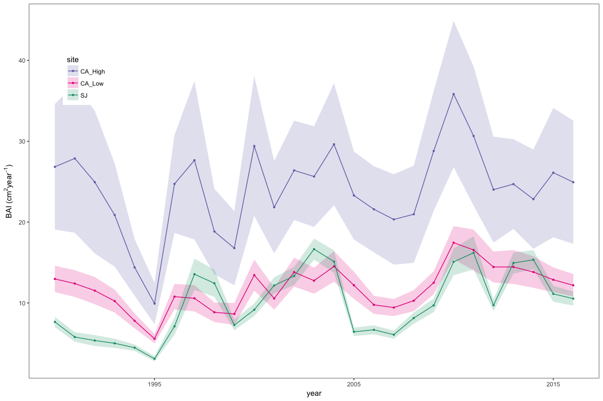

``` r
fileplot <- paste0(di, '/out/chronos/crono_compara_sitesSJCALH90.pdf') 
ggsave(filename=fileplot, plot=plot_cro_sitesSJCALH90, width=12, height = 5)
```

Dorado-Liñán, I., I. Cañellas, M. Valbuena-Carabaña, L. Gil, and G. Gea-Izquierdo. 2017. Coexistence in the mediterranean-temperate transitional border: Multi-century dynamics of a mixed old-growth forest under global change. Dendrochronologia 44:48–57.

Ólafsdóttir, K. B., and M. Mudelsee. 2014. More accurate, calibrated bootstrap confidence intervals for estimating the correlation between two time series. Mathematical Geosciences 46:411–427.

Piovesa, G., F. Biondi, A. D. Filippo, A. Alessandrini, and M. Maugeri. 2008. Drought-driven growth reduction in old beech (fagus sylvatica l.) forests of the central apennines, italy. Global Change Biology 14:1265–1281.
