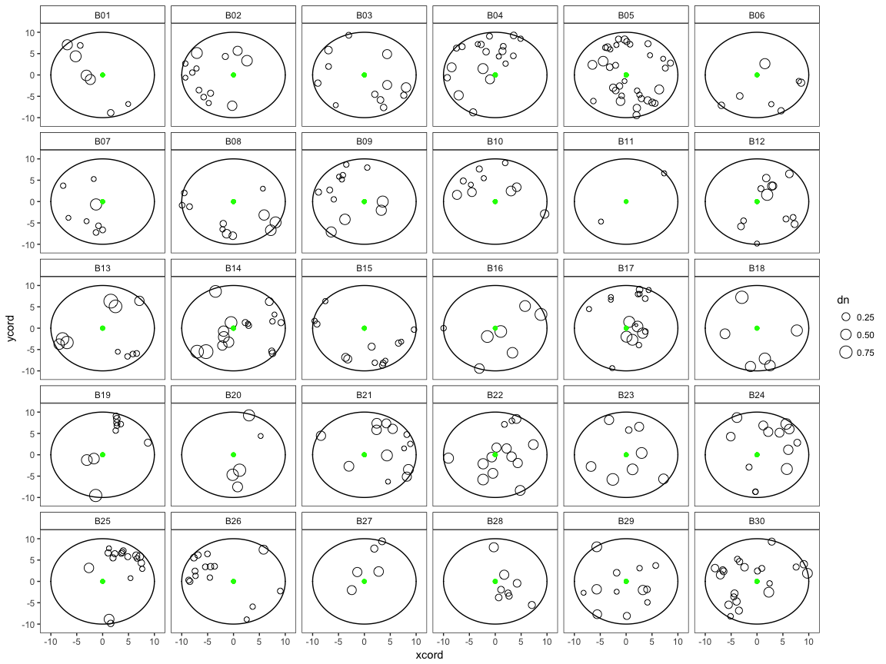

-   [Read data](#read-data)
    -   [Compute competition indices](#compute-competition-indices)
        -   [Distance-Independet Indices](#distance-independet-indices)
        -   [Distance-Dependet Indices](#distance-dependet-indices)
    -   [Plot](#plot)
    -   [Plot by site](#plot-by-site)
        -   [San Juan](#san-juan)
        -   [Canar](#canar)
    -   [References](#references)

``` r
library("tidyverse")
library("stringr")
```

Read data
=========

``` r
# Compute diameter normal (in meters)
compete <- compete %>% 
  mutate(dn = (perim_mm/1000) /pi) 
```

Compute competition indices
---------------------------

The following competition indices were computed. See Gea-Izquierdo and Cañellas (2009) for more info.

### Distance-Independet Indices

-   Basal Area (**ba**)

$$ BA = \\sum\_{i=1}^{n}pi\\cdot (dbh\_{i} / 2)^2 $$

-   Stand Density (**std**)

*s**t**d* = *n*<sub>*t**r**e**e**s*</sub>/*p**l**o**t* *a**r**e**a*(*h**a*)

-   Plot Density (**pd**)

*p**d* = *n*<sub>*t**r**e**e**s*</sub>/*p**l**o**t* *a**r**e**a*

-   Number of competitors (**n\_competitors**): number of competitors within *r* meters (10 m)

-   Number of competitors higher (**n\_competitors\_higher**): number of competitors within *r* meters (10 m) such that $ dbh\_j &gt; dbh\_i $

-   Sum of size (**sum\_sizes**) of trees within *r* meters (10 m): $ dbh\_{j} $

-   Size ratio (**sr**)

$$ sr = dbh\_i / \\sum\_{i=1}^{n}dbh\_i $$

### Distance-Dependet Indices

-   Distance to nearest tree (**dnn**)

-   Crowding

$$ \\mathrm{crowding} = \\sum\_{i=1}^{n}(dbh\_i / dist\_{ij}) $$

-   Lorimer

$$ \\mathrm{lorimer} = \\sum\_{i=1}^{n}\\left \[ (dbh\_i / dbh\_i) / \\sqrt{dist\_{ij}/r} \\right \] $$

-   Negative Exponential size ratio (**nesr**)

$$ \\mathrm{nesr} = \\sum\_{i=1}^{n} (dbh\_j / dbh\_i) \\cdot \\left\[ 1 / \\exp(dist\_{ij} + 1) \\right \] $$

-   Negative Exponential Weighted size ratio (**newsr**)

$$ \\mathrm{newsr} = \\sum\_{i=1}^{n} (dbh\_j / dbh\_i) \\cdot \\exp\\left\[ (-dist\_{ij} + 1) / (dbh\_i + dbh\_j) \\right \] $$

-   Size ratio proportional to distance (**srd**)

$$ \\mathrm{srd} = \\sum\_{i=1}^{n} (dbh\_j / dbh\_i) \\cdot \\left\[1/ (dist\_{ij} + 1) \\right \] $$

-   Size difference proportional to distance (**sdd**)

$$ \\mathrm{sdd} = \\sum\_{i=1}^{n} \\left\[ (dbh\_j  - dbh\_i) / (dist\_{ij} + 1) \\right \] $$

``` r
# 1 Get name of focal trees
focal_trees <- compete %>% filter(id_focal != 'Fresno') 
focal_trees <- unique(focal_trees$id_focal)


# 2 Compute Fixed variables 
radius_plot <- 10 # radius plot (10 m)
sf_plot <- pi * radius_plot^2 # surface plot (m2)

# 3 Empty object to store results 
output<- vector("list", length(focal_trees))

# 4 Loop 
for (i in 1:length(focal_trees)){ 
  
  # Create df with all trees inside plot (10 m radius)
  df <- compete %>% filter(id_focal == focal_trees[[i]])
  
  # Focal tree
  focal_t <- filter(df, sp== 'Focal') 
  ## Normal diameter of focal tree
  dnft <- focal_t$dn       
  
  # Competence indices 
  ## Number of competitors inside plot wihtout focal tree (r = 10)
  n_competitors <- filter(df, sp != 'Focal') %>% count() %>% transmute(n_competitors = n)
  
  ## Number of competitors with dn_j > dn_i (focal tree)
  n_competitors_higher <- df %>%
    filter(sp != 'Focal') %>%
    filter(dn > dnft) %>% 
    count() %>% 
    transmute(n_competitors_higher = n)
  
  ## plot density (tree/plot)
  plot_density <- n_competitors$n_competitors / sf_plot
  
  ## Stand density (tree / ha) 
  stand_density <- (n_competitors$n_competitors * 10000) / sf_plot

  ## Sum sizes 
  sum_sizes <- df %>% 
    filter(sp != 'Focal') %>%
    summarise(sum_sizes=sum(dn))
  
  ## Size ratio 
  size_ratio <- dnft / (dnft + sum_sizes$sum_sizes)
  
  ## Distance nearest tree
  dist_nn <- df %>% 
    filter(sp != 'Focal') %>% 
    slice(which.min(distance_cm))
  
  dist_nn <- (dist_nn$distance_cm / 100) #in meters 
  
  ## Various 
    ### Basal area
    ### Size ratio proportional to distance 
    ### Size difference proportional to distance 
    ### Negative exponential size ratio
    ### Negative exponential weighted size ratio
    ### Lorimer 
    ### Crowding 
  
  df_more_indices <- df %>%
    filter(sp != 'Focal') %>%
    mutate(basal_area = ((pi/4) * dn * dn), 
           size_ratio_distance = (dn / dnft) * (1 / ((distance_cm/100) + 1)),
           size_diff_distance = (dn - dnft) / ((distance_cm/100) + 1),
           neg_exp_size_ratio = (dn / dnft) * (1 / exp((distance_cm/100) + 1)),
           neg_exp_w_size_ratio = (dn / dnft) * exp((-(distance_cm/100) + 1) / (dn + dnft)),
           lorimer = (dn / dnft) / (sqrt((distance_cm/100) / radius_plot)),
           crowding = dn / (distance_cm/100))
  
  df_indices <- df_more_indices %>% 
    summarise(ba = sum(basal_area),
              srd = sum(size_ratio_distance),
              sdd = sum(size_diff_distance),
              nesr = sum(neg_exp_size_ratio),
              newsr = sum(neg_exp_w_size_ratio),
              lorimer = sum(lorimer),
              crowding = sum(crowding)) %>% 
    mutate(n_competitors,
           n_competitors_higher,
           pd = plot_density,
           std = stand_density,
           sum_sizes,
           sr = size_ratio,
           dnn = dist_nn,
           id_focal = focal_trees[[i]])
  
    output[[i]] <- df_indices
  
}          
   
# df_indices_plot <- bind_rows(output)
# As the output is a nested list I used this solution (http://stackoverflow.com/questions/27930883/converting-elements-in-a-nested-list-to-dataframe) to convert to a dataframe
  
df_indices_plot <- bind_rows(lapply(output, as.data.frame.list, stringsAsFactors=FALSE))

rm(n_competitors, n_competitors_higher, plot_density, stand_density, sum_sizes, size_ratio, dist_nn, df, df_indices, output, df_more_indices, dnft)

# Export data 
write.csv(df_indices_plot, file=paste(di, "data/competence/competence_indices.csv", sep=""), row.names = FALSE)
```

Plot
----

``` r
source(paste0(di, '/script/R/get_coords_trees.R')) 


# Add variables with coordinates of each tree. Use get_coords_trees() function 
compete <- compete %>% 
  mutate(xcord = get_coords_trees(angle= rumbo_degree, 
                           distance = distance_cm/100,
                           x0 = 0, y0 = 0)$x,
         ycord = get_coords_trees(angle = rumbo_degree, 
                           distance = distance_cm/100,
                           x0 = 0, y0 = 0)$y)
```

Plot by site
------------

``` r
# Set levels of eleveation 
sj_lowcode  <- paste0('A', str_pad(1:10, 2, pad='0'))
sj_highcode <- paste0('A', 11:20)
ca_lowcode <- c(paste0('B', str_pad(1:10, 2, pad='0')),
            paste0('B', 26:30))
ca_highcode <- paste0('B', 11:25)

compete <- compete %>% 
  mutate(elev = ifelse(id_focal %in% sj_lowcode, 'Low',
                       ifelse(id_focal %in% sj_highcode, 'High',
                              ifelse(id_focal %in% ca_lowcode, 'Low', 'High')))) %>%
  mutate(site = paste0(loc, '_', elev))
```

#### San Juan


#### Canar



References
----------

Gea-Izquierdo, G., and I. Cañellas. 2009. Analysis of Holm Oak Intraspecific Competition Using Gamma Regression. Forest science 55:310–322.
