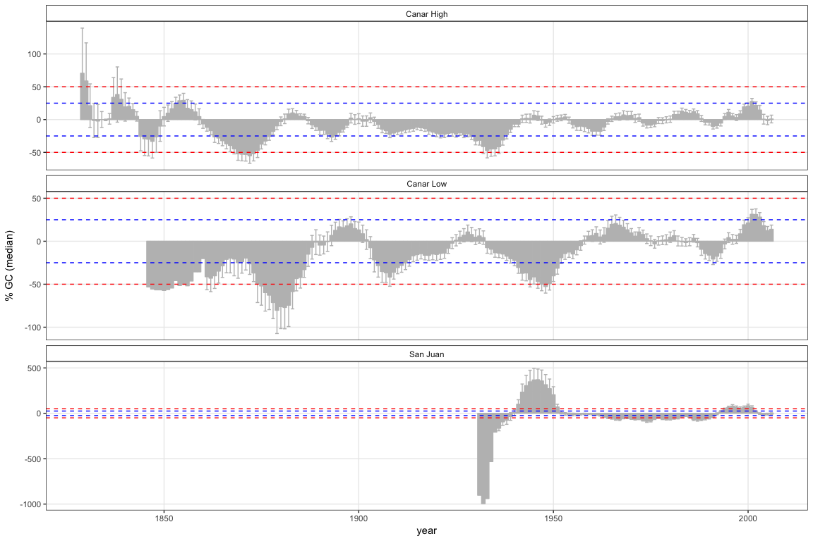

``` r
library("tidyverse")
library("stringr")
library("dplR")
library("knitr")
# library("detrendeR")
library("pander")
library('boot')
library('gtable')
library('grid')
```

Disturbance chronologies
========================

-   Vamos a calcular las disturbance chronologies siguiendo la aproximación de (Nowacki and Abrams 1997)(varios ejemplos se pueden ver en (Gea-Izquierdo and Cañellas 2014, Dorado-Liñán et al. (2017)))

-   Utilizaremos tres chronologias: SJ, CAH y CAL (ver [./analysis/analysis\_chronologies.md]('./analysis/analysis_chronologies.md))

Prepare data
------------

-   Leer datos `rwl` de SJ y CA
-   Leer datos de diametros de los focal tree

<!-- -->

    ## There does not appear to be a header in the rwl file
    ## There are 48 series
    ## 1        SNA0101      1947    2016   0.01
    ## 2        SNA0102      1947    2016   0.01
    ## 3        SNA0201      1946    2016   0.01
    ## 4        SNA0202      1948    2016   0.01
    ## 5        SNA0301      1949    2016   0.01
    ## 6        SNA0302      1948    2016   0.01
    ## 7        SNA0401      1947    2016   0.01
    ## 8        SNA0402      1947    2016   0.01
    ## 9        SNA0501      1953    2016   0.01
    ## 10       SNA0502      1948    2016   0.01
    ## 11       SNA0601      1948    2016   0.01
    ## 12       SNA0602      1957    2016   0.01
    ## 13       SNA0603      1947    2012   0.01
    ## 14       SNA0701      1954    2016   0.01
    ## 15       SNA0702      1947    2016   0.01
    ## 16       SNA0801      1949    2016   0.01
    ## 17       SNA0802      1951    2016   0.01
    ## 18       SNA0901      1947    2016   0.01
    ## 19       SNA0902      1947    2016   0.01
    ## 20       SNA0903      1947    2002   0.01
    ## 21       SNA1001      1950    2016   0.01
    ## 22       SNA1002      1953    2016   0.01
    ## 23       SNA1003      1948    2008   0.01
    ## 24       SNA1101      1940    2016   0.01
    ## 25       SNA1102      1929    2016   0.01
    ## 26       SNA1103      1942    1994   0.01
    ## 27       SNA1201      1929    2016   0.01
    ## 28       SNA1202      1929    2016   0.01
    ## 29       SNA1203      1927    1983   0.01
    ## 30       SNA1301      1960    2016   0.01
    ## 31       SNA1302      1949    2016   0.01
    ## 32       SNA1303      1949    2011   0.01
    ## 33       SNA1401      1930    2016   0.01
    ## 34       SNA1402      1949    2016   0.01
    ## 35       SNA1501      1952    2016   0.01
    ## 36       SNA1502      1948    2016   0.01
    ## 37       SNA1601      1959    2016   0.01
    ## 38       SNA1602      1927    2016   0.01
    ## 39       SNA1701      1926    2016   0.01
    ## 40       SNA1702      1930    2016   0.01
    ## 41       SNA1703      1931    2016   0.01
    ## 42       SNA1801      1937    2016   0.01
    ## 43       SNA1802      1936    2016   0.01
    ## 44       SNA1901      1921    2016   0.01
    ## 45       SNA1902      1924    2016   0.01
    ## 46       SNA2001      1932    2016   0.01
    ## 47       SNA2003      1932    2016   0.01
    ## 48       SNA2002      1934    2016   0.01

    ## There does not appear to be a header in the rwl file
    ## There are 60 series
    ## 1        SNB0101      1899    2016   0.01
    ## 2        SNB0102      1902    2016   0.01
    ## 3        SNB0201      1916    2016   0.01
    ## 4        SNB0202      1876    2016   0.01
    ## 5        SNB0301      1862    2016   0.01
    ## 6        SNB0302      1862    2016   0.01
    ## 7        SNB0401      1870    2016   0.01
    ## 8        SNB0402      1866    2016   0.01
    ## 9        SNB0501      1864    2016   0.01
    ## 10       SNB0502g     1867    2016   0.01
    ## 11       SNB0601      1860    2016   0.01
    ## 12       SNB0602      1873    2016   0.01
    ## 13       SNB0701      1851    2016   0.01
    ## 14       SNB0702g     1861    2016   0.01
    ## 15       SNB0801g     1851    2016   0.01
    ## 16       SNB0802g     1853    2016   0.01
    ## 17       SNB0901g     1836    2016   0.01
    ## 18       SNB0902      1844    2016   0.01
    ## 19       SNB1001      1868    2016   0.01
    ## 20       SNB1002      1870    2016   0.01
    ## 21       SNB1101      1949    2016   0.01
    ## 22       SNB1102      1893    2016   0.01
    ## 23       SNB1201      1867    2016   0.01
    ## 24       SNB1202      1834    2016   0.01
    ## 25       SNB1301      1865    2016   0.01
    ## 26       SNB1302      1874    2016   0.01
    ## 27       SNB1401      1843    2016   0.01
    ## 28       SNB1402      1848    2016   0.01
    ## 29       SNB1501      1898    2016   0.01
    ## 30       SNB1502      1927    2016   0.01
    ## 31       SNB1601      1846    2016   0.01
    ## 32       SNB1602      1857    2016   0.01
    ## 33       SNB1701      1856    2016   0.01
    ## 34       SNB1702      1853    2016   0.01
    ## 35       SNB1801      1827    2016   0.01
    ## 36       SNB1802      1843    2016   0.01
    ## 37       SNB1901      1888    2016   0.01
    ## 38       SNB1902      1901    2016   0.01
    ## 39       SNB2001      1830    2016   0.01
    ## 40       SNB2002g     1837    2016   0.01
    ## 41       SNB2101      1863    2016   0.01
    ## 42       SNB2102      1858    2016   0.01
    ## 43       SNB2201g     1819    2016   0.01
    ## 44       SNB2202g     1822    2016   0.01
    ## 45       SNB2301g     1832    2016   0.01
    ## 46       SNB2302      1819    2016   0.01
    ## 47       SNB2401      1829    2016   0.01
    ## 48       SNB2402      1831    2016   0.01
    ## 49       SNB2501      1831    2016   0.01
    ## 50       SNB2502      1839    2016   0.01
    ## 51       SNB2601      1872    2016   0.01
    ## 52       SNB2602      1867    2016   0.01
    ## 53       SNB2701      1865    2016   0.01
    ## 54       SNB2702g     1863    2016   0.01
    ## 55       SNB2801      1860    2016   0.01
    ## 56       SNB2802      1866    2016   0.01
    ## 57       SNB2901      1877    2016   0.01
    ## 58       SNB2902      1892    2016   0.01
    ## 59       SNB3001      1867    2016   0.01
    ## 60       SNB3002      1874    2016   0.01

``` r
source(paste0(di, 'script/R/rw_byTree.R'))
source(paste0(di, 'script/R/bai_piovesan.R'))
source(paste0(di, 'script/R/computeGC.R'))
```

-   Crear dataframes `rwl` por cada sitio CA\_High, CA\_Low, SJ\_High. SJ\_Low

    -   :red\_circle: ojo he cambiado los nombres de las series en SJ y en CA

``` r
# Replace SNA by SJ and SNB by CA
names(ca) <- stringr::str_replace(names(ca), "SNB", "CA") 
names(sj) <- stringr::str_replace(names(sj), "SNA", "SJ")

# Remove g in name of some cores of CA. 
names(ca) <- stringr::str_replace(names(ca), "g", "")
```

``` r
# Create subset to compare between sites 
caL <- ca[,c("CA0101","CA0102","CA0201","CA0202","CA0301","CA0302","CA0401","CA0402","CA0501","CA0502",
             "CA0601","CA0602","CA0701","CA0702","CA0801","CA0802","CA0901","CA0902","CA1001","CA1002",
             "CA2601","CA2602","CA2701","CA2702","CA2801","CA2802","CA2901","CA2902","CA3001","CA3002")] 
caH <- ca[, c("CA1101","CA1102","CA1201","CA1202","CA1301","CA1302","CA1401","CA1402","CA1501","CA1502",
              "CA1601","CA1602","CA1701","CA1702","CA1801","CA1802","CA1901","CA1902","CA2001","CA2002",
              "CA2101","CA2102","CA2201","CA2202","CA2301","CA2302","CA2401","CA2402","CA2501","CA2502")]
```

-   Lectura y preparación de datos de diámetro

``` r
# Prepare Diameter data 

# Compute diameter (mm)
compete <- compete %>% 
  mutate(dn_mm = (perim_mm / pi))

# Change name focal according to loc
compete <- compete %>% 
  mutate(id_focalLoc = stringr::str_replace_all(id_focal, c("A" = "SJ", "B" = "CA")))

         
# Get only focal trees, and only selected variables 
ft <- compete %>% 
  filter(sp=='Focal') %>% 
  filter(id_focal!='Fresno') %>% 
  dplyr::select(id_focal, id_focalLoc, loc, dn_mm, height_cm) 

# Set levels of eleveation 
ca_lowcode <- c(paste0('CA', str_pad(1:10, 2, pad='0')),
            paste0('CA', 26:30))
ca_highcode <- paste0('CA', 11:25)

ft <- ft %>% 
  mutate(site = as.factor(
    ifelse(id_focalLoc %in% ca_lowcode, 'CAL', 
           ifelse(id_focalLoc %in% ca_highcode, 'CAH', 'SJ'))))
```

Summary dendrochronology statistics
===================================

-   Por cada site (CAH, CAL, SJ) calculamos los siguientes datos:
    -   age: mean + sd (average of all series)
    -   year: min, max of all series
    -   year range
    -   autocorrelation order 1 (ar1): mean + sd
    -   seires intercorrelation (icor): mean + sd

By site
-------

``` r
objects_rwl <- c('caL','caH','sj')

out <- c() 

for (i in objects_rwl){ 
  
  aux <- get(i)
  # Stats of singles RWL
  aux_stats <- rwl.stats(aux)
  # Add site 
  aux_stats$site <- as.factor(i)
  
  # Compute interseries correlation 
  aux_stats$interser_cor_val  <- interseries.cor(aux)$res.cor
  aux_stats$interser_cor_p  <- interseries.cor(aux)$p.val
  
  out <- rbind(out, aux_stats)
  }


rwl_by_site <- out %>% group_by(site) %>% 
  summarize(age_mean = round(mean(year),2), 
            age_sd = round(sd(year), 2),
            year_min = min(first),
            year_max = max(last), 
            year_range = year_max - year_min + 1, 
            ar1_mean = round(mean(ar1), 3),
            ar1_sd = round(sd(ar1), 3),
            icor_mean = round(mean(interser_cor_val), 3),
            icor_sd = round(sd(interser_cor_val), 3)) %>% 
  as.data.frame() 

rwl_by_site %>% 
  write.csv(file=paste(di, "data/proto_tables/site_3_dendro.csv", sep=""), row.names = FALSE)

pander(rwl_by_site, caption='Dendrochronological summary by sites (3)') 
```

<table>
<caption>Dendrochronological summary by sites (3) (continued below)</caption>
<colgroup>
<col width="9%" />
<col width="15%" />
<col width="12%" />
<col width="15%" />
<col width="15%" />
<col width="18%" />
<col width="13%" />
</colgroup>
<thead>
<tr class="header">
<th align="center">site</th>
<th align="center">age_mean</th>
<th align="center">age_sd</th>
<th align="center">year_min</th>
<th align="center">year_max</th>
<th align="center">year_range</th>
<th align="center">ar1_mean</th>
</tr>
</thead>
<tbody>
<tr class="odd">
<td align="center">caL</td>
<td align="center">148.5</td>
<td align="center">16.54</td>
<td align="center">1836</td>
<td align="center">2016</td>
<td align="center">181</td>
<td align="center">0.799</td>
</tr>
<tr class="even">
<td align="center">caH</td>
<td align="center">161</td>
<td align="center">32.2</td>
<td align="center">1819</td>
<td align="center">2016</td>
<td align="center">198</td>
<td align="center">0.827</td>
</tr>
<tr class="odd">
<td align="center">sj</td>
<td align="center">72.56</td>
<td align="center">11.14</td>
<td align="center">1921</td>
<td align="center">2016</td>
<td align="center">96</td>
<td align="center">0.692</td>
</tr>
</tbody>
</table>

<table style="width:42%;">
<colgroup>
<col width="12%" />
<col width="16%" />
<col width="12%" />
</colgroup>
<thead>
<tr class="header">
<th align="center">ar1_sd</th>
<th align="center">icor_mean</th>
<th align="center">icor_sd</th>
</tr>
</thead>
<tbody>
<tr class="odd">
<td align="center">0.089</td>
<td align="center">0.512</td>
<td align="center">0.086</td>
</tr>
<tr class="even">
<td align="center">0.092</td>
<td align="center">0.53</td>
<td align="center">0.081</td>
</tr>
<tr class="odd">
<td align="center">0.101</td>
<td align="center">0.604</td>
<td align="center">0.12</td>
</tr>
</tbody>
</table>

Aggregate RW by tree
====================

-   Agregar valores medios de RW por site (obtenemos sj\_tree / caL\_tree, caH\_tree)
-   ver fun rw\_byTree o utilizar treeMean (dplR)

``` r
# Remember snc = structure of core name SJ0101 (site | tree | core)
sj_tree <- rw_byTree(sj, snc =c(2,2,2), locname = 'SJ')
caL_tree <- rw_byTree(caL, snc =c(2,2,2), locname = 'CA')
caH_tree <- rw_byTree(caH, snc =c(2,2,2), locname = 'CA')

# Si decido usar treeMean debería ser (solo un ejemplo)
# ids_sj <- read.ids(sj, stc = c(2, 2, 2))
# sj_meantree <- treeMean(sj, ids = ids_sj,  na.rm=TRUE)
```

-   Crear diferentes dataset de diametro por sitio

``` r
diam <- ft %>%
  mutate(diameter = dn_mm, 
         id = id_focalLoc) %>%
  dplyr::select(id, diameter, site) %>% 
  split(.$site) 


d_caH <- diam$CAH[,c('id','diameter')]
d_caL <- diam$CAL[,c('id','diameter')]
d_sj <- diam$SJ[,c('id','diameter')]
```

Disturbance chronologies
========================

-   calcular chronologies con media y mediana.
-   ver [./analysis/analysis\_disturbance\_chronos.md](/analysis/analysis_disturbance_chronos.md))

``` r
gc_caL <- computeGC(caL_tree, ws=10, prefijo = 'CA')
gc_caH <- computeGC(caH_tree, ws=10, prefijo = 'CA')
gc_sj <- computeGC(sj_tree, ws=10, prefijo = 'SJ')
```

### Plot

``` r
# Plot mean value by year 
# dataframe for plot 
gc_todos <- c() 

datasetes <- c('gc_caL', 'gc_caH', 'gc_sj')

for (d in datasetes){ 
  # get df
  df <- get(d)
  
  aux_df <- df %>%
    group_by(year) %>% 
    summarise(ntrees = length(ntrees),
              gc_m = mean(gc_mean),
              gc_m_sd = sd(gc_mean),
              gc_m_se = sd(gc_mean) / sqrt(n()), 
              gc_md = mean(gc_median),
              gc_md_sd = sd(gc_median),
              gc_md_se = sd(gc_median) / sqrt(n())) %>%  
    mutate(site=paste(d))
  
  gc_todos <- rbind(gc_todos, aux_df)
}


gc_todos %>% ggplot(aes(x=year, y=gc_m)) + 
  geom_bar(stat='identity', fill='gray', colour='gray') + theme_bw() + 
  # geom_point() +
  geom_errorbar(aes(ymin = gc_m - gc_m_se, ymax = gc_m + gc_m_se), colour='gray') +
  facet_wrap(~site, nrow = 3, scales = 'free_y',
             labeller=as_labeller(c('gc_caH' = 'Canar High', 
                                 'gc_caL' = 'Canar Low',
                                 'gc_sj' = 'San Juan'))) +
  geom_hline(yintercept=c(25, -25), linetype=2, colour='blue') +
  geom_hline(yintercept=c(50, -50), linetype=2, colour='red') + 
  ylab('Mean GC') + 
  theme(panel.grid.minor = element_blank(), 
        strip.background = element_rect(colour='black', 
                                        fill='white'))
```


Plot (correcting the scale)
===========================

``` r
# Create a transformation scale 
# https://stackoverflow.com/questions/37446064/i-need-ggplot-scale-x-log10-to-give-me-both-negative-and-positive-numbers-as-o 

pos_neg_log <- scales::trans_new('signed_log', 
                                 transform = function(x) sign(x)*log(abs(x)),
                                 inverse=function(x) sign(x)*exp(abs(x)))


# solution for arrange
# http://felixfan.github.io/stacking-plots-same-x/

                 
a <- gc_todos %>% 
  filter(site != 'gc_sj') %>% 
  ggplot(aes(x=year, y=gc_m)) + 
  geom_bar(stat='identity', fill='gray', colour='gray') + theme_bw() + 
  geom_errorbar(aes(ymin = gc_m - gc_m_se, ymax = gc_m + gc_m_se), colour='gray', width=.3, size=.2) +
  # scale_y_continuous(trans = pos_neg_log) +
  facet_wrap(~site, nrow = 2,
             labeller=as_labeller(c('gc_caH' = 'Canar High', 
                                 'gc_caL' = 'Canar Low'))) +
                                # 'gc_sj' = 'San Juan'))) + 
  geom_hline(yintercept=c(25, -25), linetype=2, colour='blue', alpha=.4) +
  geom_hline(yintercept=c(50, -50), linetype=2, colour='red', alpha=.4) + 
  ylab('Mean GC') + 
  theme(panel.grid.minor = element_blank(), 
        strip.background = element_rect(colour='black', 
                                        fill='white'),
        axis.title.x = element_blank(),
        axis.text.x = element_blank()) 
  


b <- gc_todos %>% 
  filter(site == 'gc_sj') %>% 
  ggplot(aes(x=year, y=gc_m)) + 
  xlim(layer_scales(a)$x$range$range[1],layer_scales(a)$x$range$range[2]) +
  geom_bar(stat='identity', fill='gray', colour='gray') + theme_bw() + 
  geom_errorbar(aes(ymin = gc_m - gc_m_se, ymax = gc_m + gc_m_se), colour='gray', width=.3, size=.2) +
  scale_y_continuous(trans = pos_neg_log, 
                     breaks=c(-1000, -100, 0, 100, 500)) +
  facet_wrap(~site, nrow = 2,
             labeller=as_labeller(c('gc_sj' = 'San Juan'))) + 
  geom_hline(yintercept=c(25, -25), linetype=2, colour='blue', alpha=.4) +
  geom_hline(yintercept=c(50, -50), linetype=2, colour='red', alpha=.4) + 
  ylab('') + 
  theme(panel.grid.minor = element_blank(), 
        strip.background = element_rect(colour='black', 
                                        fill='white')) 


grid.newpage()
grid.draw(rbind(ggplotGrob(a), ggplotGrob(b), size='last'))
```



Number of trees with %GC &gt; 50%
---------------------------------

``` r
computeGCtrees <- function(gcdf, treshold){ 
  
  th <- as.numeric(treshold)
  
  # Get total tree by year 
  n_tree <- gcdf %>% group_by(year) %>% summarise(total_tree = length(ntrees)) 
  
  # Get n tree with GC positve upper treshold 
  n_pos <- gcdf %>% dplyr::filter(gc_mean > th) %>% group_by(year) %>% summarise(n_pos = length(ntrees)) 
  
  # Get n tree with GC negative lower treshold 
  n_neg <- gcdf %>% dplyr::filter(gc_mean < (-1*th)) %>% group_by(year) %>% summarise(n_neg = length(ntrees)) 
  
  # Join and compute percentage 
  outgc <- n_tree %>% 
    left_join(n_pos, by='year') %>% 
    left_join(n_neg, by='year') %>% 
    mutate(per_pos = round((n_pos / total_tree) * 100, 2),
         per_neg = round((n_neg / total_tree) * 100, 2))
  
  return(outgc)
}
  

gc_trees<- c()

datasetes <- c('gc_caL', 'gc_caH', 'gc_sj')

for (d in datasetes){ 
  # get df
  df <- get(d)
  
  au <- df %>% computeGCtrees(treshold = 50) %>% data.frame() %>% mutate(site = paste(d))
  gc_trees <- rbind(gc_trees, au)
} 

# secondary axis
# https://whatalnk.github.io/r-tips/ggplot2-secondary-y-axis.nb.html

# Plot 
gc_trees %>% ggplot() +
  geom_bar(aes(x=year, y=per_pos), fill='blue', colour='blue', stat = "identity", position = "dodge") + 
  geom_bar(aes(x=year, y=(-1)*per_neg), fill='red', colour='red', stat = "identity", position = "dodge") +
  facet_wrap(~site, nrow = 3, labeller=as_labeller(c('gc_caH' = 'Canar High', 
                                 'gc_caL' = 'Canar Low',
                                 'gc_sj' = 'San Juan'))) + 
  scale_y_continuous(sec.axis = sec_axis(~ ., name = '# trees', breaks = c(0,15,30))) +
  geom_line(aes(x=year, y=total_tree), colour = 'gray') + 
  theme_bw() + ylab('%trees GC > 50 %') +
  theme(panel.grid.minor = element_blank(), 
        strip.background = element_rect(colour='black', 
                                        fill='white')) 
```


References
==========

Dorado-Liñán, I., I. Cañellas, M. Valbuena-Carabaña, L. Gil, and G. Gea-Izquierdo. 2017. Coexistence in the mediterranean-temperate transitional border: Multi-century dynamics of a mixed old-growth forest under global change. Dendrochronologia 44:48–57.

Gea-Izquierdo, G., and I. Cañellas. 2014. Local climate forces instability in long-term productivity of a mediterranean oak along climatic gradients. Ecosystems 17:228–241.

Nowacki, G. J., and M. D. Abrams. 1997. Radial-growth averaging criteria for reconstructing disturbance histories from presettlement-origing oaks. Ecological Monographs 67:225–249.
