``` r
library("tidyverse")
library("dplR")
library("stringr")
library("knitr")
library('gtable')
library('grid')
library('gridExtra')
library('pander')
library('broom')
library('effects')
```

Resilience
==========

-   Calcularemos las métricas resiliencia de (Lloret et al. 2011) sobre el crecimiento.
-   Vamos a calcularlas sobre el BAI de cada árbol.
-   Utilizaremos tres sitios: SJ, CAH y CAL (ver [./analysis/analysis\_chronologies.md]('./analysis/analysis_chronologies.md))

Prepare data
------------

-   Leer datos `rwl` de SJ y CA
-   Leer datos de diametros de los focal tree

<!-- -->

    ## There does not appear to be a header in the rwl file
    ## There are 48 series
    ## 1        SNA0101      1947    2016   0.01
    ## 2        SNA0102      1947    2016   0.01
    ## 3        SNA0201      1946    2016   0.01
    ## 4        SNA0202      1948    2016   0.01
    ## 5        SNA0301      1949    2016   0.01
    ## 6        SNA0302      1948    2016   0.01
    ## 7        SNA0401      1947    2016   0.01
    ## 8        SNA0402      1947    2016   0.01
    ## 9        SNA0501      1953    2016   0.01
    ## 10       SNA0502      1948    2016   0.01
    ## 11       SNA0601      1948    2016   0.01
    ## 12       SNA0602      1957    2016   0.01
    ## 13       SNA0603      1947    2012   0.01
    ## 14       SNA0701      1954    2016   0.01
    ## 15       SNA0702      1947    2016   0.01
    ## 16       SNA0801      1949    2016   0.01
    ## 17       SNA0802      1951    2016   0.01
    ## 18       SNA0901      1947    2016   0.01
    ## 19       SNA0902      1947    2016   0.01
    ## 20       SNA0903      1947    2002   0.01
    ## 21       SNA1001      1950    2016   0.01
    ## 22       SNA1002      1953    2016   0.01
    ## 23       SNA1003      1948    2008   0.01
    ## 24       SNA1101      1940    2016   0.01
    ## 25       SNA1102      1929    2016   0.01
    ## 26       SNA1103      1942    1994   0.01
    ## 27       SNA1201      1929    2016   0.01
    ## 28       SNA1202      1929    2016   0.01
    ## 29       SNA1203      1927    1983   0.01
    ## 30       SNA1301      1960    2016   0.01
    ## 31       SNA1302      1949    2016   0.01
    ## 32       SNA1303      1949    2011   0.01
    ## 33       SNA1401      1930    2016   0.01
    ## 34       SNA1402      1949    2016   0.01
    ## 35       SNA1501      1952    2016   0.01
    ## 36       SNA1502      1948    2016   0.01
    ## 37       SNA1601      1959    2016   0.01
    ## 38       SNA1602      1927    2016   0.01
    ## 39       SNA1701      1926    2016   0.01
    ## 40       SNA1702      1930    2016   0.01
    ## 41       SNA1703      1931    2016   0.01
    ## 42       SNA1801      1937    2016   0.01
    ## 43       SNA1802      1936    2016   0.01
    ## 44       SNA1901      1921    2016   0.01
    ## 45       SNA1902      1924    2016   0.01
    ## 46       SNA2001      1932    2016   0.01
    ## 47       SNA2003      1932    2016   0.01
    ## 48       SNA2002      1934    2016   0.01

    ## There does not appear to be a header in the rwl file
    ## There are 60 series
    ## 1        SNB0101      1899    2016   0.01
    ## 2        SNB0102      1902    2016   0.01
    ## 3        SNB0201      1916    2016   0.01
    ## 4        SNB0202      1876    2016   0.01
    ## 5        SNB0301      1862    2016   0.01
    ## 6        SNB0302      1862    2016   0.01
    ## 7        SNB0401      1870    2016   0.01
    ## 8        SNB0402      1866    2016   0.01
    ## 9        SNB0501      1864    2016   0.01
    ## 10       SNB0502g     1867    2016   0.01
    ## 11       SNB0601      1860    2016   0.01
    ## 12       SNB0602      1873    2016   0.01
    ## 13       SNB0701      1851    2016   0.01
    ## 14       SNB0702g     1861    2016   0.01
    ## 15       SNB0801g     1851    2016   0.01
    ## 16       SNB0802g     1853    2016   0.01
    ## 17       SNB0901g     1836    2016   0.01
    ## 18       SNB0902      1844    2016   0.01
    ## 19       SNB1001      1868    2016   0.01
    ## 20       SNB1002      1870    2016   0.01
    ## 21       SNB1101      1949    2016   0.01
    ## 22       SNB1102      1893    2016   0.01
    ## 23       SNB1201      1867    2016   0.01
    ## 24       SNB1202      1834    2016   0.01
    ## 25       SNB1301      1865    2016   0.01
    ## 26       SNB1302      1874    2016   0.01
    ## 27       SNB1401      1843    2016   0.01
    ## 28       SNB1402      1848    2016   0.01
    ## 29       SNB1501      1898    2016   0.01
    ## 30       SNB1502      1927    2016   0.01
    ## 31       SNB1601      1846    2016   0.01
    ## 32       SNB1602      1857    2016   0.01
    ## 33       SNB1701      1856    2016   0.01
    ## 34       SNB1702      1853    2016   0.01
    ## 35       SNB1801      1827    2016   0.01
    ## 36       SNB1802      1843    2016   0.01
    ## 37       SNB1901      1888    2016   0.01
    ## 38       SNB1902      1901    2016   0.01
    ## 39       SNB2001      1830    2016   0.01
    ## 40       SNB2002g     1837    2016   0.01
    ## 41       SNB2101      1863    2016   0.01
    ## 42       SNB2102      1858    2016   0.01
    ## 43       SNB2201g     1819    2016   0.01
    ## 44       SNB2202g     1822    2016   0.01
    ## 45       SNB2301g     1832    2016   0.01
    ## 46       SNB2302      1819    2016   0.01
    ## 47       SNB2401      1829    2016   0.01
    ## 48       SNB2402      1831    2016   0.01
    ## 49       SNB2501      1831    2016   0.01
    ## 50       SNB2502      1839    2016   0.01
    ## 51       SNB2601      1872    2016   0.01
    ## 52       SNB2602      1867    2016   0.01
    ## 53       SNB2701      1865    2016   0.01
    ## 54       SNB2702g     1863    2016   0.01
    ## 55       SNB2801      1860    2016   0.01
    ## 56       SNB2802      1866    2016   0.01
    ## 57       SNB2901      1877    2016   0.01
    ## 58       SNB2902      1892    2016   0.01
    ## 59       SNB3001      1867    2016   0.01
    ## 60       SNB3002      1874    2016   0.01

``` r
source(paste0(di, 'script/R/rw_byTree.R'))
source(paste0(di, 'script/R/bai_piovesan.R'))
source(paste0(di, 'script/R/baiResilience.R'))
```

-   Crear dataframes `rwl` por cada sitio CA\_High, CA\_Low, SJ\_High. SJ\_Low

``` r
# Replace SNA by SJ and SNB by CA
names(ca) <- stringr::str_replace(names(ca), "SNB", "CA") 
names(sj) <- stringr::str_replace(names(sj), "SNA", "SJ")

# Remove g in name of some cores of CA. 
names(ca) <- stringr::str_replace(names(ca), "g", "")
```

``` r
# Create subset to compare between sites 
caL <- ca[,c("CA0101","CA0102","CA0201","CA0202","CA0301","CA0302","CA0401","CA0402","CA0501","CA0502",
             "CA0601","CA0602","CA0701","CA0702","CA0801","CA0802","CA0901","CA0902","CA1001","CA1002",
             "CA2601","CA2602","CA2701","CA2702","CA2801","CA2802","CA2901","CA2902","CA3001","CA3002")] 
caH <- ca[, c("CA1101","CA1102","CA1201","CA1202","CA1301","CA1302","CA1401","CA1402","CA1501","CA1502",
              "CA1601","CA1602","CA1701","CA1702","CA1801","CA1802","CA1901","CA1902","CA2001","CA2002",
              "CA2101","CA2102","CA2201","CA2202","CA2301","CA2302","CA2401","CA2402","CA2501","CA2502")]
```

-   Lectura y preparación de datos de diámetro

``` r
# Prepare Diameter data 

# Compute diameter (mm)
compete <- compete %>% 
  mutate(dn_mm = (perim_mm / pi))

# Change name focal according to loc
compete <- compete %>% 
  mutate(id_focalLoc = stringr::str_replace_all(id_focal, c("A" = "SJ", "B" = "CA")))

         
# Get only focal trees, and only selected variables 
ft <- compete %>% 
  filter(sp=='Focal') %>% 
  filter(id_focal!='Fresno') %>% 
  dplyr::select(id_focal, id_focalLoc, loc, dn_mm, height_cm) 

# Set levels of eleveation 
ca_lowcode <- c(paste0('CA', str_pad(1:10, 2, pad='0')),
            paste0('CA', 26:30))
ca_highcode <- paste0('CA', 11:25)

ft <- ft %>% 
  mutate(site = as.factor(
    ifelse(id_focalLoc %in% ca_lowcode, 'CAL', 
           ifelse(id_focalLoc %in% ca_highcode, 'CAH', 'SJ'))))
```

Aggregate RW by tree
====================

-   Agregar valores medios de RW por site (obtenemos sj\_tree / caL\_tree, caH\_tree)
-   ver fun rw\_byTree o utilizar treeMean (dplR)

``` r
# Remember snc = structure of core name SJ0101 (site | tree | core)
sj_tree <- rw_byTree(sj, snc =c(2,2,2), locname = 'SJ')
caL_tree <- rw_byTree(caL, snc =c(2,2,2), locname = 'CA')
caH_tree <- rw_byTree(caH, snc =c(2,2,2), locname = 'CA')
```

-   Crear diferentes dataset de diametro por sitio

``` r
diam <- ft %>%
  mutate(diameter = dn_mm, 
         id = id_focalLoc) %>%
  dplyr::select(id, diameter, site) %>% 
  split(.$site) 


d_caH <- diam$CAH[,c('id','diameter')]
d_caL <- diam$CAL[,c('id','diameter')]
d_sj <- diam$SJ[,c('id','diameter')]
```

Cómputo del BAI por site
------------------------

-   He construido una funcion para el computo del BAI, teniendo en cuenta la aproximación de (Piovesa et al. 2008). Es similar a `bai.out`

``` r
bai_sj <- bai_piovesan(rwdf = sj_tree, diam_df = d_sj)
bai_caH <- bai_piovesan(rwdf = caH_tree, diam_df = d_caH)
bai_caL <- bai_piovesan(rwdf = caL_tree, diam_df = d_caL)

# Set class to bai object 
# Esto es para que funcionen algunas otras funciones de dplR 
bais <- c('bai_sj', 'bai_caH', 'bai_caL')

for (i in bais){
  aux <- get(i)
  
  class(aux) <- c('rwl', 'data.frame')
  
  assign(i, aux)
}
```

Resilience
----------

-   Computar métricas de resiliencia BAI para los tres sitios.
-   Computar tres eventos climáticos: 1995, 2005, 2012
-   Computar dos ventanas temporales: 2 y 3

``` r
# Drought years 
dyears <- c(1995, 2005, 2012)

# SJ 
res_4_sj <- baiResilience(bai_sj, event_years = dyears, window = 4)
res_3_sj <- baiResilience(bai_sj, event_years = dyears, window = 3)
res_2_sj <- baiResilience(bai_sj, event_years = dyears, window = 2)

# caL
res_4_caL <- baiResilience(bai_caL, event_years = dyears, window = 4)
res_3_caL <- baiResilience(bai_caL, event_years = dyears, window = 3)
res_2_caL <- baiResilience(bai_caL, event_years = dyears, window = 2)

# caH
res_4_caH <- baiResilience(bai_caH, event_years = dyears, window = 4)
res_3_caH <- baiResilience(bai_caH, event_years = dyears, window = 3)
res_2_caH <- baiResilience(bai_caH, event_years = dyears, window = 2)
```

### Computar correlaciones ventanas temporales

``` r
# Vector with objects name
obj <- c('res_2_sj', 'res_3_sj', 'res_4_sj',
         'res_2_caL', 'res_3_caL', 'res_4_caL',
         'res_2_caH', 'res_3_caH', 'res_4_caH')

correla_ws <- c()

for (i in obj){ 
  x <- get(i)
  xres <- x$resilience
  out <- xres %>% 
    mutate(ws = paste0('ws_', as.character(str_extract(i, "([0-9])"))),
           site = str_replace(i, "res_[0-9]_", '')) %>%
    select(-disturb_year, -tree)
             
  correla_ws <- bind_rows(correla_ws, out)

}

# Split by window size 
correla <- correla_ws %>% split(.$ws) 

# Change names 
names(correla[["ws_2"]])[1:4] <- paste0(names(correla[["ws_2"]])[1:4], '2')
names(correla[["ws_3"]])[1:4] <- paste0(names(correla[["ws_3"]])[1:4], '3')
names(correla[["ws_4"]])[1:4] <- paste0(names(correla[["ws_4"]])[1:4], '4')

cor2 <- correla[["ws_2"]] %>% select(-ws) %>% mutate(ind = row_number())
cor3 <- correla[["ws_3"]] %>% select(-ws) %>% mutate(ind = row_number())
cor4 <- correla[["ws_4"]] %>% select(-ws) %>% mutate(ind = row_number())


correlations <- inner_join(cor2, cor3, by='ind') %>% inner_join(cor4, by='ind')


# Resistance
aux_coefs <- c()

model <- lm(rt2~rt3, data=correlations)
p_rt23 <- correlations %>% ggplot(aes(rt2, rt3)) + 
  geom_point(aes(colour=site.x)) + theme_bw() + geom_smooth(method = 'lm', se=FALSE) + 
  ggtitle(paste('rt (R2) = ', round(summary(model)$r.squared, 3))) + 
  theme(legend.position = c(.2, .75))
aux <- as.data.frame(cbind('rt','2-3', as.numeric(summary(model)$r.squared)))
aux_coefs <- rbind(aux_coefs, aux)

model <- lm(rt2~rt4, data=correlations)
p_rt24 <- correlations %>% ggplot(aes(rt2, rt4)) + 
  geom_point(aes(colour=site.x)) + theme_bw() + geom_smooth(method = 'lm', se=FALSE) + 
  ggtitle(paste('rt (R2) = ', round(summary(model)$r.squared, 3))) +
  theme(legend.position = 'none')
aux <- as.data.frame(cbind('rt','2-4', as.numeric(summary(model)$r.squared)))
aux_coefs <- rbind(aux_coefs, aux)

model <- lm(rt3~rt4, data=correlations)
p_rt34 <- correlations %>% ggplot(aes(rt3, rt4)) + 
  geom_point(aes(colour=site.x)) + theme_bw() + geom_smooth(method = 'lm', se=FALSE) + 
  ggtitle(paste('rt (R2) = ', round(summary(model)$r.squared, 3))) +
  theme(legend.position = 'none')
aux <- as.data.frame(cbind('rt','3-4', as.numeric(summary(model)$r.squared)))
aux_coefs <- rbind(aux_coefs, aux)

grid.arrange(p_rt23, p_rt24, p_rt34,ncol=3) 
```

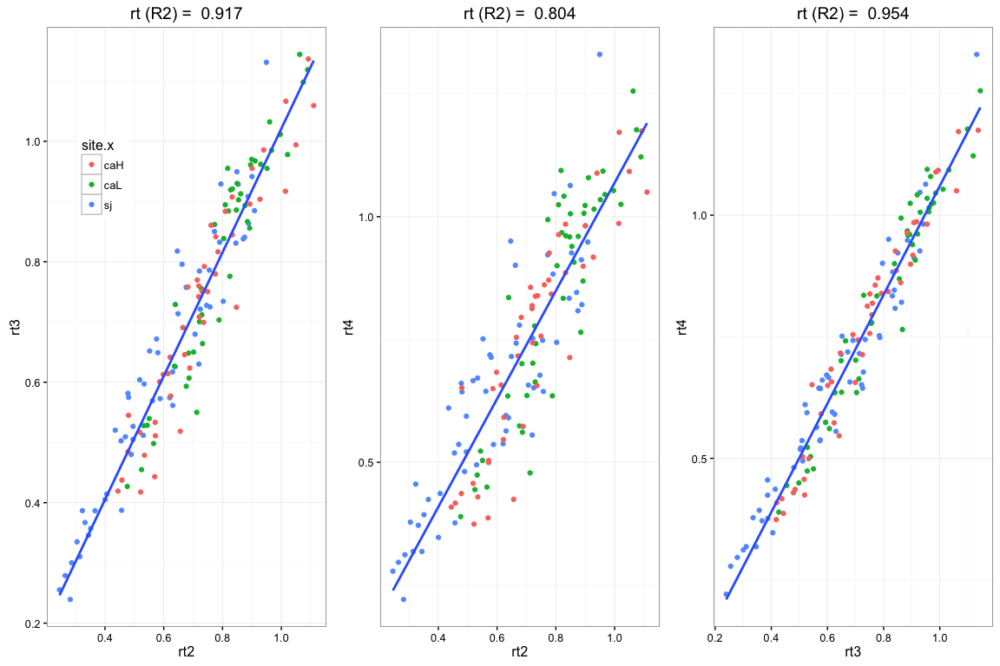

``` r
# Recovery 
model <- lm(rc2~rc3, data=correlations)
p_rc23 <- correlations %>% ggplot(aes(rc2, rc3)) + 
  geom_point(aes(colour=site.x)) + theme_bw() + geom_smooth(method = 'lm', se=FALSE) + 
  ggtitle(paste('rc (R2) = ', round(summary(model)$r.squared, 3))) + 
  theme(legend.position = c(.2, .75))
aux <- as.data.frame(cbind('rc','2-3', as.numeric(summary(model)$r.squared)))
aux_coefs <- rbind(aux_coefs, aux)


model <- lm(rc2~rc4, data=correlations)
p_rc24 <- correlations %>% ggplot(aes(rc2, rc4)) + 
  geom_point(aes(colour=site.x)) + theme_bw() + geom_smooth(method = 'lm', se=FALSE) + 
  ggtitle(paste('rc (R2) = ', round(summary(model)$r.squared, 3))) +
  theme(legend.position = 'none')
aux <- as.data.frame(cbind('rc','2-4', as.numeric(summary(model)$r.squared)))
aux_coefs <- rbind(aux_coefs, aux)


model <- lm(rc3~rc4, data=correlations)
p_rc34 <- correlations %>% ggplot(aes(rc3, rc4)) + 
  geom_point(aes(colour=site.x)) + theme_bw() + geom_smooth(method = 'lm', se=FALSE) + 
  ggtitle(paste('rc (R2) = ', round(summary(model)$r.squared, 3))) +
  theme(legend.position = 'none')
aux <- as.data.frame(cbind('rc','3-4', as.numeric(summary(model)$r.squared)))
aux_coefs <- rbind(aux_coefs, aux)


grid.arrange(p_rc23, p_rc24, p_rc34,ncol=3) 
```

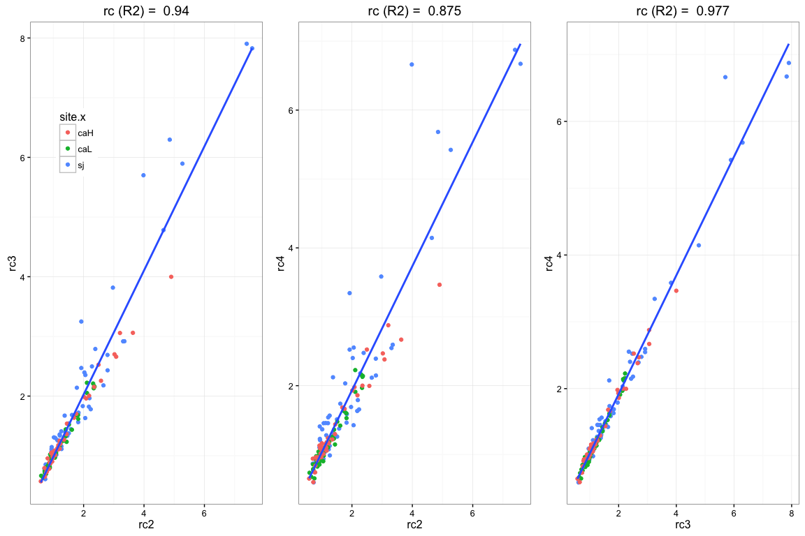

``` r
# Resilience
model <- lm(rs2~rs3, data=correlations)
p_rs23 <- correlations %>% ggplot(aes(rs2, rs3)) + 
  geom_point(aes(colour=site.x)) + theme_bw() + geom_smooth(method = 'lm', se=FALSE) + 
  ggtitle(paste('rs (R2) = ', round(summary(model)$r.squared, 3))) + 
  theme(legend.position = c(.2, .75))
aux <- as.data.frame(cbind('rs','2-3', as.numeric(summary(model)$r.squared)))
aux_coefs <- rbind(aux_coefs, aux)

model <- lm(rs2~rs4, data=correlations)
p_rs24 <- correlations %>% ggplot(aes(rs2, rs4)) + 
  geom_point(aes(colour=site.x)) + theme_bw() + geom_smooth(method = 'lm', se=FALSE) + 
  ggtitle(paste('rs (R2) = ', round(summary(model)$r.squared, 3))) +
  theme(legend.position = 'none')
aux <- as.data.frame(cbind('rs','2-4', as.numeric(summary(model)$r.squared)))
aux_coefs <- rbind(aux_coefs, aux)

model <- lm(rs3~rs4, data=correlations)
p_rs34 <- correlations %>% ggplot(aes(rs3, rs4)) + 
  geom_point(aes(colour=site.x)) + theme_bw() + geom_smooth(method = 'lm', se=FALSE) + 
  ggtitle(paste('rs (R2) = ', round(summary(model)$r.squared, 3))) +
  theme(legend.position = 'none')
aux <- as.data.frame(cbind('rs','3-4', as.numeric(summary(model)$r.squared)))
aux_coefs <- rbind(aux_coefs, aux)

grid.arrange(p_rs23, p_rs24, p_rs34,ncol=3) 
```

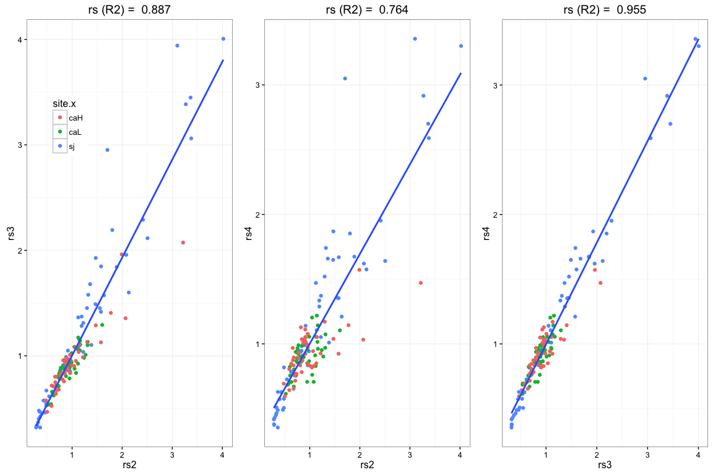

``` r
# Relative Resilience
model <- lm(rrs2~rrs3, data=correlations)
p_rrs23 <- correlations %>% ggplot(aes(rrs2, rrs3)) + 
  geom_point(aes(colour=site.x)) + theme_bw() + geom_smooth(method = 'lm', se=FALSE) + 
  ggtitle(paste('rrs (R2) = ', round(summary(model)$r.squared, 3))) + 
  theme(legend.position = c(.2, .75))
aux <- as.data.frame(cbind('rrs','2-3', as.numeric(summary(model)$r.squared)))
aux_coefs <- rbind(aux_coefs, aux)

model <- lm(rrs2~rrs4, data=correlations)
p_rrs24 <- correlations %>% ggplot(aes(rrs2, rrs4)) + 
  geom_point(aes(colour=site.x)) + theme_bw() + geom_smooth(method = 'lm', se=FALSE) + 
  ggtitle(paste('rrs (R2) = ', round(summary(model)$r.squared, 3))) +
  theme(legend.position = 'none')
aux <- as.data.frame(cbind('rrs','2-4', as.numeric(summary(model)$r.squared)))
aux_coefs <- rbind(aux_coefs, aux)

model <- lm(rrs3~rrs4, data=correlations)
p_rrs34 <- correlations %>% ggplot(aes(rrs3, rrs4)) + 
  geom_point(aes(colour=site.x)) + theme_bw() + geom_smooth(method = 'lm', se=FALSE) + 
  ggtitle(paste('rrs (R2) = ', round(summary(model)$r.squared, 3))) +
  theme(legend.position = 'none')
aux <- as.data.frame(cbind('rrs','3-4', as.numeric(summary(model)$r.squared)))
aux_coefs <- rbind(aux_coefs, aux)

grid.arrange(p_rrs23, p_rrs24, p_rrs34,ncol=3) 
```

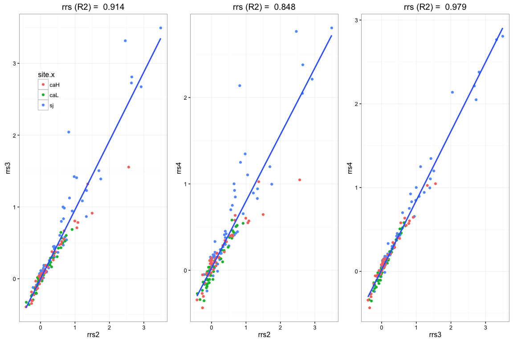

``` r
names(aux_coefs) <- c('var', 'window_size', 'r2')

write.csv(aux_coefs, file=paste0(di, '/out/correla_resilience/correla_window_size.csv'), row.names = F)
```

``` r
aux_coefs %>% pander()
```

<table style="width:51%;">
<colgroup>
<col width="8%" />
<col width="19%" />
<col width="23%" />
</colgroup>
<thead>
<tr class="header">
<th align="center">var</th>
<th align="center">window_size</th>
<th align="center">r2</th>
</tr>
</thead>
<tbody>
<tr class="odd">
<td align="center">rt</td>
<td align="center">2-3</td>
<td align="center">0.916882284149449</td>
</tr>
<tr class="even">
<td align="center">rt</td>
<td align="center">2-4</td>
<td align="center">0.804404303544226</td>
</tr>
<tr class="odd">
<td align="center">rt</td>
<td align="center">3-4</td>
<td align="center">0.954056995082479</td>
</tr>
<tr class="even">
<td align="center">rc</td>
<td align="center">2-3</td>
<td align="center">0.940435462578806</td>
</tr>
<tr class="odd">
<td align="center">rc</td>
<td align="center">2-4</td>
<td align="center">0.875357103621433</td>
</tr>
<tr class="even">
<td align="center">rc</td>
<td align="center">3-4</td>
<td align="center">0.977309191655523</td>
</tr>
<tr class="odd">
<td align="center">rs</td>
<td align="center">2-3</td>
<td align="center">0.887274876125786</td>
</tr>
<tr class="even">
<td align="center">rs</td>
<td align="center">2-4</td>
<td align="center">0.764147394080222</td>
</tr>
<tr class="odd">
<td align="center">rs</td>
<td align="center">3-4</td>
<td align="center">0.955085073886915</td>
</tr>
<tr class="even">
<td align="center">rrs</td>
<td align="center">2-3</td>
<td align="center">0.914381250472491</td>
</tr>
<tr class="odd">
<td align="center">rrs</td>
<td align="center">2-4</td>
<td align="center">0.848277808345292</td>
</tr>
<tr class="even">
<td align="center">rrs</td>
<td align="center">3-4</td>
<td align="center">0.978980936308473</td>
</tr>
</tbody>
</table>

Nos quedamos con 3 años de ventana temporal.

Plots Crecimiento
=================

Boxplot with outliers
---------------------

``` r
gsj <- res_3_sj$growth %>% mutate(site='SJ')
gcaL <- res_3_caL$growth %>% mutate(site='caL')
gcaH <- res_3_caH$growth %>% mutate(site='caH')

g <- bind_rows(gsj, gcaL, gcaH)

# Export csv 
write.csv(g, file=paste0(di, 'data/resilience/crecimientos_drought.csv'), row.names = FALSE)

g %>% mutate(disturb = recode(disturb, 
                              dr = '1_dr', pre = '0_pre', post = '2_post')) %>%
  ggplot(aes(y=mean_period/100, x=disturb)) + 
  geom_boxplot() + 
  facet_grid(site~disturb_year, scales='free_y') + 
  theme_bw()
```

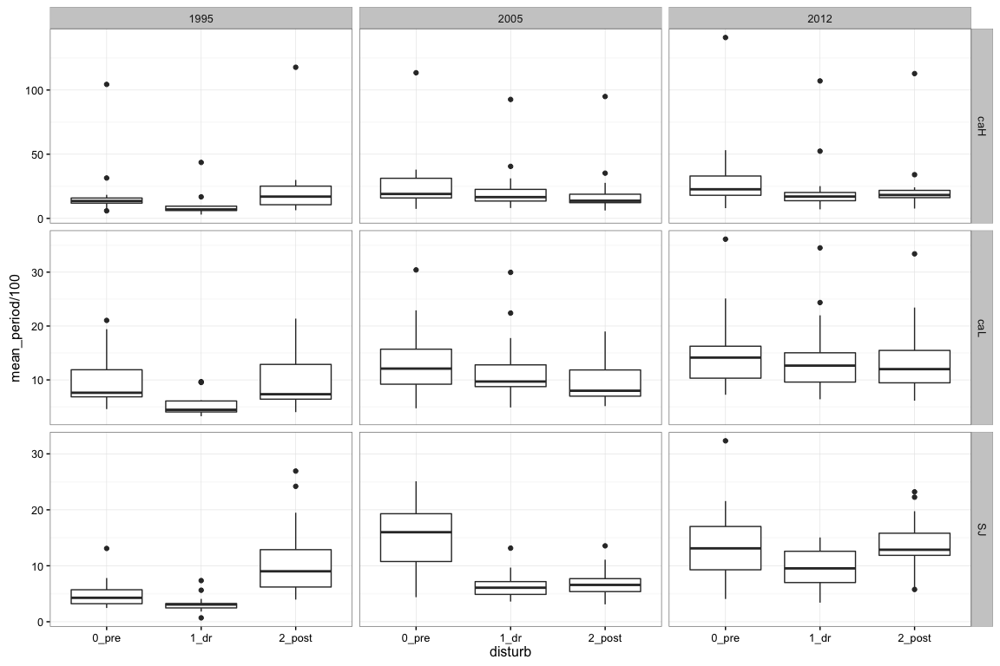

Mean + se
---------

``` r
g %>% 
  mutate(disturb = recode(disturb, dr = '1_dr', pre = '0_pre', post = '2_post')) %>%
  group_by(disturb, disturb_year, site) %>% 
  summarise(mean = mean(mean_period),
            sd = sd(mean_period),
            se = sd/sqrt(length(mean_period))) %>%
  ggplot(aes(y=mean/100, x=disturb)) + 
  geom_errorbar(aes(ymin=mean/100 - se/100, 
                    ymax=mean/100 + se/100),
                width = 0.2) +
  geom_point(size=2, shape=21, fill='white') + 
  facet_grid(site~disturb_year, scales='free_y') + 
  theme_bw() + ylab('BAI (cm2/year)') + 
  theme(panel.grid = element_blank())
```


``` r
pgrowht <- g %>% 
  mutate(disturb = recode(disturb, dr = '1_dr', pre = '0_pre', post = '2_post')) %>%
  group_by(disturb, disturb_year, site) %>% 
  summarise(mean = mean(mean_period),
            sd = sd(mean_period),
            se = sd/sqrt(length(mean_period))) %>%
  ggplot(aes(y=mean/100, x=disturb, colour=site)) + 
  geom_errorbar(aes(ymin=mean/100 - se/100, 
                    ymax=mean/100 + se/100),
                width = 0.15) +
  geom_point(size=3, aes(shape=site), fill='white') + 
  geom_line(aes(group=site))+
  facet_wrap(~disturb_year, scales='free_y') + 
  theme_bw() + ylab('BAI (cm2/year)') + 
  theme(panel.grid = element_blank())

pgrowht
```

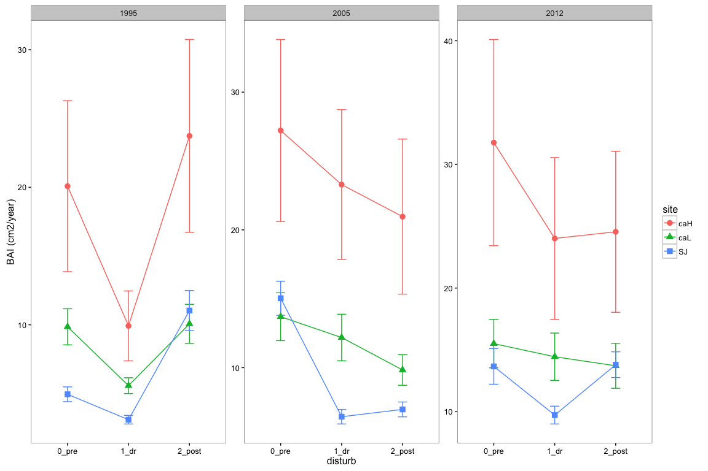

``` r
ggsave(plot=pgrowht, width=8, height = 4,
       filename=paste0(di, 'out/fig/resilience/bai_events.pdf')) 
```

``` r
g %>% 
  mutate(disturb = recode(disturb, dr = '1_dr', pre = '0_pre', post = '2_post')) %>%
  group_by(site, disturb_year, disturb) %>% 
  summarise(mean = mean(mean_period/100),
            sd = sd(mean_period/100),
            se = sd/sqrt(length(mean_period/100))) %>% pander() 
```

<table style="width:86%;">
<colgroup>
<col width="9%" />
<col width="20%" />
<col width="13%" />
<col width="13%" />
<col width="13%" />
<col width="13%" />
</colgroup>
<thead>
<tr class="header">
<th align="center">site</th>
<th align="center">disturb_year</th>
<th align="center">disturb</th>
<th align="center">mean</th>
<th align="center">sd</th>
<th align="center">se</th>
</tr>
</thead>
<tbody>
<tr class="odd">
<td align="center">SJ</td>
<td align="center">1995</td>
<td align="center">0_pre</td>
<td align="center">4.949360</td>
<td align="center">2.401841</td>
<td align="center">0.5370680</td>
</tr>
<tr class="even">
<td align="center">SJ</td>
<td align="center">1995</td>
<td align="center">1_dr</td>
<td align="center">3.102071</td>
<td align="center">1.394718</td>
<td align="center">0.3118683</td>
</tr>
<tr class="odd">
<td align="center">SJ</td>
<td align="center">1995</td>
<td align="center">2_post</td>
<td align="center">11.037538</td>
<td align="center">6.507541</td>
<td align="center">1.4551304</td>
</tr>
<tr class="even">
<td align="center">SJ</td>
<td align="center">2005</td>
<td align="center">0_pre</td>
<td align="center">15.038941</td>
<td align="center">5.521582</td>
<td align="center">1.2346633</td>
</tr>
<tr class="odd">
<td align="center">SJ</td>
<td align="center">2005</td>
<td align="center">1_dr</td>
<td align="center">6.437153</td>
<td align="center">2.358030</td>
<td align="center">0.5272715</td>
</tr>
<tr class="even">
<td align="center">SJ</td>
<td align="center">2005</td>
<td align="center">2_post</td>
<td align="center">6.966562</td>
<td align="center">2.409606</td>
<td align="center">0.5388042</td>
</tr>
<tr class="odd">
<td align="center">SJ</td>
<td align="center">2012</td>
<td align="center">0_pre</td>
<td align="center">13.666405</td>
<td align="center">6.457739</td>
<td align="center">1.4439943</td>
</tr>
<tr class="even">
<td align="center">SJ</td>
<td align="center">2012</td>
<td align="center">1_dr</td>
<td align="center">9.729436</td>
<td align="center">3.218183</td>
<td align="center">0.7196077</td>
</tr>
<tr class="odd">
<td align="center">SJ</td>
<td align="center">2012</td>
<td align="center">2_post</td>
<td align="center">13.804918</td>
<td align="center">4.651000</td>
<td align="center">1.0399953</td>
</tr>
<tr class="even">
<td align="center">caH</td>
<td align="center">1995</td>
<td align="center">0_pre</td>
<td align="center">20.078179</td>
<td align="center">24.072135</td>
<td align="center">6.2153984</td>
</tr>
<tr class="odd">
<td align="center">caH</td>
<td align="center">1995</td>
<td align="center">1_dr</td>
<td align="center">9.923127</td>
<td align="center">9.845728</td>
<td align="center">2.5421560</td>
</tr>
<tr class="even">
<td align="center">caH</td>
<td align="center">1995</td>
<td align="center">2_post</td>
<td align="center">23.735572</td>
<td align="center">27.143508</td>
<td align="center">7.0084236</td>
</tr>
<tr class="odd">
<td align="center">caH</td>
<td align="center">2005</td>
<td align="center">0_pre</td>
<td align="center">27.216860</td>
<td align="center">25.581156</td>
<td align="center">6.6050261</td>
</tr>
<tr class="even">
<td align="center">caH</td>
<td align="center">2005</td>
<td align="center">1_dr</td>
<td align="center">23.290311</td>
<td align="center">21.057950</td>
<td align="center">5.4371394</td>
</tr>
<tr class="odd">
<td align="center">caH</td>
<td align="center">2005</td>
<td align="center">2_post</td>
<td align="center">20.963604</td>
<td align="center">21.794923</td>
<td align="center">5.6274250</td>
</tr>
<tr class="even">
<td align="center">caH</td>
<td align="center">2012</td>
<td align="center">0_pre</td>
<td align="center">31.763565</td>
<td align="center">32.285075</td>
<td align="center">8.3359704</td>
</tr>
<tr class="odd">
<td align="center">caH</td>
<td align="center">2012</td>
<td align="center">1_dr</td>
<td align="center">24.015379</td>
<td align="center">25.334862</td>
<td align="center">6.5414332</td>
</tr>
<tr class="even">
<td align="center">caH</td>
<td align="center">2012</td>
<td align="center">2_post</td>
<td align="center">24.552089</td>
<td align="center">25.215397</td>
<td align="center">6.5105875</td>
</tr>
<tr class="odd">
<td align="center">caL</td>
<td align="center">1995</td>
<td align="center">0_pre</td>
<td align="center">9.855063</td>
<td align="center">5.080906</td>
<td align="center">1.3118843</td>
</tr>
<tr class="even">
<td align="center">caL</td>
<td align="center">1995</td>
<td align="center">1_dr</td>
<td align="center">5.577226</td>
<td align="center">2.229862</td>
<td align="center">0.5757479</td>
</tr>
<tr class="odd">
<td align="center">caL</td>
<td align="center">1995</td>
<td align="center">2_post</td>
<td align="center">10.070205</td>
<td align="center">5.500586</td>
<td align="center">1.4202452</td>
</tr>
<tr class="even">
<td align="center">caL</td>
<td align="center">2005</td>
<td align="center">0_pre</td>
<td align="center">13.698045</td>
<td align="center">6.730193</td>
<td align="center">1.7377283</td>
</tr>
<tr class="odd">
<td align="center">caL</td>
<td align="center">2005</td>
<td align="center">1_dr</td>
<td align="center">12.187221</td>
<td align="center">6.548989</td>
<td align="center">1.6909416</td>
</tr>
<tr class="even">
<td align="center">caL</td>
<td align="center">2005</td>
<td align="center">2_post</td>
<td align="center">9.832373</td>
<td align="center">4.307852</td>
<td align="center">1.1122825</td>
</tr>
<tr class="odd">
<td align="center">caL</td>
<td align="center">2012</td>
<td align="center">0_pre</td>
<td align="center">15.506432</td>
<td align="center">7.571946</td>
<td align="center">1.9550681</td>
</tr>
<tr class="even">
<td align="center">caL</td>
<td align="center">2012</td>
<td align="center">1_dr</td>
<td align="center">14.447602</td>
<td align="center">7.411388</td>
<td align="center">1.9136121</td>
</tr>
<tr class="odd">
<td align="center">caL</td>
<td align="center">2012</td>
<td align="center">2_post</td>
<td align="center">13.717155</td>
<td align="center">7.050255</td>
<td align="center">1.8203679</td>
</tr>
</tbody>
</table>

Anovas Resiliencia
==================

``` r
# Prepara data 
rsj <- res_3_sj$resilience %>% mutate(site='SJ')
rcaL<- res_3_caL$resilience %>% mutate(site='caL')
rcaH <- res_3_caH$resilience %>% mutate(site='caH')

re <- bind_rows(rsj, rcaL, rcaH)
re$disturb_year <- as.factor(re$disturb_year)
re$site <- as.factor(re$site)

# Export csv 
write.csv(re, file=paste0(di, 'data/resilience/resilience_bai.csv'), row.names = FALSE)
```

Custom functions
----------------

``` r
# Custom Function to compute ANOVAS
aovas <- function(df, vars, resp_var){ 
  require('dplyr')
  require('broom')
  
  # Create subset 
  dfsel <- df %>% dplyr::select_(.dots=c(vars, resp_var)) 
    
  
  # Model 
  myformula <- as.formula(paste0(resp_var,  " ~ ",
                                 paste(vars, collapse = '*')))
  
  mymodel <- aov(myformula, data=dfsel)
  
  # Output model Summary http://my.ilstu.edu/~wjschne/444/ANOVA.html#(1)
  model_coeff <- broom::tidy(mymodel)
  model_summary <- broom::glance(mymodel)
  
  out <- c() 
  out$model_coeff <- model_coeff
  out$model_summary <- model_summary
  out$mymodel <- mymodel
  
  return(out)
}


# Post-Hoc comparison
phc <- function(mymodel, resp_var){
  require(lsmeans)

  # Disturb Event 
  ph_event <- lsmeans(mymodel, pairwise ~ disturb_year, adjust = "tukey")
  
  # differences letters 
  cld_event <- cld(ph_event, alpha   = 0.01, 
                   Letters = letters, 
                   adjust  = "tukey")
  
  # Site  
  ph_site <- lsmeans(mymodel, pairwise ~ site, adjust = "tukey")
  cld_site <- cld(ph_site, alpha   = 0.01, 
                 Letters = letters, 
                 adjust  = "tukey")

  # interaction 
  ph_i <- lsmeans(mymodel, pairwise ~ disturb_year:site, adjust = "tukey")
  cld_i <- cld(ph_i, alpha   = 0.01, 
                 Letters = letters, 
                 adjust  = "tukey")
  
  # Objets for plot
  aux_ph_site <- as.data.frame(summary(ph_site$lsmeans)) 
  aux_ph_site <- aux_ph_site %>% mutate(var = resp_var)
  aux_ph_event <- as.data.frame(summary(ph_event$lsmeans)) 
  aux_ph_event <- aux_ph_event %>% mutate(var = resp_var)
  aux_ph_i <- as.data.frame(summary(ph_i$lsmeans)) 
  aux_ph_i <- aux_ph_i %>% mutate(var = resp_var)
  
  # Return objects
  cat('\n### Event ###\n')
  print(ph_event)
  print(cld_event)
  cat('\n### Clu pop ###\n')
  print(ph_site)
  print(cld_site)
  cat('\n### Event:Clu pop ###\n')
  print(ph_i)
  return(list(aux_ph_site, aux_ph_event, aux_ph_i, cld_site, cld_event, cld_i))
}
```

``` r
# Only 2005 and 2012
re <- re %>% filter(disturb_year != 1995) %>% as.data.frame()
vars <- c('disturb_year','site')
```

Recovery
--------

``` r
# Variable
resp_var <- 'rc'

# AOV
aov_rc <- aovas(re, vars=vars, resp_var = resp_var)
```

``` r
mc <- aov_rc$model_coeff

pander(mc, round=5,
       caption = paste0("ANOVA table: ", resp_var), missing = '', 
       emphasize.strong.cells = 
         which(mc < 0.1 & mc == mc$p.value, arr.ind = T))
```

<table style="width:89%;">
<caption>ANOVA table: rc</caption>
<colgroup>
<col width="25%" />
<col width="6%" />
<col width="11%" />
<col width="12%" />
<col width="16%" />
<col width="16%" />
</colgroup>
<thead>
<tr class="header">
<th align="center">term</th>
<th align="center">df</th>
<th align="center">sumsq</th>
<th align="center">meansq</th>
<th align="center">statistic</th>
<th align="center">p.value</th>
</tr>
</thead>
<tbody>
<tr class="odd">
<td align="center">disturb_year</td>
<td align="center">1</td>
<td align="center">1.316</td>
<td align="center">1.316</td>
<td align="center">32.78</td>
<td align="center"><strong>0</strong></td>
</tr>
<tr class="even">
<td align="center">site</td>
<td align="center">2</td>
<td align="center">2.847</td>
<td align="center">1.424</td>
<td align="center">35.45</td>
<td align="center"><strong>0</strong></td>
</tr>
<tr class="odd">
<td align="center">disturb_year:site</td>
<td align="center">2</td>
<td align="center">0.1961</td>
<td align="center">0.09805</td>
<td align="center">2.442</td>
<td align="center"><strong>0.09253</strong></td>
</tr>
<tr class="even">
<td align="center">Residuals</td>
<td align="center">94</td>
<td align="center">3.775</td>
<td align="center">0.04016</td>
<td align="center"></td>
<td align="center"></td>
</tr>
</tbody>
</table>

``` r
gm <- aov_rc$model_summary

gm <- apply(gm, 1, formatC, digits = 2, format = "f") %>% t()
colnames(gm) <- paste0("$",c("R^2","\\mathrm{adj}R^2","\\sigma_e","F","p","df_m","\\mathrm{logLik}","AIC","BIC","\\mathrm{dev}","df_e"),"$")
rownames(gm) <- "Statistic"
pander(t(gm)) 
```

<table style="width:49%;">
<colgroup>
<col width="33%" />
<col width="15%" />
</colgroup>
<thead>
<tr class="header">
<th align="center"> </th>
<th align="center">Statistic</th>
</tr>
</thead>
<tbody>
<tr class="odd">
<td align="center"><strong><span class="math inline"><em>R</em><sup>2</sup></span></strong></td>
<td align="center">0.54</td>
</tr>
<tr class="even">
<td align="center"><strong><span class="math inline"><em>a</em><em>d</em><em>j</em><em>R</em><sup>2</sup></span></strong></td>
<td align="center">0.51</td>
</tr>
<tr class="odd">
<td align="center"><strong><span class="math inline"><em>σ</em><sub><em>e</em></sub></span></strong></td>
<td align="center">0.20</td>
</tr>
<tr class="even">
<td align="center"><strong><span class="math inline"><em>F</em></span></strong></td>
<td align="center">21.71</td>
</tr>
<tr class="odd">
<td align="center"><strong><span class="math inline"><em>p</em></span></strong></td>
<td align="center">0.00</td>
</tr>
<tr class="even">
<td align="center"><strong><span class="math inline"><em>d</em><em>f</em><sub><em>m</em></sub></span></strong></td>
<td align="center">6.00</td>
</tr>
<tr class="odd">
<td align="center"><strong><span class="math inline"><em>l</em><em>o</em><em>g</em><em>L</em><em>i</em><em>k</em></span></strong></td>
<td align="center">21.95</td>
</tr>
<tr class="even">
<td align="center"><strong><span class="math inline"><em>A</em><em>I</em><em>C</em></span></strong></td>
<td align="center">-29.89</td>
</tr>
<tr class="odd">
<td align="center"><strong><span class="math inline"><em>B</em><em>I</em><em>C</em></span></strong></td>
<td align="center">-11.66</td>
</tr>
<tr class="even">
<td align="center"><strong><span class="math inline"><em>d</em><em>e</em><em>v</em></span></strong></td>
<td align="center">3.77</td>
</tr>
<tr class="odd">
<td align="center"><strong><span class="math inline"><em>d</em><em>f</em><sub><em>e</em></sub></span></strong></td>
<td align="center">94.00</td>
</tr>
</tbody>
</table>

### Post hoc comparison

``` r
# Post hoc Define model
mymodel <- aov_rc$mymodel
postH_rc <- phc(mymodel = mymodel, resp_var = resp_var)
```

    ## 
    ## ### Event ###
    ## $lsmeans
    ##  disturb_year    lsmean         SE df  lower.CL upper.CL
    ##  2005         0.9460722 0.02860151 94 0.8892832 1.002861
    ##  2012         1.1643064 0.02860151 94 1.1075175 1.221095
    ## 
    ## Results are averaged over the levels of: site 
    ## Confidence level used: 0.95 
    ## 
    ## $contrasts
    ##  contrast      estimate         SE df t.ratio p.value
    ##  2005 - 2012 -0.2182343 0.04044865 94  -5.395  <.0001
    ## 
    ## Results are averaged over the levels of: site 
    ## 
    ##  disturb_year    lsmean         SE df  lower.CL upper.CL .group
    ##  2005         0.9460722 0.02860151 94 0.8810686 1.011076  a    
    ##  2012         1.1643064 0.02860151 94 1.0993029 1.229310   b   
    ## 
    ## Results are averaged over the levels of: site 
    ## Confidence level used: 0.95 
    ## Conf-level adjustment: sidak method for 2 estimates 
    ## significance level used: alpha = 0.01 
    ## 
    ## ### Clu pop ###
    ## $lsmeans
    ##  site    lsmean         SE df  lower.CL  upper.CL
    ##  SJ   1.2803536 0.03168543 94 1.2174414 1.3432657
    ##  caH  0.9853013 0.03658718 94 0.9126566 1.0579460
    ##  caL  0.8999131 0.03658718 94 0.8272684 0.9725578
    ## 
    ## Results are averaged over the levels of: disturb_year 
    ## Confidence level used: 0.95 
    ## 
    ## $contrasts
    ##  contrast    estimate         SE df t.ratio p.value
    ##  SJ - caH  0.29505228 0.04840029 94   6.096  <.0001
    ##  SJ - caL  0.38044051 0.04840029 94   7.860  <.0001
    ##  caH - caL 0.08538823 0.05174209 94   1.650  0.2299
    ## 
    ## Results are averaged over the levels of: disturb_year 
    ## P value adjustment: tukey method for comparing a family of 3 estimates 
    ## 
    ##  site    lsmean         SE df  lower.CL  upper.CL .group
    ##  caL  0.8999131 0.03658718 94 0.8109687 0.9888574  a    
    ##  caH  0.9853013 0.03658718 94 0.8963569 1.0742457  a    
    ##  SJ   1.2803536 0.03168543 94 1.2033255 1.3573817   b   
    ## 
    ## Results are averaged over the levels of: disturb_year 
    ## Confidence level used: 0.95 
    ## Conf-level adjustment: sidak method for 3 estimates 
    ## P value adjustment: tukey method for comparing a family of 3 estimates 
    ## significance level used: alpha = 0.01 
    ## 
    ## ### Event:Clu pop ###
    ## $lsmeans
    ##  disturb_year site    lsmean         SE df  lower.CL  upper.CL
    ##  2005         SJ   1.1150292 0.04480996 94 1.0260579 1.2040004
    ##  2012         SJ   1.4456780 0.04480996 94 1.3567068 1.5346492
    ##  2005         caH  0.8836738 0.05174209 94 0.7809387 0.9864089
    ##  2012         caH  1.0869288 0.05174209 94 0.9841937 1.1896639
    ##  2005         caL  0.8395136 0.05174209 94 0.7367785 0.9422487
    ##  2012         caL  0.9603126 0.05174209 94 0.8575774 1.0630477
    ## 
    ## Confidence level used: 0.95 
    ## 
    ## $contrasts
    ##  contrast               estimate         SE df t.ratio p.value
    ##  2005,SJ - 2012,SJ   -0.33064881 0.06337085 94  -5.218  <.0001
    ##  2005,SJ - 2005,caH   0.23135538 0.06844835 94   3.380  0.0131
    ##  2005,SJ - 2012,caH   0.02810037 0.06844835 94   0.411  0.9985
    ##  2005,SJ - 2005,caL   0.27551559 0.06844835 94   4.025  0.0016
    ##  2005,SJ - 2012,caL   0.15471662 0.06844835 94   2.260  0.2209
    ##  2012,SJ - 2005,caH   0.56200419 0.06844835 94   8.211  <.0001
    ##  2012,SJ - 2012,caH   0.35874918 0.06844835 94   5.241  <.0001
    ##  2012,SJ - 2005,caL   0.60616440 0.06844835 94   8.856  <.0001
    ##  2012,SJ - 2012,caL   0.48536543 0.06844835 94   7.091  <.0001
    ##  2005,caH - 2012,caH -0.20325501 0.07317436 94  -2.778  0.0701
    ##  2005,caH - 2005,caL  0.04416021 0.07317436 94   0.603  0.9905
    ##  2005,caH - 2012,caL -0.07663876 0.07317436 94  -1.047  0.9005
    ##  2012,caH - 2005,caL  0.24741522 0.07317436 94   3.381  0.0131
    ##  2012,caH - 2012,caL  0.12661625 0.07317436 94   1.730  0.5155
    ##  2005,caL - 2012,caL -0.12079897 0.07317436 94  -1.651  0.5674
    ## 
    ## P value adjustment: tukey method for comparing a family of 6 estimates

### Plots

``` r
#### ~ Site
ps <- plot(effect("site",mymodel))
#### ~ Disturb Year
pd <- plot(effect('disturb_year', mymodel))
#### Disturb Year:Site
picollapse <- plot(effect("disturb_year:site",mymodel), multiline = TRUE, ci.style = 'bars')
pi <- plot(effect("disturb_year:site",mymodel), layout=c(3,1))
```

``` r
ps
```

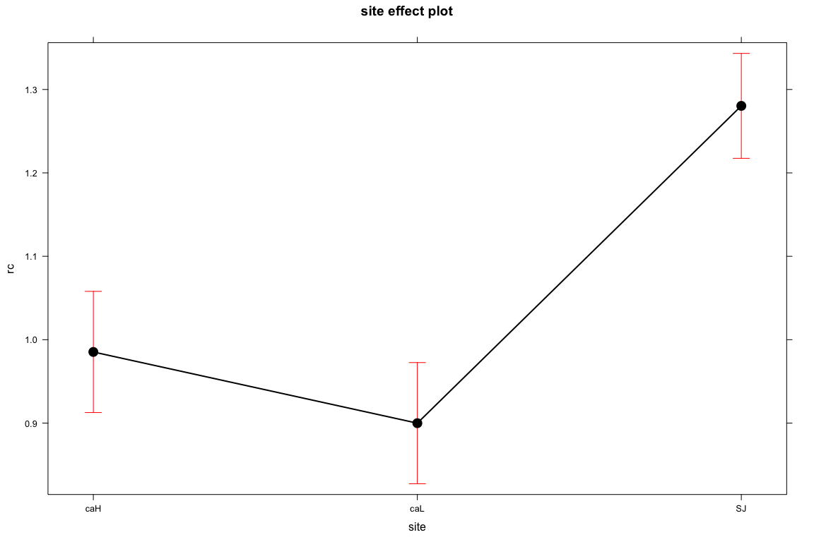

``` r
pd
```

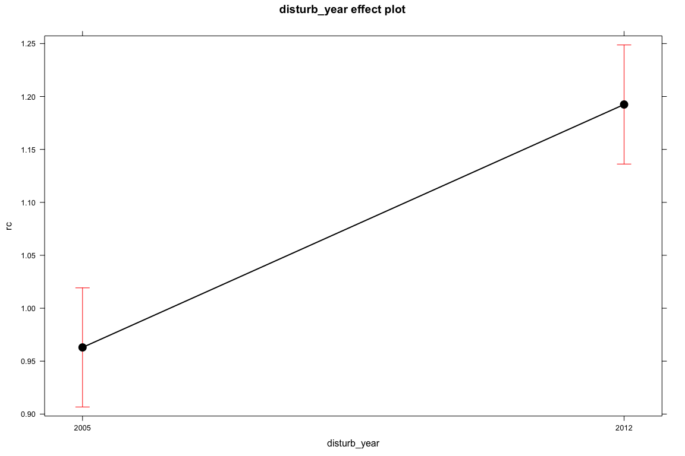

``` r
picollapse
```

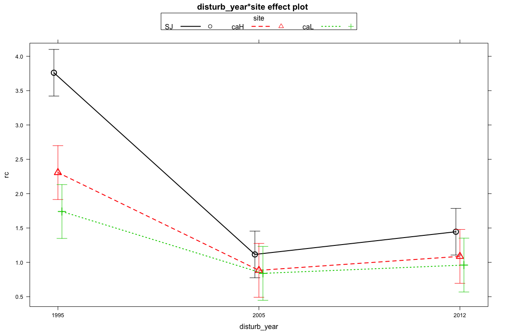

``` r
pi
```

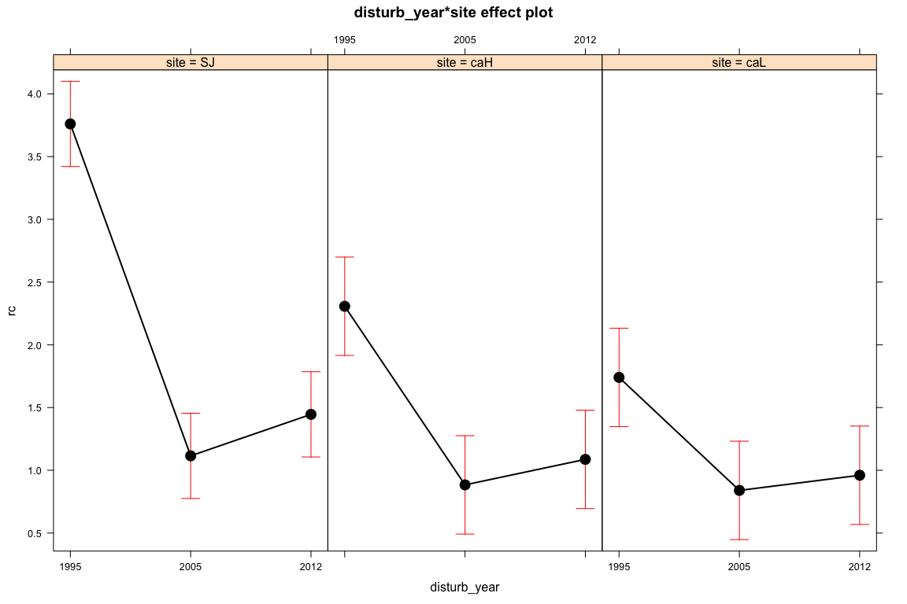

Resistance
----------

``` r
# Variable
resp_var <- 'rt'

# AOV
aov_rt <- aovas(re, vars=vars, resp_var = resp_var)
```

``` r
mc <- aov_rt$model_coeff

pander(mc, round=5,
       caption = paste0("ANOVA table: ", resp_var), missing = '', 
       emphasize.strong.cells = 
         which(mc < 0.1 & mc == mc$p.value, arr.ind = T))
```

<table style="width:89%;">
<caption>ANOVA table: rt</caption>
<colgroup>
<col width="25%" />
<col width="6%" />
<col width="11%" />
<col width="12%" />
<col width="16%" />
<col width="16%" />
</colgroup>
<thead>
<tr class="header">
<th align="center">term</th>
<th align="center">df</th>
<th align="center">sumsq</th>
<th align="center">meansq</th>
<th align="center">statistic</th>
<th align="center">p.value</th>
</tr>
</thead>
<tbody>
<tr class="odd">
<td align="center">disturb_year</td>
<td align="center">1</td>
<td align="center">0.2122</td>
<td align="center">0.2122</td>
<td align="center">9.867</td>
<td align="center"><strong>0.00225</strong></td>
</tr>
<tr class="even">
<td align="center">site</td>
<td align="center">2</td>
<td align="center">1.666</td>
<td align="center">0.833</td>
<td align="center">38.74</td>
<td align="center"><strong>0</strong></td>
</tr>
<tr class="odd">
<td align="center">disturb_year:site</td>
<td align="center">2</td>
<td align="center">0.8604</td>
<td align="center">0.4302</td>
<td align="center">20.01</td>
<td align="center"><strong>0</strong></td>
</tr>
<tr class="even">
<td align="center">Residuals</td>
<td align="center">94</td>
<td align="center">2.021</td>
<td align="center">0.0215</td>
<td align="center"></td>
<td align="center"></td>
</tr>
</tbody>
</table>

``` r
gm <- aov_rt$model_summary

gm <- apply(gm, 1, formatC, digits = 2, format = "f") %>% t()
colnames(gm) <- paste0("$",c("R^2","\\mathrm{adj}R^2","\\sigma_e","F","p","df_m","\\mathrm{logLik}","AIC","BIC","\\mathrm{dev}","df_e"),"$")
rownames(gm) <- "Statistic"
pander(t(gm)) 
```

<table style="width:49%;">
<colgroup>
<col width="33%" />
<col width="15%" />
</colgroup>
<thead>
<tr class="header">
<th align="center"> </th>
<th align="center">Statistic</th>
</tr>
</thead>
<tbody>
<tr class="odd">
<td align="center"><strong><span class="math inline"><em>R</em><sup>2</sup></span></strong></td>
<td align="center">0.58</td>
</tr>
<tr class="even">
<td align="center"><strong><span class="math inline"><em>a</em><em>d</em><em>j</em><em>R</em><sup>2</sup></span></strong></td>
<td align="center">0.55</td>
</tr>
<tr class="odd">
<td align="center"><strong><span class="math inline"><em>σ</em><sub><em>e</em></sub></span></strong></td>
<td align="center">0.15</td>
</tr>
<tr class="even">
<td align="center"><strong><span class="math inline"><em>F</em></span></strong></td>
<td align="center">25.47</td>
</tr>
<tr class="odd">
<td align="center"><strong><span class="math inline"><em>p</em></span></strong></td>
<td align="center">0.00</td>
</tr>
<tr class="even">
<td align="center"><strong><span class="math inline"><em>d</em><em>f</em><sub><em>m</em></sub></span></strong></td>
<td align="center">6.00</td>
</tr>
<tr class="odd">
<td align="center"><strong><span class="math inline"><em>l</em><em>o</em><em>g</em><em>L</em><em>i</em><em>k</em></span></strong></td>
<td align="center">53.18</td>
</tr>
<tr class="even">
<td align="center"><strong><span class="math inline"><em>A</em><em>I</em><em>C</em></span></strong></td>
<td align="center">-92.35</td>
</tr>
<tr class="odd">
<td align="center"><strong><span class="math inline"><em>B</em><em>I</em><em>C</em></span></strong></td>
<td align="center">-74.11</td>
</tr>
<tr class="even">
<td align="center"><strong><span class="math inline"><em>d</em><em>e</em><em>v</em></span></strong></td>
<td align="center">2.02</td>
</tr>
<tr class="odd">
<td align="center"><strong><span class="math inline"><em>d</em><em>f</em><sub><em>e</em></sub></span></strong></td>
<td align="center">94.00</td>
</tr>
</tbody>
</table>

### Post hoc comparison

``` r
# Post hoc Define model
mymodel <- aov_rt$mymodel
postH_rt <- phc(mymodel = mymodel, resp_var = resp_var)
```

    ## 
    ## ### Event ###
    ## $lsmeans
    ##  disturb_year    lsmean         SE df  lower.CL  upper.CL
    ##  2005         0.7483129 0.02092964 94 0.7067567 0.7898692
    ##  2012         0.8166033 0.02092964 94 0.7750470 0.8581596
    ## 
    ## Results are averaged over the levels of: site 
    ## Confidence level used: 0.95 
    ## 
    ## $contrasts
    ##  contrast       estimate         SE df t.ratio p.value
    ##  2005 - 2012 -0.06829036 0.02959898 94  -2.307  0.0232
    ## 
    ## Results are averaged over the levels of: site 
    ## 
    ##  disturb_year    lsmean         SE df  lower.CL  upper.CL .group
    ##  2005         0.7483129 0.02092964 94 0.7007455 0.7958804  a    
    ##  2012         0.8166033 0.02092964 94 0.7690359 0.8641707  a    
    ## 
    ## Results are averaged over the levels of: site 
    ## Confidence level used: 0.95 
    ## Conf-level adjustment: sidak method for 2 estimates 
    ## significance level used: alpha = 0.01 
    ## 
    ## ### Clu pop ###
    ## $lsmeans
    ##  site    lsmean         SE df  lower.CL  upper.CL
    ##  SJ   0.6139485 0.02318635 94 0.5679114 0.6599855
    ##  caH  0.8196809 0.02677329 94 0.7665219 0.8728399
    ##  caL  0.9137450 0.02677329 94 0.8605860 0.9669040
    ## 
    ## Results are averaged over the levels of: disturb_year 
    ## Confidence level used: 0.95 
    ## 
    ## $contrasts
    ##  contrast     estimate         SE df t.ratio p.value
    ##  SJ - caH  -0.20573248 0.03541773 94  -5.809  <.0001
    ##  SJ - caL  -0.29979653 0.03541773 94  -8.465  <.0001
    ##  caH - caL -0.09406405 0.03786314 94  -2.484  0.0388
    ## 
    ## Results are averaged over the levels of: disturb_year 
    ## P value adjustment: tukey method for comparing a family of 3 estimates 
    ## 
    ##  site    lsmean         SE df  lower.CL  upper.CL .group
    ##  SJ   0.6139485 0.02318635 94 0.5575818 0.6703151  a    
    ##  caH  0.8196809 0.02677329 94 0.7545944 0.8847675   b   
    ##  caL  0.9137450 0.02677329 94 0.8486584 0.9788315   b   
    ## 
    ## Results are averaged over the levels of: disturb_year 
    ## Confidence level used: 0.95 
    ## Conf-level adjustment: sidak method for 3 estimates 
    ## P value adjustment: tukey method for comparing a family of 3 estimates 
    ## significance level used: alpha = 0.01 
    ## 
    ## ### Event:Clu pop ###
    ## $lsmeans
    ##  disturb_year site    lsmean         SE df  lower.CL  upper.CL
    ##  2005         SJ   0.4606116 0.03279045 94 0.3955054 0.5257178
    ##  2012         SJ   0.7672853 0.03279045 94 0.7021791 0.8323915
    ##  2005         caH  0.8845609 0.03786314 94 0.8093827 0.9597391
    ##  2012         caH  0.7548010 0.03786314 94 0.6796228 0.8299791
    ##  2005         caL  0.8997663 0.03786314 94 0.8245881 0.9749444
    ##  2012         caL  0.9277237 0.03786314 94 0.8525455 1.0029018
    ## 
    ## Confidence level used: 0.95 
    ## 
    ## $contrasts
    ##  contrast               estimate         SE df t.ratio p.value
    ##  2005,SJ - 2012,SJ   -0.30667361 0.04637269 94  -6.613  <.0001
    ##  2005,SJ - 2005,caH  -0.42394925 0.05008823 94  -8.464  <.0001
    ##  2005,SJ - 2012,caH  -0.29418931 0.05008823 94  -5.873  <.0001
    ##  2005,SJ - 2005,caL  -0.43915464 0.05008823 94  -8.768  <.0001
    ##  2005,SJ - 2012,caL  -0.46711203 0.05008823 94  -9.326  <.0001
    ##  2012,SJ - 2005,caH  -0.11727564 0.05008823 94  -2.341  0.1882
    ##  2012,SJ - 2012,caH   0.01248430 0.05008823 94   0.249  0.9999
    ##  2012,SJ - 2005,caL  -0.13248102 0.05008823 94  -2.645  0.0967
    ##  2012,SJ - 2012,caL  -0.16043842 0.05008823 94  -3.203  0.0222
    ##  2005,caH - 2012,caH  0.12975994 0.05354657 94   2.423  0.1589
    ##  2005,caH - 2005,caL -0.01520539 0.05354657 94  -0.284  0.9997
    ##  2005,caH - 2012,caL -0.04316278 0.05354657 94  -0.806  0.9658
    ##  2012,caH - 2005,caL -0.14496533 0.05354657 94  -2.707  0.0833
    ##  2012,caH - 2012,caL -0.17292272 0.05354657 94  -3.229  0.0206
    ##  2005,caL - 2012,caL -0.02795739 0.05354657 94  -0.522  0.9952
    ## 
    ## P value adjustment: tukey method for comparing a family of 6 estimates

### Plots

``` r
#### ~ Site
ps <- plot(effect("site",mymodel))
#### ~ Disturb Year
pd <- plot(effect('disturb_year', mymodel))
#### Disturb Year:Site
picollapse <- plot(effect("disturb_year:site",mymodel), multiline = TRUE, ci.style = 'bars')
pi <- plot(effect("disturb_year:site",mymodel), layout=c(3,1))
```

``` r
ps
```

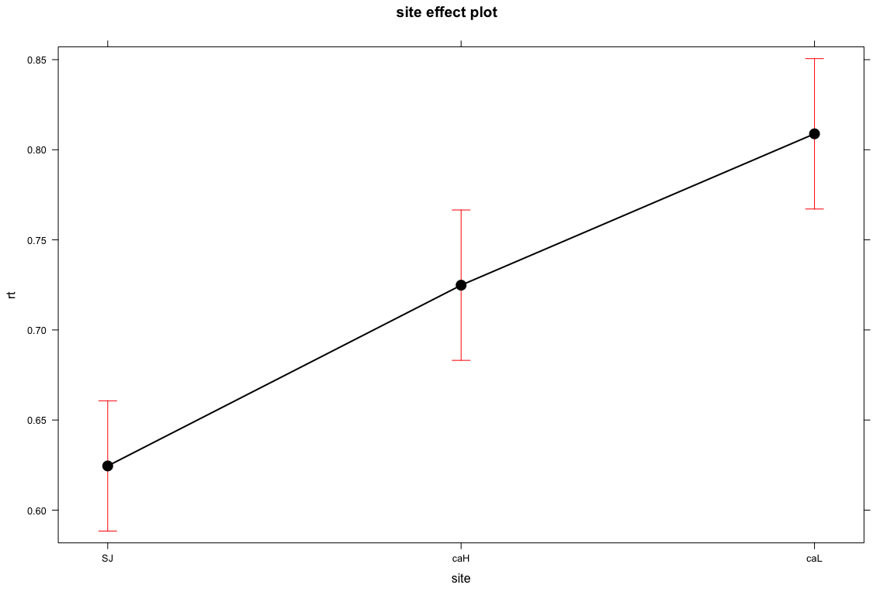

``` r
pd
```

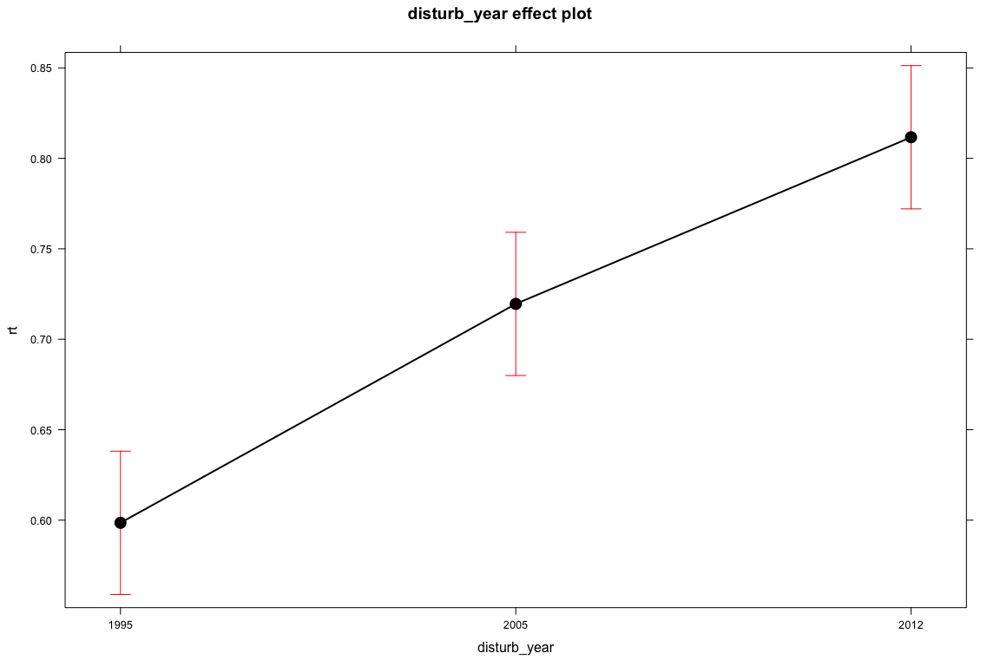

``` r
picollapse
```

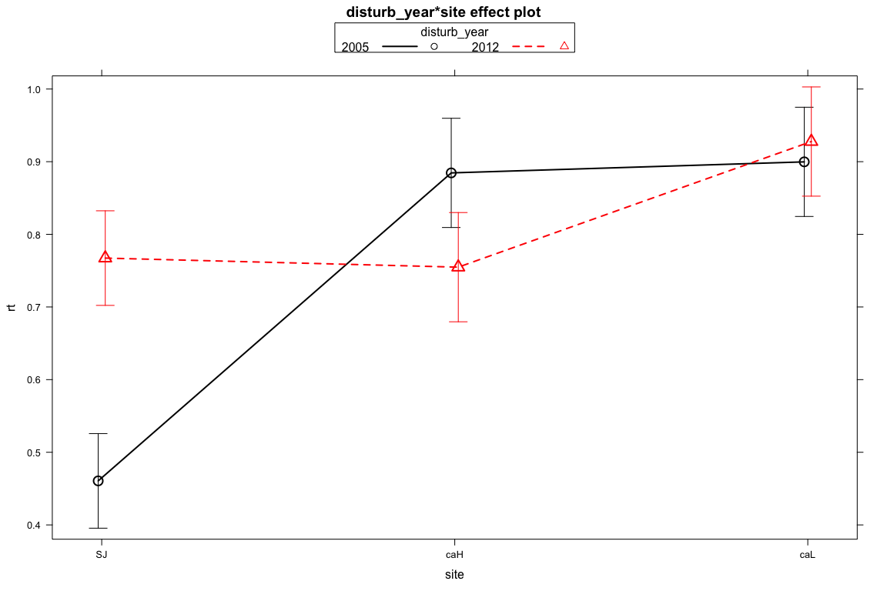

``` r
pi
```

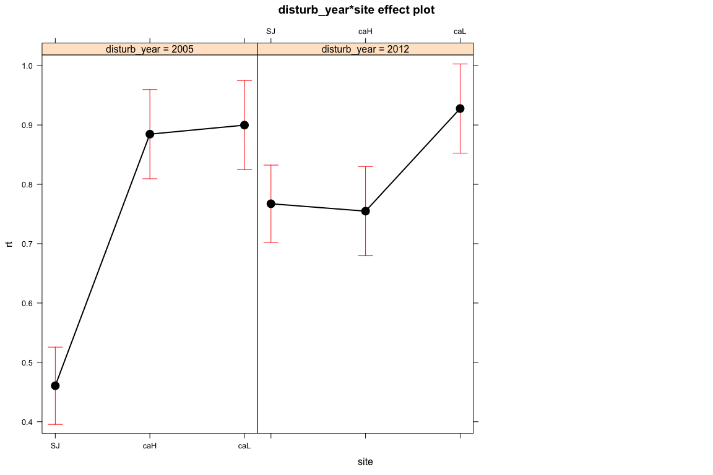

Relative Resilience
-------------------

``` r
# Variable
resp_var <- 'rrs'

# AOV
aov_rrs <- aovas(re, vars=vars, resp_var = resp_var)
```

``` r
mc <- aov_rrs$model_coeff

pander(mc, round=5,
       caption = paste0("ANOVA table: ", resp_var), missing = '', 
       emphasize.strong.cells = 
         which(mc < 0.1 & mc == mc$p.value, arr.ind = T))
```

<table style="width:89%;">
<caption>ANOVA table: rrs</caption>
<colgroup>
<col width="25%" />
<col width="6%" />
<col width="11%" />
<col width="12%" />
<col width="16%" />
<col width="16%" />
</colgroup>
<thead>
<tr class="header">
<th align="center">term</th>
<th align="center">df</th>
<th align="center">sumsq</th>
<th align="center">meansq</th>
<th align="center">statistic</th>
<th align="center">p.value</th>
</tr>
</thead>
<tbody>
<tr class="odd">
<td align="center">disturb_year</td>
<td align="center">1</td>
<td align="center">0.93</td>
<td align="center">0.93</td>
<td align="center">47.8</td>
<td align="center"><strong>0</strong></td>
</tr>
<tr class="even">
<td align="center">site</td>
<td align="center">2</td>
<td align="center">1.39</td>
<td align="center">0.6952</td>
<td align="center">35.73</td>
<td align="center"><strong>0</strong></td>
</tr>
<tr class="odd">
<td align="center">disturb_year:site</td>
<td align="center">2</td>
<td align="center">0.145</td>
<td align="center">0.07252</td>
<td align="center">3.727</td>
<td align="center"><strong>0.02769</strong></td>
</tr>
<tr class="even">
<td align="center">Residuals</td>
<td align="center">94</td>
<td align="center">1.829</td>
<td align="center">0.01946</td>
<td align="center"></td>
<td align="center"></td>
</tr>
</tbody>
</table>

``` r
gm <- aov_rrs$model_summary

gm <- apply(gm, 1, formatC, digits = 2, format = "f") %>% t()
colnames(gm) <- paste0("$",c("R^2","\\mathrm{adj}R^2","\\sigma_e","F","p","df_m","\\mathrm{logLik}","AIC","BIC","\\mathrm{dev}","df_e"),"$")
rownames(gm) <- "Statistic"
pander(t(gm)) 
```

<table style="width:49%;">
<colgroup>
<col width="33%" />
<col width="15%" />
</colgroup>
<thead>
<tr class="header">
<th align="center"> </th>
<th align="center">Statistic</th>
</tr>
</thead>
<tbody>
<tr class="odd">
<td align="center"><strong><span class="math inline"><em>R</em><sup>2</sup></span></strong></td>
<td align="center">0.57</td>
</tr>
<tr class="even">
<td align="center"><strong><span class="math inline"><em>a</em><em>d</em><em>j</em><em>R</em><sup>2</sup></span></strong></td>
<td align="center">0.55</td>
</tr>
<tr class="odd">
<td align="center"><strong><span class="math inline"><em>σ</em><sub><em>e</em></sub></span></strong></td>
<td align="center">0.14</td>
</tr>
<tr class="even">
<td align="center"><strong><span class="math inline"><em>F</em></span></strong></td>
<td align="center">25.34</td>
</tr>
<tr class="odd">
<td align="center"><strong><span class="math inline"><em>p</em></span></strong></td>
<td align="center">0.00</td>
</tr>
<tr class="even">
<td align="center"><strong><span class="math inline"><em>d</em><em>f</em><sub><em>m</em></sub></span></strong></td>
<td align="center">6.00</td>
</tr>
<tr class="odd">
<td align="center"><strong><span class="math inline"><em>l</em><em>o</em><em>g</em><em>L</em><em>i</em><em>k</em></span></strong></td>
<td align="center">58.18</td>
</tr>
<tr class="even">
<td align="center"><strong><span class="math inline"><em>A</em><em>I</em><em>C</em></span></strong></td>
<td align="center">-102.35</td>
</tr>
<tr class="odd">
<td align="center"><strong><span class="math inline"><em>B</em><em>I</em><em>C</em></span></strong></td>
<td align="center">-84.12</td>
</tr>
<tr class="even">
<td align="center"><strong><span class="math inline"><em>d</em><em>e</em><em>v</em></span></strong></td>
<td align="center">1.83</td>
</tr>
<tr class="odd">
<td align="center"><strong><span class="math inline"><em>d</em><em>f</em><sub><em>e</em></sub></span></strong></td>
<td align="center">94.00</td>
</tr>
</tbody>
</table>

### Post hoc comparison

``` r
# Post hoc Define model
mymodel <- aov_rrs$mymodel
postH_rrs <- phc(mymodel = mymodel, resp_var = resp_var)
```

    ## 
    ## ### Event ###
    ## $lsmeans
    ##  disturb_year      lsmean         SE df    lower.CL    upper.CL
    ##  2005         -0.07268135 0.01990865 94 -0.11221043 -0.03315226
    ##  2012          0.11047515 0.01990865 94  0.07094607  0.15000424
    ## 
    ## Results are averaged over the levels of: site 
    ## Confidence level used: 0.95 
    ## 
    ## $contrasts
    ##  contrast      estimate         SE df t.ratio p.value
    ##  2005 - 2012 -0.1831565 0.02815508 94  -6.505  <.0001
    ## 
    ## Results are averaged over the levels of: site 
    ## 
    ##  disturb_year      lsmean         SE df    lower.CL    upper.CL .group
    ##  2005         -0.07268135 0.01990865 94 -0.11792835 -0.02743435  a    
    ##  2012          0.11047515 0.01990865 94  0.06522815  0.15572215   b   
    ## 
    ## Results are averaged over the levels of: site 
    ## Confidence level used: 0.95 
    ## Conf-level adjustment: sidak method for 2 estimates 
    ## significance level used: alpha = 0.01 
    ## 
    ## ### Clu pop ###
    ## $lsmeans
    ##  site      lsmean         SE df    lower.CL    upper.CL
    ##  SJ    0.17544720 0.02205526 94  0.13165595  0.21923844
    ##  caH  -0.02596381 0.02546723 94 -0.07652958  0.02460197
    ##  caL  -0.09279268 0.02546723 94 -0.14335846 -0.04222691
    ## 
    ## Results are averaged over the levels of: disturb_year 
    ## Confidence level used: 0.95 
    ## 
    ## $contrasts
    ##  contrast    estimate         SE df t.ratio p.value
    ##  SJ - caH  0.20141101 0.03368997 94   5.978  <.0001
    ##  SJ - caL  0.26823988 0.03368997 94   7.962  <.0001
    ##  caH - caL 0.06682887 0.03601610 94   1.856  0.1575
    ## 
    ## Results are averaged over the levels of: disturb_year 
    ## P value adjustment: tukey method for comparing a family of 3 estimates 
    ## 
    ##  site      lsmean         SE df    lower.CL    upper.CL .group
    ##  caL  -0.09279268 0.02546723 94 -0.15470416 -0.03088120  a    
    ##  caH  -0.02596381 0.02546723 94 -0.08787529  0.03594767  a    
    ##  SJ    0.17544720 0.02205526 94  0.12183028  0.22906411   b   
    ## 
    ## Results are averaged over the levels of: disturb_year 
    ## Confidence level used: 0.95 
    ## Conf-level adjustment: sidak method for 3 estimates 
    ## P value adjustment: tukey method for comparing a family of 3 estimates 
    ## significance level used: alpha = 0.01 
    ## 
    ## ### Event:Clu pop ###
    ## $lsmeans
    ##  disturb_year site      lsmean         SE df    lower.CL    upper.CL
    ##  2005         SJ    0.03528048 0.03119085 94 -0.02664969  0.09721065
    ##  2012         SJ    0.31561391 0.03119085 94  0.25368374  0.37754408
    ##  2005         caH  -0.11035142 0.03601610 94 -0.18186223 -0.03884062
    ##  2012         caH   0.05842381 0.03601610 94 -0.01308700  0.12993461
    ##  2005         caL  -0.14297310 0.03601610 94 -0.21448390 -0.07146230
    ##  2012         caL  -0.04261226 0.03601610 94 -0.11412307  0.02889854
    ## 
    ## Confidence level used: 0.95 
    ## 
    ## $contrasts
    ##  contrast               estimate         SE df t.ratio p.value
    ##  2005,SJ - 2012,SJ   -0.28033343 0.04411053 94  -6.355  <.0001
    ##  2005,SJ - 2005,caH   0.14563191 0.04764482 94   3.057  0.0336
    ##  2005,SJ - 2012,caH  -0.02314333 0.04764482 94  -0.486  0.9966
    ##  2005,SJ - 2005,caL   0.17825358 0.04764482 94   3.741  0.0041
    ##  2005,SJ - 2012,caL   0.07789274 0.04764482 94   1.635  0.5778
    ##  2012,SJ - 2005,caH   0.42596534 0.04764482 94   8.940  <.0001
    ##  2012,SJ - 2012,caH   0.25719010 0.04764482 94   5.398  <.0001
    ##  2012,SJ - 2005,caL   0.45858701 0.04764482 94   9.625  <.0001
    ##  2012,SJ - 2012,caL   0.35822618 0.04764482 94   7.519  <.0001
    ##  2005,caH - 2012,caH -0.16877523 0.05093445 94  -3.314  0.0160
    ##  2005,caH - 2005,caL  0.03262167 0.05093445 94   0.640  0.9876
    ##  2005,caH - 2012,caL -0.06773916 0.05093445 94  -1.330  0.7677
    ##  2012,caH - 2005,caL  0.20139691 0.05093445 94   3.954  0.0020
    ##  2012,caH - 2012,caL  0.10103607 0.05093445 94   1.984  0.3594
    ##  2005,caL - 2012,caL -0.10036083 0.05093445 94  -1.970  0.3670
    ## 
    ## P value adjustment: tukey method for comparing a family of 6 estimates

### Plots

``` r
#### ~ Site
ps <- plot(effect("site",mymodel))
#### ~ Disturb Year
pd <- plot(effect('disturb_year', mymodel))
#### Disturb Year:Site
picollapse <- plot(effect("disturb_year:site",mymodel), multiline = TRUE, ci.style = 'bars')
pi <- plot(effect("disturb_year:site",mymodel), layout=c(3,1))
```

``` r
ps
```


``` r
pd
```

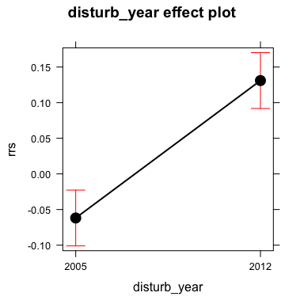

``` r
picollapse
```

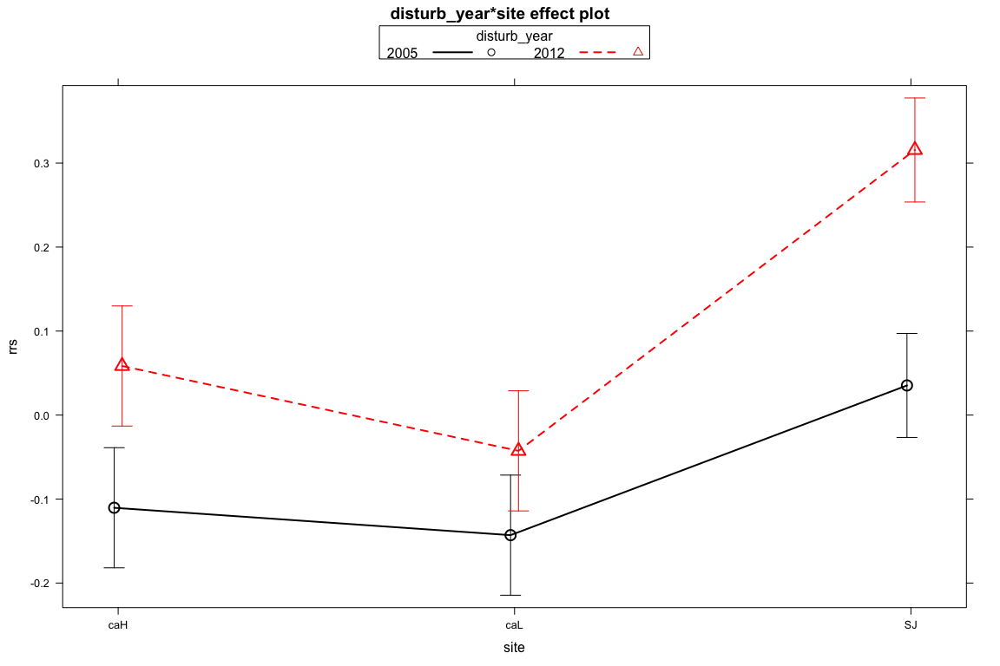

``` r
pi
```

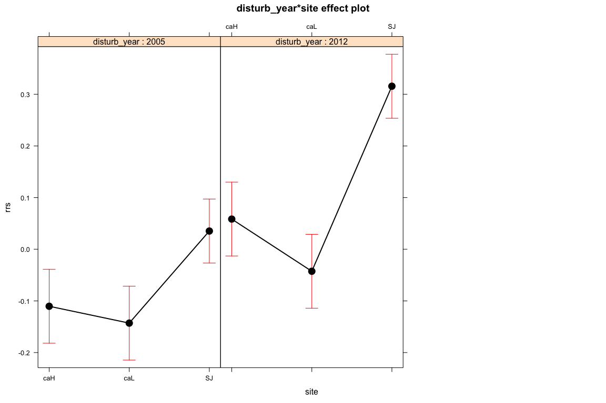

Resilience
----------

``` r
# Variable
resp_var <- 'rs'

# AOV
aov_rs <- aovas(re, vars=vars, resp_var = resp_var)
```

``` r
mc <- aov_rs$model_coeff

pander(mc, round=5,
       caption = paste0("ANOVA table: ", resp_var), missing = '', 
       emphasize.strong.cells = 
         which(mc < 0.1 & mc == mc$p.value, arr.ind = T))
```

<table style="width:85%;">
<caption>ANOVA table: rs</caption>
<colgroup>
<col width="25%" />
<col width="6%" />
<col width="11%" />
<col width="12%" />
<col width="16%" />
<col width="12%" />
</colgroup>
<thead>
<tr class="header">
<th align="center">term</th>
<th align="center">df</th>
<th align="center">sumsq</th>
<th align="center">meansq</th>
<th align="center">statistic</th>
<th align="center">p.value</th>
</tr>
</thead>
<tbody>
<tr class="odd">
<td align="center">disturb_year</td>
<td align="center">1</td>
<td align="center">2.031</td>
<td align="center">2.031</td>
<td align="center">66.58</td>
<td align="center"><strong>0</strong></td>
</tr>
<tr class="even">
<td align="center">site</td>
<td align="center">2</td>
<td align="center">0.01885</td>
<td align="center">0.00942</td>
<td align="center">0.309</td>
<td align="center">0.7349</td>
</tr>
<tr class="odd">
<td align="center">disturb_year:site</td>
<td align="center">2</td>
<td align="center">1.55</td>
<td align="center">0.775</td>
<td align="center">25.41</td>
<td align="center"><strong>0</strong></td>
</tr>
<tr class="even">
<td align="center">Residuals</td>
<td align="center">94</td>
<td align="center">2.867</td>
<td align="center">0.0305</td>
<td align="center"></td>
<td align="center"></td>
</tr>
</tbody>
</table>

``` r
gm <- aov_rs$model_summary

gm <- apply(gm, 1, formatC, digits = 2, format = "f") %>% t()
colnames(gm) <- paste0("$",c("R^2","\\mathrm{adj}R^2","\\sigma_e","F","p","df_m","\\mathrm{logLik}","AIC","BIC","\\mathrm{dev}","df_e"),"$")
rownames(gm) <- "Statistic"
pander(t(gm)) 
```

<table style="width:49%;">
<colgroup>
<col width="33%" />
<col width="15%" />
</colgroup>
<thead>
<tr class="header">
<th align="center"> </th>
<th align="center">Statistic</th>
</tr>
</thead>
<tbody>
<tr class="odd">
<td align="center"><strong><span class="math inline"><em>R</em><sup>2</sup></span></strong></td>
<td align="center">0.56</td>
</tr>
<tr class="even">
<td align="center"><strong><span class="math inline"><em>a</em><em>d</em><em>j</em><em>R</em><sup>2</sup></span></strong></td>
<td align="center">0.53</td>
</tr>
<tr class="odd">
<td align="center"><strong><span class="math inline"><em>σ</em><sub><em>e</em></sub></span></strong></td>
<td align="center">0.17</td>
</tr>
<tr class="even">
<td align="center"><strong><span class="math inline"><em>F</em></span></strong></td>
<td align="center">23.60</td>
</tr>
<tr class="odd">
<td align="center"><strong><span class="math inline"><em>p</em></span></strong></td>
<td align="center">0.00</td>
</tr>
<tr class="even">
<td align="center"><strong><span class="math inline"><em>d</em><em>f</em><sub><em>m</em></sub></span></strong></td>
<td align="center">6.00</td>
</tr>
<tr class="odd">
<td align="center"><strong><span class="math inline"><em>l</em><em>o</em><em>g</em><em>L</em><em>i</em><em>k</em></span></strong></td>
<td align="center">35.70</td>
</tr>
<tr class="even">
<td align="center"><strong><span class="math inline"><em>A</em><em>I</em><em>C</em></span></strong></td>
<td align="center">-57.41</td>
</tr>
<tr class="odd">
<td align="center"><strong><span class="math inline"><em>B</em><em>I</em><em>C</em></span></strong></td>
<td align="center">-39.17</td>
</tr>
<tr class="even">
<td align="center"><strong><span class="math inline"><em>d</em><em>e</em><em>v</em></span></strong></td>
<td align="center">2.87</td>
</tr>
<tr class="odd">
<td align="center"><strong><span class="math inline"><em>d</em><em>f</em><sub><em>e</em></sub></span></strong></td>
<td align="center">94.00</td>
</tr>
</tbody>
</table>

### Post hoc comparison

``` r
# Post hoc Define model
mymodel <- aov_rs$mymodel
postH_rs <- phc(mymodel = mymodel, resp_var = resp_var)
```

    ## 
    ## ### Event ###
    ## $lsmeans
    ##  disturb_year    lsmean         SE df  lower.CL  upper.CL
    ##  2005         0.6756316 0.02492546 94 0.6261415 0.7251217
    ##  2012         0.9270785 0.02492546 94 0.8775884 0.9765685
    ## 
    ## Results are averaged over the levels of: site 
    ## Confidence level used: 0.95 
    ## 
    ## $contrasts
    ##  contrast      estimate         SE df t.ratio p.value
    ##  2005 - 2012 -0.2514469 0.03524992 94  -7.133  <.0001
    ## 
    ## Results are averaged over the levels of: site 
    ## 
    ##  disturb_year    lsmean         SE df  lower.CL  upper.CL .group
    ##  2005         0.6756316 0.02492546 94 0.6189827 0.7322805  a    
    ##  2012         0.9270785 0.02492546 94 0.8704296 0.9837273   b   
    ## 
    ## Results are averaged over the levels of: site 
    ## Confidence level used: 0.95 
    ## Conf-level adjustment: sidak method for 2 estimates 
    ## significance level used: alpha = 0.01 
    ## 
    ## ### Clu pop ###
    ## $lsmeans
    ##  site    lsmean         SE df  lower.CL  upper.CL
    ##  SJ   0.7893957 0.02761300 94 0.7345694 0.8442219
    ##  caH  0.7937171 0.03188475 94 0.7304092 0.8570250
    ##  caL  0.8209523 0.03188475 94 0.7576444 0.8842602
    ## 
    ## Results are averaged over the levels of: disturb_year 
    ## Confidence level used: 0.95 
    ## 
    ## $contrasts
    ##  contrast      estimate         SE df t.ratio p.value
    ##  SJ - caH  -0.004321471 0.04217956 94  -0.102  0.9942
    ##  SJ - caL  -0.031556651 0.04217956 94  -0.748  0.7355
    ##  caH - caL -0.027235180 0.04509185 94  -0.604  0.8183
    ## 
    ## Results are averaged over the levels of: disturb_year 
    ## P value adjustment: tukey method for comparing a family of 3 estimates 
    ## 
    ##  site    lsmean         SE df  lower.CL  upper.CL .group
    ##  SJ   0.7893957 0.02761300 94 0.7222677 0.8565236  a    
    ##  caH  0.7937171 0.03188475 94 0.7162045 0.8712298  a    
    ##  caL  0.8209523 0.03188475 94 0.7434397 0.8984649  a    
    ## 
    ## Results are averaged over the levels of: disturb_year 
    ## Confidence level used: 0.95 
    ## Conf-level adjustment: sidak method for 3 estimates 
    ## P value adjustment: tukey method for comparing a family of 3 estimates 
    ## significance level used: alpha = 0.01 
    ## 
    ## ### Event:Clu pop ###
    ## $lsmeans
    ##  disturb_year site    lsmean         SE df  lower.CL  upper.CL
    ##  2005         SJ   0.4958921 0.03905068 94 0.4183561 0.5734282
    ##  2012         SJ   1.0828992 0.03905068 94 1.0053631 1.1604352
    ##  2005         caH  0.7742095 0.04509185 94 0.6846786 0.8637404
    ##  2012         caH  0.8132248 0.04509185 94 0.7236938 0.9027557
    ##  2005         caL  0.7567932 0.04509185 94 0.6672623 0.8463241
    ##  2012         caL  0.8851114 0.04509185 94 0.7955805 0.9746423
    ## 
    ## Confidence level used: 0.95 
    ## 
    ## $contrasts
    ##  contrast               estimate         SE df t.ratio p.value
    ##  2005,SJ - 2012,SJ   -0.58700705 0.05522601 94 -10.629  <.0001
    ##  2005,SJ - 2005,caH  -0.27831735 0.05965091 94  -4.666  0.0001
    ##  2005,SJ - 2012,caH  -0.31733264 0.05965091 94  -5.320  <.0001
    ##  2005,SJ - 2005,caL  -0.26090106 0.05965091 94  -4.374  0.0004
    ##  2005,SJ - 2012,caL  -0.38921929 0.05965091 94  -6.525  <.0001
    ##  2012,SJ - 2005,caH   0.30868970 0.05965091 94   5.175  <.0001
    ##  2012,SJ - 2012,caH   0.26967441 0.05965091 94   4.521  0.0003
    ##  2012,SJ - 2005,caL   0.32610599 0.05965091 94   5.467  <.0001
    ##  2012,SJ - 2012,caL   0.19778776 0.05965091 94   3.316  0.0159
    ##  2005,caH - 2012,caH -0.03901529 0.06376950 94  -0.612  0.9899
    ##  2005,caH - 2005,caL  0.01741629 0.06376950 94   0.273  0.9998
    ##  2005,caH - 2012,caL -0.11090194 0.06376950 94  -1.739  0.5098
    ##  2012,caH - 2005,caL  0.05643158 0.06376950 94   0.885  0.9492
    ##  2012,caH - 2012,caL -0.07188665 0.06376950 94  -1.127  0.8688
    ##  2005,caL - 2012,caL -0.12831823 0.06376950 94  -2.012  0.3433
    ## 
    ## P value adjustment: tukey method for comparing a family of 6 estimates

### Plots

``` r
#### ~ Site
ps <- plot(effect("site",mymodel))
#### ~ Disturb Year
pd <- plot(effect('disturb_year', mymodel))
#### Disturb Year:Site
picollapse <- plot(effect("disturb_year:site",mymodel), multiline = TRUE, ci.style = 'bars')
pi <- plot(effect("disturb_year:site",mymodel), layout=c(3,1))
```

``` r
ps
```

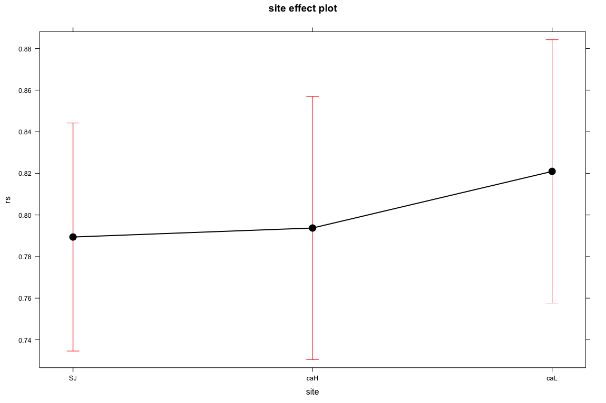

``` r
pd
```

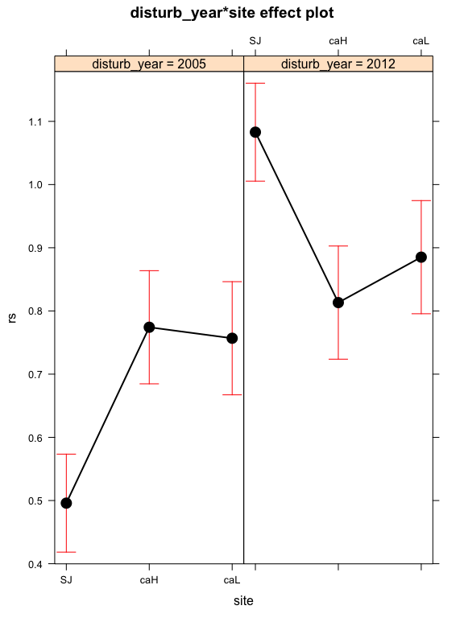

``` r
picollapse
```

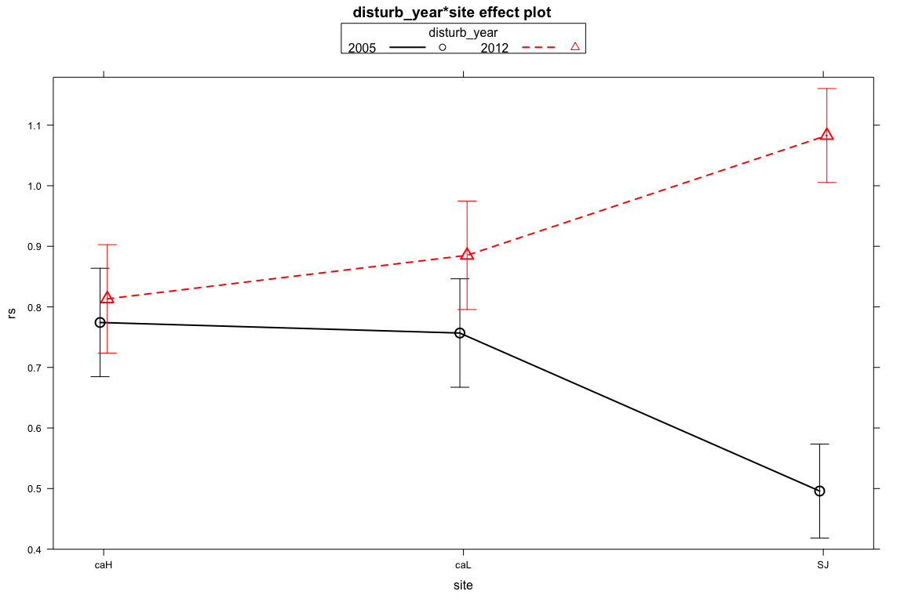

``` r
pi
```

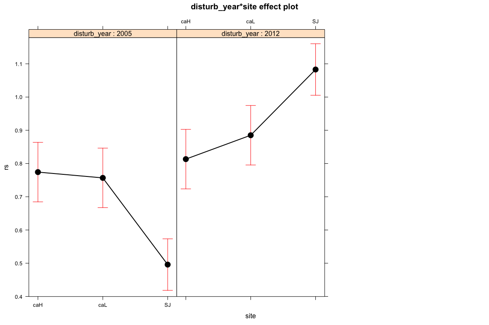

``` r
# Interactions plot all  
means_site <- postH_rc[[4]] %>% mutate(var = 'rc') %>% 
  bind_rows(postH_rt[[4]] %>% mutate(var = 'rt')) %>% 
  bind_rows(postH_rs[[4]] %>% mutate(var = 'rs')) %>% 
  bind_rows(postH_rrs[[4]] %>% mutate(var = 'rrs')) %>% 
  rename(letras = .group)

means_disturb <- postH_rc[[5]] %>% mutate(var = 'rc') %>% 
  bind_rows(postH_rt[[5]] %>% mutate(var = 'rt')) %>% 
  bind_rows(postH_rs[[5]] %>% mutate(var = 'rs')) %>% 
  bind_rows(postH_rrs[[5]] %>% mutate(var = 'rrs')) %>% 
  rename(letras = .group)

means_distub_site <- postH_rc[[6]] %>% mutate(var = 'rc') %>% 
  bind_rows(postH_rt[[6]] %>% mutate(var = 'rt')) %>% 
  bind_rows(postH_rs[[6]] %>% mutate(var = 'rs')) %>% 
  bind_rows(postH_rrs[[6]] %>% mutate(var = 'rrs')) %>% 
  rename(letras = .group)

dodge <- position_dodge(width = 0.3)
micolor <- '#455883'
```

``` r
plot_ms <- means_site %>%  
  ggplot(aes(x=site, y=lsmean)) + 
  geom_errorbar(aes(ymin=lsmean - SE, ymax=lsmean + SE), 
                color=micolor, size=.5, width=.15, position = dodge) +
  geom_point(colour=micolor, 
             size=3, position = dodge) +
  theme_bw() + xlab('') + ylab('') + 
  facet_wrap(~var, scales='free_y', ncol = 1) +
  geom_text(aes(y=lsmean, label=letras), nudge_x = 0.15) +
  theme(strip.background = element_rect(colour = "black", fill = "white"))
```

``` r
plot_md <- means_disturb %>%  
  ggplot(aes(x=disturb_year, y=lsmean)) + 
  geom_errorbar(aes(ymin=lsmean - SE, ymax=lsmean + SE), 
                color=micolor, size=.5, width=.15, position = dodge) +
  geom_point(colour=micolor, 
             size=3, position = dodge) +
  theme_bw() + xlab('') + ylab('') + 
  facet_wrap(~var, scales='free_y', ncol = 1) +
  geom_text(aes(y=lsmean, label=letras), nudge_x = 0.15) +
  theme(strip.background = element_rect(colour = "black", fill = "white"))
```

``` r
plot_mds <- means_distub_site %>%  
  ggplot(aes(x=site, y=lsmean, group=disturb_year, colour=disturb_year)) + 
  geom_errorbar(aes(ymin=lsmean - SE, ymax=lsmean + SE), 
                size=.5, width=.15) + 
  geom_point(aes(shape=disturb_year), size=3) + 
  geom_line() +
  theme_bw() + xlab('') + ylab('') + 
  facet_wrap(~var, scales='free_y', ncol = 1) +
  geom_text(aes(y=lsmean+SE, label=letras), nudge_x = 0.15)+
  theme(strip.background = element_rect(colour = "black", fill = "white"),
        legend.position = c(0.8, 0.93),
        legend.background = element_blank()) +
  scale_colour_manual(values = c(micolor, "red")) 
```

``` r
pdf(paste0(di, 'out/fig/resilience/interaction_plots.pdf'), width=9, height = 9)
grid.arrange(plot_md, plot_ms, plot_mds, ncol=3)
dev.off()
```

    ## quartz_off_screen 
    ##                 2

``` r
aovas_coeff <- aov_rc$model_coeff %>% mutate(var = 'rc') %>% 
  bind_rows(aov_rt$model_coeff %>% mutate(var = 'rt')) %>% 
  bind_rows(aov_rs$model_coeff %>% mutate(var = 'rs')) %>% 
  bind_rows(aov_rrs$model_coeff%>% mutate(var = 'rrs')) 

write.csv(aovas_coeff, file=paste0(di, '/out/anovas_resilience/anovas_statistics.csv'), row.names = F)

aovas_coeff %>% pander()
```

<table style="width:93%;">
<colgroup>
<col width="25%" />
<col width="6%" />
<col width="11%" />
<col width="12%" />
<col width="16%" />
<col width="13%" />
<col width="6%" />
</colgroup>
<thead>
<tr class="header">
<th align="center">term</th>
<th align="center">df</th>
<th align="center">sumsq</th>
<th align="center">meansq</th>
<th align="center">statistic</th>
<th align="center">p.value</th>
<th align="center">var</th>
</tr>
</thead>
<tbody>
<tr class="odd">
<td align="center">disturb_year</td>
<td align="center">1</td>
<td align="center">1.316</td>
<td align="center">1.316</td>
<td align="center">32.78</td>
<td align="center">1.228e-07</td>
<td align="center">rc</td>
</tr>
<tr class="even">
<td align="center">site</td>
<td align="center">2</td>
<td align="center">2.847</td>
<td align="center">1.424</td>
<td align="center">35.45</td>
<td align="center">3.373e-12</td>
<td align="center">rc</td>
</tr>
<tr class="odd">
<td align="center">disturb_year:site</td>
<td align="center">2</td>
<td align="center">0.1961</td>
<td align="center">0.09805</td>
<td align="center">2.442</td>
<td align="center">0.09253</td>
<td align="center">rc</td>
</tr>
<tr class="even">
<td align="center">Residuals</td>
<td align="center">94</td>
<td align="center">3.775</td>
<td align="center">0.04016</td>
<td align="center">NA</td>
<td align="center">NA</td>
<td align="center">rc</td>
</tr>
<tr class="odd">
<td align="center">disturb_year</td>
<td align="center">1</td>
<td align="center">0.2122</td>
<td align="center">0.2122</td>
<td align="center">9.867</td>
<td align="center">0.00225</td>
<td align="center">rt</td>
</tr>
<tr class="even">
<td align="center">site</td>
<td align="center">2</td>
<td align="center">1.666</td>
<td align="center">0.833</td>
<td align="center">38.74</td>
<td align="center">5.363e-13</td>
<td align="center">rt</td>
</tr>
<tr class="odd">
<td align="center">disturb_year:site</td>
<td align="center">2</td>
<td align="center">0.8604</td>
<td align="center">0.4302</td>
<td align="center">20.01</td>
<td align="center">5.77e-08</td>
<td align="center">rt</td>
</tr>
<tr class="even">
<td align="center">Residuals</td>
<td align="center">94</td>
<td align="center">2.021</td>
<td align="center">0.0215</td>
<td align="center">NA</td>
<td align="center">NA</td>
<td align="center">rt</td>
</tr>
<tr class="odd">
<td align="center">disturb_year</td>
<td align="center">1</td>
<td align="center">2.031</td>
<td align="center">2.031</td>
<td align="center">66.58</td>
<td align="center">1.474e-12</td>
<td align="center">rs</td>
</tr>
<tr class="even">
<td align="center">site</td>
<td align="center">2</td>
<td align="center">0.01885</td>
<td align="center">0.009425</td>
<td align="center">0.309</td>
<td align="center">0.7349</td>
<td align="center">rs</td>
</tr>
<tr class="odd">
<td align="center">disturb_year:site</td>
<td align="center">2</td>
<td align="center">1.55</td>
<td align="center">0.775</td>
<td align="center">25.41</td>
<td align="center">1.506e-09</td>
<td align="center">rs</td>
</tr>
<tr class="even">
<td align="center">Residuals</td>
<td align="center">94</td>
<td align="center">2.867</td>
<td align="center">0.0305</td>
<td align="center">NA</td>
<td align="center">NA</td>
<td align="center">rs</td>
</tr>
<tr class="odd">
<td align="center">disturb_year</td>
<td align="center">1</td>
<td align="center">0.93</td>
<td align="center">0.93</td>
<td align="center">47.8</td>
<td align="center">5.63e-10</td>
<td align="center">rrs</td>
</tr>
<tr class="even">
<td align="center">site</td>
<td align="center">2</td>
<td align="center">1.39</td>
<td align="center">0.6952</td>
<td align="center">35.73</td>
<td align="center">2.874e-12</td>
<td align="center">rrs</td>
</tr>
<tr class="odd">
<td align="center">disturb_year:site</td>
<td align="center">2</td>
<td align="center">0.145</td>
<td align="center">0.07252</td>
<td align="center">3.727</td>
<td align="center">0.02769</td>
<td align="center">rrs</td>
</tr>
<tr class="even">
<td align="center">Residuals</td>
<td align="center">94</td>
<td align="center">1.829</td>
<td align="center">0.01946</td>
<td align="center">NA</td>
<td align="center">NA</td>
<td align="center">rrs</td>
</tr>
</tbody>
</table>

``` r
aovas_model_summary <- aov_rc$model_summary %>% mutate(var = 'rc') %>% 
  bind_rows(aov_rt$model_summary %>% mutate(var = 'rt')) %>% 
  bind_rows(aov_rs$model_summary %>% mutate(var = 'rs')) %>% 
  bind_rows(aov_rrs$model_summary%>% mutate(var = 'rrs')) 

write.csv(aovas_model_summary, 
          file=paste0(di, '/out/anovas_resilience/anovas_summary_modelos.csv'), row.names = F)


gm <- apply(aovas_model_summary, 1, formatC, digits = 2, format = "f") 
rownames(gm) <- paste0("$",c("R^2","\\mathrm{adj}R^2","\\sigma_e","F","p","df_m","\\mathrm{logLik}","AIC","BIC","\\mathrm{dev}","df_e", "variable"),"$")
colnames(gm) <- c("rc", "rt", "rs", "rrs")

pander(gm)
```

<table style="width:100%;">
<colgroup>
<col width="31%" />
<col width="17%" />
<col width="17%" />
<col width="17%" />
<col width="17%" />
</colgroup>
<thead>
<tr class="header">
<th align="center"> </th>
<th align="center">rc</th>
<th align="center">rt</th>
<th align="center">rs</th>
<th align="center">rrs</th>
</tr>
</thead>
<tbody>
<tr class="odd">
<td align="center"><strong><span class="math inline"><em>R</em><sup>2</sup></span></strong></td>
<td align="center">0.5359434</td>
<td align="center">0.5753458</td>
<td align="center">0.5566473</td>
<td align="center">0.5741044</td>
</tr>
<tr class="even">
<td align="center"><strong><span class="math inline"><em>a</em><em>d</em><em>j</em><em>R</em><sup>2</sup></span></strong></td>
<td align="center">0.5112596</td>
<td align="center">0.5527578</td>
<td align="center">0.5330647</td>
<td align="center">0.5514503</td>
</tr>
<tr class="odd">
<td align="center"><strong><span class="math inline"><em>σ</em><sub><em>e</em></sub></span></strong></td>
<td align="center">0.2003962</td>
<td align="center">0.1466433</td>
<td align="center">0.1746400</td>
<td align="center">0.1394897</td>
</tr>
<tr class="even">
<td align="center"><strong><span class="math inline"><em>F</em></span></strong></td>
<td align="center">21.71230</td>
<td align="center">25.47131</td>
<td align="center">23.60416</td>
<td align="center">25.34227</td>
</tr>
<tr class="odd">
<td align="center"><strong><span class="math inline"><em>p</em></span></strong></td>
<td align="center">2.166716e-14</td>
<td align="center">3.707920e-16</td>
<td align="center">2.678847e-15</td>
<td align="center">4.239928e-16</td>
</tr>
<tr class="even">
<td align="center"><strong><span class="math inline"><em>d</em><em>f</em><sub><em>m</em></sub></span></strong></td>
<td align="center">6</td>
<td align="center">6</td>
<td align="center">6</td>
<td align="center">6</td>
</tr>
<tr class="odd">
<td align="center"><strong><span class="math inline"><em>l</em><em>o</em><em>g</em><em>L</em><em>i</em><em>k</em></span></strong></td>
<td align="center">21.94579</td>
<td align="center">53.17511</td>
<td align="center">35.70279</td>
<td align="center">58.17634</td>
</tr>
<tr class="even">
<td align="center"><strong><span class="math inline"><em>A</em><em>I</em><em>C</em></span></strong></td>
<td align="center">-29.89157</td>
<td align="center">-92.35023</td>
<td align="center">-57.40558</td>
<td align="center">-102.35268</td>
</tr>
<tr class="odd">
<td align="center"><strong><span class="math inline"><em>B</em><em>I</em><em>C</em></span></strong></td>
<td align="center">-11.65538</td>
<td align="center">-74.11404</td>
<td align="center">-39.16939</td>
<td align="center">-84.11649</td>
</tr>
<tr class="even">
<td align="center"><strong><span class="math inline"><em>d</em><em>e</em><em>v</em></span></strong></td>
<td align="center">3.774913</td>
<td align="center">2.021401</td>
<td align="center">2.866917</td>
<td align="center">1.828994</td>
</tr>
<tr class="odd">
<td align="center"><strong><span class="math inline"><em>d</em><em>f</em><sub><em>e</em></sub></span></strong></td>
<td align="center">94</td>
<td align="center">94</td>
<td align="center">94</td>
<td align="center">94</td>
</tr>
<tr class="even">
<td align="center"><strong><span class="math inline"><em>v</em><em>a</em><em>r</em><em>i</em><em>a</em><em>b</em><em>l</em><em>e</em></span></strong></td>
<td align="center">rc</td>
<td align="center">rt</td>
<td align="center">rs</td>
<td align="center">rrs</td>
</tr>
</tbody>
</table>

References
==========

Lloret, F., E. G. Keeling, and A. Sala. 2011. Components of tree resilience: Effects of successive low-growth episodes in old ponderosa pine forests. Oikos 120:1909–1920.

Piovesa, G., F. Biondi, A. D. Filippo, A. Alessandrini, and M. Maugeri. 2008. Drought-driven growth reduction in old beech (fagus sylvatica l.) forests of the central apennines, italy. Global Change Biology 14:1265–1281.
