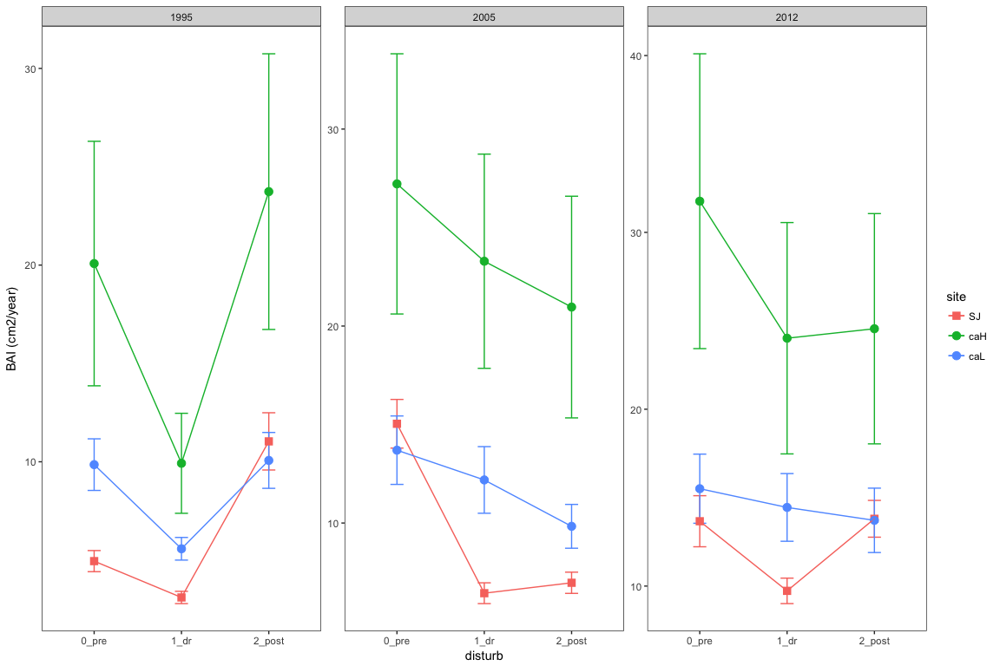
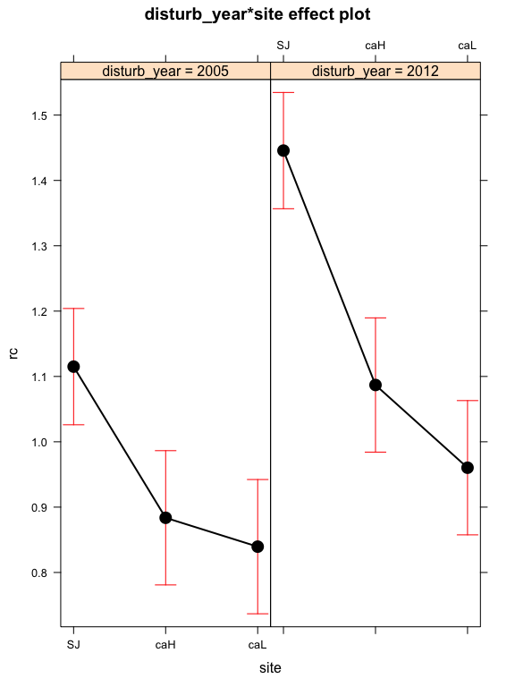
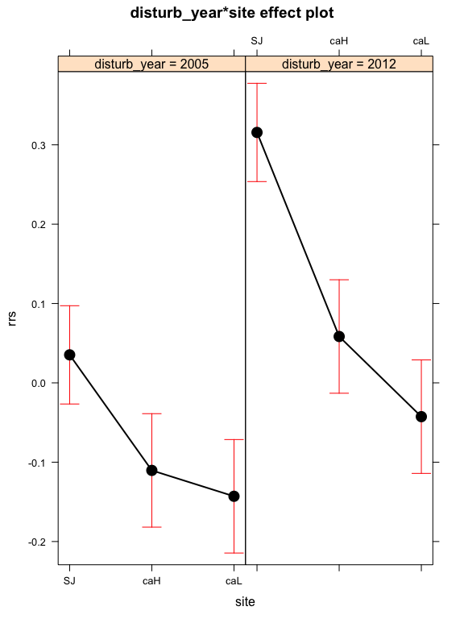
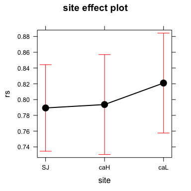
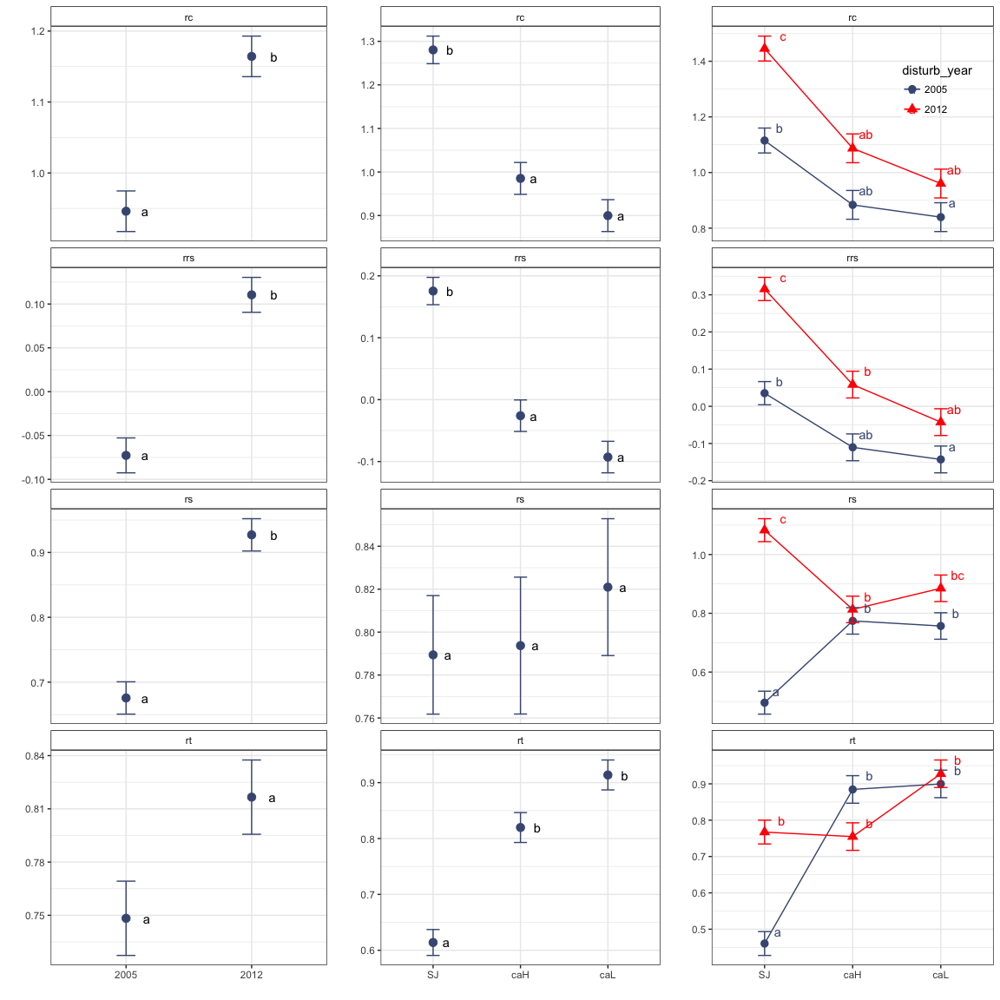
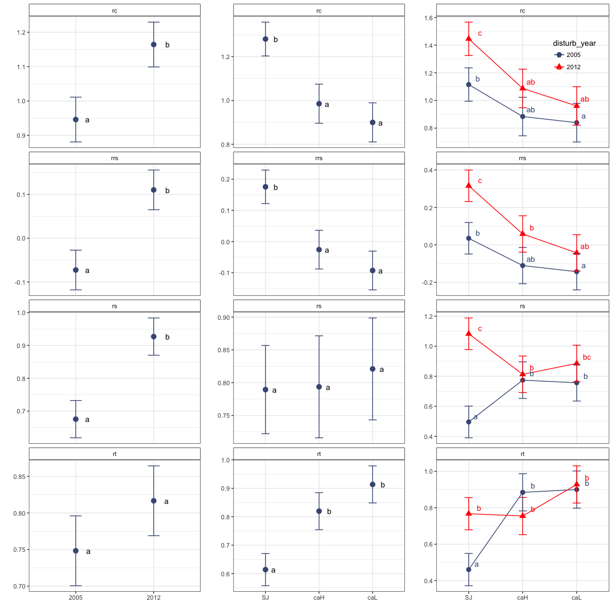

Resilience
==========

-   Calcularemos las métricas resiliencia de (<span class="citeproc-not-found" data-reference-id="Lloret2011">**???**</span>) sobre el crecimiento.
-   Vamos a calcularlas sobre el BAI de cada árbol.
-   Utilizaremos tres sitios: SJ, CAH y CAL (ver [./analysis/analysis\_chronologies.md]('./analysis/analysis_chronologies.md))

Prepare data
------------

-   Leer datos `rwl` de SJ y CA
-   Leer datos de diametros de los focal tree

``` r
machine <- 'ajpelu'
# machine <- 'ajpeluLap'
di <- paste0('/Users/', machine, '/Dropbox/phd/phd_repos/qpyr_dendro/', sep = '')

# sj 
sj <- read.rwl(fname=paste0(di, '/data_raw/dendro_ring/sn_sanjuan/sn_sanjuan.rwl'), format="tucson")
```

    ## There does not appear to be a header in the rwl file
    ## There are 48 series
    ## 1        SNA0101      1947    2016   0.01
    ## 2        SNA0102      1947    2016   0.01
    ## 3        SNA0201      1946    2016   0.01
    ## 4        SNA0202      1948    2016   0.01
    ## 5        SNA0301      1949    2016   0.01
    ## 6        SNA0302      1948    2016   0.01
    ## 7        SNA0401      1947    2016   0.01
    ## 8        SNA0402      1947    2016   0.01
    ## 9        SNA0501      1953    2016   0.01
    ## 10       SNA0502      1948    2016   0.01
    ## 11       SNA0601      1948    2016   0.01
    ## 12       SNA0602      1957    2016   0.01
    ## 13       SNA0603      1947    2012   0.01
    ## 14       SNA0701      1954    2016   0.01
    ## 15       SNA0702      1947    2016   0.01
    ## 16       SNA0801      1949    2016   0.01
    ## 17       SNA0802      1951    2016   0.01
    ## 18       SNA0901      1947    2016   0.01
    ## 19       SNA0902      1947    2016   0.01
    ## 20       SNA0903      1947    2002   0.01
    ## 21       SNA1001      1950    2016   0.01
    ## 22       SNA1002      1953    2016   0.01
    ## 23       SNA1003      1948    2008   0.01
    ## 24       SNA1101      1940    2016   0.01
    ## 25       SNA1102      1929    2016   0.01
    ## 26       SNA1103      1942    1994   0.01
    ## 27       SNA1201      1929    2016   0.01
    ## 28       SNA1202      1929    2016   0.01
    ## 29       SNA1203      1927    1983   0.01
    ## 30       SNA1301      1960    2016   0.01
    ## 31       SNA1302      1949    2016   0.01
    ## 32       SNA1303      1949    2011   0.01
    ## 33       SNA1401      1930    2016   0.01
    ## 34       SNA1402      1949    2016   0.01
    ## 35       SNA1501      1952    2016   0.01
    ## 36       SNA1502      1948    2016   0.01
    ## 37       SNA1601      1959    2016   0.01
    ## 38       SNA1602      1927    2016   0.01
    ## 39       SNA1701      1926    2016   0.01
    ## 40       SNA1702      1930    2016   0.01
    ## 41       SNA1703      1931    2016   0.01
    ## 42       SNA1801      1937    2016   0.01
    ## 43       SNA1802      1936    2016   0.01
    ## 44       SNA1901      1921    2016   0.01
    ## 45       SNA1902      1924    2016   0.01
    ## 46       SNA2001      1932    2016   0.01
    ## 47       SNA2003      1932    2016   0.01
    ## 48       SNA2002      1934    2016   0.01

``` r
# canar 
ca <- read.rwl(fname=paste0(di, '/data_raw/dendro_ring/sn_canar/sn_canar.rwl'), format="tucson")
```

    ## There does not appear to be a header in the rwl file
    ## There are 60 series
    ## 1        SNB0101      1899    2016   0.01
    ## 2        SNB0102      1902    2016   0.01
    ## 3        SNB0201      1916    2016   0.01
    ## 4        SNB0202      1876    2016   0.01
    ## 5        SNB0301      1862    2016   0.01
    ## 6        SNB0302      1862    2016   0.01
    ## 7        SNB0401      1870    2016   0.01
    ## 8        SNB0402      1866    2016   0.01
    ## 9        SNB0501      1864    2016   0.01
    ## 10       SNB0502g     1867    2016   0.01
    ## 11       SNB0601      1860    2016   0.01
    ## 12       SNB0602      1873    2016   0.01
    ## 13       SNB0701      1851    2016   0.01
    ## 14       SNB0702g     1861    2016   0.01
    ## 15       SNB0801g     1851    2016   0.01
    ## 16       SNB0802g     1853    2016   0.01
    ## 17       SNB0901g     1836    2016   0.01
    ## 18       SNB0902      1844    2016   0.01
    ## 19       SNB1001      1868    2016   0.01
    ## 20       SNB1002      1870    2016   0.01
    ## 21       SNB1101      1949    2016   0.01
    ## 22       SNB1102      1893    2016   0.01
    ## 23       SNB1201      1867    2016   0.01
    ## 24       SNB1202      1834    2016   0.01
    ## 25       SNB1301      1865    2016   0.01
    ## 26       SNB1302      1874    2016   0.01
    ## 27       SNB1401      1843    2016   0.01
    ## 28       SNB1402      1848    2016   0.01
    ## 29       SNB1501      1898    2016   0.01
    ## 30       SNB1502      1927    2016   0.01
    ## 31       SNB1601      1846    2016   0.01
    ## 32       SNB1602      1857    2016   0.01
    ## 33       SNB1701      1856    2016   0.01
    ## 34       SNB1702      1853    2016   0.01
    ## 35       SNB1801      1827    2016   0.01
    ## 36       SNB1802      1843    2016   0.01
    ## 37       SNB1901      1888    2016   0.01
    ## 38       SNB1902      1901    2016   0.01
    ## 39       SNB2001      1830    2016   0.01
    ## 40       SNB2002g     1837    2016   0.01
    ## 41       SNB2101      1863    2016   0.01
    ## 42       SNB2102      1858    2016   0.01
    ## 43       SNB2201g     1819    2016   0.01
    ## 44       SNB2202g     1822    2016   0.01
    ## 45       SNB2301g     1832    2016   0.01
    ## 46       SNB2302      1819    2016   0.01
    ## 47       SNB2401      1829    2016   0.01
    ## 48       SNB2402      1831    2016   0.01
    ## 49       SNB2501      1831    2016   0.01
    ## 50       SNB2502      1839    2016   0.01
    ## 51       SNB2601      1872    2016   0.01
    ## 52       SNB2602      1867    2016   0.01
    ## 53       SNB2701      1865    2016   0.01
    ## 54       SNB2702g     1863    2016   0.01
    ## 55       SNB2801      1860    2016   0.01
    ## 56       SNB2802      1866    2016   0.01
    ## 57       SNB2901      1877    2016   0.01
    ## 58       SNB2902      1892    2016   0.01
    ## 59       SNB3001      1867    2016   0.01
    ## 60       SNB3002      1874    2016   0.01

``` r
# Read diameters data
compete <- read.csv(file=paste0(di, '/data_raw/dendro_competence.csv'), header=TRUE, sep=',')
```

``` r
source(paste0(di, 'script/R/rw_byTree.R'))
source(paste0(di, 'script/R/bai_piovesan.R'))
source(paste0(di, 'script/R/baiResilience.R'))
```

-   Crear dataframes `rwl` por cada sitio CA\_High, CA\_Low, SJ\_High. SJ\_Low

-   Lectura y preparación de datos de diámetro

``` r
# Prepare Diameter data 

# Compute diameter (mm)
compete <- compete %>% 
  mutate(dn_mm = (perim_mm / pi))

# Change name focal according to loc
compete <- compete %>% 
  mutate(id_focalLoc = stringr::str_replace_all(id_focal, c("A" = "SJ", "B" = "CA")))

         
# Get only focal trees, and only selected variables 
ft <- compete %>% 
  filter(sp=='Focal') %>% 
  filter(id_focal!='Fresno') %>% 
  dplyr::select(id_focal, id_focalLoc, loc, dn_mm, height_cm) 

# Set levels of eleveation 
ca_lowcode <- c(paste0('CA', str_pad(1:10, 2, pad='0')),
            paste0('CA', 26:30))
ca_highcode <- paste0('CA', 11:25)

ft <- ft %>% 
  mutate(site = as.factor(
    ifelse(id_focalLoc %in% ca_lowcode, 'CAL', 
           ifelse(id_focalLoc %in% ca_highcode, 'CAH', 'SJ'))))
```

Aggregate RW by tree
====================

-   Agregar valores medios de RW por site (obtenemos sj\_tree / caL\_tree, caH\_tree)
-   ver fun rw\_byTree o utilizar treeMean (dplR)

``` r
# Remember snc = structure of core name SJ0101 (site | tree | core)
sj_tree <- rw_byTree(sj, snc =c(2,2,2), locname = 'SJ')
caL_tree <- rw_byTree(caL, snc =c(2,2,2), locname = 'CA')
caH_tree <- rw_byTree(caH, snc =c(2,2,2), locname = 'CA')
```

-   Crear diferentes dataset de diametro por sitio

``` r
diam <- ft %>%
  mutate(diameter = dn_mm, 
         id = id_focalLoc) %>%
  dplyr::select(id, diameter, site) %>% 
  split(.$site) 


d_caH <- diam$CAH[,c('id','diameter')]
d_caL <- diam$CAL[,c('id','diameter')]
d_sj <- diam$SJ[,c('id','diameter')]
```

Cómputo del BAI por site
------------------------

-   He construido una funcion para el computo del BAI, teniendo en cuenta la aproximación de (Piovesa et al. 2008). Es similar a `bai.out`

``` r
bai_sj <- bai_piovesan(rwdf = sj_tree, diam_df = d_sj)
bai_caH <- bai_piovesan(rwdf = caH_tree, diam_df = d_caH)
bai_caL <- bai_piovesan(rwdf = caL_tree, diam_df = d_caL)

# Set class to bai object 
# Esto es para que funcionen algunas otras funciones de dplR 
bais <- c('bai_sj', 'bai_caH', 'bai_caL')

for (i in bais){
  aux <- get(i)
  
  class(aux) <- c('rwl', 'data.frame')
  
  assign(i, aux)
}
```

Resilience
----------

-   Computar métricas de resiliencia BAI para los tres sitios.
-   Computar tres eventos climáticos: 1995, 2005, 2012
-   Computar ventanas temporales: 2, 3 y 4

``` r
# Drought years 
dyears <- c(1995, 2005, 2012)

# SJ 
res_4_sj <- baiResilience(bai_sj, event_years = dyears, window = 4)
res_3_sj <- baiResilience(bai_sj, event_years = dyears, window = 3)
res_2_sj <- baiResilience(bai_sj, event_years = dyears, window = 2)

# caL
res_4_caL <- baiResilience(bai_caL, event_years = dyears, window = 4)
res_3_caL <- baiResilience(bai_caL, event_years = dyears, window = 3)
res_2_caL <- baiResilience(bai_caL, event_years = dyears, window = 2)

# caH
res_4_caH <- baiResilience(bai_caH, event_years = dyears, window = 4)
res_3_caH <- baiResilience(bai_caH, event_years = dyears, window = 3)
res_2_caH <- baiResilience(bai_caH, event_years = dyears, window = 2)
```

### Computar correlaciones ventanas temporales

#### Resistance


#### Recovery


#### Resilience


#### Relative Resilience


#### Coeficientes de correlacion entre ventanas temporales

``` r
aux_coefs %>% pander()
```

<table style="width:51%;">
<colgroup>
<col width="8%" />
<col width="19%" />
<col width="23%" />
</colgroup>
<thead>
<tr class="header">
<th align="center">var</th>
<th align="center">window_size</th>
<th align="center">r2</th>
</tr>
</thead>
<tbody>
<tr class="odd">
<td align="center">rt</td>
<td align="center">2-3</td>
<td align="center">0.916882284149449</td>
</tr>
<tr class="even">
<td align="center">rt</td>
<td align="center">2-4</td>
<td align="center">0.804404303544226</td>
</tr>
<tr class="odd">
<td align="center">rt</td>
<td align="center">3-4</td>
<td align="center">0.954056995082479</td>
</tr>
<tr class="even">
<td align="center">rc</td>
<td align="center">2-3</td>
<td align="center">0.940435462578806</td>
</tr>
<tr class="odd">
<td align="center">rc</td>
<td align="center">2-4</td>
<td align="center">0.875357103621433</td>
</tr>
<tr class="even">
<td align="center">rc</td>
<td align="center">3-4</td>
<td align="center">0.977309191655523</td>
</tr>
<tr class="odd">
<td align="center">rs</td>
<td align="center">2-3</td>
<td align="center">0.887274876125786</td>
</tr>
<tr class="even">
<td align="center">rs</td>
<td align="center">2-4</td>
<td align="center">0.764147394080222</td>
</tr>
<tr class="odd">
<td align="center">rs</td>
<td align="center">3-4</td>
<td align="center">0.955085073886915</td>
</tr>
<tr class="even">
<td align="center">rrs</td>
<td align="center">2-3</td>
<td align="center">0.914381250472491</td>
</tr>
<tr class="odd">
<td align="center">rrs</td>
<td align="center">2-4</td>
<td align="center">0.848277808345292</td>
</tr>
<tr class="even">
<td align="center">rrs</td>
<td align="center">3-4</td>
<td align="center">0.978980936308473</td>
</tr>
</tbody>
</table>

Nos quedamos con 3 años de ventana temporal.

Plots Crecimiento
=================

Boxplot with outliers
---------------------


Mean + se
---------




tables
------

``` r
g %>% 
  mutate(disturb = dplyr::recode(disturb, dr = '1_dr', pre = '0_pre', post = '2_post')) %>%
  dplyr::group_by(site, disturb_year, disturb) %>% 
  dplyr::summarise(mean = mean(mean_period/100), 
                   sd = sd(mean_period/100),
                   se = sd/sqrt(length(mean_period/100))) %>% as.data.frame() %>% pander() 
```

<table style="width:71%;">
<colgroup>
<col width="9%" />
<col width="20%" />
<col width="13%" />
<col width="9%" />
<col width="8%" />
<col width="8%" />
</colgroup>
<thead>
<tr class="header">
<th align="center">site</th>
<th align="center">disturb_year</th>
<th align="center">disturb</th>
<th align="center">mean</th>
<th align="center">sd</th>
<th align="center">se</th>
</tr>
</thead>
<tbody>
<tr class="odd">
<td align="center">SJ</td>
<td align="center">1995</td>
<td align="center">0_pre</td>
<td align="center">4.949</td>
<td align="center">2.402</td>
<td align="center">0.5371</td>
</tr>
<tr class="even">
<td align="center">SJ</td>
<td align="center">1995</td>
<td align="center">1_dr</td>
<td align="center">3.102</td>
<td align="center">1.395</td>
<td align="center">0.3119</td>
</tr>
<tr class="odd">
<td align="center">SJ</td>
<td align="center">1995</td>
<td align="center">2_post</td>
<td align="center">11.04</td>
<td align="center">6.508</td>
<td align="center">1.455</td>
</tr>
<tr class="even">
<td align="center">SJ</td>
<td align="center">2005</td>
<td align="center">0_pre</td>
<td align="center">15.04</td>
<td align="center">5.522</td>
<td align="center">1.235</td>
</tr>
<tr class="odd">
<td align="center">SJ</td>
<td align="center">2005</td>
<td align="center">1_dr</td>
<td align="center">6.437</td>
<td align="center">2.358</td>
<td align="center">0.5273</td>
</tr>
<tr class="even">
<td align="center">SJ</td>
<td align="center">2005</td>
<td align="center">2_post</td>
<td align="center">6.967</td>
<td align="center">2.41</td>
<td align="center">0.5388</td>
</tr>
<tr class="odd">
<td align="center">SJ</td>
<td align="center">2012</td>
<td align="center">0_pre</td>
<td align="center">13.67</td>
<td align="center">6.458</td>
<td align="center">1.444</td>
</tr>
<tr class="even">
<td align="center">SJ</td>
<td align="center">2012</td>
<td align="center">1_dr</td>
<td align="center">9.729</td>
<td align="center">3.218</td>
<td align="center">0.7196</td>
</tr>
<tr class="odd">
<td align="center">SJ</td>
<td align="center">2012</td>
<td align="center">2_post</td>
<td align="center">13.8</td>
<td align="center">4.651</td>
<td align="center">1.04</td>
</tr>
<tr class="even">
<td align="center">caH</td>
<td align="center">1995</td>
<td align="center">0_pre</td>
<td align="center">20.08</td>
<td align="center">24.07</td>
<td align="center">6.215</td>
</tr>
<tr class="odd">
<td align="center">caH</td>
<td align="center">1995</td>
<td align="center">1_dr</td>
<td align="center">9.923</td>
<td align="center">9.846</td>
<td align="center">2.542</td>
</tr>
<tr class="even">
<td align="center">caH</td>
<td align="center">1995</td>
<td align="center">2_post</td>
<td align="center">23.74</td>
<td align="center">27.14</td>
<td align="center">7.008</td>
</tr>
<tr class="odd">
<td align="center">caH</td>
<td align="center">2005</td>
<td align="center">0_pre</td>
<td align="center">27.22</td>
<td align="center">25.58</td>
<td align="center">6.605</td>
</tr>
<tr class="even">
<td align="center">caH</td>
<td align="center">2005</td>
<td align="center">1_dr</td>
<td align="center">23.29</td>
<td align="center">21.06</td>
<td align="center">5.437</td>
</tr>
<tr class="odd">
<td align="center">caH</td>
<td align="center">2005</td>
<td align="center">2_post</td>
<td align="center">20.96</td>
<td align="center">21.79</td>
<td align="center">5.627</td>
</tr>
<tr class="even">
<td align="center">caH</td>
<td align="center">2012</td>
<td align="center">0_pre</td>
<td align="center">31.76</td>
<td align="center">32.29</td>
<td align="center">8.336</td>
</tr>
<tr class="odd">
<td align="center">caH</td>
<td align="center">2012</td>
<td align="center">1_dr</td>
<td align="center">24.02</td>
<td align="center">25.33</td>
<td align="center">6.541</td>
</tr>
<tr class="even">
<td align="center">caH</td>
<td align="center">2012</td>
<td align="center">2_post</td>
<td align="center">24.55</td>
<td align="center">25.22</td>
<td align="center">6.511</td>
</tr>
<tr class="odd">
<td align="center">caL</td>
<td align="center">1995</td>
<td align="center">0_pre</td>
<td align="center">9.855</td>
<td align="center">5.081</td>
<td align="center">1.312</td>
</tr>
<tr class="even">
<td align="center">caL</td>
<td align="center">1995</td>
<td align="center">1_dr</td>
<td align="center">5.577</td>
<td align="center">2.23</td>
<td align="center">0.5757</td>
</tr>
<tr class="odd">
<td align="center">caL</td>
<td align="center">1995</td>
<td align="center">2_post</td>
<td align="center">10.07</td>
<td align="center">5.501</td>
<td align="center">1.42</td>
</tr>
<tr class="even">
<td align="center">caL</td>
<td align="center">2005</td>
<td align="center">0_pre</td>
<td align="center">13.7</td>
<td align="center">6.73</td>
<td align="center">1.738</td>
</tr>
<tr class="odd">
<td align="center">caL</td>
<td align="center">2005</td>
<td align="center">1_dr</td>
<td align="center">12.19</td>
<td align="center">6.549</td>
<td align="center">1.691</td>
</tr>
<tr class="even">
<td align="center">caL</td>
<td align="center">2005</td>
<td align="center">2_post</td>
<td align="center">9.832</td>
<td align="center">4.308</td>
<td align="center">1.112</td>
</tr>
<tr class="odd">
<td align="center">caL</td>
<td align="center">2012</td>
<td align="center">0_pre</td>
<td align="center">15.51</td>
<td align="center">7.572</td>
<td align="center">1.955</td>
</tr>
<tr class="even">
<td align="center">caL</td>
<td align="center">2012</td>
<td align="center">1_dr</td>
<td align="center">14.45</td>
<td align="center">7.411</td>
<td align="center">1.914</td>
</tr>
<tr class="odd">
<td align="center">caL</td>
<td align="center">2012</td>
<td align="center">2_post</td>
<td align="center">13.72</td>
<td align="center">7.05</td>
<td align="center">1.82</td>
</tr>
</tbody>
</table>

Anovas Resiliencia
==================

``` r
# Prepara data 
rsj <- res_3_sj$resilience %>% mutate(site='SJ')
rcaL<- res_3_caL$resilience %>% mutate(site='caL')
rcaH <- res_3_caH$resilience %>% mutate(site='caH')

re <- bind_rows(rsj, rcaL, rcaH)
re$disturb_year <- as.factor(re$disturb_year)
re$site <- as.factor(re$site)

# Export csv 
write.csv(re, file=paste0(di, 'data/resilience/resilience_bai.csv'), row.names = FALSE)
```

Asumptions
----------

-   Explorar si se cumplen los supuestos de normalidad y homocedasticidad. Tenemos que comprobar que cada uno de los grupos son normales (1995,2005,2012; site: SJ, CaH, CaL; e interactions)

Normalidad
----------

``` r
normtestA <- rbind(nrcA, nrtA, nrsA, nrrsA) 
normtestA %>% pander()
```

<table style="width:58%;">
<colgroup>
<col width="20%" />
<col width="16%" />
<col width="13%" />
<col width="6%" />
</colgroup>
<thead>
<tr class="header">
<th align="center">disturb_year</th>
<th align="center">statistic</th>
<th align="center">p_value</th>
<th align="center">var</th>
</tr>
</thead>
<tbody>
<tr class="odd">
<td align="center">1995</td>
<td align="center">0.746</td>
<td align="center">0</td>
<td align="center">rc</td>
</tr>
<tr class="even">
<td align="center">2005</td>
<td align="center">0.9571</td>
<td align="center">0.06742</td>
<td align="center">rc</td>
</tr>
<tr class="odd">
<td align="center">2012</td>
<td align="center">0.9422</td>
<td align="center">0.01639</td>
<td align="center">rc</td>
</tr>
<tr class="even">
<td align="center">1995</td>
<td align="center">0.9857</td>
<td align="center">0.8007</td>
<td align="center">rt</td>
</tr>
<tr class="odd">
<td align="center">2005</td>
<td align="center">0.9436</td>
<td align="center">0.01871</td>
<td align="center">rt</td>
</tr>
<tr class="even">
<td align="center">2012</td>
<td align="center">0.9651</td>
<td align="center">0.1455</td>
<td align="center">rt</td>
</tr>
<tr class="odd">
<td align="center">1995</td>
<td align="center">0.7908</td>
<td align="center">0</td>
<td align="center">rs</td>
</tr>
<tr class="even">
<td align="center">2005</td>
<td align="center">0.9751</td>
<td align="center">0.3682</td>
<td align="center">rs</td>
</tr>
<tr class="odd">
<td align="center">2012</td>
<td align="center">0.8882</td>
<td align="center">2e-04</td>
<td align="center">rs</td>
</tr>
<tr class="even">
<td align="center">1995</td>
<td align="center">0.7946</td>
<td align="center">0</td>
<td align="center">rrs</td>
</tr>
<tr class="odd">
<td align="center">2005</td>
<td align="center">0.9628</td>
<td align="center">0.1165</td>
<td align="center">rrs</td>
</tr>
<tr class="even">
<td align="center">2012</td>
<td align="center">0.9752</td>
<td align="center">0.373</td>
<td align="center">rrs</td>
</tr>
</tbody>
</table>

``` r
write.csv(normtestA, 
          file=paste0(di, '/out/anovas_resilience/bai/normo_disturb_year.csv'), row.names = F)
```

``` r
normtestB <- rbind(nrcB, nrtB, nrsB, nrrsB) 
normtestB %>% pander()
```

<table style="width:47%;">
<colgroup>
<col width="9%" />
<col width="16%" />
<col width="13%" />
<col width="6%" />
</colgroup>
<thead>
<tr class="header">
<th align="center">site</th>
<th align="center">statistic</th>
<th align="center">p_value</th>
<th align="center">var</th>
</tr>
</thead>
<tbody>
<tr class="odd">
<td align="center">SJ</td>
<td align="center">0.7041</td>
<td align="center">0</td>
<td align="center">rc</td>
</tr>
<tr class="even">
<td align="center">caH</td>
<td align="center">0.8221</td>
<td align="center">1e-05</td>
<td align="center">rc</td>
</tr>
<tr class="odd">
<td align="center">caL</td>
<td align="center">0.8419</td>
<td align="center">2e-05</td>
<td align="center">rc</td>
</tr>
<tr class="even">
<td align="center">SJ</td>
<td align="center">0.9784</td>
<td align="center">0.3642</td>
<td align="center">rt</td>
</tr>
<tr class="odd">
<td align="center">caH</td>
<td align="center">0.9739</td>
<td align="center">0.3968</td>
<td align="center">rt</td>
</tr>
<tr class="even">
<td align="center">caL</td>
<td align="center">0.95</td>
<td align="center">0.05101</td>
<td align="center">rt</td>
</tr>
<tr class="odd">
<td align="center">SJ</td>
<td align="center">0.8511</td>
<td align="center">0</td>
<td align="center">rs</td>
</tr>
<tr class="even">
<td align="center">caH</td>
<td align="center">0.8264</td>
<td align="center">1e-05</td>
<td align="center">rs</td>
</tr>
<tr class="odd">
<td align="center">caL</td>
<td align="center">0.9807</td>
<td align="center">0.6473</td>
<td align="center">rs</td>
</tr>
<tr class="even">
<td align="center">SJ</td>
<td align="center">0.7718</td>
<td align="center">0</td>
<td align="center">rrs</td>
</tr>
<tr class="odd">
<td align="center">caH</td>
<td align="center">0.8988</td>
<td align="center">0.00087</td>
<td align="center">rrs</td>
</tr>
<tr class="even">
<td align="center">caL</td>
<td align="center">0.9386</td>
<td align="center">0.01906</td>
<td align="center">rrs</td>
</tr>
</tbody>
</table>

``` r
write.csv(normtestB, 
          file=paste0(di, '/out/anovas_resilience/bai/normo_site.csv'), row.names = F)
```

``` r
normtestAB <- rbind(nrcAB, nrtAB, nrsAB, nrrsAB) 
normtestAB %>% pander()
```

<table style="width:68%;">
<colgroup>
<col width="20%" />
<col width="9%" />
<col width="16%" />
<col width="13%" />
<col width="6%" />
</colgroup>
<thead>
<tr class="header">
<th align="center">disturb_year</th>
<th align="center">site</th>
<th align="center">statistic</th>
<th align="center">p_value</th>
<th align="center">var</th>
</tr>
</thead>
<tbody>
<tr class="odd">
<td align="center">1995</td>
<td align="center">SJ</td>
<td align="center">0.7989</td>
<td align="center">0.00083</td>
<td align="center">rc</td>
</tr>
<tr class="even">
<td align="center">1995</td>
<td align="center">caH</td>
<td align="center">0.9388</td>
<td align="center">0.3676</td>
<td align="center">rc</td>
</tr>
<tr class="odd">
<td align="center">1995</td>
<td align="center">caL</td>
<td align="center">0.8746</td>
<td align="center">0.03943</td>
<td align="center">rc</td>
</tr>
<tr class="even">
<td align="center">2005</td>
<td align="center">SJ</td>
<td align="center">0.9849</td>
<td align="center">0.9806</td>
<td align="center">rc</td>
</tr>
<tr class="odd">
<td align="center">2005</td>
<td align="center">caH</td>
<td align="center">0.958</td>
<td align="center">0.658</td>
<td align="center">rc</td>
</tr>
<tr class="even">
<td align="center">2005</td>
<td align="center">caL</td>
<td align="center">0.928</td>
<td align="center">0.2543</td>
<td align="center">rc</td>
</tr>
<tr class="odd">
<td align="center">2012</td>
<td align="center">SJ</td>
<td align="center">0.945</td>
<td align="center">0.2979</td>
<td align="center">rc</td>
</tr>
<tr class="even">
<td align="center">2012</td>
<td align="center">caH</td>
<td align="center">0.8691</td>
<td align="center">0.03275</td>
<td align="center">rc</td>
</tr>
<tr class="odd">
<td align="center">2012</td>
<td align="center">caL</td>
<td align="center">0.9628</td>
<td align="center">0.7418</td>
<td align="center">rc</td>
</tr>
<tr class="even">
<td align="center">1995</td>
<td align="center">SJ</td>
<td align="center">0.9583</td>
<td align="center">0.5109</td>
<td align="center">rt</td>
</tr>
<tr class="odd">
<td align="center">1995</td>
<td align="center">caH</td>
<td align="center">0.919</td>
<td align="center">0.1861</td>
<td align="center">rt</td>
</tr>
<tr class="even">
<td align="center">1995</td>
<td align="center">caL</td>
<td align="center">0.9581</td>
<td align="center">0.6587</td>
<td align="center">rt</td>
</tr>
<tr class="odd">
<td align="center">2005</td>
<td align="center">SJ</td>
<td align="center">0.9286</td>
<td align="center">0.1453</td>
<td align="center">rt</td>
</tr>
<tr class="even">
<td align="center">2005</td>
<td align="center">caH</td>
<td align="center">0.9733</td>
<td align="center">0.9033</td>
<td align="center">rt</td>
</tr>
<tr class="odd">
<td align="center">2005</td>
<td align="center">caL</td>
<td align="center">0.9632</td>
<td align="center">0.7472</td>
<td align="center">rt</td>
</tr>
<tr class="even">
<td align="center">2012</td>
<td align="center">SJ</td>
<td align="center">0.9597</td>
<td align="center">0.5371</td>
<td align="center">rt</td>
</tr>
<tr class="odd">
<td align="center">2012</td>
<td align="center">caH</td>
<td align="center">0.9797</td>
<td align="center">0.9676</td>
<td align="center">rt</td>
</tr>
<tr class="even">
<td align="center">2012</td>
<td align="center">caL</td>
<td align="center">0.8614</td>
<td align="center">0.02526</td>
<td align="center">rt</td>
</tr>
<tr class="odd">
<td align="center">1995</td>
<td align="center">SJ</td>
<td align="center">0.8921</td>
<td align="center">0.02936</td>
<td align="center">rs</td>
</tr>
<tr class="even">
<td align="center">1995</td>
<td align="center">caH</td>
<td align="center">0.8123</td>
<td align="center">0.00531</td>
<td align="center">rs</td>
</tr>
<tr class="odd">
<td align="center">1995</td>
<td align="center">caL</td>
<td align="center">0.9826</td>
<td align="center">0.9844</td>
<td align="center">rs</td>
</tr>
<tr class="even">
<td align="center">2005</td>
<td align="center">SJ</td>
<td align="center">0.9191</td>
<td align="center">0.09531</td>
<td align="center">rs</td>
</tr>
<tr class="odd">
<td align="center">2005</td>
<td align="center">caH</td>
<td align="center">0.9316</td>
<td align="center">0.2887</td>
<td align="center">rs</td>
</tr>
<tr class="even">
<td align="center">2005</td>
<td align="center">caL</td>
<td align="center">0.9163</td>
<td align="center">0.1689</td>
<td align="center">rs</td>
</tr>
<tr class="odd">
<td align="center">2012</td>
<td align="center">SJ</td>
<td align="center">0.8959</td>
<td align="center">0.0345</td>
<td align="center">rs</td>
</tr>
<tr class="even">
<td align="center">2012</td>
<td align="center">caH</td>
<td align="center">0.9512</td>
<td align="center">0.5435</td>
<td align="center">rs</td>
</tr>
<tr class="odd">
<td align="center">2012</td>
<td align="center">caL</td>
<td align="center">0.9275</td>
<td align="center">0.2502</td>
<td align="center">rs</td>
</tr>
<tr class="even">
<td align="center">1995</td>
<td align="center">SJ</td>
<td align="center">0.8511</td>
<td align="center">0.00556</td>
<td align="center">rrs</td>
</tr>
<tr class="odd">
<td align="center">1995</td>
<td align="center">caH</td>
<td align="center">0.8753</td>
<td align="center">0.04041</td>
<td align="center">rrs</td>
</tr>
<tr class="even">
<td align="center">1995</td>
<td align="center">caL</td>
<td align="center">0.9468</td>
<td align="center">0.4759</td>
<td align="center">rrs</td>
</tr>
<tr class="odd">
<td align="center">2005</td>
<td align="center">SJ</td>
<td align="center">0.9638</td>
<td align="center">0.6222</td>
<td align="center">rrs</td>
</tr>
<tr class="even">
<td align="center">2005</td>
<td align="center">caH</td>
<td align="center">0.9517</td>
<td align="center">0.551</td>
<td align="center">rrs</td>
</tr>
<tr class="odd">
<td align="center">2005</td>
<td align="center">caL</td>
<td align="center">0.9489</td>
<td align="center">0.5077</td>
<td align="center">rrs</td>
</tr>
<tr class="even">
<td align="center">2012</td>
<td align="center">SJ</td>
<td align="center">0.9657</td>
<td align="center">0.6639</td>
<td align="center">rrs</td>
</tr>
<tr class="odd">
<td align="center">2012</td>
<td align="center">caH</td>
<td align="center">0.7872</td>
<td align="center">0.00253</td>
<td align="center">rrs</td>
</tr>
<tr class="even">
<td align="center">2012</td>
<td align="center">caL</td>
<td align="center">0.9734</td>
<td align="center">0.9052</td>
<td align="center">rrs</td>
</tr>
</tbody>
</table>

``` r
write.csv(normtestAB, 
          file=paste0(di, '/out/anovas_resilience/bai/normo_disturb_year_site.csv'), row.names = F)
```

``` r
# rm(nrcA, nrcB, nrcAB,
#    nrsA, nrsB, nrsAB,
#    nrrsA, nrrsB, nrrsAB,
#    nrtA, nrtB, nrtAB)
```

-   No se cumplen los requisitos de normalidad

Heterocedasticidad
------------------

<table>
<colgroup>
<col width="12%" />
<col width="14%" />
<col width="13%" />
<col width="15%" />
<col width="31%" />
<col width="12%" />
</colgroup>
<thead>
<tr class="header">
<th align="center">fk_stat</th>
<th align="center">fk_pvalue</th>
<th align="center">lev_stat</th>
<th align="center">lev_pvalue</th>
<th align="center">factor</th>
<th align="center">response</th>
</tr>
</thead>
<tbody>
<tr class="odd">
<td align="center">35.03</td>
<td align="center">2.472e-08</td>
<td align="center">16.5</td>
<td align="center">3.436e-07</td>
<td align="center">disturb_year</td>
<td align="center">rs</td>
</tr>
<tr class="even">
<td align="center">44.13</td>
<td align="center">2.613e-10</td>
<td align="center">19.31</td>
<td align="center">3.573e-08</td>
<td align="center">site</td>
<td align="center">rs</td>
</tr>
<tr class="odd">
<td align="center">41.88</td>
<td align="center">1.425e-06</td>
<td align="center">9.072</td>
<td align="center">5.231e-10</td>
<td align="center">interaction(disturb_year, site)</td>
<td align="center">rs</td>
</tr>
<tr class="even">
<td align="center">35.96</td>
<td align="center">1.557e-08</td>
<td align="center">14.78</td>
<td align="center">1.414e-06</td>
<td align="center">disturb_year</td>
<td align="center">rc</td>
</tr>
<tr class="odd">
<td align="center">12.41</td>
<td align="center">0.002015</td>
<td align="center">5.564</td>
<td align="center">0.004685</td>
<td align="center">site</td>
<td align="center">rc</td>
</tr>
<tr class="even">
<td align="center">62.94</td>
<td align="center">1.232e-10</td>
<td align="center">8.321</td>
<td align="center">3.315e-09</td>
<td align="center">interaction(disturb_year, site)</td>
<td align="center">rc</td>
</tr>
<tr class="odd">
<td align="center">25.59</td>
<td align="center">2.778e-06</td>
<td align="center">15.59</td>
<td align="center">7.267e-07</td>
<td align="center">disturb_year</td>
<td align="center">rt</td>
</tr>
<tr class="even">
<td align="center">0.6251</td>
<td align="center">0.7316</td>
<td align="center">0.3586</td>
<td align="center">0.6993</td>
<td align="center">site</td>
<td align="center">rt</td>
</tr>
<tr class="odd">
<td align="center">14.53</td>
<td align="center">0.06902</td>
<td align="center">1.782</td>
<td align="center">0.08539</td>
<td align="center">interaction(disturb_year, site)</td>
<td align="center">rt</td>
</tr>
<tr class="even">
<td align="center">40.59</td>
<td align="center">1.537e-09</td>
<td align="center">17.16</td>
<td align="center">2.003e-07</td>
<td align="center">disturb_year</td>
<td align="center">rrs</td>
</tr>
<tr class="odd">
<td align="center">13.99</td>
<td align="center">0.0009147</td>
<td align="center">7.446</td>
<td align="center">0.0008313</td>
<td align="center">site</td>
<td align="center">rrs</td>
</tr>
<tr class="even">
<td align="center">54.08</td>
<td align="center">6.67e-09</td>
<td align="center">9.558</td>
<td align="center">1.618e-10</td>
<td align="center">interaction(disturb_year, site)</td>
<td align="center">rrs</td>
</tr>
</tbody>
</table>

-   Tampoco se cumplen los requisitos de homogeneidad de varianzas entre grupos

Transformación datos
====================

Log
---

-   Probamos a transformar los datos con log y reanalizar los supuestos de homocedasticidad

<table>
<colgroup>
<col width="12%" />
<col width="14%" />
<col width="13%" />
<col width="15%" />
<col width="31%" />
<col width="12%" />
</colgroup>
<thead>
<tr class="header">
<th align="center">fk_stat</th>
<th align="center">fk_pvalue</th>
<th align="center">lev_stat</th>
<th align="center">lev_pvalue</th>
<th align="center">factor</th>
<th align="center">response</th>
</tr>
</thead>
<tbody>
<tr class="odd">
<td align="center">18.09</td>
<td align="center">0.000118</td>
<td align="center">9.431</td>
<td align="center">0.0001401</td>
<td align="center">disturb_year</td>
<td align="center">logrs</td>
</tr>
<tr class="even">
<td align="center">41.3</td>
<td align="center">1.077e-09</td>
<td align="center">30.45</td>
<td align="center">8.633e-12</td>
<td align="center">site</td>
<td align="center">logrs</td>
</tr>
<tr class="odd">
<td align="center">22.44</td>
<td align="center">0.004155</td>
<td align="center">3.336</td>
<td align="center">0.001586</td>
<td align="center">interaction(disturb_year, site)</td>
<td align="center">logrs</td>
</tr>
<tr class="even">
<td align="center">8.671</td>
<td align="center">0.01309</td>
<td align="center">6.408</td>
<td align="center">0.002147</td>
<td align="center">disturb_year</td>
<td align="center">logrc</td>
</tr>
<tr class="odd">
<td align="center">5.079</td>
<td align="center">0.0789</td>
<td align="center">2.769</td>
<td align="center">0.06602</td>
<td align="center">site</td>
<td align="center">logrc</td>
</tr>
<tr class="even">
<td align="center">25.48</td>
<td align="center">0.001286</td>
<td align="center">4.143</td>
<td align="center">0.0001806</td>
<td align="center">interaction(disturb_year, site)</td>
<td align="center">logrc</td>
</tr>
<tr class="odd">
<td align="center">8.671</td>
<td align="center">0.01309</td>
<td align="center">6.408</td>
<td align="center">0.002147</td>
<td align="center">disturb_year</td>
<td align="center">logrt</td>
</tr>
<tr class="even">
<td align="center">5.079</td>
<td align="center">0.0789</td>
<td align="center">2.769</td>
<td align="center">0.06602</td>
<td align="center">site</td>
<td align="center">logrt</td>
</tr>
<tr class="odd">
<td align="center">25.48</td>
<td align="center">0.001286</td>
<td align="center">4.143</td>
<td align="center">0.0001806</td>
<td align="center">interaction(disturb_year, site)</td>
<td align="center">logrt</td>
</tr>
<tr class="even">
<td align="center">2.434</td>
<td align="center">0.2961</td>
<td align="center">1.511</td>
<td align="center">0.2256</td>
<td align="center">disturb_year</td>
<td align="center">logrrs</td>
</tr>
<tr class="odd">
<td align="center">2.644</td>
<td align="center">0.2666</td>
<td align="center">0.9344</td>
<td align="center">0.3961</td>
<td align="center">site</td>
<td align="center">logrrs</td>
</tr>
<tr class="even">
<td align="center">5.803</td>
<td align="center">0.6692</td>
<td align="center">0.694</td>
<td align="center">0.696</td>
<td align="center">interaction(disturb_year, site)</td>
<td align="center">logrrs</td>
</tr>
</tbody>
</table>

-   Tampoco se cumplen

 ANOVAS
=======

-   Utilizamos una custom function

**OJO SOLO 2005 y 2012**

``` r
# Only 2005 and 2012
re <- re %>% filter(disturb_year != 1995) %>% as.data.frame()
vars <- c('disturb_year','site')
re$disturb_year <- factor(re$disturb_year)
```

Recovery
--------

<table style="width:89%;">
<caption>ANOVA table: rc</caption>
<colgroup>
<col width="25%" />
<col width="6%" />
<col width="11%" />
<col width="12%" />
<col width="16%" />
<col width="16%" />
</colgroup>
<thead>
<tr class="header">
<th align="center">term</th>
<th align="center">df</th>
<th align="center">sumsq</th>
<th align="center">meansq</th>
<th align="center">statistic</th>
<th align="center">p.value</th>
</tr>
</thead>
<tbody>
<tr class="odd">
<td align="center">disturb_year</td>
<td align="center">1</td>
<td align="center">1.316</td>
<td align="center">1.316</td>
<td align="center">32.78</td>
<td align="center"><strong>0</strong></td>
</tr>
<tr class="even">
<td align="center">site</td>
<td align="center">2</td>
<td align="center">2.847</td>
<td align="center">1.424</td>
<td align="center">35.45</td>
<td align="center"><strong>0</strong></td>
</tr>
<tr class="odd">
<td align="center">disturb_year:site</td>
<td align="center">2</td>
<td align="center">0.1961</td>
<td align="center">0.09805</td>
<td align="center">2.442</td>
<td align="center"><strong>0.09253</strong></td>
</tr>
<tr class="even">
<td align="center">Residuals</td>
<td align="center">94</td>
<td align="center">3.775</td>
<td align="center">0.04016</td>
<td align="center"></td>
<td align="center"></td>
</tr>
</tbody>
</table>

<table style="width:49%;">
<colgroup>
<col width="33%" />
<col width="15%" />
</colgroup>
<thead>
<tr class="header">
<th align="center"> </th>
<th align="center">Statistic</th>
</tr>
</thead>
<tbody>
<tr class="odd">
<td align="center"><strong><span class="math inline"><em>R</em><sup>2</sup></span></strong></td>
<td align="center">0.54</td>
</tr>
<tr class="even">
<td align="center"><strong><span class="math inline"><em>a</em><em>d</em><em>j</em><em>R</em><sup>2</sup></span></strong></td>
<td align="center">0.51</td>
</tr>
<tr class="odd">
<td align="center"><strong><span class="math inline"><em>σ</em><sub><em>e</em></sub></span></strong></td>
<td align="center">0.20</td>
</tr>
<tr class="even">
<td align="center"><strong><span class="math inline"><em>F</em></span></strong></td>
<td align="center">21.71</td>
</tr>
<tr class="odd">
<td align="center"><strong><span class="math inline"><em>p</em></span></strong></td>
<td align="center">0.00</td>
</tr>
<tr class="even">
<td align="center"><strong><span class="math inline"><em>d</em><em>f</em><sub><em>m</em></sub></span></strong></td>
<td align="center">6.00</td>
</tr>
<tr class="odd">
<td align="center"><strong><span class="math inline"><em>l</em><em>o</em><em>g</em><em>L</em><em>i</em><em>k</em></span></strong></td>
<td align="center">21.95</td>
</tr>
<tr class="even">
<td align="center"><strong><span class="math inline"><em>A</em><em>I</em><em>C</em></span></strong></td>
<td align="center">-29.89</td>
</tr>
<tr class="odd">
<td align="center"><strong><span class="math inline"><em>B</em><em>I</em><em>C</em></span></strong></td>
<td align="center">-11.66</td>
</tr>
<tr class="even">
<td align="center"><strong><span class="math inline"><em>d</em><em>e</em><em>v</em></span></strong></td>
<td align="center">3.77</td>
</tr>
<tr class="odd">
<td align="center"><strong><span class="math inline"><em>d</em><em>f</em><sub><em>e</em></sub></span></strong></td>
<td align="center">94.00</td>
</tr>
</tbody>
</table>

``` r
# Post hoc Define model
mymodel <- aov_rc$mymodel
postH_rc <- phc(mymodel = mymodel, resp_var = resp_var)
```

    ## 
    ## ### Event ###
    ## $lsmeans
    ##  disturb_year    lsmean         SE df  lower.CL upper.CL
    ##  2005         0.9460722 0.02860151 94 0.8892832 1.002861
    ##  2012         1.1643064 0.02860151 94 1.1075175 1.221095
    ## 
    ## Results are averaged over the levels of: site 
    ## Confidence level used: 0.95 
    ## 
    ## $contrasts
    ##  contrast      estimate         SE df t.ratio p.value
    ##  2005 - 2012 -0.2182343 0.04044865 94  -5.395  <.0001
    ## 
    ## Results are averaged over the levels of: site 
    ## 
    ##  disturb_year    lsmean         SE df  lower.CL upper.CL .group
    ##  2005         0.9460722 0.02860151 94 0.8809216 1.011223  a    
    ##  2012         1.1643064 0.02860151 94 1.0991558 1.229457   b   
    ## 
    ## Results are averaged over the levels of: site 
    ## Confidence level used: 0.95 
    ## Conf-level adjustment: bonferroni method for 2 estimates 
    ## significance level used: alpha = 0.01 
    ## 
    ## ### Clu pop ###
    ## $lsmeans
    ##  site    lsmean         SE df  lower.CL  upper.CL
    ##  SJ   1.2803536 0.03168543 94 1.2174414 1.3432657
    ##  caH  0.9853013 0.03658718 94 0.9126566 1.0579460
    ##  caL  0.8999131 0.03658718 94 0.8272684 0.9725578
    ## 
    ## Results are averaged over the levels of: disturb_year 
    ## Confidence level used: 0.95 
    ## 
    ## $contrasts
    ##  contrast    estimate         SE df t.ratio p.value
    ##  SJ - caH  0.29505228 0.04840029 94   6.096  <.0001
    ##  SJ - caL  0.38044051 0.04840029 94   7.860  <.0001
    ##  caH - caL 0.08538823 0.05174209 94   1.650  0.3067
    ## 
    ## Results are averaged over the levels of: disturb_year 
    ## P value adjustment: bonferroni method for 3 tests 
    ## 
    ##  site    lsmean         SE df  lower.CL  upper.CL .group
    ##  caL  0.8999131 0.03658718 94 0.8107290 0.9890971  a    
    ##  caH  0.9853013 0.03658718 94 0.8961172 1.0744854  a    
    ##  SJ   1.2803536 0.03168543 94 1.2031179 1.3575893   b   
    ## 
    ## Results are averaged over the levels of: disturb_year 
    ## Confidence level used: 0.95 
    ## Conf-level adjustment: bonferroni method for 3 estimates 
    ## P value adjustment: bonferroni method for 3 tests 
    ## significance level used: alpha = 0.01 
    ## 
    ## ### Event:Clu pop ###
    ## $lsmeans
    ##  disturb_year site    lsmean         SE df  lower.CL  upper.CL
    ##  2005         SJ   1.1150292 0.04480996 94 1.0260579 1.2040004
    ##  2012         SJ   1.4456780 0.04480996 94 1.3567068 1.5346492
    ##  2005         caH  0.8836738 0.05174209 94 0.7809387 0.9864089
    ##  2012         caH  1.0869288 0.05174209 94 0.9841937 1.1896639
    ##  2005         caL  0.8395136 0.05174209 94 0.7367785 0.9422487
    ##  2012         caL  0.9603126 0.05174209 94 0.8575774 1.0630477
    ## 
    ## Confidence level used: 0.95 
    ## 
    ## $contrasts
    ##  contrast               estimate         SE df t.ratio p.value
    ##  2005,SJ - 2012,SJ   -0.33064881 0.06337085 94  -5.218  <.0001
    ##  2005,SJ - 2005,caH   0.23135538 0.06844835 94   3.380  0.0159
    ##  2005,SJ - 2012,caH   0.02810037 0.06844835 94   0.411  1.0000
    ##  2005,SJ - 2005,caL   0.27551559 0.06844835 94   4.025  0.0017
    ##  2005,SJ - 2012,caL   0.15471662 0.06844835 94   2.260  0.3916
    ##  2012,SJ - 2005,caH   0.56200419 0.06844835 94   8.211  <.0001
    ##  2012,SJ - 2012,caH   0.35874918 0.06844835 94   5.241  <.0001
    ##  2012,SJ - 2005,caL   0.60616440 0.06844835 94   8.856  <.0001
    ##  2012,SJ - 2012,caL   0.48536543 0.06844835 94   7.091  <.0001
    ##  2005,caH - 2012,caH -0.20325501 0.07317436 94  -2.778  0.0991
    ##  2005,caH - 2005,caL  0.04416021 0.07317436 94   0.603  1.0000
    ##  2005,caH - 2012,caL -0.07663876 0.07317436 94  -1.047  1.0000
    ##  2012,caH - 2005,caL  0.24741522 0.07317436 94   3.381  0.0158
    ##  2012,caH - 2012,caL  0.12661625 0.07317436 94   1.730  1.0000
    ##  2005,caL - 2012,caL -0.12079897 0.07317436 94  -1.651  1.0000
    ## 
    ## P value adjustment: bonferroni method for 15 tests

``` r
ps
```


``` r
pd
```


``` r
picollapse
```


``` r
pi
```



Resistance
----------

<table style="width:89%;">
<caption>ANOVA table: rt</caption>
<colgroup>
<col width="25%" />
<col width="6%" />
<col width="11%" />
<col width="12%" />
<col width="16%" />
<col width="16%" />
</colgroup>
<thead>
<tr class="header">
<th align="center">term</th>
<th align="center">df</th>
<th align="center">sumsq</th>
<th align="center">meansq</th>
<th align="center">statistic</th>
<th align="center">p.value</th>
</tr>
</thead>
<tbody>
<tr class="odd">
<td align="center">disturb_year</td>
<td align="center">1</td>
<td align="center">0.2122</td>
<td align="center">0.2122</td>
<td align="center">9.867</td>
<td align="center"><strong>0.00225</strong></td>
</tr>
<tr class="even">
<td align="center">site</td>
<td align="center">2</td>
<td align="center">1.666</td>
<td align="center">0.833</td>
<td align="center">38.74</td>
<td align="center"><strong>0</strong></td>
</tr>
<tr class="odd">
<td align="center">disturb_year:site</td>
<td align="center">2</td>
<td align="center">0.8604</td>
<td align="center">0.4302</td>
<td align="center">20.01</td>
<td align="center"><strong>0</strong></td>
</tr>
<tr class="even">
<td align="center">Residuals</td>
<td align="center">94</td>
<td align="center">2.021</td>
<td align="center">0.0215</td>
<td align="center"></td>
<td align="center"></td>
</tr>
</tbody>
</table>

<table style="width:49%;">
<colgroup>
<col width="33%" />
<col width="15%" />
</colgroup>
<thead>
<tr class="header">
<th align="center"> </th>
<th align="center">Statistic</th>
</tr>
</thead>
<tbody>
<tr class="odd">
<td align="center"><strong><span class="math inline"><em>R</em><sup>2</sup></span></strong></td>
<td align="center">0.58</td>
</tr>
<tr class="even">
<td align="center"><strong><span class="math inline"><em>a</em><em>d</em><em>j</em><em>R</em><sup>2</sup></span></strong></td>
<td align="center">0.55</td>
</tr>
<tr class="odd">
<td align="center"><strong><span class="math inline"><em>σ</em><sub><em>e</em></sub></span></strong></td>
<td align="center">0.15</td>
</tr>
<tr class="even">
<td align="center"><strong><span class="math inline"><em>F</em></span></strong></td>
<td align="center">25.47</td>
</tr>
<tr class="odd">
<td align="center"><strong><span class="math inline"><em>p</em></span></strong></td>
<td align="center">0.00</td>
</tr>
<tr class="even">
<td align="center"><strong><span class="math inline"><em>d</em><em>f</em><sub><em>m</em></sub></span></strong></td>
<td align="center">6.00</td>
</tr>
<tr class="odd">
<td align="center"><strong><span class="math inline"><em>l</em><em>o</em><em>g</em><em>L</em><em>i</em><em>k</em></span></strong></td>
<td align="center">53.18</td>
</tr>
<tr class="even">
<td align="center"><strong><span class="math inline"><em>A</em><em>I</em><em>C</em></span></strong></td>
<td align="center">-92.35</td>
</tr>
<tr class="odd">
<td align="center"><strong><span class="math inline"><em>B</em><em>I</em><em>C</em></span></strong></td>
<td align="center">-74.11</td>
</tr>
<tr class="even">
<td align="center"><strong><span class="math inline"><em>d</em><em>e</em><em>v</em></span></strong></td>
<td align="center">2.02</td>
</tr>
<tr class="odd">
<td align="center"><strong><span class="math inline"><em>d</em><em>f</em><sub><em>e</em></sub></span></strong></td>
<td align="center">94.00</td>
</tr>
</tbody>
</table>

``` r
# Post hoc Define model
mymodel <- aov_rt$mymodel
postH_rt <- phc(mymodel = mymodel, resp_var = resp_var)
```

    ## 
    ## ### Event ###
    ## $lsmeans
    ##  disturb_year    lsmean         SE df  lower.CL  upper.CL
    ##  2005         0.7483129 0.02092964 94 0.7067567 0.7898692
    ##  2012         0.8166033 0.02092964 94 0.7750470 0.8581596
    ## 
    ## Results are averaged over the levels of: site 
    ## Confidence level used: 0.95 
    ## 
    ## $contrasts
    ##  contrast       estimate         SE df t.ratio p.value
    ##  2005 - 2012 -0.06829036 0.02959898 94  -2.307  0.0232
    ## 
    ## Results are averaged over the levels of: site 
    ## 
    ##  disturb_year    lsmean         SE df  lower.CL  upper.CL .group
    ##  2005         0.7483129 0.02092964 94 0.7006379 0.7959880  a    
    ##  2012         0.8166033 0.02092964 94 0.7689282 0.8642784  a    
    ## 
    ## Results are averaged over the levels of: site 
    ## Confidence level used: 0.95 
    ## Conf-level adjustment: bonferroni method for 2 estimates 
    ## significance level used: alpha = 0.01 
    ## 
    ## ### Clu pop ###
    ## $lsmeans
    ##  site    lsmean         SE df  lower.CL  upper.CL
    ##  SJ   0.6139485 0.02318635 94 0.5679114 0.6599855
    ##  caH  0.8196809 0.02677329 94 0.7665219 0.8728399
    ##  caL  0.9137450 0.02677329 94 0.8605860 0.9669040
    ## 
    ## Results are averaged over the levels of: disturb_year 
    ## Confidence level used: 0.95 
    ## 
    ## $contrasts
    ##  contrast     estimate         SE df t.ratio p.value
    ##  SJ - caH  -0.20573248 0.03541773 94  -5.809  <.0001
    ##  SJ - caL  -0.29979653 0.03541773 94  -8.465  <.0001
    ##  caH - caL -0.09406405 0.03786314 94  -2.484  0.0442
    ## 
    ## Results are averaged over the levels of: disturb_year 
    ## P value adjustment: bonferroni method for 3 tests 
    ## 
    ##  site    lsmean         SE df  lower.CL  upper.CL .group
    ##  SJ   0.6139485 0.02318635 94 0.5574299 0.6704670  a    
    ##  caH  0.8196809 0.02677329 94 0.7544190 0.8849429   b   
    ##  caL  0.9137450 0.02677329 94 0.8484830 0.9790069   b   
    ## 
    ## Results are averaged over the levels of: disturb_year 
    ## Confidence level used: 0.95 
    ## Conf-level adjustment: bonferroni method for 3 estimates 
    ## P value adjustment: bonferroni method for 3 tests 
    ## significance level used: alpha = 0.01 
    ## 
    ## ### Event:Clu pop ###
    ## $lsmeans
    ##  disturb_year site    lsmean         SE df  lower.CL  upper.CL
    ##  2005         SJ   0.4606116 0.03279045 94 0.3955054 0.5257178
    ##  2012         SJ   0.7672853 0.03279045 94 0.7021791 0.8323915
    ##  2005         caH  0.8845609 0.03786314 94 0.8093827 0.9597391
    ##  2012         caH  0.7548010 0.03786314 94 0.6796228 0.8299791
    ##  2005         caL  0.8997663 0.03786314 94 0.8245881 0.9749444
    ##  2012         caL  0.9277237 0.03786314 94 0.8525455 1.0029018
    ## 
    ## Confidence level used: 0.95 
    ## 
    ## $contrasts
    ##  contrast               estimate         SE df t.ratio p.value
    ##  2005,SJ - 2012,SJ   -0.30667361 0.04637269 94  -6.613  <.0001
    ##  2005,SJ - 2005,caH  -0.42394925 0.05008823 94  -8.464  <.0001
    ##  2005,SJ - 2012,caH  -0.29418931 0.05008823 94  -5.873  <.0001
    ##  2005,SJ - 2005,caL  -0.43915464 0.05008823 94  -8.768  <.0001
    ##  2005,SJ - 2012,caL  -0.46711203 0.05008823 94  -9.326  <.0001
    ##  2012,SJ - 2005,caH  -0.11727564 0.05008823 94  -2.341  0.3199
    ##  2012,SJ - 2012,caH   0.01248430 0.05008823 94   0.249  1.0000
    ##  2012,SJ - 2005,caL  -0.13248102 0.05008823 94  -2.645  0.1436
    ##  2012,SJ - 2012,caL  -0.16043842 0.05008823 94  -3.203  0.0278
    ##  2005,caH - 2012,caH  0.12975994 0.05354657 94   2.423  0.2594
    ##  2005,caH - 2005,caL -0.01520539 0.05354657 94  -0.284  1.0000
    ##  2005,caH - 2012,caL -0.04316278 0.05354657 94  -0.806  1.0000
    ##  2012,caH - 2005,caL -0.14496533 0.05354657 94  -2.707  0.1209
    ##  2012,caH - 2012,caL -0.17292272 0.05354657 94  -3.229  0.0256
    ##  2005,caL - 2012,caL -0.02795739 0.05354657 94  -0.522  1.0000
    ## 
    ## P value adjustment: bonferroni method for 15 tests

``` r
ps
```


``` r
pd
```


``` r
picollapse
```


``` r
pi
```


Relative Resilience
-------------------

<table style="width:89%;">
<caption>ANOVA table: rrs</caption>
<colgroup>
<col width="25%" />
<col width="6%" />
<col width="11%" />
<col width="12%" />
<col width="16%" />
<col width="16%" />
</colgroup>
<thead>
<tr class="header">
<th align="center">term</th>
<th align="center">df</th>
<th align="center">sumsq</th>
<th align="center">meansq</th>
<th align="center">statistic</th>
<th align="center">p.value</th>
</tr>
</thead>
<tbody>
<tr class="odd">
<td align="center">disturb_year</td>
<td align="center">1</td>
<td align="center">0.93</td>
<td align="center">0.93</td>
<td align="center">47.8</td>
<td align="center"><strong>0</strong></td>
</tr>
<tr class="even">
<td align="center">site</td>
<td align="center">2</td>
<td align="center">1.39</td>
<td align="center">0.6952</td>
<td align="center">35.73</td>
<td align="center"><strong>0</strong></td>
</tr>
<tr class="odd">
<td align="center">disturb_year:site</td>
<td align="center">2</td>
<td align="center">0.145</td>
<td align="center">0.07252</td>
<td align="center">3.727</td>
<td align="center"><strong>0.02769</strong></td>
</tr>
<tr class="even">
<td align="center">Residuals</td>
<td align="center">94</td>
<td align="center">1.829</td>
<td align="center">0.01946</td>
<td align="center"></td>
<td align="center"></td>
</tr>
</tbody>
</table>

<table style="width:49%;">
<colgroup>
<col width="33%" />
<col width="15%" />
</colgroup>
<thead>
<tr class="header">
<th align="center"> </th>
<th align="center">Statistic</th>
</tr>
</thead>
<tbody>
<tr class="odd">
<td align="center"><strong><span class="math inline"><em>R</em><sup>2</sup></span></strong></td>
<td align="center">0.57</td>
</tr>
<tr class="even">
<td align="center"><strong><span class="math inline"><em>a</em><em>d</em><em>j</em><em>R</em><sup>2</sup></span></strong></td>
<td align="center">0.55</td>
</tr>
<tr class="odd">
<td align="center"><strong><span class="math inline"><em>σ</em><sub><em>e</em></sub></span></strong></td>
<td align="center">0.14</td>
</tr>
<tr class="even">
<td align="center"><strong><span class="math inline"><em>F</em></span></strong></td>
<td align="center">25.34</td>
</tr>
<tr class="odd">
<td align="center"><strong><span class="math inline"><em>p</em></span></strong></td>
<td align="center">0.00</td>
</tr>
<tr class="even">
<td align="center"><strong><span class="math inline"><em>d</em><em>f</em><sub><em>m</em></sub></span></strong></td>
<td align="center">6.00</td>
</tr>
<tr class="odd">
<td align="center"><strong><span class="math inline"><em>l</em><em>o</em><em>g</em><em>L</em><em>i</em><em>k</em></span></strong></td>
<td align="center">58.18</td>
</tr>
<tr class="even">
<td align="center"><strong><span class="math inline"><em>A</em><em>I</em><em>C</em></span></strong></td>
<td align="center">-102.35</td>
</tr>
<tr class="odd">
<td align="center"><strong><span class="math inline"><em>B</em><em>I</em><em>C</em></span></strong></td>
<td align="center">-84.12</td>
</tr>
<tr class="even">
<td align="center"><strong><span class="math inline"><em>d</em><em>e</em><em>v</em></span></strong></td>
<td align="center">1.83</td>
</tr>
<tr class="odd">
<td align="center"><strong><span class="math inline"><em>d</em><em>f</em><sub><em>e</em></sub></span></strong></td>
<td align="center">94.00</td>
</tr>
</tbody>
</table>

``` r
# Post hoc Define model
mymodel <- aov_rrs$mymodel
postH_rrs <- phc(mymodel = mymodel, resp_var = resp_var)
```

    ## 
    ## ### Event ###
    ## $lsmeans
    ##  disturb_year      lsmean         SE df    lower.CL    upper.CL
    ##  2005         -0.07268135 0.01990865 94 -0.11221043 -0.03315226
    ##  2012          0.11047515 0.01990865 94  0.07094607  0.15000424
    ## 
    ## Results are averaged over the levels of: site 
    ## Confidence level used: 0.95 
    ## 
    ## $contrasts
    ##  contrast      estimate         SE df t.ratio p.value
    ##  2005 - 2012 -0.1831565 0.02815508 94  -6.505  <.0001
    ## 
    ## Results are averaged over the levels of: site 
    ## 
    ##  disturb_year      lsmean         SE df    lower.CL    upper.CL .group
    ##  2005         -0.07268135 0.01990865 94 -0.11803071 -0.02733199  a    
    ##  2012          0.11047515 0.01990865 94  0.06512579  0.15582451   b   
    ## 
    ## Results are averaged over the levels of: site 
    ## Confidence level used: 0.95 
    ## Conf-level adjustment: bonferroni method for 2 estimates 
    ## significance level used: alpha = 0.01 
    ## 
    ## ### Clu pop ###
    ## $lsmeans
    ##  site      lsmean         SE df    lower.CL    upper.CL
    ##  SJ    0.17544720 0.02205526 94  0.13165595  0.21923844
    ##  caH  -0.02596381 0.02546723 94 -0.07652958  0.02460197
    ##  caL  -0.09279268 0.02546723 94 -0.14335846 -0.04222691
    ## 
    ## Results are averaged over the levels of: disturb_year 
    ## Confidence level used: 0.95 
    ## 
    ## $contrasts
    ##  contrast    estimate         SE df t.ratio p.value
    ##  SJ - caH  0.20141101 0.03368997 94   5.978  <.0001
    ##  SJ - caL  0.26823988 0.03368997 94   7.962  <.0001
    ##  caH - caL 0.06682887 0.03601610 94   1.856  0.2000
    ## 
    ## Results are averaged over the levels of: disturb_year 
    ## P value adjustment: bonferroni method for 3 tests 
    ## 
    ##  site      lsmean         SE df    lower.CL    upper.CL .group
    ##  caL  -0.09279268 0.02546723 94 -0.15487101 -0.03071435  a    
    ##  caH  -0.02596381 0.02546723 94 -0.08804214  0.03611452  a    
    ##  SJ    0.17544720 0.02205526 94  0.12168579  0.22920861   b   
    ## 
    ## Results are averaged over the levels of: disturb_year 
    ## Confidence level used: 0.95 
    ## Conf-level adjustment: bonferroni method for 3 estimates 
    ## P value adjustment: bonferroni method for 3 tests 
    ## significance level used: alpha = 0.01 
    ## 
    ## ### Event:Clu pop ###
    ## $lsmeans
    ##  disturb_year site      lsmean         SE df    lower.CL    upper.CL
    ##  2005         SJ    0.03528048 0.03119085 94 -0.02664969  0.09721065
    ##  2012         SJ    0.31561391 0.03119085 94  0.25368374  0.37754408
    ##  2005         caH  -0.11035142 0.03601610 94 -0.18186223 -0.03884062
    ##  2012         caH   0.05842381 0.03601610 94 -0.01308700  0.12993461
    ##  2005         caL  -0.14297310 0.03601610 94 -0.21448390 -0.07146230
    ##  2012         caL  -0.04261226 0.03601610 94 -0.11412307  0.02889854
    ## 
    ## Confidence level used: 0.95 
    ## 
    ## $contrasts
    ##  contrast               estimate         SE df t.ratio p.value
    ##  2005,SJ - 2012,SJ   -0.28033343 0.04411053 94  -6.355  <.0001
    ##  2005,SJ - 2005,caH   0.14563191 0.04764482 94   3.057  0.0437
    ##  2005,SJ - 2012,caH  -0.02314333 0.04764482 94  -0.486  1.0000
    ##  2005,SJ - 2005,caL   0.17825358 0.04764482 94   3.741  0.0047
    ##  2005,SJ - 2012,caL   0.07789274 0.04764482 94   1.635  1.0000
    ##  2012,SJ - 2005,caH   0.42596534 0.04764482 94   8.940  <.0001
    ##  2012,SJ - 2012,caH   0.25719010 0.04764482 94   5.398  <.0001
    ##  2012,SJ - 2005,caL   0.45858701 0.04764482 94   9.625  <.0001
    ##  2012,SJ - 2012,caL   0.35822618 0.04764482 94   7.519  <.0001
    ##  2005,caH - 2012,caH -0.16877523 0.05093445 94  -3.314  0.0196
    ##  2005,caH - 2005,caL  0.03262167 0.05093445 94   0.640  1.0000
    ##  2005,caH - 2012,caL -0.06773916 0.05093445 94  -1.330  1.0000
    ##  2012,caH - 2005,caL  0.20139691 0.05093445 94   3.954  0.0022
    ##  2012,caH - 2012,caL  0.10103607 0.05093445 94   1.984  0.7532
    ##  2005,caL - 2012,caL -0.10036083 0.05093445 94  -1.970  0.7760
    ## 
    ## P value adjustment: bonferroni method for 15 tests

``` r
ps
```


``` r
pd
```


``` r
picollapse
```


``` r
pi
```



Resilience
----------

<table style="width:85%;">
<caption>ANOVA table: rs</caption>
<colgroup>
<col width="25%" />
<col width="6%" />
<col width="11%" />
<col width="12%" />
<col width="16%" />
<col width="12%" />
</colgroup>
<thead>
<tr class="header">
<th align="center">term</th>
<th align="center">df</th>
<th align="center">sumsq</th>
<th align="center">meansq</th>
<th align="center">statistic</th>
<th align="center">p.value</th>
</tr>
</thead>
<tbody>
<tr class="odd">
<td align="center">disturb_year</td>
<td align="center">1</td>
<td align="center">2.031</td>
<td align="center">2.031</td>
<td align="center">66.58</td>
<td align="center"><strong>0</strong></td>
</tr>
<tr class="even">
<td align="center">site</td>
<td align="center">2</td>
<td align="center">0.01885</td>
<td align="center">0.00942</td>
<td align="center">0.309</td>
<td align="center">0.7349</td>
</tr>
<tr class="odd">
<td align="center">disturb_year:site</td>
<td align="center">2</td>
<td align="center">1.55</td>
<td align="center">0.775</td>
<td align="center">25.41</td>
<td align="center"><strong>0</strong></td>
</tr>
<tr class="even">
<td align="center">Residuals</td>
<td align="center">94</td>
<td align="center">2.867</td>
<td align="center">0.0305</td>
<td align="center"></td>
<td align="center"></td>
</tr>
</tbody>
</table>

<table style="width:49%;">
<colgroup>
<col width="33%" />
<col width="15%" />
</colgroup>
<thead>
<tr class="header">
<th align="center"> </th>
<th align="center">Statistic</th>
</tr>
</thead>
<tbody>
<tr class="odd">
<td align="center"><strong><span class="math inline"><em>R</em><sup>2</sup></span></strong></td>
<td align="center">0.56</td>
</tr>
<tr class="even">
<td align="center"><strong><span class="math inline"><em>a</em><em>d</em><em>j</em><em>R</em><sup>2</sup></span></strong></td>
<td align="center">0.53</td>
</tr>
<tr class="odd">
<td align="center"><strong><span class="math inline"><em>σ</em><sub><em>e</em></sub></span></strong></td>
<td align="center">0.17</td>
</tr>
<tr class="even">
<td align="center"><strong><span class="math inline"><em>F</em></span></strong></td>
<td align="center">23.60</td>
</tr>
<tr class="odd">
<td align="center"><strong><span class="math inline"><em>p</em></span></strong></td>
<td align="center">0.00</td>
</tr>
<tr class="even">
<td align="center"><strong><span class="math inline"><em>d</em><em>f</em><sub><em>m</em></sub></span></strong></td>
<td align="center">6.00</td>
</tr>
<tr class="odd">
<td align="center"><strong><span class="math inline"><em>l</em><em>o</em><em>g</em><em>L</em><em>i</em><em>k</em></span></strong></td>
<td align="center">35.70</td>
</tr>
<tr class="even">
<td align="center"><strong><span class="math inline"><em>A</em><em>I</em><em>C</em></span></strong></td>
<td align="center">-57.41</td>
</tr>
<tr class="odd">
<td align="center"><strong><span class="math inline"><em>B</em><em>I</em><em>C</em></span></strong></td>
<td align="center">-39.17</td>
</tr>
<tr class="even">
<td align="center"><strong><span class="math inline"><em>d</em><em>e</em><em>v</em></span></strong></td>
<td align="center">2.87</td>
</tr>
<tr class="odd">
<td align="center"><strong><span class="math inline"><em>d</em><em>f</em><sub><em>e</em></sub></span></strong></td>
<td align="center">94.00</td>
</tr>
</tbody>
</table>

``` r
# Post hoc Define model
mymodel <- aov_rs$mymodel
postH_rs <- phc(mymodel = mymodel, resp_var = resp_var)
```

    ## 
    ## ### Event ###
    ## $lsmeans
    ##  disturb_year    lsmean         SE df  lower.CL  upper.CL
    ##  2005         0.6756316 0.02492546 94 0.6261415 0.7251217
    ##  2012         0.9270785 0.02492546 94 0.8775884 0.9765685
    ## 
    ## Results are averaged over the levels of: site 
    ## Confidence level used: 0.95 
    ## 
    ## $contrasts
    ##  contrast      estimate         SE df t.ratio p.value
    ##  2005 - 2012 -0.2514469 0.03524992 94  -7.133  <.0001
    ## 
    ## Results are averaged over the levels of: site 
    ## 
    ##  disturb_year    lsmean         SE df  lower.CL  upper.CL .group
    ##  2005         0.6756316 0.02492546 94 0.6188546 0.7324086  a    
    ##  2012         0.9270785 0.02492546 94 0.8703014 0.9838555   b   
    ## 
    ## Results are averaged over the levels of: site 
    ## Confidence level used: 0.95 
    ## Conf-level adjustment: bonferroni method for 2 estimates 
    ## significance level used: alpha = 0.01 
    ## 
    ## ### Clu pop ###
    ## $lsmeans
    ##  site    lsmean         SE df  lower.CL  upper.CL
    ##  SJ   0.7893957 0.02761300 94 0.7345694 0.8442219
    ##  caH  0.7937171 0.03188475 94 0.7304092 0.8570250
    ##  caL  0.8209523 0.03188475 94 0.7576444 0.8842602
    ## 
    ## Results are averaged over the levels of: disturb_year 
    ## Confidence level used: 0.95 
    ## 
    ## $contrasts
    ##  contrast      estimate         SE df t.ratio p.value
    ##  SJ - caH  -0.004321471 0.04217956 94  -0.102  1.0000
    ##  SJ - caL  -0.031556651 0.04217956 94  -0.748  1.0000
    ##  caH - caL -0.027235180 0.04509185 94  -0.604  1.0000
    ## 
    ## Results are averaged over the levels of: disturb_year 
    ## P value adjustment: bonferroni method for 3 tests 
    ## 
    ##  site    lsmean         SE df  lower.CL  upper.CL .group
    ##  SJ   0.7893957 0.02761300 94 0.7220868 0.8567045  a    
    ##  caH  0.7937171 0.03188475 94 0.7159956 0.8714387  a    
    ##  caL  0.8209523 0.03188475 94 0.7432308 0.8986738  a    
    ## 
    ## Results are averaged over the levels of: disturb_year 
    ## Confidence level used: 0.95 
    ## Conf-level adjustment: bonferroni method for 3 estimates 
    ## P value adjustment: bonferroni method for 3 tests 
    ## significance level used: alpha = 0.01 
    ## 
    ## ### Event:Clu pop ###
    ## $lsmeans
    ##  disturb_year site    lsmean         SE df  lower.CL  upper.CL
    ##  2005         SJ   0.4958921 0.03905068 94 0.4183561 0.5734282
    ##  2012         SJ   1.0828992 0.03905068 94 1.0053631 1.1604352
    ##  2005         caH  0.7742095 0.04509185 94 0.6846786 0.8637404
    ##  2012         caH  0.8132248 0.04509185 94 0.7236938 0.9027557
    ##  2005         caL  0.7567932 0.04509185 94 0.6672623 0.8463241
    ##  2012         caL  0.8851114 0.04509185 94 0.7955805 0.9746423
    ## 
    ## Confidence level used: 0.95 
    ## 
    ## $contrasts
    ##  contrast               estimate         SE df t.ratio p.value
    ##  2005,SJ - 2012,SJ   -0.58700705 0.05522601 94 -10.629  <.0001
    ##  2005,SJ - 2005,caH  -0.27831735 0.05965091 94  -4.666  0.0002
    ##  2005,SJ - 2012,caH  -0.31733264 0.05965091 94  -5.320  <.0001
    ##  2005,SJ - 2005,caL  -0.26090106 0.05965091 94  -4.374  0.0005
    ##  2005,SJ - 2012,caL  -0.38921929 0.05965091 94  -6.525  <.0001
    ##  2012,SJ - 2005,caH   0.30868970 0.05965091 94   5.175  <.0001
    ##  2012,SJ - 2012,caH   0.26967441 0.05965091 94   4.521  0.0003
    ##  2012,SJ - 2005,caL   0.32610599 0.05965091 94   5.467  <.0001
    ##  2012,SJ - 2012,caL   0.19778776 0.05965091 94   3.316  0.0195
    ##  2005,caH - 2012,caH -0.03901529 0.06376950 94  -0.612  1.0000
    ##  2005,caH - 2005,caL  0.01741629 0.06376950 94   0.273  1.0000
    ##  2005,caH - 2012,caL -0.11090194 0.06376950 94  -1.739  1.0000
    ##  2012,caH - 2005,caL  0.05643158 0.06376950 94   0.885  1.0000
    ##  2012,caH - 2012,caL -0.07188665 0.06376950 94  -1.127  1.0000
    ##  2005,caL - 2012,caL -0.12831823 0.06376950 94  -2.012  0.7059
    ## 
    ## P value adjustment: bonferroni method for 15 tests

``` r
ps
```



``` r
pd
```


``` r
picollapse
```


``` r
pi
```


``` r
plot_mds <- means_distub_site %>%  
  ggplot(aes(x=site, y=lsmean, group=disturb_year, colour=disturb_year)) + 
  geom_point(aes(shape=disturb_year), size=3) + 
  geom_line() +
  theme_bw() + xlab('') + ylab('') + 
  facet_wrap(~var, scales='free_y', ncol = 1) +
  geom_text(aes(y=lsmean+SE, label=letras), nudge_x = 0.15)+
  theme(strip.background = element_rect(colour = "black", fill = "white"),
        legend.position = c(0.8, 0.93),
        legend.background = element_blank()) +
  scale_colour_manual(values = c(micolor, "red")) 


plot_mdsSE <- plot_mds + geom_errorbar(mierrorbarSE, size=.5, width=.15)
plot_mdsCI <- plot_mds + geom_errorbar(mierrorbar, size=.5, width=.15)
```

### mean + sd

``` r
grid.arrange(plot_mdSE, plot_msSE, plot_mdsSE, ncol=3)
```



### mean + ci

``` r
grid.arrange(plot_mdCI, plot_msCI, plot_mdsCI, ncol=3)
```



    ## quartz_off_screen 
    ##                 2

    ## quartz_off_screen 
    ##                 2

<table style="width:93%;">
<colgroup>
<col width="25%" />
<col width="6%" />
<col width="11%" />
<col width="12%" />
<col width="16%" />
<col width="13%" />
<col width="6%" />
</colgroup>
<thead>
<tr class="header">
<th align="center">term</th>
<th align="center">df</th>
<th align="center">sumsq</th>
<th align="center">meansq</th>
<th align="center">statistic</th>
<th align="center">p.value</th>
<th align="center">var</th>
</tr>
</thead>
<tbody>
<tr class="odd">
<td align="center">disturb_year</td>
<td align="center">1</td>
<td align="center">1.316</td>
<td align="center">1.316</td>
<td align="center">32.78</td>
<td align="center">1.228e-07</td>
<td align="center">rc</td>
</tr>
<tr class="even">
<td align="center">site</td>
<td align="center">2</td>
<td align="center">2.847</td>
<td align="center">1.424</td>
<td align="center">35.45</td>
<td align="center">3.373e-12</td>
<td align="center">rc</td>
</tr>
<tr class="odd">
<td align="center">disturb_year:site</td>
<td align="center">2</td>
<td align="center">0.1961</td>
<td align="center">0.09805</td>
<td align="center">2.442</td>
<td align="center">0.09253</td>
<td align="center">rc</td>
</tr>
<tr class="even">
<td align="center">Residuals</td>
<td align="center">94</td>
<td align="center">3.775</td>
<td align="center">0.04016</td>
<td align="center">NA</td>
<td align="center">NA</td>
<td align="center">rc</td>
</tr>
<tr class="odd">
<td align="center">disturb_year</td>
<td align="center">1</td>
<td align="center">0.2122</td>
<td align="center">0.2122</td>
<td align="center">9.867</td>
<td align="center">0.00225</td>
<td align="center">rt</td>
</tr>
<tr class="even">
<td align="center">site</td>
<td align="center">2</td>
<td align="center">1.666</td>
<td align="center">0.833</td>
<td align="center">38.74</td>
<td align="center">5.363e-13</td>
<td align="center">rt</td>
</tr>
<tr class="odd">
<td align="center">disturb_year:site</td>
<td align="center">2</td>
<td align="center">0.8604</td>
<td align="center">0.4302</td>
<td align="center">20.01</td>
<td align="center">5.77e-08</td>
<td align="center">rt</td>
</tr>
<tr class="even">
<td align="center">Residuals</td>
<td align="center">94</td>
<td align="center">2.021</td>
<td align="center">0.0215</td>
<td align="center">NA</td>
<td align="center">NA</td>
<td align="center">rt</td>
</tr>
<tr class="odd">
<td align="center">disturb_year</td>
<td align="center">1</td>
<td align="center">2.031</td>
<td align="center">2.031</td>
<td align="center">66.58</td>
<td align="center">1.474e-12</td>
<td align="center">rs</td>
</tr>
<tr class="even">
<td align="center">site</td>
<td align="center">2</td>
<td align="center">0.01885</td>
<td align="center">0.009425</td>
<td align="center">0.309</td>
<td align="center">0.7349</td>
<td align="center">rs</td>
</tr>
<tr class="odd">
<td align="center">disturb_year:site</td>
<td align="center">2</td>
<td align="center">1.55</td>
<td align="center">0.775</td>
<td align="center">25.41</td>
<td align="center">1.506e-09</td>
<td align="center">rs</td>
</tr>
<tr class="even">
<td align="center">Residuals</td>
<td align="center">94</td>
<td align="center">2.867</td>
<td align="center">0.0305</td>
<td align="center">NA</td>
<td align="center">NA</td>
<td align="center">rs</td>
</tr>
<tr class="odd">
<td align="center">disturb_year</td>
<td align="center">1</td>
<td align="center">0.93</td>
<td align="center">0.93</td>
<td align="center">47.8</td>
<td align="center">5.63e-10</td>
<td align="center">rrs</td>
</tr>
<tr class="even">
<td align="center">site</td>
<td align="center">2</td>
<td align="center">1.39</td>
<td align="center">0.6952</td>
<td align="center">35.73</td>
<td align="center">2.874e-12</td>
<td align="center">rrs</td>
</tr>
<tr class="odd">
<td align="center">disturb_year:site</td>
<td align="center">2</td>
<td align="center">0.145</td>
<td align="center">0.07252</td>
<td align="center">3.727</td>
<td align="center">0.02769</td>
<td align="center">rrs</td>
</tr>
<tr class="even">
<td align="center">Residuals</td>
<td align="center">94</td>
<td align="center">1.829</td>
<td align="center">0.01946</td>
<td align="center">NA</td>
<td align="center">NA</td>
<td align="center">rrs</td>
</tr>
</tbody>
</table>

``` r
aovas_model_summary <- aov_rc$model_summary %>% mutate(var = 'rc') %>% 
  bind_rows(aov_rt$model_summary %>% mutate(var = 'rt')) %>% 
  bind_rows(aov_rs$model_summary %>% mutate(var = 'rs')) %>% 
  bind_rows(aov_rrs$model_summary%>% mutate(var = 'rrs')) 

write.csv(aovas_model_summary, 
          file=paste0(di, '/out/anovas_resilience/bai/anovas_summary_modelos.csv'), row.names = F)


gm <- apply(aovas_model_summary, 1, formatC, digits = 2, format = "f") 
rownames(gm) <- paste0("$",c("R^2","\\mathrm{adj}R^2","\\sigma_e","F","p","df_m","\\mathrm{logLik}","AIC","BIC","\\mathrm{dev}","df_e", "variable"),"$")
colnames(gm) <- c("rc", "rt", "rs", "rrs")

pander(gm)
```

<table style="width:100%;">
<colgroup>
<col width="31%" />
<col width="17%" />
<col width="17%" />
<col width="17%" />
<col width="17%" />
</colgroup>
<thead>
<tr class="header">
<th align="center"> </th>
<th align="center">rc</th>
<th align="center">rt</th>
<th align="center">rs</th>
<th align="center">rrs</th>
</tr>
</thead>
<tbody>
<tr class="odd">
<td align="center"><strong><span class="math inline"><em>R</em><sup>2</sup></span></strong></td>
<td align="center">0.5359434</td>
<td align="center">0.5753458</td>
<td align="center">0.5566473</td>
<td align="center">0.5741044</td>
</tr>
<tr class="even">
<td align="center"><strong><span class="math inline"><em>a</em><em>d</em><em>j</em><em>R</em><sup>2</sup></span></strong></td>
<td align="center">0.5112596</td>
<td align="center">0.5527578</td>
<td align="center">0.5330647</td>
<td align="center">0.5514503</td>
</tr>
<tr class="odd">
<td align="center"><strong><span class="math inline"><em>σ</em><sub><em>e</em></sub></span></strong></td>
<td align="center">0.2003962</td>
<td align="center">0.1466433</td>
<td align="center">0.1746400</td>
<td align="center">0.1394897</td>
</tr>
<tr class="even">
<td align="center"><strong><span class="math inline"><em>F</em></span></strong></td>
<td align="center">21.71230</td>
<td align="center">25.47131</td>
<td align="center">23.60416</td>
<td align="center">25.34227</td>
</tr>
<tr class="odd">
<td align="center"><strong><span class="math inline"><em>p</em></span></strong></td>
<td align="center">2.166716e-14</td>
<td align="center">3.707920e-16</td>
<td align="center">2.678847e-15</td>
<td align="center">4.239928e-16</td>
</tr>
<tr class="even">
<td align="center"><strong><span class="math inline"><em>d</em><em>f</em><sub><em>m</em></sub></span></strong></td>
<td align="center">6</td>
<td align="center">6</td>
<td align="center">6</td>
<td align="center">6</td>
</tr>
<tr class="odd">
<td align="center"><strong><span class="math inline"><em>l</em><em>o</em><em>g</em><em>L</em><em>i</em><em>k</em></span></strong></td>
<td align="center">21.94579</td>
<td align="center">53.17511</td>
<td align="center">35.70279</td>
<td align="center">58.17634</td>
</tr>
<tr class="even">
<td align="center"><strong><span class="math inline"><em>A</em><em>I</em><em>C</em></span></strong></td>
<td align="center">-29.89157</td>
<td align="center">-92.35023</td>
<td align="center">-57.40558</td>
<td align="center">-102.35268</td>
</tr>
<tr class="odd">
<td align="center"><strong><span class="math inline"><em>B</em><em>I</em><em>C</em></span></strong></td>
<td align="center">-11.65538</td>
<td align="center">-74.11404</td>
<td align="center">-39.16939</td>
<td align="center">-84.11649</td>
</tr>
<tr class="even">
<td align="center"><strong><span class="math inline"><em>d</em><em>e</em><em>v</em></span></strong></td>
<td align="center">3.774913</td>
<td align="center">2.021401</td>
<td align="center">2.866917</td>
<td align="center">1.828994</td>
</tr>
<tr class="odd">
<td align="center"><strong><span class="math inline"><em>d</em><em>f</em><sub><em>e</em></sub></span></strong></td>
<td align="center">94</td>
<td align="center">94</td>
<td align="center">94</td>
<td align="center">94</td>
</tr>
<tr class="even">
<td align="center"><strong><span class="math inline"><em>v</em><em>a</em><em>r</em><em>i</em><em>a</em><em>b</em><em>l</em><em>e</em></span></strong></td>
<td align="center">rc</td>
<td align="center">rt</td>
<td align="center">rs</td>
<td align="center">rrs</td>
</tr>
</tbody>
</table>

ROBUST ANOVA
============

-   Ver Wilcox (2005, 2012)
-   Vamos a realizar un Robust factorial ANOVA. En concreto:

-   Two-way robust factorial ANOVA on M-estimator
-   pkg WRS2

``` r
robustANOVA <- function(df, resp_var, factores, 
         alpha, nboot, treshold) {
  # alpha: alpha ci for huber m-estimation 
  # nboot: numer of iterations 
  # treshoold for letter (posthoc)
  # See http://rcompanion.org/rcompanion/d_08a.html 
  
  set.seed(123)

  # Create interaction 
  df$interaction <- interaction(df$disturb_year, df$site)
  
  # Formulas 
  formulaFull <- as.formula(paste0(resp_var,  " ~ ",
                                 paste(factores, collapse = '+')))
  
  formula_A <- as.formula(paste0(resp_var,  " ~ ", factores[1]))
  formula_B <- as.formula(paste0(resp_var,  " ~ ", factores[2]))
  formula_AB <- as.formula(paste0(resp_var,  " ~ interaction"))
  
  
  # Produce Huber M-estimators and confidence intervals by group
  mest <- groupwiseHuber(formulaFull, data = df, ci.type = 'wald', conf.level = alpha)
  mest_a <- groupwiseHuber(formula_A, data = df, ci.type = 'wald', conf.level = alpha)
  mest_b <- groupwiseHuber(formula_B, data = df, ci.type = 'wald', conf.level = alpha)

  # Two-way robust analysis 
  x <- pbad2way(formulaFull, data = df, est = "mom", nboot = nboot) 
  

  out_ra <- data.frame(
    term = c(x$varnames[2], 
             x$varnames[3], 
             paste0(x$varnames[2], ':', x$varnames[3])),
    p_value = c(x$A.p.value, x$B.p.value, x$AB.p.value)) 
  
  out_raTrimmed <- t2way(formulaFull, data = df)
  
  out_ratr_df <- data.frame(fact = c(out_raTrimmed$varnames[2], 
                                    out_raTrimmed$varnames[3], 
                                    paste0(out_raTrimmed$varnames[2], ':', out_raTrimmed$varnames[3])),
              statistic = c(out_raTrimmed$Qa, out_raTrimmed$Qb, out_raTrimmed$Qab),
              pvalue = c(out_raTrimmed$A.p.value, out_raTrimmed$B.p.value, out_raTrimmed$AB.p.value))
  
  # post-hoc 
  ## factor A
  pha <- pairwiseRobustTest(formula_A, data = df, est = "mom", 
                            nboot = nboot, method="bonferroni")
  
  ## factor B
  phb <- pairwiseRobustTest(formula_B, data = df, est = "mom", 
                            nboot = nboot, method="bonferroni")
  ## interaction effect (AB)
  phab <- pairwiseRobustTest(formula_AB, data = df, est = "mom", 
                            nboot = nboot, method="bonferroni")
 
  ph <- rbind(pha, phb, phab)
  
  phRWS2 <- mcp2a(formulaFull, data=df, est = "mom", nboot = nboot)
  
  phtrimmed <- mcp2atm(formulaFull, data=df)
  
  out <- list()  
  out$mest <- mest # Huber M-estimators and Confidence Intervals
  out$mest_a <- mest_a
  out$mest_b <- mest_b
  out$raTrimmed <- out_raTrimmed
  out$out_ratr_df <- out_ratr_df
  out$ra <- out_ra # Output for Two-way robust analysis (M-estimators)
  out$ph <- ph # posthoc comparison usinng pairwiseRobustTest 
  out$pha <- pha
  out$phb <- phb
  out$phab <- phab
  
  print(cat('\n Robust M-Anova \n'))
  print(out_ra)
  print(cat('\n Robust Trimmed \n'))
  print(out_raTrimmed)
  print(cat('\n post hoc Mhuber \n'))
  print(phRWS2)
  print(cat('\n post hoc Trimmed means \n'))
  print(phtrimmed)
  
  return(out)
}

  # if (exists('letters_phb')) {
  # letters_phb <- letters_phb} else {
  # myerror <- evaluate('cldList(comparison = phb$Comparison, 
  #                     p.value = phb$p.adjust, threshold  = treshold)')
  # letters_phb <- as.character(myerror[[2]]$message)}
  # 
  # if (exists('letters_pha')) {
  # letters_pha <- letters_pha} else {
  # myerror <- evaluate('cldList(comparison = pha$Comparison, 
  #                     p.value = pha$p.adjust, threshold  = treshold)')
  # letters_pha <- as.character(myerror[[2]]$message)}
  # 
  # if (exists('letters_phab')) {
  # letters_phab <- letters_phab} else {
  # myerror <- evaluate('cldList(comparison = phab$Comparison, 
  #                     p.value = phab$p.adjust, threshold  = treshold)')
  # letters_phab <- as.character(myerror[[2]]$message)}
```

``` r
factores = c('disturb_year', 'site', 'disturb_year:site')
```

Resilience
----------

``` r
rars <- robustANOVA(df=re, resp_var='rs', factores=factores,
              alpha = 0.95, nboot = 3000, treshold = 0.01)
```

    ## [1] "comparison 1 ..."
    ## 
    ##  
    ## [1] "comparison 1 ..."
    ## [1] "comparison 2 ..."
    ## [1] "comparison 3 ..."
    ## 
    ##  
    ## [1] "comparison 1 ..."
    ## [1] "comparison 2 ..."
    ## [1] "comparison 3 ..."
    ## [1] "comparison 4 ..."
    ## [1] "comparison 5 ..."
    ## [1] "comparison 6 ..."
    ## [1] "comparison 7 ..."
    ## [1] "comparison 8 ..."
    ## [1] "comparison 9 ..."
    ## [1] "comparison 10 ..."
    ## [1] "comparison 11 ..."
    ## [1] "comparison 12 ..."
    ## [1] "comparison 13 ..."
    ## [1] "comparison 14 ..."
    ## [1] "comparison 15 ..."
    ## 
    ##  
    ## 
    ##  Robust M-Anova 
    ## NULL
    ##                term     p_value
    ## 1      disturb_year 0.000000000
    ## 2              site 0.404000000
    ## 3 disturb_year:site 0.002333333
    ## 
    ##  Robust Trimmed 
    ## NULL
    ## Call:
    ## t2way(formula = formulaFull, data = df)
    ## 
    ##                     value p.value
    ## disturb_year      44.3134   0.001
    ## site               1.3103   0.534
    ## disturb_year:site 30.0141   0.001
    ## 
    ## 
    ##  post hoc Mhuber 
    ## NULL
    ## Call:
    ## mcp2a(formula = formulaFull, data = df, est = "mom", nboot = nboot)
    ## 
    ##                       psihat ci.lower ci.upper p-value
    ## disturb_year1       -0.66998 -0.99312 -0.45850 0.00000
    ## site1               -0.17216 -0.35171  0.16278 0.18600
    ## site2               -0.13328 -0.34962  0.13655 0.16633
    ## site3                0.03889 -0.21029  0.18357 0.45567
    ## disturb_year1:site1 -0.46693 -0.76256 -0.26831 0.00000
    ## disturb_year1:site2 -0.31564 -0.65462 -0.17853 0.00000
    ## disturb_year1:site3  0.15129 -0.09236  0.31023 0.13367
    ## 
    ## 
    ##  post hoc Trimmed means 
    ## NULL
    ## Call:
    ## mcp2atm(formula = formulaFull, data = df)
    ## 
    ##                       psihat ci.lower ci.upper p-value
    ## disturb_year1       -0.73922 -0.96305 -0.51538 0.00000
    ## site1               -0.09423 -0.35080  0.16235 0.36418
    ## site2               -0.09809 -0.32050  0.12432 0.27356
    ## site3               -0.00387 -0.20852  0.20079 0.96199
    ## disturb_year1:site1 -0.52928 -0.78586 -0.27271 0.00001
    ## disturb_year1:site2 -0.41786 -0.64028 -0.19545 0.00005
    ## disturb_year1:site3  0.11142 -0.09324  0.31607 0.17735

#### Rs Letters

``` r
x <-rars

letraArs <- cldList(comparison = x$pha$Comparison, p.value = x$pha$p.adjust, threshold  = 0.01) %>% mutate(var ='rs')
letraArs 
```

    ##   Group Letter MonoLetter var
    ## 1    25      a         a   rs
    ## 2   212      b          b  rs

``` r
letraBrs <- cldList(comparison = x$phb$Comparison, p.value = x$phb$p.adjust, threshold  = 0.01) %>% mutate(var ='rs')
```

    ## Error: No significant differences.

``` r
letraBrs # Manual (IMPROVE IT)
```

    ## Error in eval(expr, envir, enclos): object 'letraBrs' not found

``` r
letraBrs <- data.frame(Group = c('SJ', 'caH', 'caL'),
                     Letter = c('a','a','a'),
                     MonoLetter = c('a','a','a')) %>% mutate(var ='rs')
letraBrs
```

    ##   Group Letter MonoLetter var
    ## 1    SJ      a          a  rs
    ## 2   caH      a          a  rs
    ## 3   caL      a          a  rs

``` r
letraABrs  <- cldList(comparison = x$phab$Comparison, p.value = x$phab$p.adjust, threshold  = 0.01) %>% mutate(var ='rs')
letraABrs  
```

    ##     Group Letter MonoLetter var
    ## 1   25.SJ      a        a    rs
    ## 2  212.SJ      b         b   rs
    ## 3  25.caH     bc         bc  rs
    ## 4 212.caH     bc         bc  rs
    ## 5  25.caL     ac        a c  rs
    ## 6 212.caL     bc         bc  rs

Recovery
--------

``` r
rarc <- robustANOVA(df=re, resp_var='rc', factores=factores,
              alpha = 0.95, nboot = 3000, treshold = 0.01)
```

    ## [1] "comparison 1 ..."
    ## 
    ##  
    ## [1] "comparison 1 ..."
    ## [1] "comparison 2 ..."
    ## [1] "comparison 3 ..."
    ## 
    ##  
    ## [1] "comparison 1 ..."
    ## [1] "comparison 2 ..."
    ## [1] "comparison 3 ..."
    ## [1] "comparison 4 ..."
    ## [1] "comparison 5 ..."
    ## [1] "comparison 6 ..."
    ## [1] "comparison 7 ..."
    ## [1] "comparison 8 ..."
    ## [1] "comparison 9 ..."
    ## [1] "comparison 10 ..."
    ## [1] "comparison 11 ..."
    ## [1] "comparison 12 ..."
    ## [1] "comparison 13 ..."
    ## [1] "comparison 14 ..."
    ## [1] "comparison 15 ..."
    ## 
    ##  
    ## 
    ##  Robust M-Anova 
    ## NULL
    ##                term   p_value
    ## 1      disturb_year 0.0000000
    ## 2              site 0.0000000
    ## 3 disturb_year:site 0.1046667
    ## 
    ##  Robust Trimmed 
    ## NULL
    ## Call:
    ## t2way(formula = formulaFull, data = df)
    ## 
    ##                     value p.value
    ## disturb_year      29.5491   0.001
    ## site              53.0783   0.001
    ## disturb_year:site  4.3962   0.134
    ## 
    ## 
    ##  post hoc Mhuber 
    ## NULL
    ## Call:
    ## mcp2a(formula = formulaFull, data = df, est = "mom", nboot = nboot)
    ## 
    ##                       psihat ci.lower ci.upper p-value
    ## disturb_year1       -0.66711 -0.95045 -0.41849 0.00000
    ## site1                0.55891  0.31081  0.82798 0.00000
    ## site2                0.77967  0.54353  1.02893 0.00000
    ## site3                0.22076  0.03026  0.40455 0.00767
    ## disturb_year1:site1 -0.09620 -0.36969  0.13276 0.17433
    ## disturb_year1:site2 -0.22864 -0.47797  0.02064 0.02733
    ## disturb_year1:site3 -0.13244 -0.30168  0.08120 0.10233
    ## 
    ## 
    ##  post hoc Trimmed means 
    ## NULL
    ## Call:
    ## mcp2atm(formula = formulaFull, data = df)
    ## 
    ##                       psihat ci.lower ci.upper p-value
    ## disturb_year1       -0.68242 -0.93631 -0.42852 0.00000
    ## site1                0.58042  0.28923  0.87161 0.00002
    ## site2                0.79940  0.51965  1.07915 0.00000
    ## site3                0.21898  0.02158  0.41639 0.00906
    ## disturb_year1:site1 -0.12231 -0.41350  0.16888 0.29851
    ## disturb_year1:site2 -0.21777 -0.49752  0.06198 0.05870
    ## disturb_year1:site3 -0.09546 -0.29287  0.10194 0.22763

#### Rc Letters

``` r
x <-rarc

letraArc <- cldList(comparison = x$pha$Comparison, p.value = x$pha$p.adjust, threshold  = 0.01) %>% mutate(var ='rc')
letraArc
```

    ##   Group Letter MonoLetter var
    ## 1    25      a         a   rc
    ## 2   212      b          b  rc

``` r
letraBrc <- cldList(comparison = x$phb$Comparison, p.value = x$phb$p.adjust, threshold  = 0.01) %>% mutate(var ='rc')
letraBrc
```

    ##   Group Letter MonoLetter var
    ## 1    SJ      a         a   rc
    ## 2   caH      b          b  rc
    ## 3   caL      b          b  rc

``` r
letraABrc <- cldList(comparison = x$phab$Comparison, p.value = x$phab$p.adjust, threshold  = 0.01) %>% mutate(var ='rc')
letraABrc 
```

    ##     Group Letter MonoLetter var
    ## 1   25.SJ    abc        abc  rc
    ## 2  212.SJ      a        a    rc
    ## 3  25.caH     bc         bc  rc
    ## 4 212.caH     ab        ab   rc
    ## 5  25.caL      c          c  rc
    ## 6 212.caL     bc         bc  rc

Resistance
----------

``` r
rart <- robustANOVA(df=re, resp_var='rt', factores=factores,
              alpha = 0.95, nboot = 3000, treshold = 0.01)
```

    ## [1] "comparison 1 ..."
    ## 
    ##  
    ## [1] "comparison 1 ..."
    ## [1] "comparison 2 ..."
    ## [1] "comparison 3 ..."
    ## 
    ##  
    ## [1] "comparison 1 ..."
    ## [1] "comparison 2 ..."
    ## [1] "comparison 3 ..."
    ## [1] "comparison 4 ..."
    ## [1] "comparison 5 ..."
    ## [1] "comparison 6 ..."
    ## [1] "comparison 7 ..."
    ## [1] "comparison 8 ..."
    ## [1] "comparison 9 ..."
    ## [1] "comparison 10 ..."
    ## [1] "comparison 11 ..."
    ## [1] "comparison 12 ..."
    ## [1] "comparison 13 ..."
    ## [1] "comparison 14 ..."
    ## [1] "comparison 15 ..."
    ## 
    ##  
    ## 
    ##  Robust M-Anova 
    ## NULL
    ##                term    p_value
    ## 1      disturb_year 0.02533333
    ## 2              site 0.00000000
    ## 3 disturb_year:site 0.00000000
    ## 
    ##  Robust Trimmed 
    ## NULL
    ## Call:
    ## t2way(formula = formulaFull, data = df)
    ## 
    ##                     value p.value
    ## disturb_year       6.0189   0.019
    ## site              59.2535   0.001
    ## disturb_year:site 32.2363   0.001
    ## 
    ## 
    ##  post hoc Mhuber 
    ## NULL
    ## Call:
    ## mcp2a(formula = formulaFull, data = df, est = "mom", nboot = nboot)
    ## 
    ##                       psihat ci.lower ci.upper p-value
    ## disturb_year1       -0.22274 -0.43042 -0.03561 0.01400
    ## site1               -0.43120 -0.62168 -0.24081 0.00000
    ## site2               -0.59768 -0.80159 -0.43318 0.00000
    ## site3               -0.16648 -0.34530 -0.03932 0.00367
    ## disturb_year1:site1 -0.49622 -0.66165 -0.30074 0.00000
    ## disturb_year1:site2 -0.31961 -0.50767 -0.13402 0.00000
    ## disturb_year1:site3  0.17661  0.00627  0.30451 0.01300
    ## 
    ## 
    ##  post hoc Trimmed means 
    ## NULL
    ## Call:
    ## mcp2atm(formula = formulaFull, data = df)
    ## 
    ##                       psihat ci.lower ci.upper p-value
    ## disturb_year1       -0.23252 -0.42362 -0.04141 0.01826
    ## site1               -0.43515 -0.64428 -0.22601 0.00001
    ## site2               -0.62330 -0.82736 -0.41923 0.00000
    ## site3               -0.18815 -0.35938 -0.01692 0.00973
    ## disturb_year1:site1 -0.47330 -0.68244 -0.26417 0.00000
    ## disturb_year1:site2 -0.32296 -0.52703 -0.11890 0.00039
    ## disturb_year1:site3  0.15034 -0.02089  0.32157 0.03407

#### Rt Letters

``` r
x <-rart

letraArt <- cldList(comparison = x$pha$Comparison, p.value = x$pha$p.adjust, threshold  = 0.01) %>% mutate(var ='rt')
```

    ## Error: No significant differences.

``` r
letraArt #Manual (IMPROVE IT)
```

    ## Error in eval(expr, envir, enclos): object 'letraArt' not found

``` r
letraArt <- data.frame(Group = as.factor(c('25', '212')),
                     Letter = as.factor(c('a','a')),
                     MonoLetter = as.factor(c('a','a'))) %>% mutate(var ='rt')
letraArt 
```

    ##   Group Letter MonoLetter var
    ## 1    25      a          a  rt
    ## 2   212      a          a  rt

``` r
letraBrt <- cldList(comparison = x$phb$Comparison, p.value = x$phb$p.adjust, threshold  = 0.01) %>% mutate(var ='rt')
letraBrt
```

    ##   Group Letter MonoLetter var
    ## 1    SJ      a         a   rt
    ## 2   caH      b          b  rt
    ## 3   caL      b          b  rt

``` r
letraABrt <- cldList(comparison = x$phab$Comparison, p.value = x$phab$p.adjust, threshold  = 0.01) %>% mutate(var ='rt')
letraABrt 
```

    ##     Group Letter MonoLetter var
    ## 1   25.SJ      a        a    rt
    ## 2  212.SJ     bc         bc  rt
    ## 3  25.caH     bc         bc  rt
    ## 4 212.caH      b         b   rt
    ## 5  25.caL     bc         bc  rt
    ## 6 212.caL      c          c  rt

Relative Resilience
-------------------

``` r
rarrs <- robustANOVA(df=re, resp_var='rrs', factores=factores,
              alpha = 0.95, nboot = 3000, treshold = 0.01)
```

    ## [1] "comparison 1 ..."
    ## 
    ##  
    ## [1] "comparison 1 ..."
    ## [1] "comparison 2 ..."
    ## [1] "comparison 3 ..."
    ## 
    ##  
    ## [1] "comparison 1 ..."
    ## [1] "comparison 2 ..."
    ## [1] "comparison 3 ..."
    ## [1] "comparison 4 ..."
    ## [1] "comparison 5 ..."
    ## [1] "comparison 6 ..."
    ## [1] "comparison 7 ..."
    ## [1] "comparison 8 ..."
    ## [1] "comparison 9 ..."
    ## [1] "comparison 10 ..."
    ## [1] "comparison 11 ..."
    ## [1] "comparison 12 ..."
    ## [1] "comparison 13 ..."
    ## [1] "comparison 14 ..."
    ## [1] "comparison 15 ..."
    ## 
    ##  
    ## 
    ##  Robust M-Anova 
    ## NULL
    ##                term p_value
    ## 1      disturb_year   0.000
    ## 2              site   0.000
    ## 3 disturb_year:site   0.095
    ## 
    ##  Robust Trimmed 
    ## NULL
    ## Call:
    ## t2way(formula = formulaFull, data = df)
    ## 
    ##                     value p.value
    ## disturb_year      43.2200   0.001
    ## site              70.4314   0.001
    ## disturb_year:site  6.7909   0.051
    ## 
    ## 
    ##  post hoc Mhuber 
    ## NULL
    ## Call:
    ## mcp2a(formula = formulaFull, data = df, est = "mom", nboot = nboot)
    ## 
    ##                       psihat ci.lower ci.upper p-value
    ## disturb_year1       -0.56395 -0.75681 -0.36412 0.00000
    ## site1                0.38674  0.20575  0.56841 0.00000
    ## site2                0.55080  0.39968  0.73100 0.00000
    ## site3                0.16406  0.01256  0.35005 0.01333
    ## disturb_year1:site1 -0.07004 -0.27611  0.07693 0.12367
    ## disturb_year1:site2 -0.16885 -0.34767 -0.02413 0.00733
    ## disturb_year1:site3 -0.09881 -0.25026  0.08640 0.13967
    ## 
    ## 
    ##  post hoc Trimmed means 
    ## NULL
    ## Call:
    ## mcp2atm(formula = formulaFull, data = df)
    ## 
    ##                       psihat ci.lower ci.upper p-value
    ## disturb_year1       -0.56322 -0.73651 -0.38993 0.00000
    ## site1                0.38571  0.20032  0.57110 0.00001
    ## site2                0.56847  0.39544  0.74150 0.00000
    ## site3                0.18276  0.00749  0.35802 0.01342
    ## disturb_year1:site1 -0.10703 -0.29242  0.07836 0.15453
    ## disturb_year1:site2 -0.17765 -0.35069 -0.00462 0.01474
    ## disturb_year1:site3 -0.07063 -0.24589  0.10464 0.31247

#### RRs Letters

``` r
x <-rarrs

letraArrs <- cldList(comparison = x$pha$Comparison, p.value = x$pha$p.adjust, threshold  = 0.01) %>% mutate(var ='rrs')
letraArrs
```

    ##   Group Letter MonoLetter var
    ## 1    25      a         a  rrs
    ## 2   212      b          b rrs

``` r
letraBrrs <- cldList(comparison = x$phb$Comparison, p.value = x$phb$p.adjust, threshold  = 0.01) %>% mutate(var ='rrs')
letraBrrs
```

    ##   Group Letter MonoLetter var
    ## 1    SJ      a         a  rrs
    ## 2   caH     ab         ab rrs
    ## 3   caL      b          b rrs

``` r
letraABrrs <- cldList(comparison = x$phab$Comparison, p.value = x$phab$p.adjust, threshold  = 0.01) %>% mutate(var ='rrs')
letraABrrs 
```

    ##     Group Letter MonoLetter var
    ## 1   25.SJ      a         a  rrs
    ## 2  212.SJ      b          b rrs
    ## 3  25.caH      a         a  rrs
    ## 4 212.caH      a         a  rrs
    ## 5  25.caL      a         a  rrs
    ## 6 212.caL      a         a  rrs

``` r
letrasA <- rbind(letraArs, letraArc, letraArt, letraArrs) %>% 
  mutate(disturb_year = 
           case_when(Group == "25" ~ "2005",
                     Group == "212" ~ "2012")) %>% 
  dplyr::select(-Group)

letrasB <- rbind(letraBrs, letraBrc, letraBrt, letraBrrs) %>% rename(site = Group)

letrasAB <- rbind(letraABrs, letraABrc, letraABrt, letraABrrs) %>% 
  separate(Group, into=c('disturb_year', 'site')) %>% 
  mutate(disturb_year = 
           case_when(disturb_year == "25" ~ "2005",
                     disturb_year == "212" ~ "2012"))
```

### Estimadores de huber

``` r
rars$mest$var <- 'rs'
rarc$mest$var <- 'rc'
rart$mest$var <- 'rt'
rarrs$mest$var <- 'rrs'

mhuber <- rbind(rarc$mest, rart$mest, rars$mest, rarrs$mest)

# add letras 
mhuber <- mhuber %>% inner_join(letrasAB, by=c('var','disturb_year', 'site'))

mhuber_agg <- mhuber %>% 
  mutate(M.Huber = round(M.Huber, 4),
         lower.ci = round(lower.ci, 4),
         upper.ci = round(upper.ci, 4)) %>% 
  unite_("ci", c("lower.ci", "upper.ci"), sep=",") %>% 
  mutate(ci = paste0('(', ci, ')')) %>% 
  dplyr::select(-MonoLetter) %>% 
  dplyr::select(var, disturb_year:ci, Letter) %>% as.data.frame()

mhuber_agg %>% pander() 
```

<table style="width:94%;">
<colgroup>
<col width="8%" />
<col width="20%" />
<col width="9%" />
<col width="5%" />
<col width="13%" />
<col width="25%" />
<col width="11%" />
</colgroup>
<thead>
<tr class="header">
<th align="center">var</th>
<th align="center">disturb_year</th>
<th align="center">site</th>
<th align="center">n</th>
<th align="center">M.Huber</th>
<th align="center">ci</th>
<th align="center">Letter</th>
</tr>
</thead>
<tbody>
<tr class="odd">
<td align="center">rc</td>
<td align="center">2005</td>
<td align="center">SJ</td>
<td align="center">20</td>
<td align="center">1.112</td>
<td align="center">(1.0004,1.2241)</td>
<td align="center">abc</td>
</tr>
<tr class="even">
<td align="center">rc</td>
<td align="center">2005</td>
<td align="center">caH</td>
<td align="center">15</td>
<td align="center">0.8866</td>
<td align="center">(0.8003,0.973)</td>
<td align="center">bc</td>
</tr>
<tr class="odd">
<td align="center">rc</td>
<td align="center">2005</td>
<td align="center">caL</td>
<td align="center">15</td>
<td align="center">0.8321</td>
<td align="center">(0.7326,0.9315)</td>
<td align="center">c</td>
</tr>
<tr class="even">
<td align="center">rc</td>
<td align="center">2012</td>
<td align="center">SJ</td>
<td align="center">20</td>
<td align="center">1.446</td>
<td align="center">(1.3223,1.5691)</td>
<td align="center">a</td>
</tr>
<tr class="odd">
<td align="center">rc</td>
<td align="center">2012</td>
<td align="center">caH</td>
<td align="center">15</td>
<td align="center">1.107</td>
<td align="center">(1.0257,1.1885)</td>
<td align="center">ab</td>
</tr>
<tr class="even">
<td align="center">rc</td>
<td align="center">2012</td>
<td align="center">caL</td>
<td align="center">15</td>
<td align="center">0.952</td>
<td align="center">(0.8889,1.015)</td>
<td align="center">bc</td>
</tr>
<tr class="odd">
<td align="center">rt</td>
<td align="center">2005</td>
<td align="center">SJ</td>
<td align="center">20</td>
<td align="center">0.4454</td>
<td align="center">(0.3751,0.5158)</td>
<td align="center">a</td>
</tr>
<tr class="even">
<td align="center">rt</td>
<td align="center">2005</td>
<td align="center">caH</td>
<td align="center">15</td>
<td align="center">0.8921</td>
<td align="center">(0.8091,0.9751)</td>
<td align="center">bc</td>
</tr>
<tr class="odd">
<td align="center">rt</td>
<td align="center">2005</td>
<td align="center">caL</td>
<td align="center">15</td>
<td align="center">0.9012</td>
<td align="center">(0.8132,0.9892)</td>
<td align="center">bc</td>
</tr>
<tr class="even">
<td align="center">rt</td>
<td align="center">2012</td>
<td align="center">SJ</td>
<td align="center">20</td>
<td align="center">0.7687</td>
<td align="center">(0.6839,0.8534)</td>
<td align="center">bc</td>
</tr>
<tr class="odd">
<td align="center">rt</td>
<td align="center">2012</td>
<td align="center">caH</td>
<td align="center">15</td>
<td align="center">0.7534</td>
<td align="center">(0.6864,0.8204)</td>
<td align="center">b</td>
</tr>
<tr class="even">
<td align="center">rt</td>
<td align="center">2012</td>
<td align="center">caL</td>
<td align="center">15</td>
<td align="center">0.9263</td>
<td align="center">(0.9001,0.9526)</td>
<td align="center">c</td>
</tr>
<tr class="odd">
<td align="center">rs</td>
<td align="center">2005</td>
<td align="center">SJ</td>
<td align="center">20</td>
<td align="center">0.4888</td>
<td align="center">(0.4213,0.5562)</td>
<td align="center">a</td>
</tr>
<tr class="even">
<td align="center">rs</td>
<td align="center">2005</td>
<td align="center">caH</td>
<td align="center">15</td>
<td align="center">0.7895</td>
<td align="center">(0.6913,0.8878)</td>
<td align="center">bc</td>
</tr>
<tr class="odd">
<td align="center">rs</td>
<td align="center">2005</td>
<td align="center">caL</td>
<td align="center">15</td>
<td align="center">0.7303</td>
<td align="center">(0.6118,0.8489)</td>
<td align="center">ac</td>
</tr>
<tr class="even">
<td align="center">rs</td>
<td align="center">2012</td>
<td align="center">SJ</td>
<td align="center">20</td>
<td align="center">1.031</td>
<td align="center">(0.93,1.1321)</td>
<td align="center">b</td>
</tr>
<tr class="odd">
<td align="center">rs</td>
<td align="center">2012</td>
<td align="center">caH</td>
<td align="center">15</td>
<td align="center">0.8132</td>
<td align="center">(0.7413,0.8852)</td>
<td align="center">bc</td>
</tr>
<tr class="even">
<td align="center">rs</td>
<td align="center">2012</td>
<td align="center">caL</td>
<td align="center">15</td>
<td align="center">0.8761</td>
<td align="center">(0.8394,0.9129)</td>
<td align="center">bc</td>
</tr>
<tr class="odd">
<td align="center">rrs</td>
<td align="center">2005</td>
<td align="center">SJ</td>
<td align="center">20</td>
<td align="center">0.0426</td>
<td align="center">(-0.0066,0.0918)</td>
<td align="center">a</td>
</tr>
<tr class="even">
<td align="center">rrs</td>
<td align="center">2005</td>
<td align="center">caH</td>
<td align="center">15</td>
<td align="center">-0.1075</td>
<td align="center">(-0.1893,-0.0257)</td>
<td align="center">a</td>
</tr>
<tr class="odd">
<td align="center">rrs</td>
<td align="center">2005</td>
<td align="center">caL</td>
<td align="center">15</td>
<td align="center">-0.1424</td>
<td align="center">(-0.2264,-0.0583)</td>
<td align="center">a</td>
</tr>
<tr class="even">
<td align="center">rrs</td>
<td align="center">2012</td>
<td align="center">SJ</td>
<td align="center">20</td>
<td align="center">0.3206</td>
<td align="center">(0.229,0.4122)</td>
<td align="center">b</td>
</tr>
<tr class="odd">
<td align="center">rrs</td>
<td align="center">2012</td>
<td align="center">caH</td>
<td align="center">15</td>
<td align="center">0.0819</td>
<td align="center">(0.0275,0.1364)</td>
<td align="center">a</td>
</tr>
<tr class="even">
<td align="center">rrs</td>
<td align="center">2012</td>
<td align="center">caL</td>
<td align="center">15</td>
<td align="center">-0.0443</td>
<td align="center">(-0.1071,0.0185)</td>
<td align="center">a</td>
</tr>
</tbody>
</table>

``` r
rars$mest_a$var <- 'rs'
rarc$mest_a$var <- 'rc'
rart$mest_a$var <- 'rt'
rarrs$mest_a$var <- 'rrs'

mhuber_a <- rbind(rarc$mest_a, rart$mest_a, rars$mest_a, rarrs$mest_a)
mhuber_a <- mhuber_a %>% inner_join(letrasA, by=c('var','disturb_year'))


mhuber_agg_a <- mhuber_a %>% 
  mutate(M.Huber = round(M.Huber, 4),
         lower.ci = round(lower.ci, 4),
         upper.ci = round(upper.ci, 4)) %>% 
  unite_("ci", c("lower.ci", "upper.ci"), sep=",") %>% 
  mutate(ci = paste0('(', ci, ')')) %>% 
  dplyr::select(-MonoLetter) %>% 
  dplyr::select(var, disturb_year:ci, Letter) %>% as.data.frame()

mhuber_agg_a %>% pander() 
```

<table style="width:85%;">
<colgroup>
<col width="8%" />
<col width="20%" />
<col width="5%" />
<col width="13%" />
<col width="25%" />
<col width="11%" />
</colgroup>
<thead>
<tr class="header">
<th align="center">var</th>
<th align="center">disturb_year</th>
<th align="center">n</th>
<th align="center">M.Huber</th>
<th align="center">ci</th>
<th align="center">Letter</th>
</tr>
</thead>
<tbody>
<tr class="odd">
<td align="center">rc</td>
<td align="center">2005</td>
<td align="center">50</td>
<td align="center">0.9462</td>
<td align="center">(0.8794,1.0129)</td>
<td align="center">a</td>
</tr>
<tr class="even">
<td align="center">rc</td>
<td align="center">2012</td>
<td align="center">50</td>
<td align="center">1.161</td>
<td align="center">(1.0813,1.2403)</td>
<td align="center">b</td>
</tr>
<tr class="odd">
<td align="center">rt</td>
<td align="center">2005</td>
<td align="center">50</td>
<td align="center">0.721</td>
<td align="center">(0.6437,0.7984)</td>
<td align="center">a</td>
</tr>
<tr class="even">
<td align="center">rt</td>
<td align="center">2012</td>
<td align="center">50</td>
<td align="center">0.8193</td>
<td align="center">(0.7758,0.8628)</td>
<td align="center">a</td>
</tr>
<tr class="odd">
<td align="center">rs</td>
<td align="center">2005</td>
<td align="center">50</td>
<td align="center">0.653</td>
<td align="center">(0.5852,0.7209)</td>
<td align="center">a</td>
</tr>
<tr class="even">
<td align="center">rs</td>
<td align="center">2012</td>
<td align="center">50</td>
<td align="center">0.9107</td>
<td align="center">(0.8648,0.9567)</td>
<td align="center">b</td>
</tr>
<tr class="odd">
<td align="center">rrs</td>
<td align="center">2005</td>
<td align="center">50</td>
<td align="center">-0.0559</td>
<td align="center">(-0.0993,-0.0126)</td>
<td align="center">a</td>
</tr>
<tr class="even">
<td align="center">rrs</td>
<td align="center">2012</td>
<td align="center">50</td>
<td align="center">0.1223</td>
<td align="center">(0.0596,0.185)</td>
<td align="center">b</td>
</tr>
</tbody>
</table>

``` r
rars$mest_b$var <- 'rs'
rarc$mest_b$var <- 'rc'
rart$mest_b$var <- 'rt'
rarrs$mest_b$var <- 'rrs'

mhuber_b <- rbind(rarc$mest_b, rart$mest_b, rars$mest_b, rarrs$mest_b)
mhuber_b <- mhuber_b %>% inner_join(letrasB, by=c('var','site'))

mhuber_agg_b <- mhuber_b %>% 
  mutate(M.Huber = round(M.Huber, 4),
         lower.ci = round(lower.ci, 4),
         upper.ci = round(upper.ci, 4)) %>% 
  unite_("ci", c("lower.ci", "upper.ci"), sep=",") %>% 
  mutate(ci = paste0('(', ci, ')')) %>% 
  dplyr::select(-MonoLetter) %>% 
  dplyr::select(var, site:ci, Letter) %>% as.data.frame()

mhuber_agg_b %>% pander() 
```

<table style="width:74%;">
<colgroup>
<col width="8%" />
<col width="9%" />
<col width="5%" />
<col width="13%" />
<col width="25%" />
<col width="11%" />
</colgroup>
<thead>
<tr class="header">
<th align="center">var</th>
<th align="center">site</th>
<th align="center">n</th>
<th align="center">M.Huber</th>
<th align="center">ci</th>
<th align="center">Letter</th>
</tr>
</thead>
<tbody>
<tr class="odd">
<td align="center">rc</td>
<td align="center">SJ</td>
<td align="center">40</td>
<td align="center">1.282</td>
<td align="center">(1.1791,1.3856)</td>
<td align="center">a</td>
</tr>
<tr class="even">
<td align="center">rc</td>
<td align="center">caH</td>
<td align="center">30</td>
<td align="center">0.9962</td>
<td align="center">(0.9171,1.0753)</td>
<td align="center">b</td>
</tr>
<tr class="odd">
<td align="center">rc</td>
<td align="center">caL</td>
<td align="center">30</td>
<td align="center">0.8972</td>
<td align="center">(0.8431,0.9514)</td>
<td align="center">b</td>
</tr>
<tr class="even">
<td align="center">rt</td>
<td align="center">SJ</td>
<td align="center">40</td>
<td align="center">0.6116</td>
<td align="center">(0.5387,0.6846)</td>
<td align="center">a</td>
</tr>
<tr class="odd">
<td align="center">rt</td>
<td align="center">caH</td>
<td align="center">30</td>
<td align="center">0.8157</td>
<td align="center">(0.7549,0.8764)</td>
<td align="center">b</td>
</tr>
<tr class="even">
<td align="center">rt</td>
<td align="center">caL</td>
<td align="center">30</td>
<td align="center">0.9209</td>
<td align="center">(0.8834,0.9584)</td>
<td align="center">b</td>
</tr>
<tr class="odd">
<td align="center">rs</td>
<td align="center">SJ</td>
<td align="center">40</td>
<td align="center">0.7694</td>
<td align="center">(0.6524,0.8864)</td>
<td align="center">a</td>
</tr>
<tr class="even">
<td align="center">rs</td>
<td align="center">caH</td>
<td align="center">30</td>
<td align="center">0.7975</td>
<td align="center">(0.7439,0.8511)</td>
<td align="center">a</td>
</tr>
<tr class="odd">
<td align="center">rs</td>
<td align="center">caL</td>
<td align="center">30</td>
<td align="center">0.8172</td>
<td align="center">(0.7553,0.8791)</td>
<td align="center">a</td>
</tr>
<tr class="even">
<td align="center">rrs</td>
<td align="center">SJ</td>
<td align="center">40</td>
<td align="center">0.1656</td>
<td align="center">(0.0948,0.2364)</td>
<td align="center">a</td>
</tr>
<tr class="odd">
<td align="center">rrs</td>
<td align="center">caH</td>
<td align="center">30</td>
<td align="center">-0.0063</td>
<td align="center">(-0.0668,0.0541)</td>
<td align="center">ab</td>
</tr>
<tr class="even">
<td align="center">rrs</td>
<td align="center">caL</td>
<td align="center">30</td>
<td align="center">-0.0939</td>
<td align="center">(-0.1455,-0.0423)</td>
<td align="center">b</td>
</tr>
</tbody>
</table>

### Pairwise comparison

``` r
rars$ph$var <- 'rs'
rarc$ph$var <- 'rc'
rart$ph$var <- 'rt'
rarrs$ph$var <- 'rrs'

pairwise <- rbind(rarc$ph, rart$ph, rars$ph, rarrs$ph) 
pairwise %>% pander()
```

<table style="width:86%;">
<colgroup>
<col width="33%" />
<col width="16%" />
<col width="13%" />
<col width="15%" />
<col width="6%" />
</colgroup>
<thead>
<tr class="header">
<th align="center">Comparison</th>
<th align="center">Statistic</th>
<th align="center">p.value</th>
<th align="center">p.adjust</th>
<th align="center">var</th>
</tr>
</thead>
<tbody>
<tr class="odd">
<td align="center">2005 - 2012 = 0</td>
<td align="center">-0.1672</td>
<td align="center">0.002667</td>
<td align="center">0.002667</td>
<td align="center">rc</td>
</tr>
<tr class="even">
<td align="center">SJ - caH = 0</td>
<td align="center">0.2808</td>
<td align="center">0</td>
<td align="center">0</td>
<td align="center">rc</td>
</tr>
<tr class="odd">
<td align="center">SJ - caL = 0</td>
<td align="center">0.3926</td>
<td align="center">0</td>
<td align="center">0</td>
<td align="center">rc</td>
</tr>
<tr class="even">
<td align="center">caH - caL = 0</td>
<td align="center">0.1118</td>
<td align="center">0.04067</td>
<td align="center">0.122</td>
<td align="center">rc</td>
</tr>
<tr class="odd">
<td align="center">2005.SJ - 2012.SJ = 0</td>
<td align="center">-0.3306</td>
<td align="center">0.002</td>
<td align="center">0.03</td>
<td align="center">rc</td>
</tr>
<tr class="even">
<td align="center">2005.SJ - 2005.caH = 0</td>
<td align="center">0.2314</td>
<td align="center">0.01533</td>
<td align="center">0.23</td>
<td align="center">rc</td>
</tr>
<tr class="odd">
<td align="center">2005.SJ - 2012.caH = 0</td>
<td align="center">-0.003094</td>
<td align="center">0.9347</td>
<td align="center">1</td>
<td align="center">rc</td>
</tr>
<tr class="even">
<td align="center">2005.SJ - 2005.caL = 0</td>
<td align="center">0.2755</td>
<td align="center">0.002</td>
<td align="center">0.03</td>
<td align="center">rc</td>
</tr>
<tr class="odd">
<td align="center">2005.SJ - 2012.caL = 0</td>
<td align="center">0.1735</td>
<td align="center">0.024</td>
<td align="center">0.36</td>
<td align="center">rc</td>
</tr>
<tr class="even">
<td align="center">2012.SJ - 2005.caH = 0</td>
<td align="center">0.562</td>
<td align="center">0</td>
<td align="center">0</td>
<td align="center">rc</td>
</tr>
<tr class="odd">
<td align="center">2012.SJ - 2012.caH = 0</td>
<td align="center">0.3276</td>
<td align="center">0.0006667</td>
<td align="center">0.01</td>
<td align="center">rc</td>
</tr>
<tr class="even">
<td align="center">2012.SJ - 2005.caL = 0</td>
<td align="center">0.6062</td>
<td align="center">0</td>
<td align="center">0</td>
<td align="center">rc</td>
</tr>
<tr class="odd">
<td align="center">2012.SJ - 2012.caL = 0</td>
<td align="center">0.5042</td>
<td align="center">0</td>
<td align="center">0</td>
<td align="center">rc</td>
</tr>
<tr class="even">
<td align="center">2005.caH - 2012.caH = 0</td>
<td align="center">-0.2344</td>
<td align="center">0.002667</td>
<td align="center">0.04</td>
<td align="center">rc</td>
</tr>
<tr class="odd">
<td align="center">2005.caH - 2005.caL = 0</td>
<td align="center">0.04416</td>
<td align="center">0.4167</td>
<td align="center">1</td>
<td align="center">rc</td>
</tr>
<tr class="even">
<td align="center">2005.caH - 2012.caL = 0</td>
<td align="center">-0.05785</td>
<td align="center">0.3313</td>
<td align="center">1</td>
<td align="center">rc</td>
</tr>
<tr class="odd">
<td align="center">2012.caH - 2005.caL = 0</td>
<td align="center">0.2786</td>
<td align="center">0</td>
<td align="center">0</td>
<td align="center">rc</td>
</tr>
<tr class="even">
<td align="center">2012.caH - 2012.caL = 0</td>
<td align="center">0.1766</td>
<td align="center">0.002667</td>
<td align="center">0.04</td>
<td align="center">rc</td>
</tr>
<tr class="odd">
<td align="center">2005.caL - 2012.caL = 0</td>
<td align="center">-0.102</td>
<td align="center">0.05333</td>
<td align="center">0.8</td>
<td align="center">rc</td>
</tr>
<tr class="even">
<td align="center">2005 - 2012 = 0</td>
<td align="center">-0.107</td>
<td align="center">0.1067</td>
<td align="center">0.1067</td>
<td align="center">rt</td>
</tr>
<tr class="odd">
<td align="center">SJ - caH = 0</td>
<td align="center">-0.1948</td>
<td align="center">0.0006667</td>
<td align="center">0.002</td>
<td align="center">rt</td>
</tr>
<tr class="even">
<td align="center">SJ - caL = 0</td>
<td align="center">-0.3104</td>
<td align="center">0</td>
<td align="center">0</td>
<td align="center">rt</td>
</tr>
<tr class="odd">
<td align="center">caH - caL = 0</td>
<td align="center">-0.1156</td>
<td align="center">0.004</td>
<td align="center">0.012</td>
<td align="center">rt</td>
</tr>
<tr class="even">
<td align="center">2005.SJ - 2012.SJ = 0</td>
<td align="center">-0.3462</td>
<td align="center">0</td>
<td align="center">0</td>
<td align="center">rt</td>
</tr>
<tr class="odd">
<td align="center">2005.SJ - 2005.caH = 0</td>
<td align="center">-0.4637</td>
<td align="center">0</td>
<td align="center">0</td>
<td align="center">rt</td>
</tr>
<tr class="even">
<td align="center">2005.SJ - 2012.caH = 0</td>
<td align="center">-0.3137</td>
<td align="center">0</td>
<td align="center">0</td>
<td align="center">rt</td>
</tr>
<tr class="odd">
<td align="center">2005.SJ - 2005.caL = 0</td>
<td align="center">-0.4586</td>
<td align="center">0</td>
<td align="center">0</td>
<td align="center">rt</td>
</tr>
<tr class="even">
<td align="center">2005.SJ - 2012.caL = 0</td>
<td align="center">-0.4852</td>
<td align="center">0</td>
<td align="center">0</td>
<td align="center">rt</td>
</tr>
<tr class="odd">
<td align="center">2012.SJ - 2005.caH = 0</td>
<td align="center">-0.1175</td>
<td align="center">0.092</td>
<td align="center">1</td>
<td align="center">rt</td>
</tr>
<tr class="even">
<td align="center">2012.SJ - 2012.caH = 0</td>
<td align="center">0.03251</td>
<td align="center">0.696</td>
<td align="center">1</td>
<td align="center">rt</td>
</tr>
<tr class="odd">
<td align="center">2012.SJ - 2005.caL = 0</td>
<td align="center">-0.1125</td>
<td align="center">0.07067</td>
<td align="center">1</td>
<td align="center">rt</td>
</tr>
<tr class="even">
<td align="center">2012.SJ - 2012.caL = 0</td>
<td align="center">-0.139</td>
<td align="center">0.005333</td>
<td align="center">0.08</td>
<td align="center">rt</td>
</tr>
<tr class="odd">
<td align="center">2005.caH - 2012.caH = 0</td>
<td align="center">0.15</td>
<td align="center">0.012</td>
<td align="center">0.18</td>
<td align="center">rt</td>
</tr>
<tr class="even">
<td align="center">2005.caH - 2005.caL = 0</td>
<td align="center">0.005064</td>
<td align="center">0.8307</td>
<td align="center">1</td>
<td align="center">rt</td>
</tr>
<tr class="odd">
<td align="center">2005.caH - 2012.caL = 0</td>
<td align="center">-0.02152</td>
<td align="center">0.3687</td>
<td align="center">1</td>
<td align="center">rt</td>
</tr>
<tr class="even">
<td align="center">2012.caH - 2005.caL = 0</td>
<td align="center">-0.145</td>
<td align="center">0.005333</td>
<td align="center">0.08</td>
<td align="center">rt</td>
</tr>
<tr class="odd">
<td align="center">2012.caH - 2012.caL = 0</td>
<td align="center">-0.1715</td>
<td align="center">0</td>
<td align="center">0</td>
<td align="center">rt</td>
</tr>
<tr class="even">
<td align="center">2005.caL - 2012.caL = 0</td>
<td align="center">-0.02658</td>
<td align="center">0.6553</td>
<td align="center">1</td>
<td align="center">rt</td>
</tr>
<tr class="odd">
<td align="center">2005 - 2012 = 0</td>
<td align="center">-0.2266</td>
<td align="center">0</td>
<td align="center">0</td>
<td align="center">rs</td>
</tr>
<tr class="even">
<td align="center">SJ - caH = 0</td>
<td align="center">-0.004321</td>
<td align="center">0.7913</td>
<td align="center">1</td>
<td align="center">rs</td>
</tr>
<tr class="odd">
<td align="center">SJ - caL = 0</td>
<td align="center">-0.008101</td>
<td align="center">0.5513</td>
<td align="center">1</td>
<td align="center">rs</td>
</tr>
<tr class="even">
<td align="center">caH - caL = 0</td>
<td align="center">-0.00378</td>
<td align="center">0.5827</td>
<td align="center">1</td>
<td align="center">rs</td>
</tr>
<tr class="odd">
<td align="center">2005.SJ - 2012.SJ = 0</td>
<td align="center">-0.4842</td>
<td align="center">0</td>
<td align="center">0</td>
<td align="center">rs</td>
</tr>
<tr class="even">
<td align="center">2005.SJ - 2005.caH = 0</td>
<td align="center">-0.3195</td>
<td align="center">0</td>
<td align="center">0</td>
<td align="center">rs</td>
</tr>
<tr class="odd">
<td align="center">2005.SJ - 2012.caH = 0</td>
<td align="center">-0.3368</td>
<td align="center">0</td>
<td align="center">0</td>
<td align="center">rs</td>
</tr>
<tr class="even">
<td align="center">2005.SJ - 2005.caL = 0</td>
<td align="center">-0.2245</td>
<td align="center">0.002</td>
<td align="center">0.03</td>
<td align="center">rs</td>
</tr>
<tr class="odd">
<td align="center">2005.SJ - 2012.caL = 0</td>
<td align="center">-0.393</td>
<td align="center">0</td>
<td align="center">0</td>
<td align="center">rs</td>
</tr>
<tr class="even">
<td align="center">2012.SJ - 2005.caH = 0</td>
<td align="center">0.1646</td>
<td align="center">0.012</td>
<td align="center">0.18</td>
<td align="center">rs</td>
</tr>
<tr class="odd">
<td align="center">2012.SJ - 2012.caH = 0</td>
<td align="center">0.1474</td>
<td align="center">0.02333</td>
<td align="center">0.35</td>
<td align="center">rs</td>
</tr>
<tr class="even">
<td align="center">2012.SJ - 2005.caL = 0</td>
<td align="center">0.2597</td>
<td align="center">0</td>
<td align="center">0</td>
<td align="center">rs</td>
</tr>
<tr class="odd">
<td align="center">2012.SJ - 2012.caL = 0</td>
<td align="center">0.09118</td>
<td align="center">0.026</td>
<td align="center">0.39</td>
<td align="center">rs</td>
</tr>
<tr class="even">
<td align="center">2005.caH - 2012.caH = 0</td>
<td align="center">-0.01725</td>
<td align="center">0.6387</td>
<td align="center">1</td>
<td align="center">rs</td>
</tr>
<tr class="odd">
<td align="center">2005.caH - 2005.caL = 0</td>
<td align="center">0.09509</td>
<td align="center">0.52</td>
<td align="center">1</td>
<td align="center">rs</td>
</tr>
<tr class="even">
<td align="center">2005.caH - 2012.caL = 0</td>
<td align="center">-0.07345</td>
<td align="center">0.1027</td>
<td align="center">1</td>
<td align="center">rs</td>
</tr>
<tr class="odd">
<td align="center">2012.caH - 2005.caL = 0</td>
<td align="center">0.1123</td>
<td align="center">0.2813</td>
<td align="center">1</td>
<td align="center">rs</td>
</tr>
<tr class="even">
<td align="center">2012.caH - 2012.caL = 0</td>
<td align="center">-0.0562</td>
<td align="center">0.212</td>
<td align="center">1</td>
<td align="center">rs</td>
</tr>
<tr class="odd">
<td align="center">2005.caL - 2012.caL = 0</td>
<td align="center">-0.1685</td>
<td align="center">0.02133</td>
<td align="center">0.3199</td>
<td align="center">rs</td>
</tr>
<tr class="even">
<td align="center">2005 - 2012 = 0</td>
<td align="center">-0.1766</td>
<td align="center">0</td>
<td align="center">0</td>
<td align="center">rrs</td>
</tr>
<tr class="odd">
<td align="center">SJ - caH = 0</td>
<td align="center">0.1318</td>
<td align="center">0.012</td>
<td align="center">0.036</td>
<td align="center">rrs</td>
</tr>
<tr class="even">
<td align="center">SJ - caL = 0</td>
<td align="center">0.2463</td>
<td align="center">0</td>
<td align="center">0</td>
<td align="center">rrs</td>
</tr>
<tr class="odd">
<td align="center">caH - caL = 0</td>
<td align="center">0.1145</td>
<td align="center">0.06733</td>
<td align="center">0.202</td>
<td align="center">rrs</td>
</tr>
<tr class="even">
<td align="center">2005.SJ - 2012.SJ = 0</td>
<td align="center">-0.2676</td>
<td align="center">0</td>
<td align="center">0</td>
<td align="center">rrs</td>
</tr>
<tr class="odd">
<td align="center">2005.SJ - 2005.caH = 0</td>
<td align="center">0.1584</td>
<td align="center">0.03133</td>
<td align="center">0.47</td>
<td align="center">rrs</td>
</tr>
<tr class="even">
<td align="center">2005.SJ - 2012.caH = 0</td>
<td align="center">-0.03922</td>
<td align="center">0.2413</td>
<td align="center">1</td>
<td align="center">rrs</td>
</tr>
<tr class="odd">
<td align="center">2005.SJ - 2005.caL = 0</td>
<td align="center">0.191</td>
<td align="center">0.004667</td>
<td align="center">0.07</td>
<td align="center">rrs</td>
</tr>
<tr class="even">
<td align="center">2005.SJ - 2012.caL = 0</td>
<td align="center">0.09221</td>
<td align="center">0.02467</td>
<td align="center">0.37</td>
<td align="center">rrs</td>
</tr>
<tr class="odd">
<td align="center">2012.SJ - 2005.caH = 0</td>
<td align="center">0.426</td>
<td align="center">0</td>
<td align="center">0</td>
<td align="center">rrs</td>
</tr>
<tr class="even">
<td align="center">2012.SJ - 2012.caH = 0</td>
<td align="center">0.2284</td>
<td align="center">0</td>
<td align="center">0</td>
<td align="center">rrs</td>
</tr>
<tr class="odd">
<td align="center">2012.SJ - 2005.caL = 0</td>
<td align="center">0.4586</td>
<td align="center">0</td>
<td align="center">0</td>
<td align="center">rrs</td>
</tr>
<tr class="even">
<td align="center">2012.SJ - 2012.caL = 0</td>
<td align="center">0.3598</td>
<td align="center">0</td>
<td align="center">0</td>
<td align="center">rrs</td>
</tr>
<tr class="odd">
<td align="center">2005.caH - 2012.caH = 0</td>
<td align="center">-0.1976</td>
<td align="center">0.002667</td>
<td align="center">0.04</td>
<td align="center">rrs</td>
</tr>
<tr class="even">
<td align="center">2005.caH - 2005.caL = 0</td>
<td align="center">0.03262</td>
<td align="center">0.468</td>
<td align="center">1</td>
<td align="center">rrs</td>
</tr>
<tr class="odd">
<td align="center">2005.caH - 2012.caL = 0</td>
<td align="center">-0.06614</td>
<td align="center">0.41</td>
<td align="center">1</td>
<td align="center">rrs</td>
</tr>
<tr class="even">
<td align="center">2012.caH - 2005.caL = 0</td>
<td align="center">0.2302</td>
<td align="center">0.0006667</td>
<td align="center">0.01</td>
<td align="center">rrs</td>
</tr>
<tr class="odd">
<td align="center">2012.caH - 2012.caL = 0</td>
<td align="center">0.1314</td>
<td align="center">0.004667</td>
<td align="center">0.07</td>
<td align="center">rrs</td>
</tr>
<tr class="even">
<td align="center">2005.caL - 2012.caL = 0</td>
<td align="center">-0.09876</td>
<td align="center">0.054</td>
<td align="center">0.81</td>
<td align="center">rrs</td>
</tr>
</tbody>
</table>

Interaction plot
----------------

###  Response ~ (x=Drought)

``` r
mhuber<- mhuber %>% 
  mutate(var_sorted = case_when(var == "rc" ~ "1_rc",
                                var == "rt" ~ "0_rt",
                                var == "rs" ~ "2_rs",
                                var == "rrs" ~ "3_rrs"))

pd <- position_dodge(.2)

robust_plot_bai_drought <- ggplot(mhuber, aes(x=disturb_year, y=M.Huber, color = site, group=site, fill=site)) + 
  geom_errorbar(aes(ymin=lower.ci, ymax=upper.ci), 
                width=.1, size=0.7, position=pd) + 
  geom_line(aes(group=site,color=site, linetype=site), position=pd) + 
  geom_point(shape=21, size=3.5, position=pd) +
  facet_wrap(~var_sorted, nrow = 2, scales = 'free_y',
             labeller=as_labeller(c('0_rt' = 'Resistance', 
                                 '1_rc' = 'Recovery',
                                 '2_rs' = 'Resilience',
                                 '3_rrs' = 'Relative Resilience'))) +
  scale_color_manual(values=c('black','blue','red')) + 
  scale_fill_manual(values=c('black','blue','red')) + theme_bw() +
  scale_linetype_manual(values=c("solid", "dashed", 'dashed')) +
  theme(panel.grid.minor = element_blank(), 
        strip.background = element_rect(colour='black', 
                                        fill='white'),
        legend.position="bottom") +
  ylab('') + xlab('Drought event')

robust_plot_bai_drought 
```


``` r
pdf(paste0(di, 'out/resilience_robust/bai/robust_plot_bai_drought.pdf'), width=9, height = 9)
robust_plot_bai_drought 
dev.off()
```

    ## quartz_off_screen 
    ##                 2

###  Response ~ (x=site)

``` r
pd <- position_dodge(.2)

robust_plot_bai_site <- ggplot(mhuber, aes(x=site, y=M.Huber, color = disturb_year, group=disturb_year, fill=disturb_year)) + 
  geom_errorbar(aes(ymin=lower.ci, ymax=upper.ci), 
                width=.1, size=0.7, position=pd) + 
  geom_line(aes(group=disturb_year,color=disturb_year, linetype=disturb_year), position=pd) + 
  geom_point(shape=21, size=3.5, position=pd) +
  facet_wrap(~var_sorted, nrow = 2, scales = 'free_y',
             labeller=as_labeller(c('0_rt' = 'Resistance', 
                                 '1_rc' = 'Recovery',
                                 '2_rs' = 'Resilience',
                                 '3_rrs' = 'Relative Resilience'))) +
  scale_color_manual(values=c('black','blue')) + 
  scale_fill_manual(values=c('black','blue')) + theme_bw() +
  scale_linetype_manual(values=c("solid", "dashed")) +
  theme(panel.grid.minor = element_blank(), 
        strip.background = element_rect(colour='black', 
                                        fill='white'),
        legend.position="bottom") +
  ylab('') + xlab('Drought event')


robust_plot_bai_site 
```


``` r
pdf(paste0(di, 'out/resilience_robust/bai/robust_plot_bai_site.pdf'), width=9, height = 9)
robust_plot_bai_site 
dev.off()
```

    ## quartz_off_screen 
    ##                 2

``` r
rars$out_ratr_df$var <- 'rs'
rarc$out_ratr_df$var <- 'rc'
rart$out_ratr_df$var <- 'rt'
rarrs$out_ratr_df$var <- 'rrs'


trimmedanovas <- rbind(rarc$out_ratr_df, rart$out_ratr_df, rars$out_ratr_df, rarrs$out_ratr_df) 
trimmedanovas %>% pander()
```

<table style="width:61%;">
<colgroup>
<col width="25%" />
<col width="16%" />
<col width="12%" />
<col width="6%" />
</colgroup>
<thead>
<tr class="header">
<th align="center">fact</th>
<th align="center">statistic</th>
<th align="center">pvalue</th>
<th align="center">var</th>
</tr>
</thead>
<tbody>
<tr class="odd">
<td align="center">disturb_year</td>
<td align="center">29.55</td>
<td align="center">0.001</td>
<td align="center">rc</td>
</tr>
<tr class="even">
<td align="center">site</td>
<td align="center">53.08</td>
<td align="center">0.001</td>
<td align="center">rc</td>
</tr>
<tr class="odd">
<td align="center">disturb_year:site</td>
<td align="center">4.396</td>
<td align="center">0.134</td>
<td align="center">rc</td>
</tr>
<tr class="even">
<td align="center">disturb_year</td>
<td align="center">6.019</td>
<td align="center">0.019</td>
<td align="center">rt</td>
</tr>
<tr class="odd">
<td align="center">site</td>
<td align="center">59.25</td>
<td align="center">0.001</td>
<td align="center">rt</td>
</tr>
<tr class="even">
<td align="center">disturb_year:site</td>
<td align="center">32.24</td>
<td align="center">0.001</td>
<td align="center">rt</td>
</tr>
<tr class="odd">
<td align="center">disturb_year</td>
<td align="center">44.31</td>
<td align="center">0.001</td>
<td align="center">rs</td>
</tr>
<tr class="even">
<td align="center">site</td>
<td align="center">1.31</td>
<td align="center">0.534</td>
<td align="center">rs</td>
</tr>
<tr class="odd">
<td align="center">disturb_year:site</td>
<td align="center">30.01</td>
<td align="center">0.001</td>
<td align="center">rs</td>
</tr>
<tr class="even">
<td align="center">disturb_year</td>
<td align="center">43.22</td>
<td align="center">0.001</td>
<td align="center">rrs</td>
</tr>
<tr class="odd">
<td align="center">site</td>
<td align="center">70.43</td>
<td align="center">0.001</td>
<td align="center">rrs</td>
</tr>
<tr class="even">
<td align="center">disturb_year:site</td>
<td align="center">6.791</td>
<td align="center">0.051</td>
<td align="center">rrs</td>
</tr>
</tbody>
</table>

``` r
# Export data 
write.csv(mhuber, file=paste0(di, '/out/anovas_resilience/huber_bai/robust_mhuber.csv'), row.names = F)
write.csv(mhuber_agg, file=paste0(di, '/out/anovas_resilience/huber_bai/robust_mhuber_agg.csv'), row.names = F)
write.csv(mhuber_a, file=paste0(di, '/out/anovas_resilience/huber_bai/robust_mhuber_a.csv'), row.names = F)
write.csv(mhuber_agg_a, file=paste0(di, '/out/anovas_resilience/huber_bai/robust_mhuber_agg_a.csv'), row.names = F)
write.csv(mhuber_b, file=paste0(di, '/out/anovas_resilience/huber_bai/robust_mhuber_b.csv'), row.names = F)
write.csv(mhuber_agg_b, file=paste0(di, '/out/anovas_resilience/huber_bai/robust_mhuber_agg_b.csv'), row.names = F)

write.csv(pairwise, file=paste0(di, '/out/anovas_resilience/huber_bai/robust_pairwise.csv'), row.names = F)

write.csv(trimmedanovas, file=paste0(di, '/out/anovas_resilience/huber_bai/trimmed_anovas.csv'), row.names = F)
```

References
==========

Piovesa, G., F. Biondi, A. D. Filippo, A. Alessandrini, and M. Maugeri. 2008. Drought-driven growth reduction in old beech (fagus sylvatica l.) forests of the central apennines, italy. Global Change Biology 14:1265–1281.
