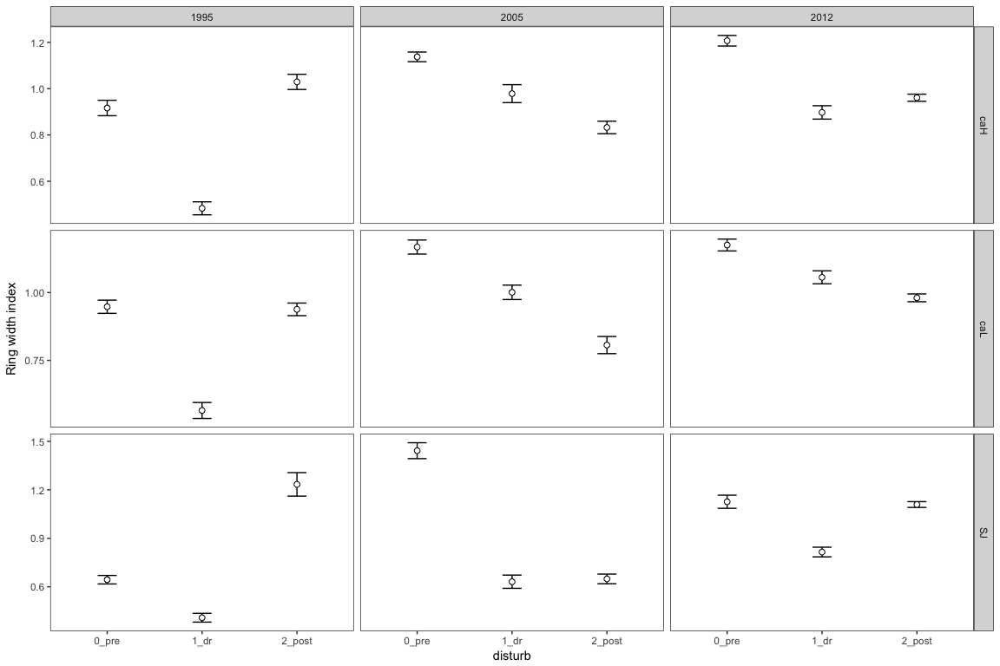
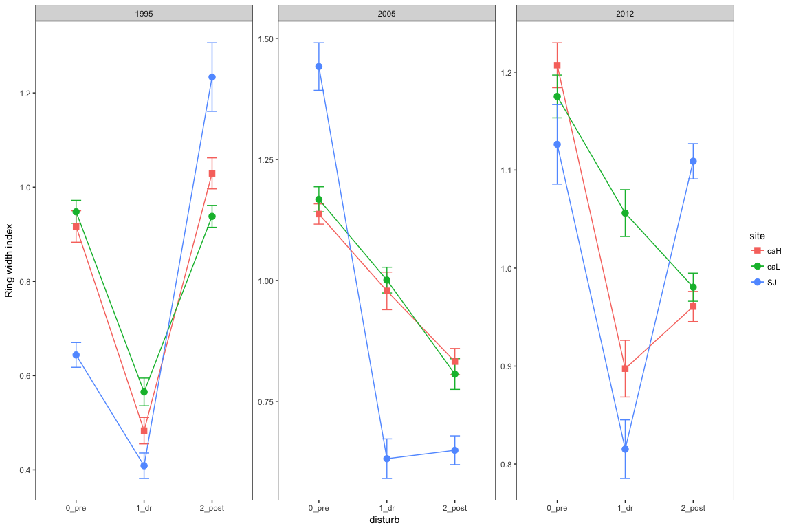

``` r
library("tidyverse")
library("stringr")
library("dplR")
library("knitr")
# library("detrendeR")
library("pander")
library("gridExtra")
```

Read y Prepare data
===================

-   Leer datos `rwl` de SJ y CA

<!-- -->

    ## There does not appear to be a header in the rwl file
    ## There are 48 series
    ## 1        SNA0101      1947    2016   0.01
    ## 2        SNA0102      1947    2016   0.01
    ## 3        SNA0201      1946    2016   0.01
    ## 4        SNA0202      1948    2016   0.01
    ## 5        SNA0301      1949    2016   0.01
    ## 6        SNA0302      1948    2016   0.01
    ## 7        SNA0401      1947    2016   0.01
    ## 8        SNA0402      1947    2016   0.01
    ## 9        SNA0501      1953    2016   0.01
    ## 10       SNA0502      1948    2016   0.01
    ## 11       SNA0601      1948    2016   0.01
    ## 12       SNA0602      1957    2016   0.01
    ## 13       SNA0603      1947    2012   0.01
    ## 14       SNA0701      1954    2016   0.01
    ## 15       SNA0702      1947    2016   0.01
    ## 16       SNA0801      1949    2016   0.01
    ## 17       SNA0802      1951    2016   0.01
    ## 18       SNA0901      1947    2016   0.01
    ## 19       SNA0902      1947    2016   0.01
    ## 20       SNA0903      1947    2002   0.01
    ## 21       SNA1001      1950    2016   0.01
    ## 22       SNA1002      1953    2016   0.01
    ## 23       SNA1003      1948    2008   0.01
    ## 24       SNA1101      1940    2016   0.01
    ## 25       SNA1102      1929    2016   0.01
    ## 26       SNA1103      1942    1994   0.01
    ## 27       SNA1201      1929    2016   0.01
    ## 28       SNA1202      1929    2016   0.01
    ## 29       SNA1203      1927    1983   0.01
    ## 30       SNA1301      1960    2016   0.01
    ## 31       SNA1302      1949    2016   0.01
    ## 32       SNA1303      1949    2011   0.01
    ## 33       SNA1401      1930    2016   0.01
    ## 34       SNA1402      1949    2016   0.01
    ## 35       SNA1501      1952    2016   0.01
    ## 36       SNA1502      1948    2016   0.01
    ## 37       SNA1601      1959    2016   0.01
    ## 38       SNA1602      1927    2016   0.01
    ## 39       SNA1701      1926    2016   0.01
    ## 40       SNA1702      1930    2016   0.01
    ## 41       SNA1703      1931    2016   0.01
    ## 42       SNA1801      1937    2016   0.01
    ## 43       SNA1802      1936    2016   0.01
    ## 44       SNA1901      1921    2016   0.01
    ## 45       SNA1902      1924    2016   0.01
    ## 46       SNA2001      1932    2016   0.01
    ## 47       SNA2003      1932    2016   0.01
    ## 48       SNA2002      1934    2016   0.01

    ## There does not appear to be a header in the rwl file
    ## There are 60 series
    ## 1        SNB0101      1899    2016   0.01
    ## 2        SNB0102      1902    2016   0.01
    ## 3        SNB0201      1916    2016   0.01
    ## 4        SNB0202      1876    2016   0.01
    ## 5        SNB0301      1862    2016   0.01
    ## 6        SNB0302      1862    2016   0.01
    ## 7        SNB0401      1870    2016   0.01
    ## 8        SNB0402      1866    2016   0.01
    ## 9        SNB0501      1864    2016   0.01
    ## 10       SNB0502g     1867    2016   0.01
    ## 11       SNB0601      1860    2016   0.01
    ## 12       SNB0602      1873    2016   0.01
    ## 13       SNB0701      1851    2016   0.01
    ## 14       SNB0702g     1861    2016   0.01
    ## 15       SNB0801g     1851    2016   0.01
    ## 16       SNB0802g     1853    2016   0.01
    ## 17       SNB0901g     1836    2016   0.01
    ## 18       SNB0902      1844    2016   0.01
    ## 19       SNB1001      1868    2016   0.01
    ## 20       SNB1002      1870    2016   0.01
    ## 21       SNB1101      1949    2016   0.01
    ## 22       SNB1102      1893    2016   0.01
    ## 23       SNB1201      1867    2016   0.01
    ## 24       SNB1202      1834    2016   0.01
    ## 25       SNB1301      1865    2016   0.01
    ## 26       SNB1302      1874    2016   0.01
    ## 27       SNB1401      1843    2016   0.01
    ## 28       SNB1402      1848    2016   0.01
    ## 29       SNB1501      1898    2016   0.01
    ## 30       SNB1502      1927    2016   0.01
    ## 31       SNB1601      1846    2016   0.01
    ## 32       SNB1602      1857    2016   0.01
    ## 33       SNB1701      1856    2016   0.01
    ## 34       SNB1702      1853    2016   0.01
    ## 35       SNB1801      1827    2016   0.01
    ## 36       SNB1802      1843    2016   0.01
    ## 37       SNB1901      1888    2016   0.01
    ## 38       SNB1902      1901    2016   0.01
    ## 39       SNB2001      1830    2016   0.01
    ## 40       SNB2002g     1837    2016   0.01
    ## 41       SNB2101      1863    2016   0.01
    ## 42       SNB2102      1858    2016   0.01
    ## 43       SNB2201g     1819    2016   0.01
    ## 44       SNB2202g     1822    2016   0.01
    ## 45       SNB2301g     1832    2016   0.01
    ## 46       SNB2302      1819    2016   0.01
    ## 47       SNB2401      1829    2016   0.01
    ## 48       SNB2402      1831    2016   0.01
    ## 49       SNB2501      1831    2016   0.01
    ## 50       SNB2502      1839    2016   0.01
    ## 51       SNB2601      1872    2016   0.01
    ## 52       SNB2602      1867    2016   0.01
    ## 53       SNB2701      1865    2016   0.01
    ## 54       SNB2702g     1863    2016   0.01
    ## 55       SNB2801      1860    2016   0.01
    ## 56       SNB2802      1866    2016   0.01
    ## 57       SNB2901      1877    2016   0.01
    ## 58       SNB2902      1892    2016   0.01
    ## 59       SNB3001      1867    2016   0.01
    ## 60       SNB3002      1874    2016   0.01

Computar RWI para tres sitios CA\_High, CA\_Low, SJ.

Preparar datos para computar RWI
================================

``` r
source(paste0(di, 'script/R/computeSpline.R'))
source(paste0(di, 'script/R/rw_byTree.R'))
source(paste0(di, 'script/R/rwiResilience.R'))
```

``` r
# Replace SNA by SJ and SNB by CA
names(ca) <- stringr::str_replace(names(ca), "SNB", "CA") 
names(sj) <- stringr::str_replace(names(sj), "SNA", "SJ")

# Remove g in name of some cores of CA. 
names(ca) <- stringr::str_replace(names(ca), "g", "")
```

-   Crear dataframes `rwl` por cada sitio CA\_High, CA\_Low, SJ

``` r
# Create subset to compare between sites 
caL <- ca[,c("CA0101","CA0102","CA0201","CA0202","CA0301","CA0302","CA0401","CA0402","CA0501","CA0502",
             "CA0601","CA0602","CA0701","CA0702","CA0801","CA0802","CA0901","CA0902","CA1001","CA1002",
             "CA2601","CA2602","CA2701","CA2702","CA2801","CA2802","CA2901","CA2902","CA3001","CA3002")] 
caH <- ca[, c("CA1101","CA1102","CA1201","CA1202","CA1301","CA1302","CA1401","CA1402","CA1501","CA1502",
              "CA1601","CA1602","CA1701","CA1702","CA1801","CA1802","CA1901","CA1902","CA2001","CA2002",
              "CA2101","CA2102","CA2201","CA2202","CA2301","CA2302","CA2401","CA2402","CA2501","CA2502")]

# remove the rows with NA across all columns 
caL <- caL[rowSums(is.na(caL))!=ncol(caL), ]
```

Compute RWI
-----------

``` r
rwi_sj <- computeSpline(rwdf = sj, nsmooth = 30)
rwi_caL <- computeSpline(rwdf = caL, nsmooth = 30)
rwi_caH <- computeSpline(rwdf = caH, nsmooth = 30)

# Export data 
write.csv(rwi_sj, file=paste(di, "data/rwi/rwi_sj.csv", sep=""), row.names = TRUE)
write.csv(rwi_caL, file=paste(di, "data/rwi/rwi_caL.csv", sep=""), row.names = TRUE)
write.csv(rwi_caH, file=paste(di, "data/rwi/rwi_caH.csv", sep=""), row.names = TRUE)
```

### Summary dendrochronology statistics

-   Por cada site (ca\_high, ca\_low, sj) calculamos los estadísticos de la serie rwi. En concreto:

:red\_circle: DUDAS cual utilizar como reportes

By site
-------

``` r
objects_rwi <- c('rwi_caL','rwi_caH','rwi_sj')

out <- c() 

for (i in objects_rwi){ 
  
  aux <- get(i)
  name_aux <- sub(".*\\_", '', i)
  
  # Get ids 
  aux_ids <- read.ids(aux, stc = c(2,2,2))
  
  # Stats of RWI 
  aux_stats <- rwi.stats(aux, ids = aux_ids)
  
  # Add site 
  aux_stats$site <- as.factor(name_aux)
  
  out <- rbind(out, aux_stats)
  }


rwi_statistics <- out 

rwi_statistics %>% 
  write.csv(file=paste(di, "data/dendro_summary/site3_dendro_rwi.csv", sep=""), row.names = FALSE)

pander(rwi_statistics, caption='Dendrochronological summary by sites') 
```

<table>
<caption>Dendrochronological summary by sites (continued below)</caption>
<colgroup>
<col width="12%" />
<col width="12%" />
<col width="7%" />
<col width="10%" />
<col width="8%" />
<col width="8%" />
<col width="13%" />
<col width="12%" />
<col width="12%" />
</colgroup>
<thead>
<tr class="header">
<th align="center">n.cores</th>
<th align="center">n.trees</th>
<th align="center">n</th>
<th align="center">n.tot</th>
<th align="center">n.wt</th>
<th align="center">n.bt</th>
<th align="center">rbar.tot</th>
<th align="center">rbar.wt</th>
<th align="center">rbar.bt</th>
</tr>
</thead>
<tbody>
<tr class="odd">
<td align="center">30</td>
<td align="center">15</td>
<td align="center">12.64</td>
<td align="center">435</td>
<td align="center">15</td>
<td align="center">420</td>
<td align="center">0.327</td>
<td align="center">0.563</td>
<td align="center">0.318</td>
</tr>
<tr class="even">
<td align="center">30</td>
<td align="center">15</td>
<td align="center">12.74</td>
<td align="center">435</td>
<td align="center">15</td>
<td align="center">420</td>
<td align="center">0.335</td>
<td align="center">0.513</td>
<td align="center">0.329</td>
</tr>
<tr class="odd">
<td align="center">48</td>
<td align="center">20</td>
<td align="center">16.05</td>
<td align="center">1125</td>
<td align="center">36</td>
<td align="center">1089</td>
<td align="center">0.532</td>
<td align="center">0.797</td>
<td align="center">0.524</td>
</tr>
</tbody>
</table>

<table style="width:51%;">
<colgroup>
<col width="11%" />
<col width="15%" />
<col width="8%" />
<col width="8%" />
<col width="8%" />
</colgroup>
<thead>
<tr class="header">
<th align="center">c.eff</th>
<th align="center">rbar.eff</th>
<th align="center">eps</th>
<th align="center">snr</th>
<th align="center">site</th>
</tr>
</thead>
<tbody>
<tr class="odd">
<td align="center">2</td>
<td align="center">0.407</td>
<td align="center">0.897</td>
<td align="center">8.69</td>
<td align="center">caL</td>
</tr>
<tr class="even">
<td align="center">2</td>
<td align="center">0.434</td>
<td align="center">0.907</td>
<td align="center">9.779</td>
<td align="center">caH</td>
</tr>
<tr class="odd">
<td align="center">2.308</td>
<td align="center">0.592</td>
<td align="center">0.959</td>
<td align="center">23.28</td>
<td align="center">sj</td>
</tr>
</tbody>
</table>

Compute residual chronologies
-----------------------------

A partir de cada serie (RWI) vamos a computar chronologias por sitio.

-   Cada serie RWI se somete a un modelo autorregresivo (pre-withening) y posteriormente se calcula el promedio para cada año mediante una estimación robusta de la media (biweight).

-   La calidad estadistica de cada serie se chequeó via la EPS (expressed population signal) (<span class="citeproc-not-found" data-reference-id="Wigley1984">**???**</span>). Se calculó para cada serie la EPS utilizando una ventana temporal de 30 años.
-   Posteriormente, a threshold value of EPS &gt;0.85 was used to determine the cutoff year of the time span that could be considered reliable

``` r
objects_rwi <- c('rwi_caL','rwi_caH','rwi_sj')

out <- c() 
out_eps <- c() 

for (i in objects_rwi){ 
  
  aux <- get(i)
  
  name_aux <- sub(".*\\_", '', i)
  
  # Compute chrono 
  crono_aux <- chron(aux, prefix = "", biweight = TRUE, prewhiten = TRUE)
  
  # Add year and site 
  crono_aux$year <- as.numeric(row.names(crono_aux))
  crono_aux$site <- as.factor(name_aux) 
  
  # name export 
  nameexport <- paste0("cro_", name_aux) 
  
  assign(nameexport, crono_aux)
  
  
  # eps 
  # Get ids 
  aux_ids <- read.ids(aux, stc = c(2,2,2))
  
  # eps cutoff
  aux_stats <- rwi.stats.running(aux, ids = aux_ids, window.length = 30)
  
  aux_eps <- data.frame(year = c(min(crono_aux$year), 
                                aux_stats$mid.year, 
                                max(crono_aux$year)),
                       eps = c(NA, aux_stats$eps, NA), 
                       site = as.factor(name_aux))
  
  
  
  out <- rbind(out, crono_aux)
  out_eps <- rbind(out_eps, aux_eps)
  }


# cronos 
cro_rwi <- out

# Export data 
write.csv(cro_rwi, file=paste(di, "data/cronos_medias/cronos_sites_rwi.csv", sep=""), row.names = FALSE)
```

Obtener el año a partir del cual podemos considerar reliable la chrono.
=======================================================================

eps
---

``` r
# eps umbral 
eps_cut <- 0.85
year_cutoffs <- 
  out_eps %>% 
  group_by(site) %>% 
  # filter(eps < eps_cut) %>% 
  slice(which.max(eps < eps_cut)) %>% as.data.frame()

pander(year_cutoffs) 
```

<table style="width:26%;">
<colgroup>
<col width="9%" />
<col width="8%" />
<col width="8%" />
</colgroup>
<thead>
<tr class="header">
<th align="center">year</th>
<th align="center">eps</th>
<th align="center">site</th>
</tr>
</thead>
<tbody>
<tr class="odd">
<td align="center">1866</td>
<td align="center">0.806</td>
<td align="center">caL</td>
</tr>
<tr class="even">
<td align="center">1836</td>
<td align="center">0.809</td>
<td align="center">caH</td>
</tr>
<tr class="odd">
<td align="center">1941</td>
<td align="center">0.924</td>
<td align="center">sj</td>
</tr>
</tbody>
</table>

Ojo el año es el mid year del periodo considerado. Por ejemplo para SJ, todos los valores de EPS son mayores del valor del umbral, y coincide que el menor valor de eps es el del primer periodo. Ojo a eso.

sample depth
------------

``` r
# ssamp.depth
sample_treshold <- 5 

year_sampledepth <- 
  cro_rwi %>% 
  group_by(site) %>% 
  # filter(eps < eps_cut) %>% 
  slice(which.max(samp.depth > sample_treshold)) %>% as.data.frame()

pander(year_sampledepth) 
```

<table style="width:57%;">
<colgroup>
<col width="9%" />
<col width="9%" />
<col width="18%" />
<col width="9%" />
<col width="9%" />
</colgroup>
<thead>
<tr class="header">
<th align="center">std</th>
<th align="center">res</th>
<th align="center">samp.depth</th>
<th align="center">year</th>
<th align="center">site</th>
</tr>
</thead>
<tbody>
<tr class="odd">
<td align="center">0.9473</td>
<td align="center">0.9815</td>
<td align="center">7</td>
<td align="center">1860</td>
<td align="center">caL</td>
</tr>
<tr class="even">
<td align="center">1.083</td>
<td align="center">0.9752</td>
<td align="center">6</td>
<td align="center">1830</td>
<td align="center">caH</td>
</tr>
<tr class="odd">
<td align="center">1.425</td>
<td align="center">1.33</td>
<td align="center">8</td>
<td align="center">1929</td>
<td align="center">sj</td>
</tr>
</tbody>
</table>

### Plots of RWI

``` r
cro_rwi <- cro_rwi %>% 
  mutate(site_sorted = case_when(
    site == "sj" ~ "0_sj", 
    site == "caH" ~ "1_caH",
    site == "caL" ~ "2_caL"))


year_cutoffs <- year_cutoffs %>% 
  mutate(site_sorted = case_when(
    site == "sj" ~ "0_sj", 
    site == "caH" ~ "1_caH",
    site == "caL" ~ "2_caL"))

year_sampledepth <- year_sampledepth %>% 
  mutate(site_sorted = case_when(
    site == "sj" ~ "0_sj", 
    site == "caH" ~ "1_caH",
    site == "caL" ~ "2_caL"))
```

Plots de las cronos, añadiendo líneas para los años de sequía 1995, 2005 y 2012 (líneas negras) y líneas para los años con valor eps &gt; 0.85 (ver ejemplo paper Dorado-liñan <https://link.springer.com/article/10.1007/s00484-017-1410-5>). También añado una con el sample depth &gt; 5 (línea azul). Escoger uno de los dos criterios. Preguntar a G. Gea

``` r
label_site <- c("0_sj" = "Northern (SJ)",
                "1_caH" = "Southern High (CaH)",
                "2_caL" = "Southern Low (CaL)")

# 
plot_rwi_crono <- ggplot(cro_rwi, aes(x=year, y=res)) +
  theme_bw() + 
  theme(panel.grid = element_blank(), 
        strip.background = element_rect(fill = "white"),
        strip.text = element_text(face="bold", size=12), 
        axis.text = element_text(face="bold", size=10), 
        axis.title = element_text(face="bold", size=12)) + 
  geom_hline(yintercept = 1, colour = "grey") + 
  geom_line(size=.8) + scale_y_continuous(breaks = seq(0.4,1.8, 0.2)) +
  facet_wrap(~site_sorted, scales = "fixed", ncol = 1,
             labeller = as_labeller(label_site)) + 
  ylab("Ring width index") + xlab("Year") + 
  geom_vline(xintercept = c(1995, 2005, 2012), linetype = "dotted") + 
  geom_vline(aes(xintercept = year), data = year_cutoffs,  linetype = "dashed", colour='red') + 
  geom_vline(aes(xintercept = year), data = year_sampledepth,  linetype = "dashed", colour='blue') +
  scale_x_continuous(limits = c(1819, 2016), 
                     breaks= seq(1820, 2020, by=20))
  
  
plot_rwi_crono   
```


``` r
ggsave(plot=plot_rwi_crono, width=8, height = 6,
       filename=paste0(di, 'out/chronos_rwi/rwi_crono_3sites.pdf')) 
```

``` r
plot_rwi_crono50 <- cro_rwi %>% 
  filter(year > 1949) %>% 
  ggplot(aes(x=year, y=res)) +
  theme_bw() + 
  theme(panel.grid = element_blank( ), 
        strip.background = element_rect(fill = "white"),
        strip.text = element_text(face="bold", size=12), 
        axis.text = element_text(face="bold", size=10), 
        axis.title = element_text(face="bold", size=12)) + 
  geom_hline(yintercept = 1, colour = "grey") + 
  geom_line(size=.8) + scale_y_continuous(breaks = seq(0.4,1.8, 0.2)) +
  facet_wrap(~site_sorted, scales = "fixed", ncol = 1,
             labeller = as_labeller(label_site)) + 
  ylab("Ring width index") + xlab("Year") + 
  geom_vline(xintercept = c(1995, 2005, 2012), linetype = "dotted") +
  scale_x_continuous(limits = c(1950, 2016), 
                     breaks = seq(1950, 2016, by=10))

plot_rwi_crono50   
```


``` r
ggsave(plot=plot_rwi_crono50, width=8, height = 6,
       filename=paste0(di, 'out/chronos_rwi/rwi_crono_3sites50.pdf')) 
```

Resilience
==========

-   Computar métricas de resiliencia RWI para los tres sitios.
-   Computar tres eventos climáticos: 1995, 2005, 2012
-   Computar ventanas temporales: 2, 3 y 4

Aggregate RWI by tree
---------------------

-   Agregar valores medios de RWI por site (obtenemos sj\_tree / caL\_tree, caH\_tree)
-   ver fun rw\_byTree (utilizada para bai\_resilience.Rmd)

``` r
# Remember snc = structure of core name SJ0101 (site | tree | core)
rwi_sj_tree <- rw_byTree(rwi_sj, snc =c(2,2,2), locname = 'SJ')
rwi_caL_tree <- rw_byTree(rwi_caL, snc =c(2,2,2), locname = 'CA')
rwi_caH_tree <- rw_byTree(rwi_caH, snc =c(2,2,2), locname = 'CA')
```

``` r
# Drought years 
dyears <- c(1995, 2005, 2012)

# SJ 
res_4_sj <- rwiResilience(rwi_sj_tree, event_years = dyears, window = 4)
res_3_sj <- rwiResilience(rwi_sj_tree, event_years = dyears, window = 3)
res_2_sj <- rwiResilience(rwi_sj_tree, event_years = dyears, window = 2)

# caL
res_4_caL <- rwiResilience(rwi_caL_tree, event_years = dyears, window = 4)
res_3_caL <- rwiResilience(rwi_caL_tree, event_years = dyears, window = 3)
res_2_caL <- rwiResilience(rwi_caL_tree, event_years = dyears, window = 2)

# caH
res_4_caH <- rwiResilience(rwi_caH_tree , event_years = dyears, window = 4)
res_3_caH <- rwiResilience(rwi_caH_tree , event_years = dyears, window = 3)
res_2_caH <- rwiResilience(rwi_caH_tree , event_years = dyears, window = 2)
```

### Computar correlaciones ventanas temporales

#### Resistance


#### Recovery


#### Resilience


#### Relative Resilience


#### Coeficientes de correlacion entre ventanas temporales

``` r
aux_coefs %>% pander()
```

<table style="width:51%;">
<colgroup>
<col width="8%" />
<col width="19%" />
<col width="23%" />
</colgroup>
<thead>
<tr class="header">
<th align="center">var</th>
<th align="center">window_size</th>
<th align="center">r2</th>
</tr>
</thead>
<tbody>
<tr class="odd">
<td align="center">rt</td>
<td align="center">2-3</td>
<td align="center">0.919732565996108</td>
</tr>
<tr class="even">
<td align="center">rt</td>
<td align="center">2-4</td>
<td align="center">0.810304467792039</td>
</tr>
<tr class="odd">
<td align="center">rt</td>
<td align="center">3-4</td>
<td align="center">0.953793899096482</td>
</tr>
<tr class="even">
<td align="center">rc</td>
<td align="center">2-3</td>
<td align="center">0.949827815209224</td>
</tr>
<tr class="odd">
<td align="center">rc</td>
<td align="center">2-4</td>
<td align="center">0.903988256703656</td>
</tr>
<tr class="even">
<td align="center">rc</td>
<td align="center">3-4</td>
<td align="center">0.98441525780542</td>
</tr>
<tr class="odd">
<td align="center">rs</td>
<td align="center">2-3</td>
<td align="center">0.897577583067891</td>
</tr>
<tr class="even">
<td align="center">rs</td>
<td align="center">2-4</td>
<td align="center">0.786486871635327</td>
</tr>
<tr class="odd">
<td align="center">rs</td>
<td align="center">3-4</td>
<td align="center">0.955264708059663</td>
</tr>
<tr class="even">
<td align="center">rrs</td>
<td align="center">2-3</td>
<td align="center">0.927176073959788</td>
</tr>
<tr class="odd">
<td align="center">rrs</td>
<td align="center">2-4</td>
<td align="center">0.876739679983047</td>
</tr>
<tr class="even">
<td align="center">rrs</td>
<td align="center">3-4</td>
<td align="center">0.981723373223396</td>
</tr>
</tbody>
</table>

Nos quedamos con 3 años de ventana temporal.

Plots Crecimiento
=================

Boxplot with outliers
---------------------


Mean + se
---------





tables
------

``` r
g %>% 
  mutate(disturb = dplyr::recode(disturb, dr = '1_dr', pre = '0_pre', post = '2_post')) %>%
  dplyr::group_by(site, disturb_year, disturb) %>% 
  dplyr::summarise(mean = mean(mean_period/100), 
                   sd = sd(mean_period/100),
                   se = sd/sqrt(length(mean_period/100))) %>% as.data.frame() %>% pander() 
```

<table style="width:85%;">
<colgroup>
<col width="9%" />
<col width="20%" />
<col width="13%" />
<col width="12%" />
<col width="13%" />
<col width="13%" />
</colgroup>
<thead>
<tr class="header">
<th align="center">site</th>
<th align="center">disturb_year</th>
<th align="center">disturb</th>
<th align="center">mean</th>
<th align="center">sd</th>
<th align="center">se</th>
</tr>
</thead>
<tbody>
<tr class="odd">
<td align="center">SJ</td>
<td align="center">1995</td>
<td align="center">0_pre</td>
<td align="center">0.00644</td>
<td align="center">0.001174</td>
<td align="center">0.0002626</td>
</tr>
<tr class="even">
<td align="center">SJ</td>
<td align="center">1995</td>
<td align="center">1_dr</td>
<td align="center">0.004087</td>
<td align="center">0.00121</td>
<td align="center">0.0002705</td>
</tr>
<tr class="odd">
<td align="center">SJ</td>
<td align="center">1995</td>
<td align="center">2_post</td>
<td align="center">0.01234</td>
<td align="center">0.003254</td>
<td align="center">0.0007276</td>
</tr>
<tr class="even">
<td align="center">SJ</td>
<td align="center">2005</td>
<td align="center">0_pre</td>
<td align="center">0.01442</td>
<td align="center">0.0022</td>
<td align="center">0.000492</td>
</tr>
<tr class="odd">
<td align="center">SJ</td>
<td align="center">2005</td>
<td align="center">1_dr</td>
<td align="center">0.006315</td>
<td align="center">0.001831</td>
<td align="center">0.0004094</td>
</tr>
<tr class="even">
<td align="center">SJ</td>
<td align="center">2005</td>
<td align="center">2_post</td>
<td align="center">0.006489</td>
<td align="center">0.00133</td>
<td align="center">0.0002975</td>
</tr>
<tr class="odd">
<td align="center">SJ</td>
<td align="center">2012</td>
<td align="center">0_pre</td>
<td align="center">0.01126</td>
<td align="center">0.001815</td>
<td align="center">0.0004058</td>
</tr>
<tr class="even">
<td align="center">SJ</td>
<td align="center">2012</td>
<td align="center">1_dr</td>
<td align="center">0.008152</td>
<td align="center">0.001339</td>
<td align="center">0.0002994</td>
</tr>
<tr class="odd">
<td align="center">SJ</td>
<td align="center">2012</td>
<td align="center">2_post</td>
<td align="center">0.01109</td>
<td align="center">0.0008023</td>
<td align="center">0.0001794</td>
</tr>
<tr class="even">
<td align="center">caH</td>
<td align="center">1995</td>
<td align="center">0_pre</td>
<td align="center">0.009165</td>
<td align="center">0.001291</td>
<td align="center">0.0003332</td>
</tr>
<tr class="odd">
<td align="center">caH</td>
<td align="center">1995</td>
<td align="center">1_dr</td>
<td align="center">0.004831</td>
<td align="center">0.001087</td>
<td align="center">0.0002805</td>
</tr>
<tr class="even">
<td align="center">caH</td>
<td align="center">1995</td>
<td align="center">2_post</td>
<td align="center">0.01029</td>
<td align="center">0.001273</td>
<td align="center">0.0003288</td>
</tr>
<tr class="odd">
<td align="center">caH</td>
<td align="center">2005</td>
<td align="center">0_pre</td>
<td align="center">0.01137</td>
<td align="center">0.00081</td>
<td align="center">0.0002091</td>
</tr>
<tr class="even">
<td align="center">caH</td>
<td align="center">2005</td>
<td align="center">1_dr</td>
<td align="center">0.009785</td>
<td align="center">0.001505</td>
<td align="center">0.0003885</td>
</tr>
<tr class="odd">
<td align="center">caH</td>
<td align="center">2005</td>
<td align="center">2_post</td>
<td align="center">0.008324</td>
<td align="center">0.001048</td>
<td align="center">0.0002706</td>
</tr>
<tr class="even">
<td align="center">caH</td>
<td align="center">2012</td>
<td align="center">0_pre</td>
<td align="center">0.01207</td>
<td align="center">0.0008875</td>
<td align="center">0.0002292</td>
</tr>
<tr class="odd">
<td align="center">caH</td>
<td align="center">2012</td>
<td align="center">1_dr</td>
<td align="center">0.008974</td>
<td align="center">0.00112</td>
<td align="center">0.0002891</td>
</tr>
<tr class="even">
<td align="center">caH</td>
<td align="center">2012</td>
<td align="center">2_post</td>
<td align="center">0.009608</td>
<td align="center">0.0005954</td>
<td align="center">0.0001537</td>
</tr>
<tr class="odd">
<td align="center">caL</td>
<td align="center">1995</td>
<td align="center">0_pre</td>
<td align="center">0.009476</td>
<td align="center">0.0009421</td>
<td align="center">0.0002433</td>
</tr>
<tr class="even">
<td align="center">caL</td>
<td align="center">1995</td>
<td align="center">1_dr</td>
<td align="center">0.005655</td>
<td align="center">0.001139</td>
<td align="center">0.0002942</td>
</tr>
<tr class="odd">
<td align="center">caL</td>
<td align="center">1995</td>
<td align="center">2_post</td>
<td align="center">0.00938</td>
<td align="center">0.0008989</td>
<td align="center">0.0002321</td>
</tr>
<tr class="even">
<td align="center">caL</td>
<td align="center">2005</td>
<td align="center">0_pre</td>
<td align="center">0.01168</td>
<td align="center">0.001001</td>
<td align="center">0.0002585</td>
</tr>
<tr class="odd">
<td align="center">caL</td>
<td align="center">2005</td>
<td align="center">1_dr</td>
<td align="center">0.01001</td>
<td align="center">0.001029</td>
<td align="center">0.0002656</td>
</tr>
<tr class="even">
<td align="center">caL</td>
<td align="center">2005</td>
<td align="center">2_post</td>
<td align="center">0.008065</td>
<td align="center">0.001226</td>
<td align="center">0.0003166</td>
</tr>
<tr class="odd">
<td align="center">caL</td>
<td align="center">2012</td>
<td align="center">0_pre</td>
<td align="center">0.01175</td>
<td align="center">0.0008473</td>
<td align="center">0.0002188</td>
</tr>
<tr class="even">
<td align="center">caL</td>
<td align="center">2012</td>
<td align="center">1_dr</td>
<td align="center">0.01056</td>
<td align="center">0.0009248</td>
<td align="center">0.0002388</td>
</tr>
<tr class="odd">
<td align="center">caL</td>
<td align="center">2012</td>
<td align="center">2_post</td>
<td align="center">0.009805</td>
<td align="center">0.0005555</td>
<td align="center">0.0001434</td>
</tr>
</tbody>
</table>

Prepare data of Resiliencia for ANOVAS
======================================

``` r
# Prepara data 
rsj <- res_3_sj$resilience %>% mutate(site='SJ')
rcaL<- res_3_caL$resilience %>% mutate(site='caL')
rcaH <- res_3_caH$resilience %>% mutate(site='caH')

re <- bind_rows(rsj, rcaL, rcaH)
re$disturb_year <- as.factor(re$disturb_year)
re$site <- as.factor(re$site)

# Export csv 
write.csv(re, file=paste0(di, 'data/resilience/resilience_rwi.csv'), row.names = FALSE)
```
