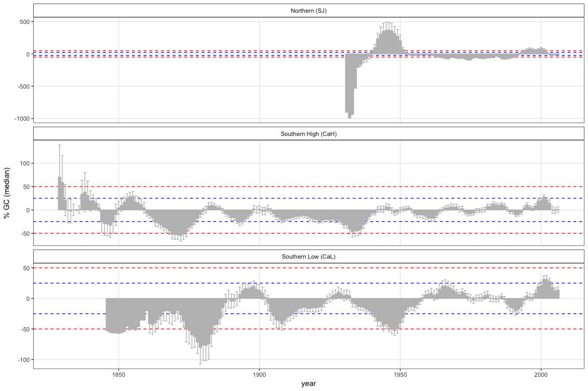

``` r
library("tidyverse")
library("stringr")
library("dplR")
library("knitr")
# library("detrendeR")
library("pander")
library('boot')
library('gtable')
library('grid')
library('patchwork')
```

Disturbance chronologies
========================

-   Vamos a calcular las disturbance chronologies siguiendo la aproximación de (Nowacki and Abrams 1997)(varios ejemplos se pueden ver en (Gea-Izquierdo and Cañellas 2014, Dorado-Liñán et al. (2017)))

-   Utilizaremos tres chronologias: SJ, CAH y CAL (ver [./analysis/chronos/analysis\_chronologies.md]('./analysis/chronos/analysis_chronologies.md))

Prepare data
------------

-   Leer datos `rwl` de SJ y CA
-   Leer datos de diametros de los focal tree

<!-- -->

    ## There does not appear to be a header in the rwl file
    ## There are 48 series
    ## 1        SNA0101      1947    2016   0.01
    ## 2        SNA0102      1947    2016   0.01
    ## 3        SNA0201      1946    2016   0.01
    ## 4        SNA0202      1948    2016   0.01
    ## 5        SNA0301      1949    2016   0.01
    ## 6        SNA0302      1948    2016   0.01
    ## 7        SNA0401      1947    2016   0.01
    ## 8        SNA0402      1947    2016   0.01
    ## 9        SNA0501      1953    2016   0.01
    ## 10       SNA0502      1948    2016   0.01
    ## 11       SNA0601      1948    2016   0.01
    ## 12       SNA0602      1957    2016   0.01
    ## 13       SNA0603      1947    2012   0.01
    ## 14       SNA0701      1954    2016   0.01
    ## 15       SNA0702      1947    2016   0.01
    ## 16       SNA0801      1949    2016   0.01
    ## 17       SNA0802      1951    2016   0.01
    ## 18       SNA0901      1947    2016   0.01
    ## 19       SNA0902      1947    2016   0.01
    ## 20       SNA0903      1947    2002   0.01
    ## 21       SNA1001      1950    2016   0.01
    ## 22       SNA1002      1953    2016   0.01
    ## 23       SNA1003      1948    2008   0.01
    ## 24       SNA1101      1940    2016   0.01
    ## 25       SNA1102      1929    2016   0.01
    ## 26       SNA1103      1942    1994   0.01
    ## 27       SNA1201      1929    2016   0.01
    ## 28       SNA1202      1929    2016   0.01
    ## 29       SNA1203      1927    1983   0.01
    ## 30       SNA1301      1960    2016   0.01
    ## 31       SNA1302      1949    2016   0.01
    ## 32       SNA1303      1949    2011   0.01
    ## 33       SNA1401      1930    2016   0.01
    ## 34       SNA1402      1949    2016   0.01
    ## 35       SNA1501      1952    2016   0.01
    ## 36       SNA1502      1948    2016   0.01
    ## 37       SNA1601      1959    2016   0.01
    ## 38       SNA1602      1927    2016   0.01
    ## 39       SNA1701      1926    2016   0.01
    ## 40       SNA1702      1930    2016   0.01
    ## 41       SNA1703      1931    2016   0.01
    ## 42       SNA1801      1937    2016   0.01
    ## 43       SNA1802      1936    2016   0.01
    ## 44       SNA1901      1921    2016   0.01
    ## 45       SNA1902      1924    2016   0.01
    ## 46       SNA2001      1932    2016   0.01
    ## 47       SNA2003      1932    2016   0.01
    ## 48       SNA2002      1934    2016   0.01

    ## There does not appear to be a header in the rwl file
    ## There are 60 series
    ## 1        SNB0101      1899    2016   0.01
    ## 2        SNB0102      1902    2016   0.01
    ## 3        SNB0201      1916    2016   0.01
    ## 4        SNB0202      1876    2016   0.01
    ## 5        SNB0301      1862    2016   0.01
    ## 6        SNB0302      1862    2016   0.01
    ## 7        SNB0401      1870    2016   0.01
    ## 8        SNB0402      1866    2016   0.01
    ## 9        SNB0501      1864    2016   0.01
    ## 10       SNB0502g     1867    2016   0.01
    ## 11       SNB0601      1860    2016   0.01
    ## 12       SNB0602      1873    2016   0.01
    ## 13       SNB0701      1851    2016   0.01
    ## 14       SNB0702g     1861    2016   0.01
    ## 15       SNB0801g     1851    2016   0.01
    ## 16       SNB0802g     1853    2016   0.01
    ## 17       SNB0901g     1836    2016   0.01
    ## 18       SNB0902      1844    2016   0.01
    ## 19       SNB1001      1868    2016   0.01
    ## 20       SNB1002      1870    2016   0.01
    ## 21       SNB1101      1949    2016   0.01
    ## 22       SNB1102      1893    2016   0.01
    ## 23       SNB1201      1867    2016   0.01
    ## 24       SNB1202      1834    2016   0.01
    ## 25       SNB1301      1865    2016   0.01
    ## 26       SNB1302      1874    2016   0.01
    ## 27       SNB1401      1843    2016   0.01
    ## 28       SNB1402      1848    2016   0.01
    ## 29       SNB1501      1898    2016   0.01
    ## 30       SNB1502      1927    2016   0.01
    ## 31       SNB1601      1846    2016   0.01
    ## 32       SNB1602      1857    2016   0.01
    ## 33       SNB1701      1856    2016   0.01
    ## 34       SNB1702      1853    2016   0.01
    ## 35       SNB1801      1827    2016   0.01
    ## 36       SNB1802      1843    2016   0.01
    ## 37       SNB1901      1888    2016   0.01
    ## 38       SNB1902      1901    2016   0.01
    ## 39       SNB2001      1830    2016   0.01
    ## 40       SNB2002g     1837    2016   0.01
    ## 41       SNB2101      1863    2016   0.01
    ## 42       SNB2102      1858    2016   0.01
    ## 43       SNB2201g     1819    2016   0.01
    ## 44       SNB2202g     1822    2016   0.01
    ## 45       SNB2301g     1832    2016   0.01
    ## 46       SNB2302      1819    2016   0.01
    ## 47       SNB2401      1829    2016   0.01
    ## 48       SNB2402      1831    2016   0.01
    ## 49       SNB2501      1831    2016   0.01
    ## 50       SNB2502      1839    2016   0.01
    ## 51       SNB2601      1872    2016   0.01
    ## 52       SNB2602      1867    2016   0.01
    ## 53       SNB2701      1865    2016   0.01
    ## 54       SNB2702g     1863    2016   0.01
    ## 55       SNB2801      1860    2016   0.01
    ## 56       SNB2802      1866    2016   0.01
    ## 57       SNB2901      1877    2016   0.01
    ## 58       SNB2902      1892    2016   0.01
    ## 59       SNB3001      1867    2016   0.01
    ## 60       SNB3002      1874    2016   0.01

``` r
source(paste0(di, 'script/R/rw_byTree.R'))
source(paste0(di, 'script/R/bai_piovesan.R'))
source(paste0(di, 'script/R/computeGC.R'))
```

-   Crear dataframes `rwl` por cada sitio CA\_High, CA\_Low, SJ\_High. SJ\_Low

-   :red\_circle: ojo he cambiado los nombres de las series en SJ y en CA

``` r
# Replace SNA by SJ and SNB by CA
names(ca) <- stringr::str_replace(names(ca), "SNB", "CA") 
names(sj) <- stringr::str_replace(names(sj), "SNA", "SJ")

# Remove g in name of some cores of CA. 
names(ca) <- stringr::str_replace(names(ca), "g", "")
```

``` r
# Create subset to compare between sites 
caL <- ca[,c("CA0101","CA0102","CA0201","CA0202","CA0301","CA0302","CA0401","CA0402","CA0501","CA0502",
             "CA0601","CA0602","CA0701","CA0702","CA0801","CA0802","CA0901","CA0902","CA1001","CA1002",
             "CA2601","CA2602","CA2701","CA2702","CA2801","CA2802","CA2901","CA2902","CA3001","CA3002")] 
caH <- ca[, c("CA1101","CA1102","CA1201","CA1202","CA1301","CA1302","CA1401","CA1402","CA1501","CA1502",
              "CA1601","CA1602","CA1701","CA1702","CA1801","CA1802","CA1901","CA1902","CA2001","CA2002",
              "CA2101","CA2102","CA2201","CA2202","CA2301","CA2302","CA2401","CA2402","CA2501","CA2502")]
```

-   Lectura y preparación de datos de diámetro

``` r
# Prepare Diameter data 

# Compute diameter (mm)
compete <- compete %>% 
  mutate(dn_mm = (perim_mm / pi))

# Change name focal according to loc
compete <- compete %>% 
  mutate(id_focalLoc = stringr::str_replace_all(id_focal, c("A" = "SJ", "B" = "CA")))

         
# Get only focal trees, and only selected variables 
ft <- compete %>% 
  filter(sp=='Focal') %>% 
  filter(id_focal!='Fresno') %>% 
  dplyr::select(id_focal, id_focalLoc, loc, dn_mm, height_cm) 

# Set levels of eleveation 
ca_lowcode <- c(paste0('CA', str_pad(1:10, 2, pad='0')),
            paste0('CA', 26:30))
ca_highcode <- paste0('CA', 11:25)

ft <- ft %>% 
  mutate(site = as.factor(
    ifelse(id_focalLoc %in% ca_lowcode, 'CAL', 
           ifelse(id_focalLoc %in% ca_highcode, 'CAH', 'SJ'))))
```

Summary dendrochronology statistics
===================================

-   Por cada site (CAH, CAL, SJ) calculamos los siguientes datos:
    -   age: mean + sd (average of all series)
    -   year: min, max of all series
    -   year range
    -   autocorrelation order 1 (ar1): mean + sd
    -   seires intercorrelation (icor): mean + sd

By site
-------

``` r
objects_rwl <- c('caL','caH','sj')

out <- c() 

for (i in objects_rwl){ 
  
  aux <- get(i)
  # Stats of singles RWL
  aux_stats <- rwl.stats(aux)
  # Add site 
  aux_stats$site <- as.factor(i)
  
  # Compute interseries correlation 
  aux_stats$interser_cor_val  <- interseries.cor(aux)$res.cor
  aux_stats$interser_cor_p  <- interseries.cor(aux)$p.val
  
  out <- rbind(out, aux_stats)
  }


rwl_by_site <- out %>% group_by(site) %>% 
  summarize(age_mean = round(mean(year),2), 
            age_sd = round(sd(year), 2),
            year_min = min(first),
            year_max = max(last), 
            year_range = year_max - year_min + 1, 
            ar1_mean = round(mean(ar1), 3),
            ar1_sd = round(sd(ar1), 3),
            icor_mean = round(mean(interser_cor_val), 3),
            icor_sd = round(sd(interser_cor_val), 3)) %>% 
  as.data.frame() 

rwl_by_site %>% 
  write.csv(file=paste(di, "data/proto_tables/site_3_dendro.csv", sep=""), row.names = FALSE)

pander(rwl_by_site, caption='Dendrochronological summary by sites (3)') 
```

<table>
<caption>Dendrochronological summary by sites (3) (continued below)</caption>
<colgroup>
<col width="9%" />
<col width="15%" />
<col width="12%" />
<col width="15%" />
<col width="15%" />
<col width="18%" />
<col width="13%" />
</colgroup>
<thead>
<tr class="header">
<th align="center">site</th>
<th align="center">age_mean</th>
<th align="center">age_sd</th>
<th align="center">year_min</th>
<th align="center">year_max</th>
<th align="center">year_range</th>
<th align="center">ar1_mean</th>
</tr>
</thead>
<tbody>
<tr class="odd">
<td align="center">caL</td>
<td align="center">148.5</td>
<td align="center">16.54</td>
<td align="center">1836</td>
<td align="center">2016</td>
<td align="center">181</td>
<td align="center">0.799</td>
</tr>
<tr class="even">
<td align="center">caH</td>
<td align="center">161</td>
<td align="center">32.2</td>
<td align="center">1819</td>
<td align="center">2016</td>
<td align="center">198</td>
<td align="center">0.827</td>
</tr>
<tr class="odd">
<td align="center">sj</td>
<td align="center">72.56</td>
<td align="center">11.14</td>
<td align="center">1921</td>
<td align="center">2016</td>
<td align="center">96</td>
<td align="center">0.692</td>
</tr>
</tbody>
</table>

<table style="width:42%;">
<colgroup>
<col width="12%" />
<col width="16%" />
<col width="12%" />
</colgroup>
<thead>
<tr class="header">
<th align="center">ar1_sd</th>
<th align="center">icor_mean</th>
<th align="center">icor_sd</th>
</tr>
</thead>
<tbody>
<tr class="odd">
<td align="center">0.089</td>
<td align="center">0.512</td>
<td align="center">0.086</td>
</tr>
<tr class="even">
<td align="center">0.092</td>
<td align="center">0.53</td>
<td align="center">0.081</td>
</tr>
<tr class="odd">
<td align="center">0.101</td>
<td align="center">0.604</td>
<td align="center">0.12</td>
</tr>
</tbody>
</table>

Aggregate RW by tree
====================

-   Agregar valores medios de RW por site (obtenemos sj\_tree / caL\_tree, caH\_tree)
-   ver fun rw\_byTree o utilizar treeMean (dplR)

``` r
# Remember snc = structure of core name SJ0101 (site | tree | core)
sj_tree <- rw_byTree(sj, snc =c(2,2,2), locname = 'SJ')
caL_tree <- rw_byTree(caL, snc =c(2,2,2), locname = 'CA')
caH_tree <- rw_byTree(caH, snc =c(2,2,2), locname = 'CA')

# Si decido usar treeMean debería ser (solo un ejemplo)
# ids_sj <- read.ids(sj, stc = c(2, 2, 2))
# sj_meantree <- treeMean(sj, ids = ids_sj,  na.rm=TRUE)
```

-   Crear diferentes dataset de diametro por sitio

``` r
diam <- ft %>%
  mutate(diameter = dn_mm, 
         id = id_focalLoc) %>%
  dplyr::select(id, diameter, site) %>% 
  split(.$site) 


d_caH <- diam$CAH[,c('id','diameter')]
d_caL <- diam$CAL[,c('id','diameter')]
d_sj <- diam$SJ[,c('id','diameter')]
```

Disturbance chronologies
========================

-   calcular chronologies con media y mediana.

``` r
gc_caL <- computeGC(caL_tree, ws=10, prefijo = 'CA')
gc_caH <- computeGC(caH_tree, ws=10, prefijo = 'CA')
gc_sj <- computeGC(sj_tree, ws=10, prefijo = 'SJ')
```

-   Create a dataset with all values

``` r
# dataframe for plot 
gc_todos <- c() 

datasetes <- c('gc_caL', 'gc_caH', 'gc_sj')

for (d in datasetes){ 
  # get df
  df <- get(d)
  
  aux_df <- df %>%
    group_by(year) %>% 
    dplyr::summarise(ntrees = length(ntrees),
              gc_m = mean(gc_mean, na.rm=TRUE),
              gc_m_sd = sd(gc_mean, na.rm=TRUE),
              gc_m_se = sd(gc_mean) / sqrt(n()), 
              gc_md = mean(gc_median, na.rm=TRUE),
              gc_md_sd = sd(gc_median, na.rm=TRUE),
              gc_md_se = sd(gc_median) / sqrt(n())) %>%  
    mutate(site=paste(d))
  
  gc_todos <- rbind(gc_todos, aux_df)
}

gc_todos <- gc_todos %>% 
  mutate(site_sorted = case_when(
    site == "gc_sj" ~ "0_sj", 
    site == "gc_caH" ~ "1_caH",
    site == "gc_caL" ~ "2_caL"))
  
gc_todos %>%   
  write.csv(file=paste(di, "data/disturbance/disturbance_gc.csv", sep=""), row.names = FALSE)
```

Plots
=====

### Plots: auxiliar fx

``` r
# plot themes  
label_site <- c("0_sj" = "Northern (SJ)",
                "1_caH" = "Southern High (CaH)",
                "2_caL" = "Southern Low (CaL)")


theme_gc <- function(){
  theme_bw() %+replace% 
    theme(panel.grid.minor = element_blank(),
          strip.background = element_rect(colour='black', fill='white'))
}
  
  
custom_gc <- list(
  theme_gc(), 
  geom_hline(yintercept=c(25, -25), linetype=2, colour='blue'),
  geom_hline(yintercept=c(50, -50), linetype=2, colour='red'), 
  facet_wrap(~site_sorted, nrow = 3, scales = 'free_y',
             labeller = as_labeller(label_site)),
  geom_bar(stat='identity', fill='gray', colour='gray')
  )
```

Mean
----

``` r
p_gc_mean <- gc_todos %>% 
  ggplot(aes(x=year, y=gc_m)) +
  custom_gc + ylab('% GC (mean)') + 
  geom_errorbar(aes(ymin = gc_m - gc_m_se, ymax = gc_m + gc_m_se), colour = ' gray') 

p_gc_mean 
```


``` r
pdf(paste0(di, 'out/disturbance/gc_mean.pdf'), width=9, height = 9)
p_gc_mean 
dev.off()
```

    ## quartz_off_screen 
    ##                 2

Median
------

``` r
p_gc_median <- gc_todos %>% 
  ggplot(aes(x=year, y=gc_md)) +
  custom_gc + ylab('% GC (median)') + 
  geom_errorbar(aes(ymin = gc_md - gc_md_se, ymax = gc_md + gc_md_se), colour = ' gray')

p_gc_median 
```



``` r
pdf(paste0(di, 'out/disturbance/gc_median.pdf'), width=9, height = 9)
p_gc_median 
dev.off()
```

    ## quartz_off_screen 
    ##                 2

### Plot (correcting the scale) (mean)

``` r
# Create a transformation scale 
# https://stackoverflow.com/questions/37446064/i-need-ggplot-scale-x-log10-to-give-me-both-negative-and-positive-numbers-as-o 

pos_neg_log <- scales::trans_new('signed_log', 
                                 transform = function(x) sign(x)*log(abs(x)),
                                 inverse = function(x) sign(x)*exp(abs(x)))


# solution for arrange
# http://felixfan.github.io/stacking-plots-same-x/


custom_corrected_gc <- list(
  geom_bar(stat='identity', fill='gray', colour='gray'),
  theme_bw(), 
  geom_hline(yintercept=c(25, -25), linetype=2, colour='blue', alpha=.4), 
  geom_hline(yintercept=c(50, -50), linetype=2, colour='red', alpha=.4),
  theme(panel.grid.minor = element_blank(), 
        strip.background = element_rect(colour='black',fill='white'))
  )


custom_ylab <- '% GC (mean)'

a <- gc_todos %>% 
  filter(site != 'gc_sj') %>% 
  ggplot(aes(x=year, y=gc_m)) + 
  geom_hline(yintercept = 0, colour = 'black', lwd = 0.3) + 
  geom_errorbar(aes(ymin = gc_m - gc_m_se, ymax = gc_m + gc_m_se), 
                colour='gray', width=.3, size=.2) +
  # scale_y_continuous(trans = pos_neg_log) +
  facet_wrap(~site_sorted, nrow = 2,
             labeller=as_labeller(c("1_caH" = "Southern High (CaH)", "2_caL" = "Southern Low (CaL)"))) + 
    ylab(custom_ylab) + custom_corrected_gc


b <- gc_todos %>% 
  filter(site == 'gc_sj') %>% 
  ggplot(aes(x=year, y=gc_m)) + 
  xlim(layer_scales(a)$x$range$range[1],layer_scales(a)$x$range$range[2]) +
  geom_hline(yintercept = 1, colour = 'black', lwd = 0.3) + 
  geom_errorbar(aes(ymin = gc_m - gc_m_se, ymax = gc_m + gc_m_se), colour='gray', width=.3, size=.2) +
  facet_wrap(~site_sorted, nrow = 2,
             labeller=as_labeller(c("0_sj" = "Northern (SJ)"))) + 
  custom_corrected_gc + ylab('') + 
  scale_y_continuous(trans = pos_neg_log, 
                     breaks=c(-1000, -500, -100, 0, 100, 500)) +
  theme(axis.title.x = element_blank(),
        axis.text.x = element_blank()) 


# grid.newpage()
# mean_corregido <- grid.draw(rbind(ggplotGrob(b), ggplotGrob(a), size='last'))

plot_means_corregido <- b + a + plot_layout(ncol=1, heights = c(1, 2))


pdf(paste0(di, 'out/disturbance/gc_mean_corregido.pdf'), width=9, height = 9)
plot_means_corregido 
dev.off()
```

    ## quartz_off_screen 
    ##                 2

``` r
custom_ylab <- '% GC (median)'

c <- gc_todos %>% 
  filter(site != 'gc_sj') %>% 
  ggplot(aes(x=year, y=gc_md)) + 
  geom_hline(yintercept = 0, colour = 'black', lwd = 0.3) + 
  geom_errorbar(aes(ymin = gc_md - gc_md_se, ymax = gc_md + gc_md_se), colour='gray', width=.3, size=.2) + 
  # scale_y_continuous(trans = pos_neg_log) +
  facet_wrap(~site_sorted, nrow = 2,
             labeller=as_labeller(c("1_caH" = "Southern High (CaH)", "2_caL" = "Southern Low (CaL)"))) + 
    ylab(custom_ylab) + custom_corrected_gc


d <- gc_todos %>% 
  filter(site == 'gc_sj') %>% 
  ggplot(aes(x=year, y=gc_md)) + 
  xlim(layer_scales(c)$x$range$range[1],layer_scales(c)$x$range$range[2]) +
  geom_hline(yintercept = 1, colour = 'black', lwd = 0.3) + 
  geom_errorbar(aes(ymin = gc_md - gc_md_se, ymax = gc_md + gc_md_se), colour='gray', width=.3, size=.2) +
  facet_wrap(~site_sorted, nrow = 2,
             labeller=as_labeller(c("0_sj" = "Northern (SJ)"))) + 
  custom_corrected_gc + ylab('') + 
  scale_y_continuous(trans = pos_neg_log, 
                     breaks=c(-1000, -500, -100, 0, 100, 500)) +
  theme(axis.title.x = element_blank(),
        axis.text.x = element_blank()) 


plot_medians_corregido <- d + c + plot_layout(ncol=1, heights = c(1, 2))
plot_medians_corregido
```


``` r
pdf(paste0(di, 'out/disturbance/gc_median_corregido.pdf'), width=9, height = 9)
plot_medians_corregido
dev.off()
```

    ## quartz_off_screen 
    ##                 2

Number trees with %GC &gt; 25 %
===============================

Number of trees with %GC &gt; 25% (mean)
----------------------------------------

``` r
computeGCtrees <- function(gcdf, treshold){ 
  
  th <- as.numeric(treshold)
  
  # Get total tree by year 
  n_tree <- gcdf %>% group_by(year) %>% dplyr::summarise(total_tree = length(ntrees)) 
  
  # Get n tree with GC positve upper treshold 
  n_pos <- gcdf %>% dplyr::filter(gc_mean > th) %>% group_by(year) %>% dplyr::summarise(n_pos = length(ntrees)) 
  
  # Get n tree with GC negative lower treshold 
  n_neg <- gcdf %>% dplyr::filter(gc_mean < (-1*th)) %>% group_by(year) %>% dplyr::summarise(n_neg = length(ntrees)) 
  
  # Join and compute percentage 
  outgc <- n_tree %>% 
    left_join(n_pos, by='year') %>% 
    left_join(n_neg, by='year') %>% 
    mutate(per_pos = round((n_pos / total_tree) * 100, 2),
         per_neg = round((n_neg / total_tree) * 100, 2))
  
  return(outgc)
}
```

``` r
gc_trees<- c()

datasetes <- c('gc_caL', 'gc_caH', 'gc_sj')

for (d in datasetes){ 
  # get df
  df <- get(d)
  
  au <- df %>% computeGCtrees(treshold = 25) %>% data.frame() %>% mutate(site = paste(d))
  gc_trees <- rbind(gc_trees, au)
} 


gc_trees  <- gc_trees  %>% 
  mutate(site_sorted = case_when(
    site == "gc_sj" ~ "0_sj", 
    site == "gc_caH" ~ "1_caH",
    site == "gc_caL" ~ "2_caL"))

gc_trees %>%   
  write.csv(file=paste(di, "data/disturbance/disturbance_trees_gc_treshold.csv", sep=""), row.names = FALSE)
```

Plots (mean)
------------

``` r
# secondary axis
# https://whatalnk.github.io/r-tips/ggplot2-secondary-y-axis.nb.html

# Plot 
pgc25_mean <- gc_trees %>% ggplot() +
  geom_bar(aes(x=year, y=per_pos), fill='blue', colour='blue', stat = "identity", position = "dodge") + 
  geom_bar(aes(x=year, y=(-1)*per_neg), fill='red', colour='red', stat = "identity", position = "dodge") +
  facet_wrap(~site_sorted, nrow = 3, labeller = as_labeller(label_site)) +
  scale_y_continuous(sec.axis = sec_axis(~ ., name = '# trees', breaks = c(0,15,30))) +
  geom_line(aes(x=year, y=total_tree), colour = 'gray') + 
  theme_bw() + ylab('% trees GC > 25 % (mean)') +
  geom_hline(yintercept=c(50, -50), linetype=2, alpha=.4) +
  theme(panel.grid.minor = element_blank(), 
        strip.background = element_rect(colour='black', 
                                        fill='white')) 

pgc25_mean
```


``` r
pdf(paste0(di, 'out/disturbance/gc_tree25_mean.pdf'), width=9, height = 9)
pgc25_mean
dev.off()
```

    ## quartz_off_screen 
    ##                 2

Number of trees with %GC &gt; 25% (median)
------------------------------------------

``` r
computeGCtreesMedian <- function(gcdf, treshold){ 
  
  th <- as.numeric(treshold)
  
  # Get total tree by year 
  n_tree <- gcdf %>% group_by(year) %>% dplyr::summarise(total_tree = length(ntrees)) 
  
  # Get n tree with GC positve upper treshold 
  n_pos <- gcdf %>% dplyr::filter(gc_median > th) %>% group_by(year) %>% dplyr::summarise(n_pos = length(ntrees)) 
  
  # Get n tree with GC negative lower treshold 
  n_neg <- gcdf %>% dplyr::filter(gc_median < (-1*th)) %>% group_by(year) %>% dplyr::summarise(n_neg = length(ntrees)) 
  
  # Join and compute percentage 
  outgc <- n_tree %>% 
    left_join(n_pos, by='year') %>% 
    left_join(n_neg, by='year') %>% 
    mutate(per_pos = round((n_pos / total_tree) * 100, 2),
         per_neg = round((n_neg / total_tree) * 100, 2))
  
  return(outgc)
}
  

gc_treesMed <- c()

datasetes <- c('gc_caL', 'gc_caH', 'gc_sj')

for (d in datasetes){ 
  # get df
  df <- get(d)
  
  au <- df %>% computeGCtreesMedian(treshold = 25) %>% data.frame() %>% mutate(site = paste(d))
  gc_treesMed <- rbind(gc_treesMed, au)
} 

gc_treesMed  <- gc_treesMed  %>% 
  mutate(site_sorted = case_when(
    site == "gc_sj" ~ "0_sj", 
    site == "gc_caH" ~ "1_caH",
    site == "gc_caL" ~ "2_caL"))

gc_treesMed %>%   
  write.csv(file=paste(di, "data/disturbance/disturbance_trees_gc_treshold_median.csv", sep=""), row.names = FALSE)
```

``` r
# secondary axis
# https://whatalnk.github.io/r-tips/ggplot2-secondary-y-axis.nb.html

# Plot 
pgc25_median <- gc_treesMed %>% ggplot() +
  geom_bar(aes(x=year, y=per_pos), fill='blue', colour='blue', stat = "identity", position = "dodge") + 
  geom_bar(aes(x=year, y=(-1)*per_neg), fill='red', colour='red', stat = "identity", position = "dodge") +
  facet_wrap(~site_sorted, nrow = 3, labeller = as_labeller(label_site)) + 
  scale_y_continuous(sec.axis = sec_axis(~ ., name = '# trees', breaks = c(0,15,30))) +
  geom_line(aes(x=year, y=total_tree), colour = 'gray') + 
  theme_bw() + ylab('% trees GC > 25 % (median)') +
  geom_hline(yintercept=c(50, -50), linetype=2, alpha=.4) +
  theme(panel.grid.minor = element_blank(), 
        strip.background = element_rect(colour='black', 
                                        fill='white')) 


pgc25_median
```


``` r
pdf(paste0(di, 'out/disturbance/gc_tree25_median.pdf'), width=9, height = 9)
pgc25_median
dev.off()  
```

    ## quartz_off_screen 
    ##                 2

TRADER approach
===============

Vamos a utilizar la aproximación del pkg `trader` \[Altman2014\]

Nowacki & Abrams 1997
---------------------

Mismo análisis de PG (Nowacki and Abrams 1997), pero con trader.

``` r
## PG approach 
library('TRADER')

temp <- getwd()

setwd(paste0(di, 'analysis/disturbance/trader_chronos/caL/'))
growthAveragingALL(caL_tree, releases = NULL, m1 = 10, m2 = 10, buffer = 10, 
                   drawing = TRUE, criteria = 0.25, criteria2 = 0.50,
                   prefix = 'CA', gfun = median, length = 5, storedev = pdf) 
```

    ## [1] "## Nowacki & Abrams analysis!"
    ## [1] "Criteria 0.25 Criteria2 0.5 m1 10 m2 10 Buffer 10 Length 5"
    ## [1] "Total number of releases >= 0.25 & < 0.5 is 17"
    ## inyears
    ## 1898 1913 1924 1928 1952 1962 1967 1972 1981 1982 1998 2001 2002 2003 2004 
    ##    1    1    1    1    1    1    1    1    1    1    1    1    1    3    1 
    ## [1] "Total number of releases >= 0.5 is 5"
    ## inyears
    ## 1889 1893 1931 1966 
    ##    1    2    1    1

``` r
setwd(paste0(di, 'analysis/disturbance/trader_chronos/caH/'))
growthAveragingALL(caH_tree, releases = NULL, m1 = 10, m2 = 10, buffer = 10, 
                   drawing = TRUE, criteria = 0.25, criteria2 = 0.50,
                   prefix = 'CA', gfun = median, length = 5, storedev = pdf) 
```

    ## [1] "## Nowacki & Abrams analysis!"
    ## [1] "Criteria 0.25 Criteria2 0.5 m1 10 m2 10 Buffer 10 Length 5"
    ## [1] "Total number of releases >= 0.25 & < 0.5 is 13"
    ## inyears
    ## 1853 1957 1967 1968 1970 1980 1984 1987 2000 2002 2003 
    ##    1    1    1    1    1    1    1    1    2    1    2 
    ## [1] "Total number of releases >= 0.5 is 1"
    ## inyears
    ## 1900 
    ##    1

``` r
setwd(paste0(di, 'analysis/disturbance/trader_chronos/sj/'))
growthAveragingALL(sj_tree, releases = NULL, m1 = 10, m2 = 10, buffer = 10, 
                   drawing = TRUE, criteria = 0.25, criteria2 = 0.50,
                   prefix = 'SJ', gfun = median, length = 5, storedev = pdf) 
```

    ## [1] "## Nowacki & Abrams analysis!"
    ## [1] "Criteria 0.25 Criteria2 0.5 m1 10 m2 10 Buffer 10 Length 5"
    ## [1] "Total number of releases >= 0.25 & < 0.5 is 6"
    ## inyears
    ## 1946 1995 1996 2000 2001 
    ##    1    1    1    2    1 
    ## [1] "Total number of releases >= 0.5 is 13"
    ## inyears
    ## 1946 1947 1948 1960 1995 1996 2000 2001 
    ##    3    1    1    1    1    2    3    1

Black & Abrams 2003
-------------------

Análisis de boundary-line (<span class="citeproc-not-found" data-reference-id="Black2003">**???**</span>)

``` r
setwd(paste0(di, 'analysis/disturbance/trader_chronos/boundary_caL/'))

boundaryLineALL(caL_tree, releases = NULL, m1 = 10, m2 = 10,
                boundary = NULL, buffer = 10,
                criteria = 0.2, criteria2 = 0.5, segment = 0.5, segment2 = 0.5, 
                prefix = 'CA', drawing = TRUE, gfun = median, length = 5, 
                notop = 10, notop2 = 10, storedev = pdf) 
```

    ## [1] "## Black & Abrams analysis!"
    ## [1] "Criteria 0.2 Criteria2 0.5 m1 10 m2 10 Buffer 10 Length 5 Segment 0.5 Segment2 0.5"
    ## [1] "--Summary of y=a+bx fit."
    ## 
    ## Call:
    ## lm(formula = tops ~ segments, data = boundaries)
    ## 
    ## Residuals:
    ##        1        2        3        4        5 
    ## -0.32587  0.42154  0.06479 -0.09073 -0.06973 
    ## 
    ## Coefficients:
    ##             Estimate Std. Error t value Pr(>|t|)  
    ## (Intercept)   1.1299     0.2878   3.926   0.0294 *
    ## segments     -0.4172     0.2004  -2.082   0.1288  
    ## ---
    ## Signif. codes:  0 '***' 0.001 '**' 0.01 '*' 0.05 '.' 0.1 ' ' 1
    ## 
    ## Residual standard error: 0.3168 on 3 degrees of freedom
    ## Multiple R-squared:  0.591,  Adjusted R-squared:  0.4546 
    ## F-statistic: 4.334 on 1 and 3 DF,  p-value: 0.1288
    ## 
    ## [1] "--Summary of y=a+bx+cx^2 fit."
    ## 
    ## Call:
    ## lm(formula = tops ~ segments + I(segments^2), data = boundaries)
    ## 
    ## Residuals:
    ##       1       2       3       4       5 
    ## -0.1471  0.3321 -0.1140 -0.1801  0.1091 
    ## 
    ## Coefficients:
    ##               Estimate Std. Error t value Pr(>|t|)
    ## (Intercept)     0.7499     0.4474   1.676    0.236
    ## segments        0.4768     0.8449   0.564    0.629
    ## I(segments^2)  -0.3576     0.3289  -1.087    0.390
    ## 
    ## Residual standard error: 0.3076 on 2 degrees of freedom
    ## Multiple R-squared:  0.7429, Adjusted R-squared:  0.4858 
    ## F-statistic:  2.89 on 2 and 2 DF,  p-value: 0.2571
    ## 
    ## [1] "--Summary of y=ae^bx fit."
    ## 
    ## Formula: tops ~ a * exp(b * segments)
    ## 
    ## Parameters:
    ##   Estimate Std. Error t value Pr(>|t|)  
    ## a   1.1303     0.4494   2.515   0.0866 .
    ## b  -0.5350     0.4076  -1.313   0.2807  
    ## ---
    ## Signif. codes:  0 '***' 0.001 '**' 0.01 '*' 0.05 '.' 0.1 ' ' 1
    ## 
    ## Residual standard error: 0.3605 on 3 degrees of freedom
    ## 
    ## Number of iterations to convergence: 10 
    ## Achieved convergence tolerance: 8.874e-06
    ## 
    ## [1] "y=c+ae^bx nls error: singular gradient"
    ## [1] "y=c+dx+ae^bx nls error: singular gradient"
    ## [1] "--Summary of y=ae^bx+ce^dx fit."
    ## 
    ## Formula: tops ~ a * exp(b * segments) + c * exp(d * segments)
    ## 
    ## Parameters:
    ##   Estimate Std. Error t value Pr(>|t|)  
    ## a   8.8064     3.3934   2.595   0.2341  
    ## b  -1.8615     0.1614 -11.536   0.0550 .
    ## c -10.9364     3.1237  -3.501   0.1771  
    ## d  -3.2692     0.4407  -7.418   0.0853 .
    ## ---
    ## Signif. codes:  0 '***' 0.001 '**' 0.01 '*' 0.05 '.' 0.1 ' ' 1
    ## 
    ## Residual standard error: 0.008351 on 1 degrees of freedom
    ## 
    ## Number of iterations to convergence: 8 
    ## Achieved convergence tolerance: 2.701e-07
    ## 
    ## [1] "--Summary of y=a+blog(x) fit."
    ## 
    ## Formula: tops ~ a + b * log(segments)
    ## 
    ## Parameters:
    ##   Estimate Std. Error t value Pr(>|t|)  
    ## a   0.6038     0.1815   3.326   0.0448 *
    ## b  -0.2830     0.2334  -1.213   0.3120  
    ## ---
    ## Signif. codes:  0 '***' 0.001 '**' 0.01 '*' 0.05 '.' 0.1 ' ' 1
    ## 
    ## Residual standard error: 0.4058 on 3 degrees of freedom
    ## 
    ## Number of iterations to convergence: 1 
    ## Achieved convergence tolerance: 4.51e-08
    ## 
    ## [1] "--Summary of y=a+bx+clog(x)+dxlog(x) fit."
    ## 
    ## Call:
    ## lm(formula = tops ~ segments + log(segments) + segments:log(segments), 
    ##     data = boundaries)
    ## 
    ## Residuals:
    ##         1         2         3         4         5 
    ## -0.001076  0.009679 -0.024117  0.023500 -0.007987 
    ## 
    ## Coefficients:
    ##                        Estimate Std. Error t value Pr(>|t|)  
    ## (Intercept)             11.0757     1.0288  10.766   0.0590 .
    ## segments               -10.1060     1.0250  -9.860   0.0643 .
    ## log(segments)            4.5514     0.4348  10.467   0.0606 .
    ## segments:log(segments)   4.4401     0.5165   8.596   0.0737 .
    ## ---
    ## Signif. codes:  0 '***' 0.001 '**' 0.01 '*' 0.05 '.' 0.1 ' ' 1
    ## 
    ## Residual standard error: 0.03595 on 1 degrees of freedom
    ## Multiple R-squared:  0.9982, Adjusted R-squared:  0.993 
    ## F-statistic: 189.6 on 3 and 1 DF,  p-value: 0.05333
    ## 
    ## [1] "The fitted boundary line summary!"
    ## [1] "Exponential model y=ae^bx+ce^dx was the best!"
    ## 
    ## Formula: tops ~ a * exp(b * segments) + c * exp(d * segments)
    ## 
    ## Parameters:
    ##   Estimate Std. Error t value Pr(>|t|)  
    ## a   8.8064     3.3934   2.595   0.2341  
    ## b  -1.8615     0.1614 -11.536   0.0550 .
    ## c -10.9364     3.1237  -3.501   0.1771  
    ## d  -3.2692     0.4407  -7.418   0.0853 .
    ## ---
    ## Signif. codes:  0 '***' 0.001 '**' 0.01 '*' 0.05 '.' 0.1 ' ' 1
    ## 
    ## Residual standard error: 0.008351 on 1 degrees of freedom
    ## 
    ## Number of iterations to convergence: 8 
    ## Achieved convergence tolerance: 2.701e-07

    ## [1] "Total number of releases >= 0.2 & < 0.5 is 20"
    ## inyears
    ## 1893 1895 1897 1913 1924 1928 1952 1962 1965 1967 1973 1978 1981 2001 2002 
    ##    1    2    1    1    1    1    1    1    1    1    1    1    1    1    1 
    ## 2003 2004 
    ##    3    1 
    ## [1] "Total number of releases >= 0.5 is 6"
    ## inyears
    ## 1889 1898 1926 1927 1966 1977 
    ##    1    1    1    1    1    1

``` r
setwd(paste0(di, 'analysis/disturbance/trader_chronos/boundary_caH/'))
boundaryLineALL(caH_tree, releases = NULL, m1 = 10, m2 = 10,
                boundary = NULL, buffer = 10,
                criteria = 0.2, criteria2 = 0.5, segment = 0.5, segment2 = 0.5, 
                prefix = 'CA', drawing = TRUE, gfun = median, length = 5, 
                notop = 10, notop2 = 10, storedev = pdf) 
```

    ## [1] "## Black & Abrams analysis!"
    ## [1] "Criteria 0.2 Criteria2 0.5 m1 10 m2 10 Buffer 10 Length 5 Segment 0.5 Segment2 0.5"
    ## [1] "--Summary of y=a+bx fit."
    ## 
    ## Call:
    ## lm(formula = tops ~ segments, data = boundaries)
    ## 
    ## Residuals:
    ##      Min       1Q   Median       3Q      Max 
    ## -0.48391 -0.16374  0.08741  0.20553  0.26066 
    ## 
    ## Coefficients:
    ##             Estimate Std. Error t value Pr(>|t|)  
    ## (Intercept)   0.6792     0.2012   3.375   0.0149 *
    ## segments     -0.1131     0.0873  -1.296   0.2427  
    ## ---
    ## Signif. codes:  0 '***' 0.001 '**' 0.01 '*' 0.05 '.' 0.1 ' ' 1
    ## 
    ## Residual standard error: 0.2829 on 6 degrees of freedom
    ## Multiple R-squared:  0.2186, Adjusted R-squared:  0.08841 
    ## F-statistic: 1.679 on 1 and 6 DF,  p-value: 0.2427
    ## 
    ## [1] "--Summary of y=a+bx+cx^2 fit."
    ## 
    ## Call:
    ## lm(formula = tops ~ segments + I(segments^2), data = boundaries)
    ## 
    ## Residuals:
    ##        1        2        3        4        5        6        7        8 
    ## -0.16924  0.18621  0.06840  0.03590 -0.01243 -0.10130 -0.17832  0.17077 
    ## 
    ## Coefficients:
    ##               Estimate Std. Error t value Pr(>|t|)  
    ## (Intercept)    0.19593    0.18326   1.069   0.3339  
    ## segments       0.60613    0.21342   2.840   0.0362 *
    ## I(segments^2) -0.17981    0.05176  -3.474   0.0178 *
    ## ---
    ## Signif. codes:  0 '***' 0.001 '**' 0.01 '*' 0.05 '.' 0.1 ' ' 1
    ## 
    ## Residual standard error: 0.1677 on 5 degrees of freedom
    ## Multiple R-squared:  0.7711, Adjusted R-squared:  0.6795 
    ## F-statistic: 8.422 on 2 and 5 DF,  p-value: 0.02507
    ## 
    ## [1] "--Summary of y=ae^bx fit."
    ## 
    ## Formula: tops ~ a * exp(b * segments)
    ## 
    ## Parameters:
    ##   Estimate Std. Error t value Pr(>|t|)  
    ## a   0.6348     0.2469   2.571   0.0423 *
    ## b  -0.1744     0.2046  -0.852   0.4267  
    ## ---
    ## Signif. codes:  0 '***' 0.001 '**' 0.01 '*' 0.05 '.' 0.1 ' ' 1
    ## 
    ## Residual standard error: 0.2943 on 6 degrees of freedom
    ## 
    ## Number of iterations to convergence: 12 
    ## Achieved convergence tolerance: 8.095e-06
    ## 
    ## [1] "y=c+ae^bx nls error: singular gradient"
    ## [1] "--Summary of y=c+dx+ae^bx fit."
    ## 
    ## Formula: tops ~ c + d * segments + a * exp(b * segments)
    ## 
    ## Parameters:
    ##   Estimate Std. Error t value Pr(>|t|)   
    ## a -1.90113    0.25868  -7.349  0.00183 **
    ## b -1.95577    0.77026  -2.539  0.06404 . 
    ## c  1.42867    0.26140   5.466  0.00545 **
    ## d -0.37111    0.08288  -4.478  0.01101 * 
    ## ---
    ## Signif. codes:  0 '***' 0.001 '**' 0.01 '*' 0.05 '.' 0.1 ' ' 1
    ## 
    ## Residual standard error: 0.08933 on 4 degrees of freedom
    ## 
    ## Number of iterations to convergence: 5 
    ## Achieved convergence tolerance: 6.508e-07
    ## 
    ## [1] "y=ae^bx+ce^dx nls error: singular gradient"
    ## [1] "--Summary of y=a+blog(x) fit."
    ## 
    ## Formula: tops ~ a + b * log(segments)
    ## 
    ## Parameters:
    ##   Estimate Std. Error t value Pr(>|t|)   
    ## a  0.47120    0.12582   3.745  0.00956 **
    ## b -0.04257    0.13276  -0.321  0.75934   
    ## ---
    ## Signif. codes:  0 '***' 0.001 '**' 0.01 '*' 0.05 '.' 0.1 ' ' 1
    ## 
    ## Residual standard error: 0.3173 on 6 degrees of freedom
    ## 
    ## Number of iterations to convergence: 1 
    ## Achieved convergence tolerance: 9.936e-08
    ## 
    ## [1] "--Summary of y=a+bx+clog(x)+dxlog(x) fit."
    ## 
    ## Call:
    ## lm(formula = tops ~ segments + log(segments) + segments:log(segments), 
    ##     data = boundaries)
    ## 
    ## Residuals:
    ##         1         2         3         4         5         6         7 
    ##  0.002706  0.001195 -0.046204  0.035453  0.067657 -0.002365 -0.135149 
    ##         8 
    ##  0.076707 
    ## 
    ## Coefficients:
    ##                        Estimate Std. Error t value Pr(>|t|)  
    ## (Intercept)              1.9088     0.9563   1.996   0.1167  
    ## segments                -1.1219     0.9148  -1.226   0.2873  
    ## log(segments)            1.0054     0.4521   2.224   0.0902 .
    ## segments:log(segments)   0.2025     0.3891   0.520   0.6302  
    ## ---
    ## Signif. codes:  0 '***' 0.001 '**' 0.01 '*' 0.05 '.' 0.1 ' ' 1
    ## 
    ## Residual standard error: 0.08963 on 4 degrees of freedom
    ## Multiple R-squared:  0.9477, Adjusted R-squared:  0.9085 
    ## F-statistic: 24.17 on 3 and 4 DF,  p-value: 0.005037
    ## 
    ## [1] "The fitted boundary line summary!"
    ## [1] "Exponential model y=c+dx+ae^bx was the best!"
    ## 
    ## Formula: tops ~ c + d * segments + a * exp(b * segments)
    ## 
    ## Parameters:
    ##   Estimate Std. Error t value Pr(>|t|)   
    ## a -1.90113    0.25868  -7.349  0.00183 **
    ## b -1.95577    0.77026  -2.539  0.06404 . 
    ## c  1.42867    0.26140   5.466  0.00545 **
    ## d -0.37111    0.08288  -4.478  0.01101 * 
    ## ---
    ## Signif. codes:  0 '***' 0.001 '**' 0.01 '*' 0.05 '.' 0.1 ' ' 1
    ## 
    ## Residual standard error: 0.08933 on 4 degrees of freedom
    ## 
    ## Number of iterations to convergence: 5 
    ## Achieved convergence tolerance: 6.508e-07

    ## [1] "Total number of releases >= 0.2 & < 0.5 is 15"
    ## inyears
    ## 1833 1841 1853 1864 1882 1891 1946 1968 1981 1987 2002 2003 
    ##    1    1    2    1    1    1    1    2    1    1    1    2 
    ## [1] "Total number of releases >= 0.5 is 14"
    ## inyears
    ## 1838 1853 1900 1911 1942 1957 1967 1970 1980 1983 2000 2002 
    ##    1    2    1    1    1    1    1    1    1    1    2    1

``` r
setwd(paste0(di, 'analysis/disturbance/trader_chronos/boundary_sj/'))
boundaryLineALL(sj_tree, releases = NULL, m1 = 10, m2 = 10,
                boundary = NULL, buffer = 10,
                criteria = 0.2, criteria2 = 0.5, segment = 0.5, segment2 = 0.5, 
                prefix = 'SJ', drawing = TRUE, gfun = median, length = 5, 
                notop = 10, notop2 = 10, storedev = pdf) 
```

    ## [1] "## Black & Abrams analysis!"
    ## [1] "Criteria 0.2 Criteria2 0.5 m1 10 m2 10 Buffer 10 Length 5 Segment 0.5 Segment2 0.5"
    ## [1] "--Summary of y=a+bx fit."
    ## 
    ## Call:
    ## lm(formula = tops ~ segments, data = boundaries)
    ## 
    ## Residuals:
    ##       1       2       3       4       5       6       7 
    ##  2.6161 -0.7784 -1.7052 -1.4391 -0.4529  0.2389  1.5206 
    ## 
    ## Coefficients:
    ##             Estimate Std. Error t value Pr(>|t|)   
    ## (Intercept)   5.8000     1.3196   4.395  0.00705 **
    ## segments     -2.1681     0.6547  -3.311  0.02121 * 
    ## ---
    ## Signif. codes:  0 '***' 0.001 '**' 0.01 '*' 0.05 '.' 0.1 ' ' 1
    ## 
    ## Residual standard error: 1.732 on 5 degrees of freedom
    ## Multiple R-squared:  0.6868, Adjusted R-squared:  0.6242 
    ## F-statistic: 10.97 on 1 and 5 DF,  p-value: 0.02121
    ## 
    ## [1] "--Summary of y=a+bx+cx^2 fit."
    ## 
    ## Call:
    ## lm(formula = tops ~ segments + I(segments^2), data = boundaries)
    ## 
    ## Residuals:
    ##       1       2       3       4       5       6       7 
    ##  0.6570 -0.7784 -0.5297  0.1282  0.7226  0.2389 -0.4386 
    ## 
    ## Coefficients:
    ##               Estimate Std. Error t value Pr(>|t|)    
    ## (Intercept)     9.0326     0.8557  10.556 0.000456 ***
    ## segments       -7.6538     1.1418  -6.703 0.002577 ** 
    ## I(segments^2)   1.5673     0.3167   4.949 0.007765 ** 
    ## ---
    ## Signif. codes:  0 '***' 0.001 '**' 0.01 '*' 0.05 '.' 0.1 ' ' 1
    ## 
    ## Residual standard error: 0.7256 on 4 degrees of freedom
    ## Multiple R-squared:  0.956,  Adjusted R-squared:  0.9341 
    ## F-statistic:  43.5 on 2 and 4 DF,  p-value: 0.001933
    ## 
    ## [1] "--Summary of y=ae^bx fit."
    ## 
    ## Formula: tops ~ a * exp(b * segments)
    ## 
    ## Parameters:
    ##   Estimate Std. Error t value Pr(>|t|)    
    ## a 12.00706    0.33262   36.10 3.07e-07 ***
    ## b -1.68947    0.06175  -27.36 1.22e-06 ***
    ## ---
    ## Signif. codes:  0 '***' 0.001 '**' 0.01 '*' 0.05 '.' 0.1 ' ' 1
    ## 
    ## Residual standard error: 0.1417 on 5 degrees of freedom
    ## 
    ## Number of iterations to convergence: 5 
    ## Achieved convergence tolerance: 5.612e-06
    ## 
    ## [1] "--Summary of y=c+ae^bx fit."
    ## 
    ## Formula: tops ~ c + a * exp(b * segments)
    ## 
    ## Parameters:
    ##   Estimate Std. Error t value Pr(>|t|)    
    ## a 12.10418    0.32343  37.424 3.04e-06 ***
    ## b -1.77442    0.08485 -20.912 3.09e-05 ***
    ## c  0.12312    0.08350   1.475    0.214    
    ## ---
    ## Signif. codes:  0 '***' 0.001 '**' 0.01 '*' 0.05 '.' 0.1 ' ' 1
    ## 
    ## Residual standard error: 0.128 on 4 degrees of freedom
    ## 
    ## Number of iterations to convergence: 7 
    ## Achieved convergence tolerance: 4.455e-07
    ## 
    ## [1] "--Summary of y=c+dx+ae^bx fit."
    ## 
    ## Formula: tops ~ c + d * segments + a * exp(b * segments)
    ## 
    ## Parameters:
    ##   Estimate Std. Error t value Pr(>|t|)    
    ## a  12.4059     0.5201  23.855 0.000161 ***
    ## b  -1.6319     0.1879  -8.683 0.003214 ** 
    ## c  -0.4161     0.7124  -0.584 0.600247    
    ## d   0.1805     0.2321   0.778 0.493518    
    ## ---
    ## Signif. codes:  0 '***' 0.001 '**' 0.01 '*' 0.05 '.' 0.1 ' ' 1
    ## 
    ## Residual standard error: 0.1334 on 3 degrees of freedom
    ## 
    ## Number of iterations to convergence: 5 
    ## Achieved convergence tolerance: 2.105e-07
    ## 
    ## [1] "y=ae^bx+ce^dx nls error: step factor 0.000488281 reduced below 'minFactor' of 0.000976562"
    ## [1] "--Summary of y=a+blog(x) fit."
    ## 
    ## Formula: tops ~ a + b * log(segments)
    ## 
    ## Parameters:
    ##   Estimate Std. Error t value Pr(>|t|)    
    ## a   2.9297     0.3008   9.741 0.000194 ***
    ## b  -3.0651     0.3412  -8.983 0.000285 ***
    ## ---
    ## Signif. codes:  0 '***' 0.001 '**' 0.01 '*' 0.05 '.' 0.1 ' ' 1
    ## 
    ## Residual standard error: 0.7477 on 5 degrees of freedom
    ## 
    ## Number of iterations to convergence: 1 
    ## Achieved convergence tolerance: 2.859e-08
    ## 
    ## [1] "--Summary of y=a+bx+clog(x)+dxlog(x) fit."
    ## 
    ## Call:
    ## lm(formula = tops ~ segments + log(segments) + segments:log(segments), 
    ##     data = boundaries)
    ## 
    ## Residuals:
    ##         1         2         3         4         5         6         7 
    ## -0.014670  0.099241 -0.131660 -0.078149  0.218157 -0.083412 -0.009507 
    ## 
    ## Coefficients:
    ##                        Estimate Std. Error t value Pr(>|t|)  
    ## (Intercept)             2.14395    2.34646   0.914   0.4282  
    ## segments                0.09919    2.27610   0.044   0.9680  
    ## log(segments)          -4.31568    1.07161  -4.027   0.0275 *
    ## segments:log(segments)  0.75814    1.01432   0.747   0.5091  
    ## ---
    ## Signif. codes:  0 '***' 0.001 '**' 0.01 '*' 0.05 '.' 0.1 ' ' 1
    ## 
    ## Residual standard error: 0.1714 on 3 degrees of freedom
    ## Multiple R-squared:  0.9982, Adjusted R-squared:  0.9963 
    ## F-statistic: 542.5 on 3 and 3 DF,  p-value: 0.0001339
    ## 
    ## [1] "The fitted boundary line summary!"
    ## [1] "Exponential model y=c+dx+ae^bx was the best!"
    ## 
    ## Formula: tops ~ c + d * segments + a * exp(b * segments)
    ## 
    ## Parameters:
    ##   Estimate Std. Error t value Pr(>|t|)    
    ## a  12.4059     0.5201  23.855 0.000161 ***
    ## b  -1.6319     0.1879  -8.683 0.003214 ** 
    ## c  -0.4161     0.7124  -0.584 0.600247    
    ## d   0.1805     0.2321   0.778 0.493518    
    ## ---
    ## Signif. codes:  0 '***' 0.001 '**' 0.01 '*' 0.05 '.' 0.1 ' ' 1
    ## 
    ## Residual standard error: 0.1334 on 3 degrees of freedom
    ## 
    ## Number of iterations to convergence: 5 
    ## Achieved convergence tolerance: 2.105e-07

    ## [1] "Total number of releases >= 0.2 & < 0.5 is 9"
    ## inyears
    ## 1945 1959 1994 1995 1996 2000 
    ##    1    1    1    2    3    1 
    ## [1] "Total number of releases >= 0.5 is 6"
    ## inyears
    ## 1944 1945 1946 1949 1963 
    ##    1    2    1    1    1

Fraver & White 2005
-------------------

Análisis de absolute increase (<span class="citeproc-not-found" data-reference-id="Fraver2005">**???**</span>)

``` r
setwd(paste0(di, 'analysis/disturbance/trader_chronos/absoluteI_caL/'))
absoluteIncreaseALL(caL_tree, abs = NULL, m1 = 10, m2 = 10,
                buffer = 10, prefix = 'CA', drawing = TRUE, gfun = median,
                length = 5, storedev = pdf) 
```

    ## [1] "## Fraver & White analysis!"
    ## [1] "Absolute threshold  0.527 m1 10 m2 10 Buffer 10 Length 5"
    ## [1] "Total number of releases is 7"
    ## inyears
    ## 1889 1894 1895 1898 1902 1928 1965 
    ##    1    1    1    1    1    1    1

``` r
setwd(paste0(di, 'analysis/disturbance/trader_chronos/absoluteI_caH/'))
absoluteIncreaseALL(caH_tree, abs = NULL, m1 = 10, m2 = 10,
                buffer = 10, prefix = 'CA', drawing = TRUE, gfun = median,
                length = 5, storedev = pdf) 
```

    ## [1] "## Fraver & White analysis!"
    ## [1] "Absolute threshold  0.518 m1 10 m2 10 Buffer 10 Length 5"
    ## [1] "Total number of releases is 6"
    ## inyears
    ## 1838 1853 1900 1953 1987 
    ##    1    2    1    1    1

``` r
setwd(paste0(di, 'analysis/disturbance/trader_chronos/absoluteI_sj/'))
absoluteIncreaseALL(sj_tree, abs = NULL, m1 = 10, m2 = 10,
                buffer = 10, prefix = 'SJ', drawing = TRUE, gfun = median,
                length = 5, storedev = pdf)
```

    ## [1] "## Fraver & White analysis!"
    ## [1] "Absolute threshold  1.043 m1 10 m2 10 Buffer 10 Length 5"
    ## [1] "Total number of releases is 5"
    ## inyears
    ## 1946 1947 1961 
    ##    3    1    1

``` r
setwd(temp)
```

``` r
# SJ 
pg <- read.csv(paste0(di, 'analysis/disturbance/trader_chronos/sj/', 'SJ_releases_years_total.csv'), header=TRUE) %>% 
  mutate(metodo = 'PG')
bl <- read.csv(paste0(di, 'analysis/disturbance/trader_chronos/boundary_sj/', 'SJ_releases_years_total.csv'), header=TRUE) %>% 
  mutate(metodo = 'BL')
ai <- read.csv(paste0(di, 'analysis/disturbance/trader_chronos/absoluteI_sj/', 'SJ_releases_years_total.csv'), header=TRUE) %>% 
  mutate(metodo = 'AI')

dist_sj <- pg %>% bind_rows(bl) %>% bind_rows(ai) %>% mutate(site = 'sj')

# caL 
pg <- read.csv(paste0(di, 'analysis/disturbance/trader_chronos/caL/', 'CA_releases_years_total.csv'), header=TRUE) %>% 
  mutate(metodo = 'PG')
bl <- read.csv(paste0(di, 'analysis/disturbance/trader_chronos/boundary_caL/', 'CA_releases_years_total.csv'), header=TRUE) %>% 
  mutate(metodo = 'BL')
ai <- read.csv(paste0(di, 'analysis/disturbance/trader_chronos/absoluteI_caL/', 'CA_releases_years_total.csv'), header=TRUE) %>% 
  mutate(metodo = 'AI')

dist_caL <- pg %>% bind_rows(bl) %>% bind_rows(ai) %>% mutate(site = 'caL')


# caH 
pg <- read.csv(paste0(di, 'analysis/disturbance/trader_chronos/caH/', 'CA_releases_years_total.csv'), header=TRUE) %>% 
  mutate(metodo = 'PG')
bl <- read.csv(paste0(di, 'analysis/disturbance/trader_chronos/boundary_caH/', 'CA_releases_years_total.csv'), header=TRUE) %>% 
  mutate(metodo = 'BL')
ai <- read.csv(paste0(di, 'analysis/disturbance/trader_chronos/absoluteI_caH/', 'CA_releases_years_total.csv'), header=TRUE) %>% 
  mutate(metodo = 'AI')

dist_caH <- pg %>% bind_rows(bl) %>% bind_rows(ai) %>% mutate(site = 'caH')

disturbances <- dist_caH %>% bind_rows(dist_caL, dist_sj) %>% 
    mutate(site_sorted = case_when(
    site == "sj" ~ "0_sj", 
    site == "caH" ~ "1_caH",
    site == "caL" ~ "2_caL"))
```

``` r
trader_compare <- disturbances %>% ggplot(aes(x=AllReleasesYear, y=AllReleasesFreq)) + 
  geom_point(aes(shape=metodo, size=AllReleasesFreq)) + scale_shape(solid = FALSE) +
  facet_wrap(~site_sorted, nrow = 3, labeller = as_labeller(label_site)) +
  theme_bw()

trader_compare
```


``` r
pdf(paste0(di, 'out/disturbance/trader_compare.pdf'), width=10, height = 9)
trader_compare
dev.off()
```

    ## quartz_off_screen 
    ##                 2

``` r
trader_compare_separe <- disturbances %>% ggplot(aes(x=AllReleasesYear, y=AllReleasesFreq, fill=metodo)) + 
  geom_bar(aes(fill=metodo), stat="identity", position = "dodge") +
  facet_wrap(~site_sorted, nrow = 3, labeller = as_labeller(label_site)) + theme_bw()

trader_compare_separe
```


``` r
pdf(paste0(di, 'out/disturbance/trader_compare_separados.pdf'), width=10, height = 9)
trader_compare_separe
dev.off()
```

    ## quartz_off_screen 
    ##                 2

References
==========

Dorado-Liñán, I., I. Cañellas, M. Valbuena-Carabaña, L. Gil, and G. Gea-Izquierdo. 2017. Coexistence in the mediterranean-temperate transitional border: Multi-century dynamics of a mixed old-growth forest under global change. Dendrochronologia 44:48–57.

Gea-Izquierdo, G., and I. Cañellas. 2014. Local climate forces instability in long-term productivity of a mediterranean oak along climatic gradients. Ecosystems 17:228–241.

Nowacki, G. J., and M. D. Abrams. 1997. Radial-growth averaging criteria for reconstructing disturbance histories from presettlement-origing oaks. Ecological Monographs 67:225–249.
