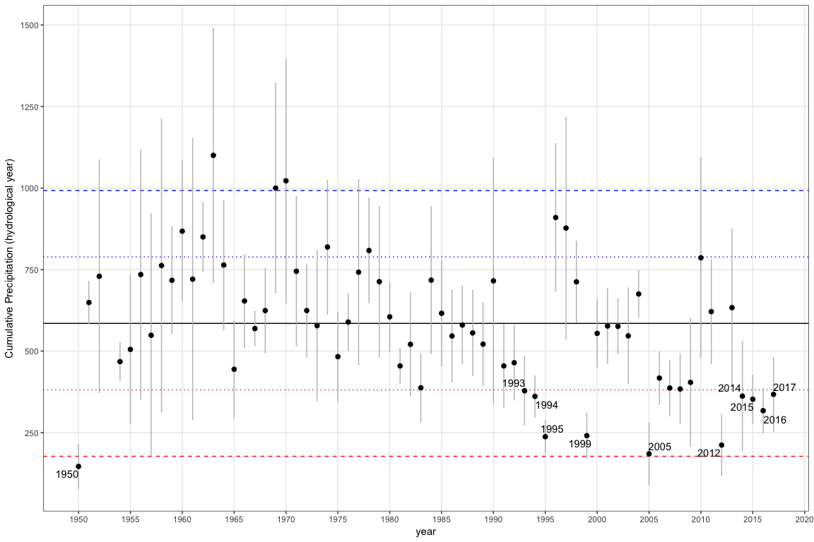

``` r
source(here::here('script/R', 'hydro_year.R'))
```

``` r
ltdf <- read.csv(file=here::here('data_raw/meteo/', 'long_term_data_rediam_data.txt'), header=T, sep=';', dec=',')

ltdf <- ltdf %>% 
  dplyr::select(cod = INDICATIVO, VARIABLE, FECHA, VALOR) %>% 
  dplyr::mutate(fecha = as.Date(FECHA, format='%d/%m/%Y'),
         month = lubridate::month(fecha),
         hmonth = ifelse(month <= 8, month + 4, month -8), 
         hyear = hydro_year(fecha),
         hyear_f = paste0(hyear-1,'-', hyear))


st5514 <- ltdf %>% 
  filter(VARIABLE == 'PM1') %>% 
  filter(cod == '5514') %>% 
  filter(hyear >= 1950) %>% 
  dplyr::select(fecha, month, hmonth, hyear, hyear_f, pre=VALOR)


df <- st5514 %>% 
  group_by(hyear_f) %>% 
  dplyr::mutate(csum = cumsum(pre)) %>% 
  filter(hmonth == 12) %>% 
  dplyr::select(-month, -pre, -fecha) %>% as.data.frame()

meandf <- mean(df$csum)
sddf <- sd(df$csum)


prec_hydrol <- ggplot(df, aes(x=hyear, y=csum)) + 
  geom_point() + theme_bw() + 
  geom_hline(yintercept = meandf) + 
  geom_hline(yintercept = meandf + 2*sddf, color ='blue', linetype = 'dashed') +
  geom_hline(yintercept = meandf - 2*sddf, color ='red', linetype = 'dashed') +
    geom_hline(yintercept = meandf + 1*sddf, color ='blue', linetype = 'dotted') +
  geom_hline(yintercept = meandf  - 1*sddf, color ='red', linetype = 'dotted') +
  scale_x_continuous(breaks=seq(1950,2020, by=5)) +
  geom_text_repel(
    data = subset(df, csum < (meandf - 1*sddf)),
    aes(label = hyear)) +
  ylab('Cumulative prec (hydrological year)')

pdf(here::here('/out/precipitation_2sd', 'prec_hydrol.pdf'), width=12, height = 9)
prec_hydrol
dev.off()
```

    ## quartz_off_screen 
    ##                 2

``` r
df2sd <- df %>% filter(csum < (meandf - 2*sddf)) %>% as.data.frame()
pander(df2sd)
```

<table style="width:46%;">
<colgroup>
<col width="12%" />
<col width="11%" />
<col width="13%" />
<col width="8%" />
</colgroup>
<thead>
<tr class="header">
<th align="center">hmonth</th>
<th align="center">hyear</th>
<th align="center">hyear_f</th>
<th align="center">csum</th>
</tr>
</thead>
<tbody>
<tr class="odd">
<td align="center">12</td>
<td align="center">1995</td>
<td align="center">1994-1995</td>
<td align="center">140.4</td>
</tr>
<tr class="even">
<td align="center">12</td>
<td align="center">2005</td>
<td align="center">2004-2005</td>
<td align="center">147.7</td>
</tr>
</tbody>
</table>

``` r
write.csv(df2sd, here::here("/data/sequias", "prec19502012_2sd.csv"), row.names = FALSE)

df1sd <- df %>% filter(csum < (meandf - 1*sddf)) %>% as.data.frame()
pander(df1sd)
```

<table style="width:46%;">
<colgroup>
<col width="12%" />
<col width="11%" />
<col width="13%" />
<col width="8%" />
</colgroup>
<thead>
<tr class="header">
<th align="center">hmonth</th>
<th align="center">hyear</th>
<th align="center">hyear_f</th>
<th align="center">csum</th>
</tr>
</thead>
<tbody>
<tr class="odd">
<td align="center">12</td>
<td align="center">1953</td>
<td align="center">1952-1953</td>
<td align="center">247.3</td>
</tr>
<tr class="even">
<td align="center">12</td>
<td align="center">1965</td>
<td align="center">1964-1965</td>
<td align="center">242.1</td>
</tr>
<tr class="odd">
<td align="center">12</td>
<td align="center">1989</td>
<td align="center">1988-1989</td>
<td align="center">233.3</td>
</tr>
<tr class="even">
<td align="center">12</td>
<td align="center">1991</td>
<td align="center">1990-1991</td>
<td align="center">259</td>
</tr>
<tr class="odd">
<td align="center">12</td>
<td align="center">1993</td>
<td align="center">1992-1993</td>
<td align="center">232.1</td>
</tr>
<tr class="even">
<td align="center">12</td>
<td align="center">1994</td>
<td align="center">1993-1994</td>
<td align="center">263.4</td>
</tr>
<tr class="odd">
<td align="center">12</td>
<td align="center">1995</td>
<td align="center">1994-1995</td>
<td align="center">140.4</td>
</tr>
<tr class="even">
<td align="center">12</td>
<td align="center">1999</td>
<td align="center">1998-1999</td>
<td align="center">186.7</td>
</tr>
<tr class="odd">
<td align="center">12</td>
<td align="center">2005</td>
<td align="center">2004-2005</td>
<td align="center">147.7</td>
</tr>
<tr class="even">
<td align="center">12</td>
<td align="center">2012</td>
<td align="center">2011-2012</td>
<td align="center">207.8</td>
</tr>
</tbody>
</table>

``` r
write.csv(df1sd, here::here("/data/sequias", "prec19502012_1sd.csv"), row.names = FALSE)
```

PREC + 2sd for more series
--------------------------

``` r
prec_files <- list.files(here::here('data_raw/meteo/prec_subclima/'), pattern="*.csv")


dfpre <- c() 

for (i in prec_files){
  
  auxdf <- read.csv(here::here('data_raw/meteo/prec_subclima', i), header = TRUE, sep=";")
  auxdf$code <- gsub(x=i, pattern = ".csv", replacement = "")
  
  dfpre <- rbind(dfpre, auxdf)
} 
  

dfpre$date <- as.Date(dfpre$date, format = "%d/%m/%Y")


dfpre <- dfpre %>% 
  dplyr::mutate(fecha = as.Date(date, format='%d/%m/%Y'),
         month = lubridate::month(fecha),
         hmonth = ifelse(month <= 8, month + 4, month -8), 
         hyear = hydro_year(fecha),
         hyear_f = paste0(hyear-1,'-', hyear))


# sql to get lat/lon en Linaria
# SELECT 
#   cli_estaciones.id, 
#   cli_estaciones.nombre, 
#   cli_estaciones.codigo, 
#   cli_estaciones.punto_x, 
#   cli_estaciones.punto_y, 
#   cli_estaciones.geometria, 
#   ST_X(ST_Transform (geometria, 4326)) AS "Longitude",
#   ST_Y(ST_Transform (geometria, 4326)) AS "Latitude"
# FROM 
#   public.cli_estaciones 
# WHERE cli_estaciones.codigo IN ('5501','5502','5504','5504A','5505','5509','5509A','5511E',
# '5517','5518','6224','6234','6234E','6236','6242U','6243','6243E','6248','6251','6252','6253',
# '6257','6257I','6280U','6281E','6282','6307','6307X','6308');

stations  <- read.csv(here::here('data_raw/meteo/prec_subclima/mdestaciones', 'estaciones_latlong.csv'), header=TRUE, sep=";")

stations <- stations %>% dplyr::select(nombre, codigo, Longitude, Latitude)


aux <- dfpre %>% 
  group_by(hyear_f, code) %>% 
  dplyr::mutate(csum = cumsum(prec)) %>% 
  filter(hmonth == 12) %>% 
  dplyr::select(-month, -prec, -date, -fecha) %>% as.data.frame()


presn <- aux %>% group_by(hyear) %>% 
     dplyr::summarise(
     csum_mean = mean(csum, na.rm = TRUE),
     csum_sd = sd(csum, na.rm = TRUE), 
     csum_se = csum_sd/sqrt(length(csum_sd)), 
     n = n()) 

meandf <- mean(presn$csum_mean)
sddf <- sd(presn$csum_mean)

prec_hydrol_sn <- ggplot(presn, aes(x=hyear, y=csum_mean)) + 
  geom_hline(yintercept = meandf) + 
  geom_hline(yintercept = meandf + 2*sddf, color ='blue', linetype = 'dashed') +
  geom_hline(yintercept = meandf - 2*sddf, color ='red', linetype = 'dashed') +
  geom_hline(yintercept = meandf + 1*sddf, color ='blue', linetype = 'dotted') +
  geom_hline(yintercept = meandf  - 1*sddf, color ='red', linetype = 'dotted') +
  geom_errorbar(aes(ymin = csum_mean - csum_se, ymax= csum_mean + csum_se), width=.1, colour='gray') +
  geom_point(size=2) + theme_bw() +
  scale_x_continuous(breaks=seq(1950,2020, by=5)) +
  scale_y_continuous(breaks=seq(0,1500, by=250)) +
  geom_text_repel(
    data = subset(presn, csum_mean < (meandf - 1*sddf)),
    aes(label = hyear)) +
  theme(panel.grid.minor = element_blank()) +
  ylab('Cumulative Precipitation (hydrological year)') + xlab('year')
prec_hydrol_sn
```



``` r
pdf(here::here('/out/precipitation_2sd', 'prec_hydrol_sn.pdf'), width=12, height = 7)
prec_hydrol_sn
dev.off()
```

    ## quartz_off_screen 
    ##                 2

Mapa de estaciones
==================

``` r
es <- read.csv(here::here('data_raw/meteo/prec_subclima/mdestaciones', 'estaciones_latlong.csv'), header=TRUE, sep=";")

es <- st_as_sf(x = es, 
               coords = c("Longitude","Latitude"), 
               crs = "+proj=longlat +datum=WGS84")

# mapview(es)
```
