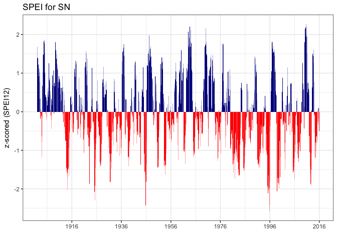

-   [Read and prepare data](#read-and-prepare-data)
-   [Plot](#plot)
-   [Analysis](#analysis)
    -   [Computo de indicadores](#computo-de-indicadores)

``` r
library("here")
```

    ## here() starts at /Users/ajpeluLap/Dropbox/phd/phd_repos/qpyr_dendro

``` r
library("dplyr")
```

    ## 
    ## Attaching package: 'dplyr'

    ## The following objects are masked from 'package:stats':
    ## 
    ##     filter, lag

    ## The following objects are masked from 'package:base':
    ## 
    ##     intersect, setdiff, setequal, union

``` r
library("tidyverse")
```

    ## Loading tidyverse: ggplot2
    ## Loading tidyverse: tibble
    ## Loading tidyverse: tidyr
    ## Loading tidyverse: readr
    ## Loading tidyverse: purrr

    ## Conflicts with tidy packages ----------------------------------------------

    ## filter(): dplyr, stats
    ## lag():    dplyr, stats

``` r
library("stringr")
library("pander")
library("magrittr")
```

    ## 
    ## Attaching package: 'magrittr'

    ## The following object is masked from 'package:purrr':
    ## 
    ##     set_names

    ## The following object is masked from 'package:tidyr':
    ## 
    ##     extract

``` r
# machine <- 'ajpeluLap'
# machine <- 'ajpelu'
```

Read and prepare data
---------------------

``` r
# Get file names
myfiles <- list.files(path = here("data_raw/spei/spei_longterm"), pattern = "\\.csv$")

mydf <- data.frame() 

for (j in myfiles){ 
  aux <- read.csv(file=here("data_raw/spei/spei_longterm", j), header = TRUE, sep = ',')
  
  # Remove csv and get name 
  name_aux <- str_replace(j, ".csv", "") 
  
  # Get lat long
  latlong <- str_replace(name_aux, "spei_", "")
  mylong <- as.numeric(str_split_fixed(latlong, "_", 2))[1]
  mylat <- as.numeric(str_split_fixed(latlong, "_", 2))[2]
  
  # Store lat and long 
  aux$lat <- mylat
  aux$long <- mylong 
  
  # year and month 
  aux$month <- rep(1:12, 115)
  
  auxy <- c()
  years <- c() 
  for (j in 1901:2015) { 
    auxy <- as.data.frame(rep(j,12))
    years <- rbind(years, auxy)
    } 
  names(years) <- 'year'
  
  aux <- cbind(aux,years)
  
  # join all df 
  mydf <- rbind(mydf, aux)
}


# Convert to date  
mydf <- mydf %>% mutate(date = sprintf("%d-%02d", year, month),
                        date = as.Date(paste0(date, '-01'), format="%Y-%m-%d"))
```

``` r
speidf <- mydf %>% dplyr::select(SPEI06,SPEI12,SPEI24,month, year, date) %>% 
  group_by(year,month, date) %>%
  summarise_at(vars(SPEI06,SPEI12,SPEI24), funs(mean,sd,se=sd(.)/sqrt(n()))) %>% 
  as.data.frame() 
```

Plot
====

``` r
speiPlot <- function(df, vi, mytitle, year_scaleX){
  require(dplyr)
  require(scales)

  # Select variable of interest 
  dfs <- df %>% dplyr::select(year, month, date, starts_with(vi))
  
  # Rename variables 
  dfs <- dfs %>% rename_all(~sub(paste0(vi,'_'), '',.x))
  # Create variable pos and neg 
  dfs <- dfs %>% mutate(signo = ifelse(mean > 0, "pos", "neg"))
  
  # Plot  
  p <- ggplot(dfs, aes(x = date, y = mean, fill = signo)) + 
    geom_bar(stat = "identity") +
    scale_fill_manual(values = c("pos" = "darkblue", "neg" = "red")) +
    theme_bw()  + 
    labs(title= mytitle, x= '', y = paste0('z-scored (',vi,')')) +
    theme(legend.position = "none")
  
  # Date Scale in X 
  if (missing(year_scaleX)){
    p
    } else { 
    year_interval <- paste0(year_scaleX," year")
    p <- p + scale_x_date(date_breaks = year_interval, date_labels = "%Y")
    }

  return(p)
}
```

``` r
speiPlot(speidf, vi = 'SPEI12', mytitle = "SPEI for SN", year_scaleX = 20)
```

    ## Loading required package: scales

    ## 
    ## Attaching package: 'scales'

    ## The following object is masked from 'package:purrr':
    ## 
    ##     discard

    ## The following object is masked from 'package:readr':
    ## 
    ##     col_factor

    ## Warning: Removed 11 rows containing missing values (position_stack).



Analysis
========

Computo de indicadores
----------------------

Vamos a calcular para el promedio espacial de la serie (valores medios de los pixeles), los eventos de sequía. El sesgo de la agregación espacial de estos datos puede ser un problema a la hora de comparar entre regiones, pero puede corregirse ((<span class="citeproc-not-found" data-reference-id="Spinoni2015b">**???**</span>)). No obstante en nuestro caso no vamos a realizar comparaciones entre regiones, por lo que utilizaremos la agregación espacial (un promedio) para dar una visión general de la sequía en Sierra Nevada.

-   Hemos utilizado una categorización mixta, así para valores de sequía hemos seguido las categorías propuestas por (<span class="citeproc-not-found" data-reference-id="Agnew2000">**???**</span>) y para los valores positivos, la clasificación de (<span class="citeproc-not-found" data-reference-id="Mckee1993">**???**</span>)
-   Un evento de sequía comienza cuando el valor del índice está por debajo de un umbral (Páscoa et al. 2017) (en este caso &lt; -0.84 moderate, &lt; -1.28 severe y &lt; -1.65 extreme)
-   Utilizaremos la escala de 6 y 12 de SPEI
-   Computaremos:

    -   Duración del evento de sequía (*drought duration*, *dd*): número de meses consecutivos con el valor de spei por debajo de un umbral.
    -   Intensidad (*drought intensity*, *di*): valor medio del spei durante el periodo de sequía.
    -   Severidad (*drought severity*, *ds*): suma de los valores de spei (en valores absolutos) durante el periodo de sequía
    -   Inicio (*start*, *dstart*): mes de inicio del periodo de sequía
    -   Fin (*end*, *dend*): mes de fin del periodo de sequía
    -   Frecuencia de sequías (*drought frequency*, *df*): número de eventos de sequía por década.

Consideramos un evento cuando se dan las condiciones en al menos dos meses consecutivos (ver (<span class="citeproc-not-found" data-reference-id="Spinoni2014">**???**</span>, Páscoa et al. 2017)). Para mas info ver (<span class="citeproc-not-found" data-reference-id="Spinoni2014">**???**</span>, Spinoni et al. 2015, Páscoa et al. 2017)

``` r
droughtIndicators <- function(df, vname, threshold){
  require(dplyr)
  require(magrittr)

outlist <- c()

# https://github.com/tidyverse/dplyr/issues/1661
 
# Compute months under threshold 
out <- df %>% mutate(
  is_drought = ifelse(
    .[[vname]] < threshold & lead(.[[vname]] < threshold), 1, 0))

# Identified the different events and numbered them
# Compute lenght of drought events

out2 <- out %>% 
  group_by(index_events = rle(is_drought) %>% extract2("lengths") %>% rep(seq_along(.), .)) %>% 
  mutate(drought_duration = sum(is_drought)) %>% 
  as.data.frame()

# Filter events with drought duration > 1 
out3 <- out2 %>% filter(drought_duration > 1) %>% as.data.frame()

# Compute several indicators (drought assessments) 
da <- out3 %>% group_by(index_events) %>% 
  summarise(d_duration = unique(drought_duration),
            d_intensity = mean(spei, na.rm=TRUE),
            d_severity = sum(abs(spei), na.rm=TRUE),
            lowest_spei = min(spei),
            month_peak = month[which.min(spei)], 
            minyear = min(year),
            maxyear = max(year)) %>%
  as.data.frame()

outlist$data <- out2
outlist$drought_events <- out3
outlist$drought_assessment <- da 

return(outlist) 
} 
```

``` r
# Compute for all pixels (mean values of SN) only for scales 6 and 12 

spei6avg <- speidf %>% dplyr::select(year, month, date, spei = SPEI06_mean) 
spei12avg <- speidf %>% dplyr::select(year, month, date, spei = SPEI12_mean)

da6_mod <- droughtIndicators(spei6avg, threshold = -0.84, vname = 'spei') 
da12_mod <- droughtIndicators(spei12avg, threshold = -0.84, vname = 'spei') 

da6_sev <- droughtIndicators(spei6avg, threshold = -1.28, vname = 'spei') 
da12_sev <- droughtIndicators(spei12avg, threshold = -1.28, vname = 'spei') 

da6_ext <- droughtIndicators(spei6avg, threshold = -1.65, vname = 'spei') 
da12_ext <- droughtIndicators(spei12avg, threshold = -1.65, vname = 'spei') 


# Join all moderate and compute decade (# https://stackoverflow.com/questions/35352914/floor-a-year-to-the-decade-in-r 

mod <- rbind(da6_mod$drought_assessment %>% mutate(variable= 'spei6'),
      da12_mod$drought_assessment %>% mutate(variable= 'spei12')) %>% 
  mutate(cat = 'moderate', decade = (minyear %/% 10) * 10)

sev<- rbind(da6_sev$drought_assessment %>% mutate(variable= 'spei6'),
      da12_sev$drought_assessment %>% mutate(variable= 'spei12')) %>% 
  mutate(cat = 'severe', decade = (minyear %/% 10) * 10)

ext <- rbind(da6_ext$drought_assessment %>% mutate(variable= 'spei6'),
      da12_ext$drought_assessment %>% mutate(variable= 'spei12')) %>% 
  mutate(cat = 'extreme', decade = (minyear %/% 10) * 10)


# Compute DF (*drought frequency*)

dfmod <- mod %>% group_by(variable, decade, cat) %>% summarize(df = n())
dfsev <- sev %>% group_by(variable, decade, cat) %>% summarize(df = n())
dfext <- ext %>% group_by(variable, decade, cat) %>% summarize(df = n())

df <- dfmod %>% bind_rows(dfsev, dfext)
```

Utilizar SPEI 12

``` r
sev12 <- sev %>% filter(variable == "spei12") %>% arrange(desc(d_duration)) %>% 
  dplyr::select(-index_events, -cat, -decade, -variable)

write.csv(sev12, file=here::here('data/sequias', 'severe_spei12.csv'), row.names=FALSE)

pander(sev12)
```

<table>
<caption>Table continues below</caption>
<colgroup>
<col width="17%" />
<col width="18%" />
<col width="17%" />
<col width="18%" />
<col width="17%" />
<col width="11%" />
</colgroup>
<thead>
<tr class="header">
<th align="center">d_duration</th>
<th align="center">d_intensity</th>
<th align="center">d_severity</th>
<th align="center">lowest_spei</th>
<th align="center">month_peak</th>
<th align="center">minyear</th>
</tr>
</thead>
<tbody>
<tr class="odd">
<td align="center">11</td>
<td align="center">-1.581</td>
<td align="center">17.39</td>
<td align="center">-2.024</td>
<td align="center">3</td>
<td align="center">1913</td>
</tr>
<tr class="even">
<td align="center">11</td>
<td align="center">-1.957</td>
<td align="center">21.52</td>
<td align="center">-2.585</td>
<td align="center">11</td>
<td align="center">1995</td>
</tr>
<tr class="odd">
<td align="center">9</td>
<td align="center">-1.823</td>
<td align="center">16.41</td>
<td align="center">-2.427</td>
<td align="center">11</td>
<td align="center">1945</td>
</tr>
<tr class="even">
<td align="center">9</td>
<td align="center">-1.764</td>
<td align="center">15.88</td>
<td align="center">-2.056</td>
<td align="center">12</td>
<td align="center">1998</td>
</tr>
<tr class="odd">
<td align="center">8</td>
<td align="center">-1.482</td>
<td align="center">11.86</td>
<td align="center">-1.654</td>
<td align="center">7</td>
<td align="center">1983</td>
</tr>
<tr class="even">
<td align="center">6</td>
<td align="center">-1.728</td>
<td align="center">10.37</td>
<td align="center">-1.906</td>
<td align="center">8</td>
<td align="center">2012</td>
</tr>
<tr class="odd">
<td align="center">5</td>
<td align="center">-1.905</td>
<td align="center">9.527</td>
<td align="center">-2.3</td>
<td align="center">4</td>
<td align="center">1925</td>
</tr>
<tr class="even">
<td align="center">5</td>
<td align="center">-1.493</td>
<td align="center">7.463</td>
<td align="center">-1.537</td>
<td align="center">6</td>
<td align="center">1985</td>
</tr>
<tr class="odd">
<td align="center">5</td>
<td align="center">-1.385</td>
<td align="center">6.926</td>
<td align="center">-1.444</td>
<td align="center">7</td>
<td align="center">1991</td>
</tr>
<tr class="even">
<td align="center">5</td>
<td align="center">-1.522</td>
<td align="center">7.611</td>
<td align="center">-1.571</td>
<td align="center">6</td>
<td align="center">2005</td>
</tr>
<tr class="odd">
<td align="center">4</td>
<td align="center">-1.363</td>
<td align="center">5.453</td>
<td align="center">-1.441</td>
<td align="center">5</td>
<td align="center">1927</td>
</tr>
<tr class="even">
<td align="center">4</td>
<td align="center">-1.714</td>
<td align="center">6.855</td>
<td align="center">-1.833</td>
<td align="center">7</td>
<td align="center">1931</td>
</tr>
<tr class="odd">
<td align="center">2</td>
<td align="center">-1.525</td>
<td align="center">3.05</td>
<td align="center">-1.63</td>
<td align="center">9</td>
<td align="center">1953</td>
</tr>
</tbody>
</table>

<table style="width:12%;">
<colgroup>
<col width="12%" />
</colgroup>
<thead>
<tr class="header">
<th align="center">maxyear</th>
</tr>
</thead>
<tbody>
<tr class="odd">
<td align="center">1914</td>
</tr>
<tr class="even">
<td align="center">1995</td>
</tr>
<tr class="odd">
<td align="center">1946</td>
</tr>
<tr class="even">
<td align="center">1999</td>
</tr>
<tr class="odd">
<td align="center">1983</td>
</tr>
<tr class="even">
<td align="center">2012</td>
</tr>
<tr class="odd">
<td align="center">1925</td>
</tr>
<tr class="even">
<td align="center">1985</td>
</tr>
<tr class="odd">
<td align="center">1991</td>
</tr>
<tr class="even">
<td align="center">2005</td>
</tr>
<tr class="odd">
<td align="center">1927</td>
</tr>
<tr class="even">
<td align="center">1931</td>
</tr>
<tr class="odd">
<td align="center">1953</td>
</tr>
</tbody>
</table>

Páscoa, P., C. Gouveia, A. Russo, and R. Trigo. 2017. Drought trends in the iberian peninsula over the last 112 years. Advances in Meteorology:ID4653126.

Spinoni, J., G. Naumann, J. V. Vogt, and P. Barbosa. 2015. The biggest drought events in europe from 1950 to 2012. Journal of Hydrology: Regional Studies 3:509–524.
