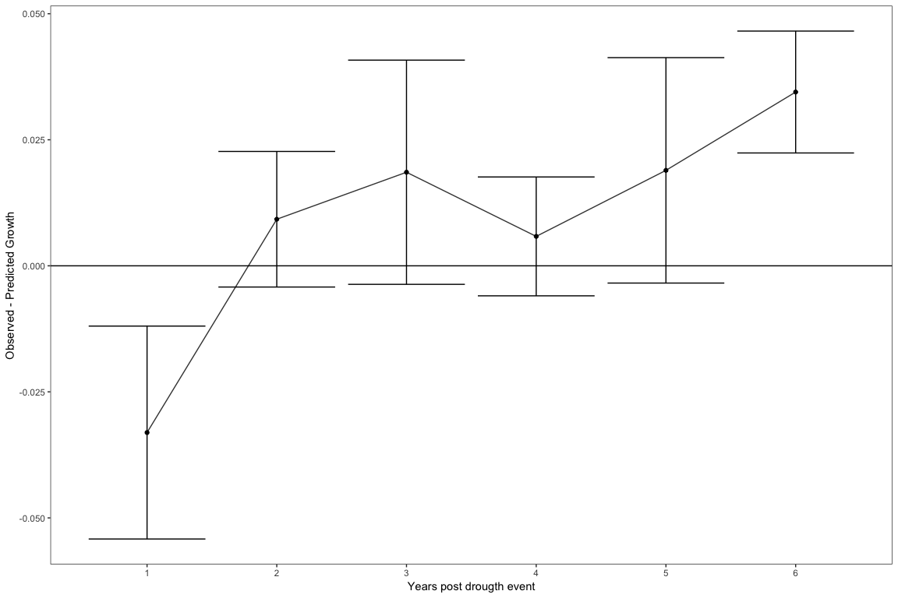
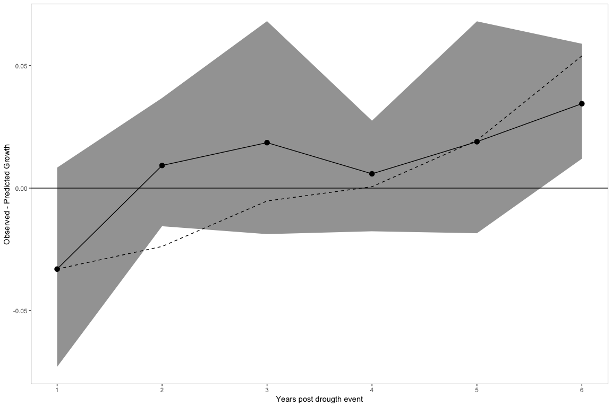
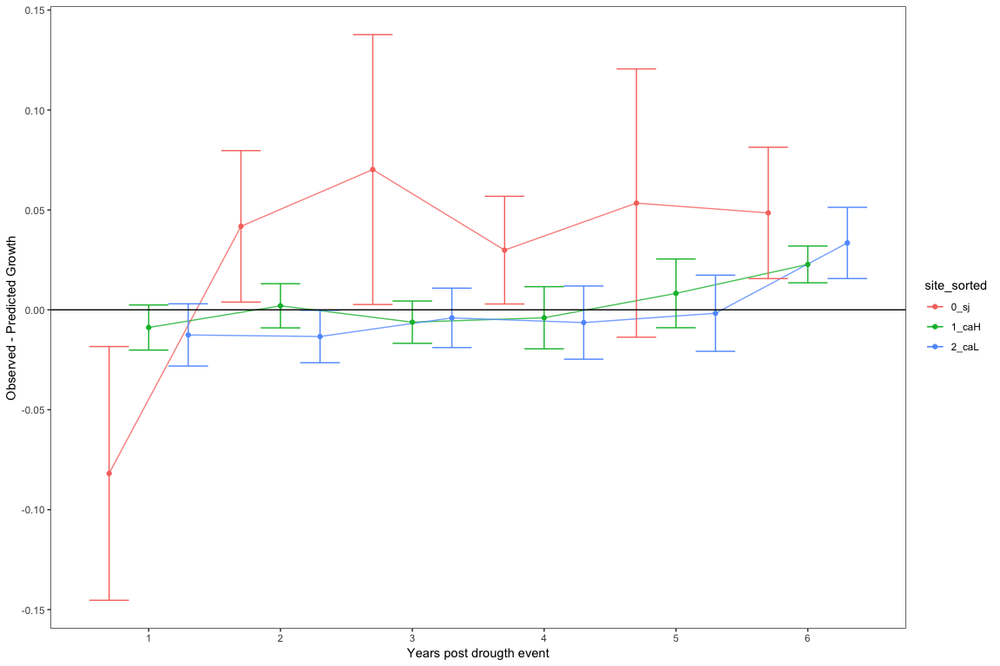
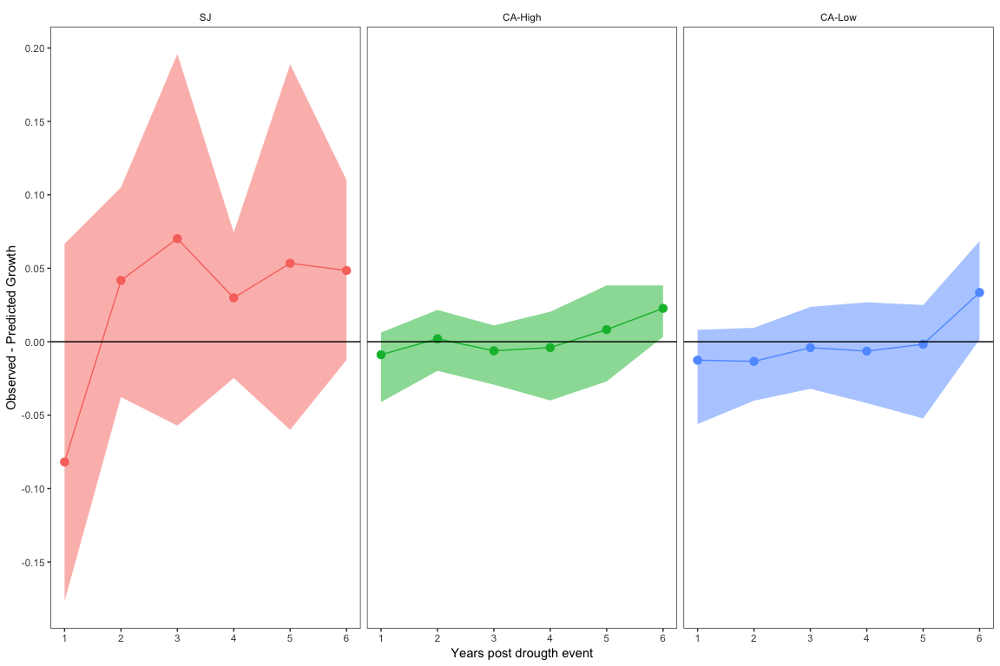
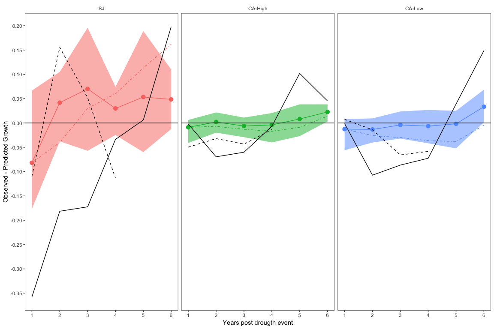

``` r
library("tidyverse")
library("stringr")
library("dplR")
library("knitr")
library("here")
library("pander")
# library("rms")
library("magrittr")
library("lemon")
```

  - Observed post-drougth growth –\> detrended-only chronologies

  - Predicted post-drought growth –\> prewithened tree growth

  - utilizamos datos procedentes de analysis\_splines.Rmd

  - Los datos de la chrono standard corresponden con la detrended (obs)
    mientras que la residual es la prewithened

<!-- end list -->

``` r
# Datos de chronos 
pre <- read.csv(here::here("data/cronos_medias", "cronos_sites_rwi.csv"), header = TRUE, sep = ',')

# Datos de sequia 
# peores sequias 
dy <- read.csv(file=here::here('data/sequias', 'severe_spei12.csv'), header=TRUE)
dy <- dy %>% arrange(desc(d_duration))
# solamente aquellos mayor de 2 meses 
dys <- dy %>% 
  filter(d_duration > 2) %>%  
  mutate(year = ifelse(minyear == maxyear, 
                       minyear, 
                       paste0(minyear, '-', maxyear))) %>% 
  dplyr::select(-minyear, -cat, -month_peak) %>% 
  as.data.frame() 


# LEGACY EFFECTs 

# drougth_years 
event <- dys$maxyear
out <- c() 

for (i in event){ 
  
  # Years post Drought 
  lag_years <- seq(from = i, to = i + 6, by =1)
  
  # Filter data 
  aux <- pre %>% 
    filter(year %in% lag_years) %>% 
    mutate(ypd = year - i)
  
  # Combined data 
  out <- rbind(out, aux)
  }


# Computed OBS - PRED and filter by year 
legacy <- out %>% 
  filter(ypd != 0) %>% 
  mutate(lag = std - res) 
```

## Legacy effects for all Q. pyrenaica forests

``` r
all_legacy <- legacy %>% group_by(ypd) %>%
  summarise(mean=mean(lag, na.rm=T),
            sd = sd(lag, na.rm=T),
            se = sd/sqrt(length(lag))) 

po <- position_dodge(0.9)
all_legacy %>% 
  ggplot(aes(x = ypd, y = mean)) + 
  geom_line(position = po, alpha=0.8) + 
  geom_point(position = po) + 
  geom_errorbar(aes(ymin = mean - se, ymax = mean + se), position = po) +
  theme_bw() + 
  geom_hline(yintercept = 0, colour = 'black') + 
  theme(panel.grid = element_blank()) + 
  scale_x_continuous("Years post drougth event", breaks=c(1:6)) + 
  scale_y_continuous("Observed - Predicted Growth")
```

<!-- -->

``` r
# Boostrap Confidence Intervals 
set.seed(1234)

all_legacy_nest <- legacy %>% 
  group_by(ypd) %>% 
  nest() 

# Boostrap the mean 
## boot_mean
boot_mean <- function(d, i) {
    mean(d[i])
}


## Use purrr::map to add another column to legacy_nest, in which each row contains the object returned by mapping the boot::boot function (which is responsible for applying the bootstrap_mean function) over the tibbles stored in each row of the “data” list-column.

all_legacy_nest %<>% 
  dplyr::mutate(booted = purrr::map(.x = data, # The list-column containing <S3: tibble>
                                      ~ boot::boot(data = .x$lag, # The <S3 tibble> column being sampled
                                                 statistic = boot_mean, # The user-defined function
                                                 R = 10000, # The number of replicates
                                                 stype = "i")))

# compute the Confidence interval 
all_legacy_nest %<>%
    dplyr::mutate(booted_ci = purrr::map(.x = booted, # The list-column containing <S3: boot> objects
                                         ~ boot::boot.ci(.x,
                                                         conf = 0.95, # Interval width
                                                         type = "bca")))  # Calculate a BCa interval
# Tidy the CI 
all_legacy_CI <- all_legacy_nest %>% 
  dplyr::mutate(statistic = purrr::map(.x = booted_ci, # The list-column containing <S3 bootci> objects
                                         ~ .x$t0), # The point estimate
                  lower_ci = purrr::map(.x = booted_ci,
                                        ~ .x$bca[[4]]), # The value of the lower 2.5% limit
                  upper_ci = purrr::map(.x = booted_ci,
                                        ~ .x$bca[[5]])) %>% # The value of teh upper 97.5% limit
    # Drop the list-columns (no longer needed)
    dplyr::select(-data, -booted, -booted_ci) %>%
    # Unnest the dataframe
    tidyr::unnest()

# Join to mean values
all_legacy %<>% inner_join(all_legacy_CI, by="ypd") 


g <- all_legacy %>% ggplot(aes(x = ypd, y = mean)) + 
  geom_ribbon(aes(ymin = lower_ci, ymax = upper_ci), alpha=.5) + 
  geom_line() + 
  geom_point(size=3) + 
  theme_bw() + 
  geom_hline(yintercept = 0, colour = 'black') + 
  theme(panel.grid = element_blank(), 
        strip.background = element_blank(), 
        legend.position = "none") + 
  scale_x_continuous("Years post drougth event", breaks=c(1:6)) + 
  scale_y_continuous("Observed - Predicted Growth", breaks=seq(-0.2, 0.2, by=0.05))
g
```

<!-- -->

## Legacy effects for site

``` r
# Get summary statistics and  plot 

mlegacy <- legacy %>% group_by(site_sorted, ypd) %>%
  summarise(mean=mean(lag, na.rm=T),
            sd = sd(lag, na.rm=T),
            se = sd/sqrt(length(lag))) 

po <- position_dodge(0.9)
mlegacy %>% ggplot(aes(x = ypd, y = mean, colour = site_sorted)) + 
  geom_line(position = po, alpha=0.8) + 
  geom_point(position = po) + 
  geom_errorbar(aes(ymin=mean - se, ymax=mean + se), position = po) +
  theme_bw() + 
  geom_hline(yintercept = 0, colour = 'black') + 
  theme(panel.grid = element_blank()) + 
  scale_x_continuous("Years post drougth event", breaks=c(1:6)) + 
  scale_y_continuous("Observed - Predicted Growth")
```

<!-- -->

``` r
# Boostrap Confidence Intervals 
set.seed(1234)

# Nest the data 
legacy_nest <- legacy %>% 
  group_by(site_sorted, ypd) %>% 
  nest() 

# Boostrap the mean 
## boot_mean
boot_mean <- function(d, i) {
    mean(d[i])
}

## Use purrr::map to add another column to legacy_nest, in which each row contains the object returned by mapping the boot::boot function (which is responsible for applying the bootstrap_mean function) over the tibbles stored in each row of the “data” list-column.

legacy_nest %<>% 
  dplyr::mutate(booted = purrr::map(.x = data, # The list-column containing <S3: tibble>
                                      ~ boot::boot(data = .x$lag, # The <S3 tibble> column being sampled
                                                 statistic = boot_mean, # The user-defined function
                                                 R = 10000, # The number of replicates
                                                 stype = "i")))

# compute the Confidence interval 
legacy_nest %<>%
    dplyr::mutate(booted_ci = purrr::map(.x = booted, # The list-column containing <S3: boot> objects
                                         ~ boot::boot.ci(.x,
                                                         conf = 0.95, # Interval width
                                                         type = "bca")))  # Calculate a BCa interval


# Tidy the CI 
legacy_CI <- legacy_nest %>% 
  dplyr::mutate(statistic = purrr::map(.x = booted_ci, # The list-column containing <S3 bootci> objects
                                         ~ .x$t0), # The point estimate
                  lower_ci = purrr::map(.x = booted_ci,
                                        ~ .x$bca[[4]]), # The value of the lower 2.5% limit
                  upper_ci = purrr::map(.x = booted_ci,
                                        ~ .x$bca[[5]])) %>% # The value of teh upper 97.5% limit
    # Drop the list-columns (no longer needed)
    dplyr::select(-data, -booted, -booted_ci) %>%
    # Unnest the dataframe
    tidyr::unnest()


# Join to mean values
mlegacy %<>% inner_join(legacy_CI, by=c("site_sorted", "ypd")) %>% 
  rename(site = site_sorted)

label_site <- c("0_sj" = "SJ",
                "1_caH" = "CA-High",
                "2_caL" = "CA-Low")


p <- mlegacy %>% ggplot(aes(x = ypd, y = mean)) + 
  geom_ribbon(aes(ymin = lower_ci, ymax = upper_ci, fill=site), alpha=.5) + 
  geom_line(aes(colour=site)) + 
  geom_point(aes(colour=site), size=3) + 
  facet_wrap(~site, labeller = as_labeller(label_site)) + 
  # geom_errorbar(aes(ymin=mean - sd, ymax=mean + sd), position = po) +
  theme_bw() + 
  geom_hline(yintercept = 0, colour = 'black') + 
  theme(panel.grid = element_blank(), 
        strip.background = element_blank(), 
        legend.position = "none") + 
  scale_x_continuous("Years post drougth event", breaks=c(1:6)) + 
  scale_y_continuous("Observed - Predicted Growth", breaks=seq(-0.2, 0.2, by=0.05))
p
```

<!-- -->

``` r
pdf(here::here('/out/legacy', 'legacy_all_droughts.pdf'), width=8, height = 5)
p
dev.off()
```

    ## quartz_off_screen 
    ##                 2

``` r
# Filter 
l2005 <- legacy %>%
  filter(year %in% seq(2005+1, 2005+6, by=1)) %>% 
  dplyr::select(-site) %>% rename(site = site_sorted)
l2012 <- legacy %>% 
  filter(year %in% seq(2012+1, 2012+6, by=1)) %>% 
  dplyr::select(-site) %>% rename(site = site_sorted)


p1 <- mlegacy %>% ggplot(aes(x = ypd, y = mean)) + 
  geom_ribbon(aes(ymin = lower_ci, ymax = upper_ci, fill=site), alpha=.5) + 
  geom_line(aes(colour=site)) + 
  geom_point(aes(colour=site), size=3) + 
  geom_line(data = l2005, aes(x = ypd, y =  lag)) + 
  geom_line(data = l2012, aes(x = ypd, y =  lag), linetype = "dashed") + 
  facet_wrap(~site, labeller = as_labeller(label_site)) + 
  theme_bw() + 
  geom_hline(yintercept = 0, colour = 'black') + 
  theme(panel.grid = element_blank(), 
        strip.background = element_blank(), 
        legend.position = "none") + 
  scale_x_continuous("Years post drougth event", breaks=c(1:6)) + 
  scale_y_continuous("Observed - Predicted Growth", breaks=seq(-0.4, 0.2, by=0.05))

p1 
```

<!-- -->

``` r
pdf(here::here('/out/legacy', 'legacy_all_droughts_2005_2012.pdf'), width=8, height = 5)
p1
dev.off()
```

    ## quartz_off_screen 
    ##                 2

``` r
ylegacy <- legacy %>% 
  filter(!(year %in% seq(2005+1, 2005+6, by=1))) %>% 
  filter(!(year %in% seq(2012+1, 2012+6, by=1))) %>% 
  group_by(ypd) %>%
  summarise(mean=mean(lag, na.rm=T),
            sd = sd(lag, na.rm=T),
            se = sd/sqrt(length(lag))) %>% 
  mutate(d = "all")


ly2005 <- legacy %>%
  filter(year %in% seq(2005+1, 2005+6, by=1)) %>% 
  dplyr::select(-site) %>% rename(site = site_sorted) %>% 
  group_by(ypd) %>%
  summarise(mean=mean(lag, na.rm=T),
            sd = sd(lag, na.rm=T),
            se = sd/sqrt(length(lag))) %>% 
  mutate(d = "2005")

ly2012 <- legacy %>%
  filter(year %in% seq(2012+1, 2012+6, by=1)) %>% 
  dplyr::select(-site) %>% rename(site = site_sorted) %>% 
  group_by(ypd) %>%
  summarise(mean=mean(lag, na.rm=T),
            sd = sd(lag, na.rm=T),
            se = sd/sqrt(length(lag))) %>% 
  mutate(d = "2012")


ly <- rbind(ylegacy, ly2005, ly2012)


p2 <- ly %>% ggplot(aes(x = ypd, y = mean)) + 
  # geom_ribbon(aes(ymin = lower_ci, ymax = upper_ci, fill=site), alpha=.5) + 
  geom_line(aes(colour=d)) + 
  geom_point(aes(colour=d), size=3) + 
  geom_errorbar(data = (dplyr::filter(ly, d == "all") %>% as.data.frame()), 
                aes(ymin=mean - se, ymax = mean + se, colour = d), width = 0.2) + 
  theme_bw() + 
  geom_hline(yintercept = 0, colour = 'black') + 
  theme(panel.grid = element_blank(), 
        strip.background = element_blank()) +  
  scale_x_continuous("Years post drougth event", breaks=c(1:6)) + 
  scale_y_continuous("Observed - Predicted Growth", breaks=seq(-0.4, 0.2, by=0.05))

pdf(here::here('/out/legacy', 'legacy_droughts_2005_2012.pdf'), width=8, height = 5)
p2
dev.off()
```

    ## quartz_off_screen 
    ##                 2
