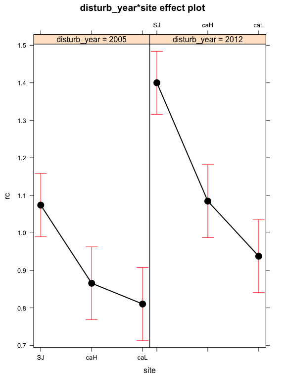

Resilience ANOVAs
=================

-   Partimos de los datos obtenidos de resiliencia para los RWI ([./analysis/chronos/analysis\_splines.md]('./analysis/chronos/analysis_splines.md)) )

``` r
machine <- 'ajpelu'
# machine <- 'ajpeluLap'
di <- paste0('/Users/', machine, '/Dropbox/phd/phd_repos/qpyr_dendro/', sep = '')

# Read diameters data
re <- read.csv(file=paste0(di, 'data/resilience/resilience_rwi.csv'), header=TRUE, sep=',')
```

Asumptions
----------

-   Explorar si se cumplen los supuestos de normalidad y homocedasticidad. Tenemos que comprobar que cada uno de los grupos son normales (1995,2005,2012; site: SJ, CaH, CaL; e interactions)

Normalidad
----------

``` r
normtestA <- rbind(nrcA, nrtA, nrsA, nrrsA) 
normtestA %>% pander()
```

<table style="width:58%;">
<colgroup>
<col width="20%" />
<col width="16%" />
<col width="13%" />
<col width="6%" />
</colgroup>
<thead>
<tr class="header">
<th align="center">disturb_year</th>
<th align="center">statistic</th>
<th align="center">p_value</th>
<th align="center">var</th>
</tr>
</thead>
<tbody>
<tr class="odd">
<td align="center">1995</td>
<td align="center">0.7653</td>
<td align="center">0</td>
<td align="center">rc</td>
</tr>
<tr class="even">
<td align="center">2005</td>
<td align="center">0.9625</td>
<td align="center">0.1126</td>
<td align="center">rc</td>
</tr>
<tr class="odd">
<td align="center">2012</td>
<td align="center">0.9435</td>
<td align="center">0.01861</td>
<td align="center">rc</td>
</tr>
<tr class="even">
<td align="center">1995</td>
<td align="center">0.9857</td>
<td align="center">0.799</td>
<td align="center">rt</td>
</tr>
<tr class="odd">
<td align="center">2005</td>
<td align="center">0.9376</td>
<td align="center">0.01082</td>
<td align="center">rt</td>
</tr>
<tr class="even">
<td align="center">2012</td>
<td align="center">0.9836</td>
<td align="center">0.7114</td>
<td align="center">rt</td>
</tr>
<tr class="odd">
<td align="center">1995</td>
<td align="center">0.8233</td>
<td align="center">0</td>
<td align="center">rs</td>
</tr>
<tr class="even">
<td align="center">2005</td>
<td align="center">0.9683</td>
<td align="center">0.1964</td>
<td align="center">rs</td>
</tr>
<tr class="odd">
<td align="center">2012</td>
<td align="center">0.9264</td>
<td align="center">0.00403</td>
<td align="center">rs</td>
</tr>
<tr class="even">
<td align="center">1995</td>
<td align="center">0.8238</td>
<td align="center">0</td>
<td align="center">rrs</td>
</tr>
<tr class="odd">
<td align="center">2005</td>
<td align="center">0.9568</td>
<td align="center">0.06517</td>
<td align="center">rrs</td>
</tr>
<tr class="even">
<td align="center">2012</td>
<td align="center">0.9741</td>
<td align="center">0.3383</td>
<td align="center">rrs</td>
</tr>
</tbody>
</table>

``` r
write.csv(normtestA, 
          file=paste0(di, '/out/anovas_resilience/rwi/normo_disturb_year.csv'), row.names = F)
```

``` r
normtestB <- rbind(nrcB, nrtB, nrsB, nrrsB) 
normtestB %>% pander()
```

<table style="width:47%;">
<colgroup>
<col width="9%" />
<col width="16%" />
<col width="13%" />
<col width="6%" />
</colgroup>
<thead>
<tr class="header">
<th align="center">site</th>
<th align="center">statistic</th>
<th align="center">p_value</th>
<th align="center">var</th>
</tr>
</thead>
<tbody>
<tr class="odd">
<td align="center">SJ</td>
<td align="center">0.7237</td>
<td align="center">0</td>
<td align="center">rc</td>
</tr>
<tr class="even">
<td align="center">caH</td>
<td align="center">0.8259</td>
<td align="center">1e-05</td>
<td align="center">rc</td>
</tr>
<tr class="odd">
<td align="center">caL</td>
<td align="center">0.8463</td>
<td align="center">3e-05</td>
<td align="center">rc</td>
</tr>
<tr class="even">
<td align="center">SJ</td>
<td align="center">0.9748</td>
<td align="center">0.2484</td>
<td align="center">rt</td>
</tr>
<tr class="odd">
<td align="center">caH</td>
<td align="center">0.9791</td>
<td align="center">0.585</td>
<td align="center">rt</td>
</tr>
<tr class="even">
<td align="center">caL</td>
<td align="center">0.9497</td>
<td align="center">0.04967</td>
<td align="center">rt</td>
</tr>
<tr class="odd">
<td align="center">SJ</td>
<td align="center">0.8871</td>
<td align="center">5e-05</td>
<td align="center">rs</td>
</tr>
<tr class="even">
<td align="center">caH</td>
<td align="center">0.8214</td>
<td align="center">1e-05</td>
<td align="center">rs</td>
</tr>
<tr class="odd">
<td align="center">caL</td>
<td align="center">0.9887</td>
<td align="center">0.9354</td>
<td align="center">rs</td>
</tr>
<tr class="even">
<td align="center">SJ</td>
<td align="center">0.8034</td>
<td align="center">0</td>
<td align="center">rrs</td>
</tr>
<tr class="odd">
<td align="center">caH</td>
<td align="center">0.9102</td>
<td align="center">0.00199</td>
<td align="center">rrs</td>
</tr>
<tr class="even">
<td align="center">caL</td>
<td align="center">0.9286</td>
<td align="center">0.00839</td>
<td align="center">rrs</td>
</tr>
</tbody>
</table>

``` r
write.csv(normtestB, 
          file=paste0(di, '/out/anovas_resilience/rwi/normo_site.csv'), row.names = F)
```

``` r
normtestAB <- rbind(nrcAB, nrtAB, nrsAB, nrrsAB) 
normtestAB %>% pander()
```

<table style="width:68%;">
<colgroup>
<col width="20%" />
<col width="9%" />
<col width="16%" />
<col width="13%" />
<col width="6%" />
</colgroup>
<thead>
<tr class="header">
<th align="center">disturb_year</th>
<th align="center">site</th>
<th align="center">statistic</th>
<th align="center">p_value</th>
<th align="center">var</th>
</tr>
</thead>
<tbody>
<tr class="odd">
<td align="center">1995</td>
<td align="center">SJ</td>
<td align="center">0.8093</td>
<td align="center">0.00119</td>
<td align="center">rc</td>
</tr>
<tr class="even">
<td align="center">1995</td>
<td align="center">caH</td>
<td align="center">0.9494</td>
<td align="center">0.5144</td>
<td align="center">rc</td>
</tr>
<tr class="odd">
<td align="center">1995</td>
<td align="center">caL</td>
<td align="center">0.8885</td>
<td align="center">0.06366</td>
<td align="center">rc</td>
</tr>
<tr class="even">
<td align="center">2005</td>
<td align="center">SJ</td>
<td align="center">0.9814</td>
<td align="center">0.9507</td>
<td align="center">rc</td>
</tr>
<tr class="odd">
<td align="center">2005</td>
<td align="center">caH</td>
<td align="center">0.9657</td>
<td align="center">0.7896</td>
<td align="center">rc</td>
</tr>
<tr class="even">
<td align="center">2005</td>
<td align="center">caL</td>
<td align="center">0.9375</td>
<td align="center">0.3513</td>
<td align="center">rc</td>
</tr>
<tr class="odd">
<td align="center">2012</td>
<td align="center">SJ</td>
<td align="center">0.9816</td>
<td align="center">0.9528</td>
<td align="center">rc</td>
</tr>
<tr class="even">
<td align="center">2012</td>
<td align="center">caH</td>
<td align="center">0.9459</td>
<td align="center">0.4625</td>
<td align="center">rc</td>
</tr>
<tr class="odd">
<td align="center">2012</td>
<td align="center">caL</td>
<td align="center">0.972</td>
<td align="center">0.8863</td>
<td align="center">rc</td>
</tr>
<tr class="even">
<td align="center">1995</td>
<td align="center">SJ</td>
<td align="center">0.9225</td>
<td align="center">0.1106</td>
<td align="center">rt</td>
</tr>
<tr class="odd">
<td align="center">1995</td>
<td align="center">caH</td>
<td align="center">0.9433</td>
<td align="center">0.4253</td>
<td align="center">rt</td>
</tr>
<tr class="even">
<td align="center">1995</td>
<td align="center">caL</td>
<td align="center">0.9437</td>
<td align="center">0.4306</td>
<td align="center">rt</td>
</tr>
<tr class="odd">
<td align="center">2005</td>
<td align="center">SJ</td>
<td align="center">0.8994</td>
<td align="center">0.04018</td>
<td align="center">rt</td>
</tr>
<tr class="even">
<td align="center">2005</td>
<td align="center">caH</td>
<td align="center">0.9703</td>
<td align="center">0.8619</td>
<td align="center">rt</td>
</tr>
<tr class="odd">
<td align="center">2005</td>
<td align="center">caL</td>
<td align="center">0.9655</td>
<td align="center">0.787</td>
<td align="center">rt</td>
</tr>
<tr class="even">
<td align="center">2012</td>
<td align="center">SJ</td>
<td align="center">0.9821</td>
<td align="center">0.9581</td>
<td align="center">rt</td>
</tr>
<tr class="odd">
<td align="center">2012</td>
<td align="center">caH</td>
<td align="center">0.9647</td>
<td align="center">0.7733</td>
<td align="center">rt</td>
</tr>
<tr class="even">
<td align="center">2012</td>
<td align="center">caL</td>
<td align="center">0.9698</td>
<td align="center">0.8556</td>
<td align="center">rt</td>
</tr>
<tr class="odd">
<td align="center">1995</td>
<td align="center">SJ</td>
<td align="center">0.9439</td>
<td align="center">0.2842</td>
<td align="center">rs</td>
</tr>
<tr class="even">
<td align="center">1995</td>
<td align="center">caH</td>
<td align="center">0.8192</td>
<td align="center">0.00655</td>
<td align="center">rs</td>
</tr>
<tr class="odd">
<td align="center">1995</td>
<td align="center">caL</td>
<td align="center">0.9511</td>
<td align="center">0.5424</td>
<td align="center">rs</td>
</tr>
<tr class="even">
<td align="center">2005</td>
<td align="center">SJ</td>
<td align="center">0.8819</td>
<td align="center">0.01911</td>
<td align="center">rs</td>
</tr>
<tr class="odd">
<td align="center">2005</td>
<td align="center">caH</td>
<td align="center">0.9481</td>
<td align="center">0.4954</td>
<td align="center">rs</td>
</tr>
<tr class="even">
<td align="center">2005</td>
<td align="center">caL</td>
<td align="center">0.9484</td>
<td align="center">0.4997</td>
<td align="center">rs</td>
</tr>
<tr class="odd">
<td align="center">2012</td>
<td align="center">SJ</td>
<td align="center">0.956</td>
<td align="center">0.4677</td>
<td align="center">rs</td>
</tr>
<tr class="even">
<td align="center">2012</td>
<td align="center">caH</td>
<td align="center">0.9526</td>
<td align="center">0.5656</td>
<td align="center">rs</td>
</tr>
<tr class="odd">
<td align="center">2012</td>
<td align="center">caL</td>
<td align="center">0.9424</td>
<td align="center">0.4133</td>
<td align="center">rs</td>
</tr>
<tr class="even">
<td align="center">1995</td>
<td align="center">SJ</td>
<td align="center">0.8829</td>
<td align="center">0.01993</td>
<td align="center">rrs</td>
</tr>
<tr class="odd">
<td align="center">1995</td>
<td align="center">caH</td>
<td align="center">0.8944</td>
<td align="center">0.07816</td>
<td align="center">rrs</td>
</tr>
<tr class="even">
<td align="center">1995</td>
<td align="center">caL</td>
<td align="center">0.9315</td>
<td align="center">0.2876</td>
<td align="center">rrs</td>
</tr>
<tr class="odd">
<td align="center">2005</td>
<td align="center">SJ</td>
<td align="center">0.9236</td>
<td align="center">0.1165</td>
<td align="center">rrs</td>
</tr>
<tr class="even">
<td align="center">2005</td>
<td align="center">caH</td>
<td align="center">0.9489</td>
<td align="center">0.5077</td>
<td align="center">rrs</td>
</tr>
<tr class="odd">
<td align="center">2005</td>
<td align="center">caL</td>
<td align="center">0.9433</td>
<td align="center">0.4261</td>
<td align="center">rrs</td>
</tr>
<tr class="even">
<td align="center">2012</td>
<td align="center">SJ</td>
<td align="center">0.9577</td>
<td align="center">0.4987</td>
<td align="center">rrs</td>
</tr>
<tr class="odd">
<td align="center">2012</td>
<td align="center">caH</td>
<td align="center">0.8702</td>
<td align="center">0.03399</td>
<td align="center">rrs</td>
</tr>
<tr class="even">
<td align="center">2012</td>
<td align="center">caL</td>
<td align="center">0.982</td>
<td align="center">0.9814</td>
<td align="center">rrs</td>
</tr>
</tbody>
</table>

``` r
write.csv(normtestAB, 
          file=paste0(di, '/out/anovas_resilience/rwi/normo_disturb_year_site.csv'), row.names = F)
```

``` r
# rm(nrcA, nrcB, nrcAB,
#    nrsA, nrsB, nrsAB,
#    nrrsA, nrrsB, nrrsAB,
#    nrtA, nrtB, nrtAB)
```

-   No se cumplen los requisitos de normalidad

Heterocedasticidad
------------------

<table>
<colgroup>
<col width="12%" />
<col width="14%" />
<col width="13%" />
<col width="15%" />
<col width="31%" />
<col width="12%" />
</colgroup>
<thead>
<tr class="header">
<th align="center">fk_stat</th>
<th align="center">fk_pvalue</th>
<th align="center">lev_stat</th>
<th align="center">lev_pvalue</th>
<th align="center">factor</th>
<th align="center">response</th>
</tr>
</thead>
<tbody>
<tr class="odd">
<td align="center">26.4</td>
<td align="center">1.854e-06</td>
<td align="center">16.02</td>
<td align="center">5.1e-07</td>
<td align="center">disturb_year</td>
<td align="center">rs</td>
</tr>
<tr class="even">
<td align="center">39.2</td>
<td align="center">3.081e-09</td>
<td align="center">20.94</td>
<td align="center">9.973e-09</td>
<td align="center">site</td>
<td align="center">rs</td>
</tr>
<tr class="odd">
<td align="center">47.55</td>
<td align="center">1.202e-07</td>
<td align="center">11.46</td>
<td align="center">1.931e-12</td>
<td align="center">interaction(disturb_year, site)</td>
<td align="center">rs</td>
</tr>
<tr class="even">
<td align="center">38.67</td>
<td align="center">4.012e-09</td>
<td align="center">15.67</td>
<td align="center">6.769e-07</td>
<td align="center">disturb_year</td>
<td align="center">rc</td>
</tr>
<tr class="odd">
<td align="center">9.58</td>
<td align="center">0.008314</td>
<td align="center">4.701</td>
<td align="center">0.0105</td>
<td align="center">site</td>
<td align="center">rc</td>
</tr>
<tr class="even">
<td align="center">51</td>
<td align="center">2.618e-08</td>
<td align="center">7.717</td>
<td align="center">1.504e-08</td>
<td align="center">interaction(disturb_year, site)</td>
<td align="center">rc</td>
</tr>
<tr class="odd">
<td align="center">24.99</td>
<td align="center">3.736e-06</td>
<td align="center">15.54</td>
<td align="center">7.545e-07</td>
<td align="center">disturb_year</td>
<td align="center">rt</td>
</tr>
<tr class="even">
<td align="center">2.391</td>
<td align="center">0.3026</td>
<td align="center">1.205</td>
<td align="center">0.3027</td>
<td align="center">site</td>
<td align="center">rt</td>
</tr>
<tr class="odd">
<td align="center">12.26</td>
<td align="center">0.1401</td>
<td align="center">1.512</td>
<td align="center">0.158</td>
<td align="center">interaction(disturb_year, site)</td>
<td align="center">rt</td>
</tr>
<tr class="even">
<td align="center">32.75</td>
<td align="center">7.745e-08</td>
<td align="center">17.03</td>
<td align="center">2.223e-07</td>
<td align="center">disturb_year</td>
<td align="center">rrs</td>
</tr>
<tr class="odd">
<td align="center">8.853</td>
<td align="center">0.01196</td>
<td align="center">6.114</td>
<td align="center">0.002814</td>
<td align="center">site</td>
<td align="center">rrs</td>
</tr>
<tr class="even">
<td align="center">45.97</td>
<td align="center">2.41e-07</td>
<td align="center">10.33</td>
<td align="center">2.621e-11</td>
<td align="center">interaction(disturb_year, site)</td>
<td align="center">rrs</td>
</tr>
</tbody>
</table>

-   Tampoco se cumplen los requisitos de homogeneidad de varianzas entre grupos

Transformación datos
====================

Log
---

-   Probamos a transformar los datos con log y reanalizar los supuestos de homocedasticidad

<table>
<colgroup>
<col width="12%" />
<col width="14%" />
<col width="13%" />
<col width="15%" />
<col width="31%" />
<col width="12%" />
</colgroup>
<thead>
<tr class="header">
<th align="center">fk_stat</th>
<th align="center">fk_pvalue</th>
<th align="center">lev_stat</th>
<th align="center">lev_pvalue</th>
<th align="center">factor</th>
<th align="center">response</th>
</tr>
</thead>
<tbody>
<tr class="odd">
<td align="center">17.93</td>
<td align="center">0.0001276</td>
<td align="center">9.613</td>
<td align="center">0.0001193</td>
<td align="center">disturb_year</td>
<td align="center">logrs</td>
</tr>
<tr class="even">
<td align="center">36.16</td>
<td align="center">1.404e-08</td>
<td align="center">28.41</td>
<td align="center">3.711e-11</td>
<td align="center">site</td>
<td align="center">logrs</td>
</tr>
<tr class="odd">
<td align="center">27.17</td>
<td align="center">0.0006601</td>
<td align="center">4.159</td>
<td align="center">0.0001728</td>
<td align="center">interaction(disturb_year, site)</td>
<td align="center">logrs</td>
</tr>
<tr class="even">
<td align="center">9.209</td>
<td align="center">0.01001</td>
<td align="center">6.175</td>
<td align="center">0.002661</td>
<td align="center">disturb_year</td>
<td align="center">logrc</td>
</tr>
<tr class="odd">
<td align="center">3.358</td>
<td align="center">0.1866</td>
<td align="center">1.978</td>
<td align="center">0.1421</td>
<td align="center">site</td>
<td align="center">logrc</td>
</tr>
<tr class="even">
<td align="center">22.51</td>
<td align="center">0.004058</td>
<td align="center">3.766</td>
<td align="center">0.0004995</td>
<td align="center">interaction(disturb_year, site)</td>
<td align="center">logrc</td>
</tr>
<tr class="odd">
<td align="center">9.209</td>
<td align="center">0.01001</td>
<td align="center">6.175</td>
<td align="center">0.002661</td>
<td align="center">disturb_year</td>
<td align="center">logrt</td>
</tr>
<tr class="even">
<td align="center">3.358</td>
<td align="center">0.1866</td>
<td align="center">1.978</td>
<td align="center">0.1421</td>
<td align="center">site</td>
<td align="center">logrt</td>
</tr>
<tr class="odd">
<td align="center">22.51</td>
<td align="center">0.004058</td>
<td align="center">3.766</td>
<td align="center">0.0004995</td>
<td align="center">interaction(disturb_year, site)</td>
<td align="center">logrt</td>
</tr>
<tr class="even">
<td align="center">2.543</td>
<td align="center">0.2804</td>
<td align="center">1.734</td>
<td align="center">0.1821</td>
<td align="center">disturb_year</td>
<td align="center">logrrs</td>
</tr>
<tr class="odd">
<td align="center">2.425</td>
<td align="center">0.2975</td>
<td align="center">0.7345</td>
<td align="center">0.4824</td>
<td align="center">site</td>
<td align="center">logrrs</td>
</tr>
<tr class="even">
<td align="center">11.49</td>
<td align="center">0.1754</td>
<td align="center">1.768</td>
<td align="center">0.09388</td>
<td align="center">interaction(disturb_year, site)</td>
<td align="center">logrrs</td>
</tr>
</tbody>
</table>

-   Tampoco se cumplen

ANOVAS
======

-   Utilizamos una custom function

**OJO SOLO 2005 y 2012**

``` r
# Only 2005 and 2012
re <- re %>% filter(disturb_year != 1995) %>% as.data.frame()
vars <- c('disturb_year','site')
re$disturb_year <- factor(re$disturb_year)
```

Recovery
--------

<table style="width:89%;">
<caption>ANOVA table: rc</caption>
<colgroup>
<col width="25%" />
<col width="6%" />
<col width="11%" />
<col width="12%" />
<col width="16%" />
<col width="16%" />
</colgroup>
<thead>
<tr class="header">
<th align="center">term</th>
<th align="center">df</th>
<th align="center">sumsq</th>
<th align="center">meansq</th>
<th align="center">statistic</th>
<th align="center">p.value</th>
</tr>
</thead>
<tbody>
<tr class="odd">
<td align="center">disturb_year</td>
<td align="center">1</td>
<td align="center">1.373</td>
<td align="center">1.373</td>
<td align="center">38.33</td>
<td align="center"><strong>0</strong></td>
</tr>
<tr class="even">
<td align="center">site</td>
<td align="center">2</td>
<td align="center">2.495</td>
<td align="center">1.247</td>
<td align="center">34.83</td>
<td align="center"><strong>0</strong></td>
</tr>
<tr class="odd">
<td align="center">disturb_year:site</td>
<td align="center">2</td>
<td align="center">0.1717</td>
<td align="center">0.08587</td>
<td align="center">2.398</td>
<td align="center"><strong>0.09646</strong></td>
</tr>
<tr class="even">
<td align="center">Residuals</td>
<td align="center">94</td>
<td align="center">3.366</td>
<td align="center">0.03581</td>
<td align="center"></td>
<td align="center"></td>
</tr>
</tbody>
</table>

<table style="width:49%;">
<colgroup>
<col width="33%" />
<col width="15%" />
</colgroup>
<thead>
<tr class="header">
<th align="center"> </th>
<th align="center">Statistic</th>
</tr>
</thead>
<tbody>
<tr class="odd">
<td align="center"><strong><span class="math inline"><em>R</em><sup>2</sup></span></strong></td>
<td align="center">0.55</td>
</tr>
<tr class="even">
<td align="center"><strong><span class="math inline"><em>a</em><em>d</em><em>j</em><em>R</em><sup>2</sup></span></strong></td>
<td align="center">0.52</td>
</tr>
<tr class="odd">
<td align="center"><strong><span class="math inline"><em>σ</em><sub><em>e</em></sub></span></strong></td>
<td align="center">0.19</td>
</tr>
<tr class="even">
<td align="center"><strong><span class="math inline"><em>F</em></span></strong></td>
<td align="center">22.56</td>
</tr>
<tr class="odd">
<td align="center"><strong><span class="math inline"><em>p</em></span></strong></td>
<td align="center">0.00</td>
</tr>
<tr class="even">
<td align="center"><strong><span class="math inline"><em>d</em><em>f</em><sub><em>m</em></sub></span></strong></td>
<td align="center">6.00</td>
</tr>
<tr class="odd">
<td align="center"><strong><span class="math inline"><em>l</em><em>o</em><em>g</em><em>L</em><em>i</em><em>k</em></span></strong></td>
<td align="center">27.67</td>
</tr>
<tr class="even">
<td align="center"><strong><span class="math inline"><em>A</em><em>I</em><em>C</em></span></strong></td>
<td align="center">-41.35</td>
</tr>
<tr class="odd">
<td align="center"><strong><span class="math inline"><em>B</em><em>I</em><em>C</em></span></strong></td>
<td align="center">-23.11</td>
</tr>
<tr class="even">
<td align="center"><strong><span class="math inline"><em>d</em><em>e</em><em>v</em></span></strong></td>
<td align="center">3.37</td>
</tr>
<tr class="odd">
<td align="center"><strong><span class="math inline"><em>d</em><em>f</em><sub><em>e</em></sub></span></strong></td>
<td align="center">94.00</td>
</tr>
</tbody>
</table>

``` r
# Post hoc Define model
mymodel <- aov_rc$mymodel
postH_rc <- phc(mymodel = mymodel, resp_var = resp_var)
```

    ## 
    ## ### Event ###
    ## $lsmeans
    ##  disturb_year    lsmean         SE df  lower.CL  upper.CL
    ##  2005         0.9166547 0.02700904 94 0.8630276 0.9702817
    ##  2012         1.1407760 0.02700904 94 1.0871489 1.1944031
    ## 
    ## Results are averaged over the levels of: site 
    ## Confidence level used: 0.95 
    ## 
    ## $contrasts
    ##  contrast      estimate         SE df t.ratio p.value
    ##  2005 - 2012 -0.2241213 0.03819655 94  -5.868  <.0001
    ## 
    ## Results are averaged over the levels of: site 
    ## 
    ##  disturb_year    lsmean         SE df  lower.CL  upper.CL .group
    ##  2005         0.9166547 0.02700904 94 0.8551315 0.9781778  a    
    ##  2012         1.1407760 0.02700904 94 1.0792529 1.2022992   b   
    ## 
    ## Results are averaged over the levels of: site 
    ## Confidence level used: 0.95 
    ## Conf-level adjustment: bonferroni method for 2 estimates 
    ## significance level used: alpha = 0.01 
    ## 
    ## ### Clu pop ###
    ## $lsmeans
    ##  site    lsmean         SE df  lower.CL  upper.CL
    ##  SJ   1.2369397 0.02992124 94 1.1775304 1.2963491
    ##  caH  0.9751421 0.03455008 94 0.9065421 1.0437421
    ##  caL  0.8740642 0.03455008 94 0.8054642 0.9426642
    ## 
    ## Results are averaged over the levels of: disturb_year 
    ## Confidence level used: 0.95 
    ## 
    ## $contrasts
    ##  contrast   estimate         SE df t.ratio p.value
    ##  SJ - caH  0.2617976 0.04570546 94   5.728  <.0001
    ##  SJ - caL  0.3628756 0.04570546 94   7.939  <.0001
    ##  caH - caL 0.1010779 0.04886119 94   2.069  0.1240
    ## 
    ## Results are averaged over the levels of: disturb_year 
    ## P value adjustment: bonferroni method for 3 tests 
    ## 
    ##  site    lsmean         SE df  lower.CL  upper.CL .group
    ##  caL  0.8740642 0.03455008 94 0.7898457 0.9582827  a    
    ##  caH  0.9751421 0.03455008 94 0.8909236 1.0593606  a    
    ##  SJ   1.2369397 0.02992124 94 1.1640044 1.3098751   b   
    ## 
    ## Results are averaged over the levels of: disturb_year 
    ## Confidence level used: 0.95 
    ## Conf-level adjustment: bonferroni method for 3 estimates 
    ## P value adjustment: bonferroni method for 3 tests 
    ## significance level used: alpha = 0.01 
    ## 
    ## ### Event:Clu pop ###
    ## $lsmeans
    ##  disturb_year site    lsmean         SE df  lower.CL  upper.CL
    ##  2005         SJ   1.0738954 0.04231503 94 0.9898780 1.1579129
    ##  2012         SJ   1.3999840 0.04231503 94 1.3159665 1.4840015
    ##  2005         caH  0.8657062 0.04886119 94 0.7686911 0.9627212
    ##  2012         caH  1.0845780 0.04886119 94 0.9875630 1.1815931
    ##  2005         caL  0.8103624 0.04886119 94 0.7133474 0.9073774
    ##  2012         caL  0.9377660 0.04886119 94 0.8407509 1.0347810
    ## 
    ## Confidence level used: 0.95 
    ## 
    ## $contrasts
    ##  contrast               estimate         SE df t.ratio p.value
    ##  2005,SJ - 2012,SJ   -0.32608857 0.05984249 94  -5.449  <.0001
    ##  2005,SJ - 2005,caH   0.20818928 0.06463727 94   3.221  0.0263
    ##  2005,SJ - 2012,caH  -0.01068260 0.06463727 94  -0.165  1.0000
    ##  2005,SJ - 2005,caL   0.26353305 0.06463727 94   4.077  0.0014
    ##  2005,SJ - 2012,caL   0.13612948 0.06463727 94   2.106  0.5680
    ##  2012,SJ - 2005,caH   0.53427785 0.06463727 94   8.266  <.0001
    ##  2012,SJ - 2012,caH   0.31540598 0.06463727 94   4.880  0.0001
    ##  2012,SJ - 2005,caL   0.58962163 0.06463727 94   9.122  <.0001
    ##  2012,SJ - 2012,caL   0.46221805 0.06463727 94   7.151  <.0001
    ##  2005,caH - 2012,caH -0.21887188 0.06910015 94  -3.167  0.0311
    ##  2005,caH - 2005,caL  0.05534377 0.06910015 94   0.801  1.0000
    ##  2005,caH - 2012,caL -0.07205980 0.06910015 94  -1.043  1.0000
    ##  2012,caH - 2005,caL  0.27421565 0.06910015 94   3.968  0.0021
    ##  2012,caH - 2012,caL  0.14681208 0.06910015 94   2.125  0.5436
    ##  2005,caL - 2012,caL -0.12740357 0.06910015 94  -1.844  1.0000
    ## 
    ## P value adjustment: bonferroni method for 15 tests

``` r
ps
```


``` r
pd
```


``` r
picollapse
```


``` r
pi
```



Resistance
----------

<table style="width:89%;">
<caption>ANOVA table: rt</caption>
<colgroup>
<col width="25%" />
<col width="6%" />
<col width="11%" />
<col width="12%" />
<col width="16%" />
<col width="16%" />
</colgroup>
<thead>
<tr class="header">
<th align="center">term</th>
<th align="center">df</th>
<th align="center">sumsq</th>
<th align="center">meansq</th>
<th align="center">statistic</th>
<th align="center">p.value</th>
</tr>
</thead>
<tbody>
<tr class="odd">
<td align="center">disturb_year</td>
<td align="center">1</td>
<td align="center">0.2085</td>
<td align="center">0.2085</td>
<td align="center">9.792</td>
<td align="center"><strong>0.00233</strong></td>
</tr>
<tr class="even">
<td align="center">site</td>
<td align="center">2</td>
<td align="center">1.527</td>
<td align="center">0.7637</td>
<td align="center">35.86</td>
<td align="center"><strong>0</strong></td>
</tr>
<tr class="odd">
<td align="center">disturb_year:site</td>
<td align="center">2</td>
<td align="center">0.7454</td>
<td align="center">0.3727</td>
<td align="center">17.5</td>
<td align="center"><strong>0</strong></td>
</tr>
<tr class="even">
<td align="center">Residuals</td>
<td align="center">94</td>
<td align="center">2.002</td>
<td align="center">0.02129</td>
<td align="center"></td>
<td align="center"></td>
</tr>
</tbody>
</table>

<table style="width:49%;">
<colgroup>
<col width="33%" />
<col width="15%" />
</colgroup>
<thead>
<tr class="header">
<th align="center"> </th>
<th align="center">Statistic</th>
</tr>
</thead>
<tbody>
<tr class="odd">
<td align="center"><strong><span class="math inline"><em>R</em><sup>2</sup></span></strong></td>
<td align="center">0.55</td>
</tr>
<tr class="even">
<td align="center"><strong><span class="math inline"><em>a</em><em>d</em><em>j</em><em>R</em><sup>2</sup></span></strong></td>
<td align="center">0.53</td>
</tr>
<tr class="odd">
<td align="center"><strong><span class="math inline"><em>σ</em><sub><em>e</em></sub></span></strong></td>
<td align="center">0.15</td>
</tr>
<tr class="even">
<td align="center"><strong><span class="math inline"><em>F</em></span></strong></td>
<td align="center">23.30</td>
</tr>
<tr class="odd">
<td align="center"><strong><span class="math inline"><em>p</em></span></strong></td>
<td align="center">0.00</td>
</tr>
<tr class="even">
<td align="center"><strong><span class="math inline"><em>d</em><em>f</em><sub><em>m</em></sub></span></strong></td>
<td align="center">6.00</td>
</tr>
<tr class="odd">
<td align="center"><strong><span class="math inline"><em>l</em><em>o</em><em>g</em><em>L</em><em>i</em><em>k</em></span></strong></td>
<td align="center">53.66</td>
</tr>
<tr class="even">
<td align="center"><strong><span class="math inline"><em>A</em><em>I</em><em>C</em></span></strong></td>
<td align="center">-93.33</td>
</tr>
<tr class="odd">
<td align="center"><strong><span class="math inline"><em>B</em><em>I</em><em>C</em></span></strong></td>
<td align="center">-75.09</td>
</tr>
<tr class="even">
<td align="center"><strong><span class="math inline"><em>d</em><em>e</em><em>v</em></span></strong></td>
<td align="center">2.00</td>
</tr>
<tr class="odd">
<td align="center"><strong><span class="math inline"><em>d</em><em>f</em><sub><em>e</em></sub></span></strong></td>
<td align="center">94.00</td>
</tr>
</tbody>
</table>

``` r
# Post hoc Define model
mymodel <- aov_rt$mymodel
postH_rt <- phc(mymodel = mymodel, resp_var = resp_var)
```

    ## 
    ## ### Event ###
    ## $lsmeans
    ##  disturb_year    lsmean         SE df  lower.CL  upper.CL
    ##  2005         0.7285968 0.02082753 94 0.6872433 0.7699504
    ##  2012         0.7978604 0.02082753 94 0.7565069 0.8392140
    ## 
    ## Results are averaged over the levels of: site 
    ## Confidence level used: 0.95 
    ## 
    ## $contrasts
    ##  contrast       estimate         SE df t.ratio p.value
    ##  2005 - 2012 -0.06926357 0.02945458 94  -2.352  0.0208
    ## 
    ## Results are averaged over the levels of: site 
    ## 
    ##  disturb_year    lsmean         SE df  lower.CL  upper.CL .group
    ##  2005         0.7285968 0.02082753 94 0.6811544 0.7760393  a    
    ##  2012         0.7978604 0.02082753 94 0.7504179 0.8453029  a    
    ## 
    ## Results are averaged over the levels of: site 
    ## Confidence level used: 0.95 
    ## Conf-level adjustment: bonferroni method for 2 estimates 
    ## significance level used: alpha = 0.01 
    ## 
    ## ### Clu pop ###
    ## $lsmeans
    ##  site    lsmean         SE df  lower.CL  upper.CL
    ##  SJ   0.6001707 0.02307323 94 0.5543583 0.6459832
    ##  caH  0.8056734 0.02664267 94 0.7527738 0.8585731
    ##  caL  0.8838417 0.02664267 94 0.8309420 0.9367413
    ## 
    ## Results are averaged over the levels of: disturb_year 
    ## Confidence level used: 0.95 
    ## 
    ## $contrasts
    ##  contrast     estimate         SE df t.ratio p.value
    ##  SJ - caH  -0.20550269 0.03524493 94  -5.831  <.0001
    ##  SJ - caL  -0.28367091 0.03524493 94  -8.049  <.0001
    ##  caH - caL -0.07816823 0.03767842 94  -2.075  0.1223
    ## 
    ## Results are averaged over the levels of: disturb_year 
    ## P value adjustment: bonferroni method for 3 tests 
    ## 
    ##  site    lsmean         SE df  lower.CL  upper.CL .group
    ##  SJ   0.6001707 0.02307323 94 0.5439280 0.6564135  a    
    ##  caH  0.8056734 0.02664267 94 0.7407299 0.8706170   b   
    ##  caL  0.8838417 0.02664267 94 0.8188981 0.9487852   b   
    ## 
    ## Results are averaged over the levels of: disturb_year 
    ## Confidence level used: 0.95 
    ## Conf-level adjustment: bonferroni method for 3 estimates 
    ## P value adjustment: bonferroni method for 3 tests 
    ## significance level used: alpha = 0.01 
    ## 
    ## ### Event:Clu pop ###
    ## $lsmeans
    ##  disturb_year site    lsmean         SE df  lower.CL  upper.CL
    ##  2005         SJ   0.4552091 0.03263047 94 0.3904205 0.5199976
    ##  2012         SJ   0.7451324 0.03263047 94 0.6803439 0.8099210
    ##  2005         caH  0.8645179 0.03767842 94 0.7897065 0.9393293
    ##  2012         caH  0.7468290 0.03767842 94 0.6720176 0.8216404
    ##  2005         caL  0.8660635 0.03767842 94 0.7912521 0.9408749
    ##  2012         caL  0.9016198 0.03767842 94 0.8268084 0.9764312
    ## 
    ## Confidence level used: 0.95 
    ## 
    ## $contrasts
    ##  contrast                estimate         SE df t.ratio p.value
    ##  2005,SJ - 2012,SJ   -0.289923388 0.04614645 94  -6.283  <.0001
    ##  2005,SJ - 2005,caH  -0.409308846 0.04984386 94  -8.212  <.0001
    ##  2005,SJ - 2012,caH  -0.291619920 0.04984386 94  -5.851  <.0001
    ##  2005,SJ - 2005,caL  -0.410854480 0.04984386 94  -8.243  <.0001
    ##  2005,SJ - 2012,caL  -0.446410736 0.04984386 94  -8.956  <.0001
    ##  2012,SJ - 2005,caH  -0.119385458 0.04984386 94  -2.395  0.2789
    ##  2012,SJ - 2012,caH  -0.001696532 0.04984386 94  -0.034  1.0000
    ##  2012,SJ - 2005,caL  -0.120931092 0.04984386 94  -2.426  0.2575
    ##  2012,SJ - 2012,caL  -0.156487348 0.04984386 94  -3.140  0.0339
    ##  2005,caH - 2012,caH  0.117688926 0.05328533 94   2.209  0.4444
    ##  2005,caH - 2005,caL -0.001545634 0.05328533 94  -0.029  1.0000
    ##  2005,caH - 2012,caL -0.037101891 0.05328533 94  -0.696  1.0000
    ##  2012,caH - 2005,caL -0.119234560 0.05328533 94  -2.238  0.4141
    ##  2012,caH - 2012,caL -0.154790817 0.05328533 94  -2.905  0.0687
    ##  2005,caL - 2012,caL -0.035556256 0.05328533 94  -0.667  1.0000
    ## 
    ## P value adjustment: bonferroni method for 15 tests

``` r
ps
```


``` r
pd
```


``` r
picollapse
```


``` r
pi
```


Relative Resilience
-------------------

<table style="width:89%;">
<caption>ANOVA table: rrs</caption>
<colgroup>
<col width="25%" />
<col width="6%" />
<col width="11%" />
<col width="12%" />
<col width="16%" />
<col width="16%" />
</colgroup>
<thead>
<tr class="header">
<th align="center">term</th>
<th align="center">df</th>
<th align="center">sumsq</th>
<th align="center">meansq</th>
<th align="center">statistic</th>
<th align="center">p.value</th>
</tr>
</thead>
<tbody>
<tr class="odd">
<td align="center">disturb_year</td>
<td align="center">1</td>
<td align="center">0.8719</td>
<td align="center">0.8719</td>
<td align="center">55.07</td>
<td align="center"><strong>0</strong></td>
</tr>
<tr class="even">
<td align="center">site</td>
<td align="center">2</td>
<td align="center">1.194</td>
<td align="center">0.597</td>
<td align="center">37.71</td>
<td align="center"><strong>0</strong></td>
</tr>
<tr class="odd">
<td align="center">disturb_year:site</td>
<td align="center">2</td>
<td align="center">0.09764</td>
<td align="center">0.04882</td>
<td align="center">3.083</td>
<td align="center"><strong>0.05047</strong></td>
</tr>
<tr class="even">
<td align="center">Residuals</td>
<td align="center">94</td>
<td align="center">1.488</td>
<td align="center">0.01583</td>
<td align="center"></td>
<td align="center"></td>
</tr>
</tbody>
</table>

<table style="width:49%;">
<colgroup>
<col width="33%" />
<col width="15%" />
</colgroup>
<thead>
<tr class="header">
<th align="center"> </th>
<th align="center">Statistic</th>
</tr>
</thead>
<tbody>
<tr class="odd">
<td align="center"><strong><span class="math inline"><em>R</em><sup>2</sup></span></strong></td>
<td align="center">0.59</td>
</tr>
<tr class="even">
<td align="center"><strong><span class="math inline"><em>a</em><em>d</em><em>j</em><em>R</em><sup>2</sup></span></strong></td>
<td align="center">0.57</td>
</tr>
<tr class="odd">
<td align="center"><strong><span class="math inline"><em>σ</em><sub><em>e</em></sub></span></strong></td>
<td align="center">0.13</td>
</tr>
<tr class="even">
<td align="center"><strong><span class="math inline"><em>F</em></span></strong></td>
<td align="center">27.33</td>
</tr>
<tr class="odd">
<td align="center"><strong><span class="math inline"><em>p</em></span></strong></td>
<td align="center">0.00</td>
</tr>
<tr class="even">
<td align="center"><strong><span class="math inline"><em>d</em><em>f</em><sub><em>m</em></sub></span></strong></td>
<td align="center">6.00</td>
</tr>
<tr class="odd">
<td align="center"><strong><span class="math inline"><em>l</em><em>o</em><em>g</em><em>L</em><em>i</em><em>k</em></span></strong></td>
<td align="center">68.48</td>
</tr>
<tr class="even">
<td align="center"><strong><span class="math inline"><em>A</em><em>I</em><em>C</em></span></strong></td>
<td align="center">-122.96</td>
</tr>
<tr class="odd">
<td align="center"><strong><span class="math inline"><em>B</em><em>I</em><em>C</em></span></strong></td>
<td align="center">-104.73</td>
</tr>
<tr class="even">
<td align="center"><strong><span class="math inline"><em>d</em><em>e</em><em>v</em></span></strong></td>
<td align="center">1.49</td>
</tr>
<tr class="odd">
<td align="center"><strong><span class="math inline"><em>d</em><em>f</em><sub><em>e</em></sub></span></strong></td>
<td align="center">94.00</td>
</tr>
</tbody>
</table>

``` r
# Post hoc Define model
mymodel <- aov_rrs$mymodel
postH_rrs <- phc(mymodel = mymodel, resp_var = resp_var)
```

    ## 
    ## ### Event ###
    ## $lsmeans
    ##  disturb_year      lsmean         SE df   lower.CL    upper.CL
    ##  2005         -0.09203152 0.01795911 94 -0.1276897 -0.05637329
    ##  2012          0.08729792 0.01795911 94  0.0516397  0.12295615
    ## 
    ## Results are averaged over the levels of: site 
    ## Confidence level used: 0.95 
    ## 
    ## $contrasts
    ##  contrast      estimate         SE df t.ratio p.value
    ##  2005 - 2012 -0.1793294 0.02539801 94  -7.061  <.0001
    ## 
    ## Results are averaged over the levels of: site 
    ## 
    ##  disturb_year      lsmean         SE df    lower.CL    upper.CL .group
    ##  2005         -0.09203152 0.01795911 94 -0.13294007 -0.05112296  a    
    ##  2012          0.08729792 0.01795911 94  0.04638937  0.12820648   b   
    ## 
    ## Results are averaged over the levels of: site 
    ## Confidence level used: 0.95 
    ## Conf-level adjustment: bonferroni method for 2 estimates 
    ## significance level used: alpha = 0.01 
    ## 
    ## ### Clu pop ###
    ## $lsmeans
    ##  site      lsmean         SE df    lower.CL    upper.CL
    ##  SJ    0.14062958 0.01989552 94  0.10112657  0.18013260
    ##  caH  -0.03516178 0.02297337 94 -0.08077593  0.01045238
    ##  caL  -0.11256820 0.02297337 94 -0.15818235 -0.06695404
    ## 
    ## Results are averaged over the levels of: disturb_year 
    ## Confidence level used: 0.95 
    ## 
    ## $contrasts
    ##  contrast    estimate         SE df t.ratio p.value
    ##  SJ - caH  0.17579136 0.03039091 94   5.784  <.0001
    ##  SJ - caL  0.25319778 0.03039091 94   8.331  <.0001
    ##  caH - caL 0.07740642 0.03248924 94   2.383  0.0576
    ## 
    ## Results are averaged over the levels of: disturb_year 
    ## P value adjustment: bonferroni method for 3 tests 
    ## 
    ##  site      lsmean         SE df    lower.CL    upper.CL .group
    ##  caL  -0.11256820 0.02297337 94 -0.16856754 -0.05656885  a    
    ##  caH  -0.03516178 0.02297337 94 -0.09116113  0.02083757  a    
    ##  SJ    0.14062958 0.01989552 94  0.09213272  0.18912644   b   
    ## 
    ## Results are averaged over the levels of: disturb_year 
    ## Confidence level used: 0.95 
    ## Conf-level adjustment: bonferroni method for 3 estimates 
    ## P value adjustment: bonferroni method for 3 tests 
    ## significance level used: alpha = 0.01 
    ## 
    ## ### Event:Clu pop ###
    ## $lsmeans
    ##  disturb_year site      lsmean         SE df     lower.CL     upper.CL
    ##  2005         SJ    0.01386758 0.02813651 94 -0.041998125  0.069733280
    ##  2012         SJ    0.26739159 0.02813651 94  0.211525885  0.323257290
    ##  2005         caH  -0.12599273 0.03248924 94 -0.190500882 -0.061484569
    ##  2012         caH   0.05566917 0.03248924 94 -0.008838986  0.120177328
    ##  2005         caL  -0.16396940 0.03248924 94 -0.228477554 -0.099461241
    ##  2012         caL  -0.06116699 0.03248924 94 -0.125675149  0.003341164
    ## 
    ## Confidence level used: 0.95 
    ## 
    ## $contrasts
    ##  contrast               estimate         SE df t.ratio p.value
    ##  2005,SJ - 2012,SJ   -0.25352401 0.03979104 94  -6.371  <.0001
    ##  2005,SJ - 2005,caH   0.13986030 0.04297923 94   3.254  0.0237
    ##  2005,SJ - 2012,caH  -0.04180159 0.04297923 94  -0.973  1.0000
    ##  2005,SJ - 2005,caL   0.17783698 0.04297923 94   4.138  0.0011
    ##  2005,SJ - 2012,caL   0.07503457 0.04297923 94   1.746  1.0000
    ##  2012,SJ - 2005,caH   0.39338431 0.04297923 94   9.153  <.0001
    ##  2012,SJ - 2012,caH   0.21172242 0.04297923 94   4.926  0.0001
    ##  2012,SJ - 2005,caL   0.43136099 0.04297923 94  10.036  <.0001
    ##  2012,SJ - 2012,caL   0.32855858 0.04297923 94   7.645  <.0001
    ##  2005,caH - 2012,caH -0.18166190 0.04594673 94  -3.954  0.0022
    ##  2005,caH - 2005,caL  0.03797667 0.04594673 94   0.827  1.0000
    ##  2005,caH - 2012,caL -0.06482573 0.04594673 94  -1.411  1.0000
    ##  2012,caH - 2005,caL  0.21963857 0.04594673 94   4.780  0.0001
    ##  2012,caH - 2012,caL  0.11683616 0.04594673 94   2.543  0.1894
    ##  2005,caL - 2012,caL -0.10280241 0.04594673 94  -2.237  0.4143
    ## 
    ## P value adjustment: bonferroni method for 15 tests

``` r
ps
```


``` r
pd
```


``` r
picollapse
```


``` r
pi
```


Resilience
----------

<table style="width:85%;">
<caption>ANOVA table: rs</caption>
<colgroup>
<col width="25%" />
<col width="6%" />
<col width="11%" />
<col width="12%" />
<col width="16%" />
<col width="12%" />
</colgroup>
<thead>
<tr class="header">
<th align="center">term</th>
<th align="center">df</th>
<th align="center">sumsq</th>
<th align="center">meansq</th>
<th align="center">statistic</th>
<th align="center">p.value</th>
</tr>
</thead>
<tbody>
<tr class="odd">
<td align="center">disturb_year</td>
<td align="center">1</td>
<td align="center">1.933</td>
<td align="center">1.933</td>
<td align="center">86.93</td>
<td align="center"><strong>0</strong></td>
</tr>
<tr class="even">
<td align="center">site</td>
<td align="center">2</td>
<td align="center">0.02174</td>
<td align="center">0.01087</td>
<td align="center">0.4888</td>
<td align="center">0.6149</td>
</tr>
<tr class="odd">
<td align="center">disturb_year:site</td>
<td align="center">2</td>
<td align="center">1.194</td>
<td align="center">0.5972</td>
<td align="center">26.86</td>
<td align="center"><strong>0</strong></td>
</tr>
<tr class="even">
<td align="center">Residuals</td>
<td align="center">94</td>
<td align="center">2.09</td>
<td align="center">0.02224</td>
<td align="center"></td>
<td align="center"></td>
</tr>
</tbody>
</table>

<table style="width:49%;">
<colgroup>
<col width="33%" />
<col width="15%" />
</colgroup>
<thead>
<tr class="header">
<th align="center"> </th>
<th align="center">Statistic</th>
</tr>
</thead>
<tbody>
<tr class="odd">
<td align="center"><strong><span class="math inline"><em>R</em><sup>2</sup></span></strong></td>
<td align="center">0.60</td>
</tr>
<tr class="even">
<td align="center"><strong><span class="math inline"><em>a</em><em>d</em><em>j</em><em>R</em><sup>2</sup></span></strong></td>
<td align="center">0.58</td>
</tr>
<tr class="odd">
<td align="center"><strong><span class="math inline"><em>σ</em><sub><em>e</em></sub></span></strong></td>
<td align="center">0.15</td>
</tr>
<tr class="even">
<td align="center"><strong><span class="math inline"><em>F</em></span></strong></td>
<td align="center">28.32</td>
</tr>
<tr class="odd">
<td align="center"><strong><span class="math inline"><em>p</em></span></strong></td>
<td align="center">0.00</td>
</tr>
<tr class="even">
<td align="center"><strong><span class="math inline"><em>d</em><em>f</em><sub><em>m</em></sub></span></strong></td>
<td align="center">6.00</td>
</tr>
<tr class="odd">
<td align="center"><strong><span class="math inline"><em>l</em><em>o</em><em>g</em><em>L</em><em>i</em><em>k</em></span></strong></td>
<td align="center">51.50</td>
</tr>
<tr class="even">
<td align="center"><strong><span class="math inline"><em>A</em><em>I</em><em>C</em></span></strong></td>
<td align="center">-89.00</td>
</tr>
<tr class="odd">
<td align="center"><strong><span class="math inline"><em>B</em><em>I</em><em>C</em></span></strong></td>
<td align="center">-70.76</td>
</tr>
<tr class="even">
<td align="center"><strong><span class="math inline"><em>d</em><em>e</em><em>v</em></span></strong></td>
<td align="center">2.09</td>
</tr>
<tr class="odd">
<td align="center"><strong><span class="math inline"><em>d</em><em>f</em><sub><em>e</em></sub></span></strong></td>
<td align="center">94.00</td>
</tr>
</tbody>
</table>

``` r
# Post hoc Define model
mymodel <- aov_rs$mymodel
postH_rs <- phc(mymodel = mymodel, resp_var = resp_var)
```

    ## 
    ## ### Event ###
    ## $lsmeans
    ##  disturb_year    lsmean         SE df  lower.CL  upper.CL
    ##  2005         0.6365653 0.02128366 94 0.5943061 0.6788245
    ##  2012         0.8851583 0.02128366 94 0.8428991 0.9274175
    ## 
    ## Results are averaged over the levels of: site 
    ## Confidence level used: 0.95 
    ## 
    ## $contrasts
    ##  contrast     estimate         SE df t.ratio p.value
    ##  2005 - 2012 -0.248593 0.03009964 94  -8.259  <.0001
    ## 
    ## Results are averaged over the levels of: site 
    ## 
    ##  disturb_year    lsmean         SE df  lower.CL  upper.CL .group
    ##  2005         0.6365653 0.02128366 94 0.5880839 0.6850468  a    
    ##  2012         0.8851583 0.02128366 94 0.8366769 0.9336398   b   
    ## 
    ## Results are averaged over the levels of: site 
    ## Confidence level used: 0.95 
    ## Conf-level adjustment: bonferroni method for 2 estimates 
    ## significance level used: alpha = 0.01 
    ## 
    ## ### Clu pop ###
    ## $lsmeans
    ##  site    lsmean         SE df  lower.CL  upper.CL
    ##  SJ   0.7408003 0.02357854 94 0.6939846 0.7876161
    ##  caH  0.7705117 0.02722615 94 0.7164535 0.8245698
    ##  caL  0.7712735 0.02722615 94 0.7172153 0.8253316
    ## 
    ## Results are averaged over the levels of: disturb_year 
    ## Confidence level used: 0.95 
    ## 
    ## $contrasts
    ##  contrast       estimate         SE df t.ratio p.value
    ##  SJ - caH  -0.0297113289 0.03601681 94  -0.825  1.0000
    ##  SJ - caL  -0.0304731365 0.03601681 94  -0.846  1.0000
    ##  caH - caL -0.0007618076 0.03850359 94  -0.020  1.0000
    ## 
    ## Results are averaged over the levels of: disturb_year 
    ## P value adjustment: bonferroni method for 3 tests 
    ## 
    ##  site    lsmean         SE df  lower.CL  upper.CL .group
    ##  SJ   0.7408003 0.02357854 94 0.6833258 0.7982748  a    
    ##  caH  0.7705117 0.02722615 94 0.7041458 0.8368775  a    
    ##  caL  0.7712735 0.02722615 94 0.7049076 0.8376393  a    
    ## 
    ## Results are averaged over the levels of: disturb_year 
    ## Confidence level used: 0.95 
    ## Conf-level adjustment: bonferroni method for 3 estimates 
    ## P value adjustment: bonferroni method for 3 tests 
    ## significance level used: alpha = 0.01 
    ## 
    ## ### Event:Clu pop ###
    ## $lsmeans
    ##  disturb_year site    lsmean         SE df  lower.CL  upper.CL
    ##  2005         SJ   0.4690766 0.03334508 94 0.4028692 0.5352841
    ##  2012         SJ   1.0125240 0.03334508 94 0.9463166 1.0787315
    ##  2005         caH  0.7385252 0.03850359 94 0.6620754 0.8149749
    ##  2012         caH  0.8024981 0.03850359 94 0.7260484 0.8789479
    ##  2005         caL  0.7020941 0.03850359 94 0.6256444 0.7785439
    ##  2012         caL  0.8404528 0.03850359 94 0.7640030 0.9169026
    ## 
    ## Confidence level used: 0.95 
    ## 
    ## $contrasts
    ##  contrast               estimate         SE df t.ratio p.value
    ##  2005,SJ - 2012,SJ   -0.54344740 0.04715707 94 -11.524  <.0001
    ##  2005,SJ - 2005,caH  -0.26944854 0.05093546 94  -5.290  <.0001
    ##  2005,SJ - 2012,caH  -0.33342151 0.05093546 94  -6.546  <.0001
    ##  2005,SJ - 2005,caL  -0.23301750 0.05093546 94  -4.575  0.0002
    ##  2005,SJ - 2012,caL  -0.37137617 0.05093546 94  -7.291  <.0001
    ##  2012,SJ - 2005,caH   0.27399886 0.05093546 94   5.379  <.0001
    ##  2012,SJ - 2012,caH   0.21002588 0.05093546 94   4.123  0.0012
    ##  2012,SJ - 2005,caL   0.31042989 0.05093546 94   6.095  <.0001
    ##  2012,SJ - 2012,caL   0.17207123 0.05093546 94   3.378  0.0159
    ##  2005,caH - 2012,caH -0.06397297 0.05445230 94  -1.175  1.0000
    ##  2005,caH - 2005,caL  0.03643104 0.05445230 94   0.669  1.0000
    ##  2005,caH - 2012,caL -0.10192762 0.05445230 94  -1.872  0.9650
    ##  2012,caH - 2005,caL  0.10040401 0.05445230 94   1.844  1.0000
    ##  2012,caH - 2012,caL -0.03795465 0.05445230 94  -0.697  1.0000
    ##  2005,caL - 2012,caL -0.13835866 0.05445230 94  -2.541  0.1904
    ## 
    ## P value adjustment: bonferroni method for 15 tests

``` r
ps
```


``` r
pd
```


``` r
picollapse
```


``` r
pi
```


``` r
plot_mds <- means_distub_site %>%  
  ggplot(aes(x=site, y=lsmean, group=disturb_year, colour=disturb_year)) + 
  geom_point(aes(shape=disturb_year), size=3) + 
  geom_line() +
  theme_bw() + xlab('') + ylab('') + 
  facet_wrap(~var, scales='free_y', ncol = 1) +
  geom_text(aes(y=lsmean+SE, label=letras), nudge_x = 0.15)+
  theme(strip.background = element_rect(colour = "black", fill = "white"),
        legend.position = c(0.8, 0.93),
        legend.background = element_blank()) +
  scale_colour_manual(values = c(micolor, "red")) 


plot_mdsSE <- plot_mds + geom_errorbar(mierrorbarSE, size=.5, width=.15)
plot_mdsCI <- plot_mds + geom_errorbar(mierrorbar, size=.5, width=.15)
```

### mean + sd

``` r
grid.arrange(plot_mdSE, plot_msSE, plot_mdsSE, ncol=3)
```


### mean + ci

``` r
grid.arrange(plot_mdCI, plot_msCI, plot_mdsCI, ncol=3)
```


    ## quartz_off_screen 
    ##                 2

    ## quartz_off_screen 
    ##                 2

<table style="width:93%;">
<colgroup>
<col width="25%" />
<col width="6%" />
<col width="11%" />
<col width="12%" />
<col width="16%" />
<col width="13%" />
<col width="6%" />
</colgroup>
<thead>
<tr class="header">
<th align="center">term</th>
<th align="center">df</th>
<th align="center">sumsq</th>
<th align="center">meansq</th>
<th align="center">statistic</th>
<th align="center">p.value</th>
<th align="center">var</th>
</tr>
</thead>
<tbody>
<tr class="odd">
<td align="center">disturb_year</td>
<td align="center">1</td>
<td align="center">1.373</td>
<td align="center">1.373</td>
<td align="center">38.33</td>
<td align="center">1.556e-08</td>
<td align="center">rc</td>
</tr>
<tr class="even">
<td align="center">site</td>
<td align="center">2</td>
<td align="center">2.495</td>
<td align="center">1.247</td>
<td align="center">34.83</td>
<td align="center">4.807e-12</td>
<td align="center">rc</td>
</tr>
<tr class="odd">
<td align="center">disturb_year:site</td>
<td align="center">2</td>
<td align="center">0.1717</td>
<td align="center">0.08587</td>
<td align="center">2.398</td>
<td align="center">0.09646</td>
<td align="center">rc</td>
</tr>
<tr class="even">
<td align="center">Residuals</td>
<td align="center">94</td>
<td align="center">3.366</td>
<td align="center">0.03581</td>
<td align="center">NA</td>
<td align="center">NA</td>
<td align="center">rc</td>
</tr>
<tr class="odd">
<td align="center">disturb_year</td>
<td align="center">1</td>
<td align="center">0.2085</td>
<td align="center">0.2085</td>
<td align="center">9.792</td>
<td align="center">0.002334</td>
<td align="center">rt</td>
</tr>
<tr class="even">
<td align="center">site</td>
<td align="center">2</td>
<td align="center">1.527</td>
<td align="center">0.7637</td>
<td align="center">35.86</td>
<td align="center">2.665e-12</td>
<td align="center">rt</td>
</tr>
<tr class="odd">
<td align="center">disturb_year:site</td>
<td align="center">2</td>
<td align="center">0.7454</td>
<td align="center">0.3727</td>
<td align="center">17.5</td>
<td align="center">3.458e-07</td>
<td align="center">rt</td>
</tr>
<tr class="even">
<td align="center">Residuals</td>
<td align="center">94</td>
<td align="center">2.002</td>
<td align="center">0.02129</td>
<td align="center">NA</td>
<td align="center">NA</td>
<td align="center">rt</td>
</tr>
<tr class="odd">
<td align="center">disturb_year</td>
<td align="center">1</td>
<td align="center">1.933</td>
<td align="center">1.933</td>
<td align="center">86.93</td>
<td align="center">5.039e-15</td>
<td align="center">rs</td>
</tr>
<tr class="even">
<td align="center">site</td>
<td align="center">2</td>
<td align="center">0.02174</td>
<td align="center">0.01087</td>
<td align="center">0.4888</td>
<td align="center">0.6149</td>
<td align="center">rs</td>
</tr>
<tr class="odd">
<td align="center">disturb_year:site</td>
<td align="center">2</td>
<td align="center">1.194</td>
<td align="center">0.5972</td>
<td align="center">26.86</td>
<td align="center">5.951e-10</td>
<td align="center">rs</td>
</tr>
<tr class="even">
<td align="center">Residuals</td>
<td align="center">94</td>
<td align="center">2.09</td>
<td align="center">0.02224</td>
<td align="center">NA</td>
<td align="center">NA</td>
<td align="center">rs</td>
</tr>
<tr class="odd">
<td align="center">disturb_year</td>
<td align="center">1</td>
<td align="center">0.8719</td>
<td align="center">0.8719</td>
<td align="center">55.07</td>
<td align="center">5.143e-11</td>
<td align="center">rrs</td>
</tr>
<tr class="even">
<td align="center">site</td>
<td align="center">2</td>
<td align="center">1.194</td>
<td align="center">0.597</td>
<td align="center">37.71</td>
<td align="center">9.468e-13</td>
<td align="center">rrs</td>
</tr>
<tr class="odd">
<td align="center">disturb_year:site</td>
<td align="center">2</td>
<td align="center">0.09764</td>
<td align="center">0.04882</td>
<td align="center">3.083</td>
<td align="center">0.05047</td>
<td align="center">rrs</td>
</tr>
<tr class="even">
<td align="center">Residuals</td>
<td align="center">94</td>
<td align="center">1.488</td>
<td align="center">0.01583</td>
<td align="center">NA</td>
<td align="center">NA</td>
<td align="center">rrs</td>
</tr>
</tbody>
</table>

``` r
aovas_model_summary <- aov_rc$model_summary %>% mutate(var = 'rc') %>% 
  bind_rows(aov_rt$model_summary %>% mutate(var = 'rt')) %>% 
  bind_rows(aov_rs$model_summary %>% mutate(var = 'rs')) %>% 
  bind_rows(aov_rrs$model_summary%>% mutate(var = 'rrs')) 

write.csv(aovas_model_summary, 
          file=paste0(di, '/out/anovas_resilience/rwi/anovas_summary_modelos.csv'), row.names = F)


gm <- apply(aovas_model_summary, 1, formatC, digits = 2, format = "f") 
rownames(gm) <- paste0("$",c("R^2","\\mathrm{adj}R^2","\\sigma_e","F","p","df_m","\\mathrm{logLik}","AIC","BIC","\\mathrm{dev}","df_e", "variable"),"$")
colnames(gm) <- c("rc", "rt", "rs", "rrs")

pander(gm)
```

<table style="width:100%;">
<colgroup>
<col width="31%" />
<col width="17%" />
<col width="17%" />
<col width="17%" />
<col width="17%" />
</colgroup>
<thead>
<tr class="header">
<th align="center"> </th>
<th align="center">rc</th>
<th align="center">rt</th>
<th align="center">rs</th>
<th align="center">rrs</th>
</tr>
</thead>
<tbody>
<tr class="odd">
<td align="center"><strong><span class="math inline"><em>R</em><sup>2</sup></span></strong></td>
<td align="center">0.5454180</td>
<td align="center">0.5534895</td>
<td align="center">0.6010548</td>
<td align="center">0.5924522</td>
</tr>
<tr class="even">
<td align="center"><strong><span class="math inline"><em>a</em><em>d</em><em>j</em><em>R</em><sup>2</sup></span></strong></td>
<td align="center">0.5212382</td>
<td align="center">0.5297389</td>
<td align="center">0.5798343</td>
<td align="center">0.5707742</td>
</tr>
<tr class="odd">
<td align="center"><strong><span class="math inline"><em>σ</em><sub><em>e</em></sub></span></strong></td>
<td align="center">0.1892386</td>
<td align="center">0.1459279</td>
<td align="center">0.1491238</td>
<td align="center">0.1258303</td>
</tr>
<tr class="even">
<td align="center"><strong><span class="math inline"><em>F</em></span></strong></td>
<td align="center">22.55668</td>
<td align="center">23.30427</td>
<td align="center">28.32427</td>
<td align="center">27.32956</td>
</tr>
<tr class="odd">
<td align="center"><strong><span class="math inline"><em>p</em></span></strong></td>
<td align="center">8.427951e-15</td>
<td align="center">3.708927e-15</td>
<td align="center">2.098287e-17</td>
<td align="center">5.601013e-17</td>
</tr>
<tr class="even">
<td align="center"><strong><span class="math inline"><em>d</em><em>f</em><sub><em>m</em></sub></span></strong></td>
<td align="center">6</td>
<td align="center">6</td>
<td align="center">6</td>
<td align="center">6</td>
</tr>
<tr class="odd">
<td align="center"><strong><span class="math inline"><em>l</em><em>o</em><em>g</em><em>L</em><em>i</em><em>k</em></span></strong></td>
<td align="center">27.67460</td>
<td align="center">53.66418</td>
<td align="center">51.49779</td>
<td align="center">68.48203</td>
</tr>
<tr class="even">
<td align="center"><strong><span class="math inline"><em>A</em><em>I</em><em>C</em></span></strong></td>
<td align="center">-41.34920</td>
<td align="center">-93.32836</td>
<td align="center">-88.99559</td>
<td align="center">-122.96405</td>
</tr>
<tr class="odd">
<td align="center"><strong><span class="math inline"><em>B</em><em>I</em><em>C</em></span></strong></td>
<td align="center">-23.11301</td>
<td align="center">-75.09217</td>
<td align="center">-70.75940</td>
<td align="center">-104.72786</td>
</tr>
<tr class="even">
<td align="center"><strong><span class="math inline"><em>d</em><em>e</em><em>v</em></span></strong></td>
<td align="center">3.366256</td>
<td align="center">2.001725</td>
<td align="center">2.090362</td>
<td align="center">1.488327</td>
</tr>
<tr class="odd">
<td align="center"><strong><span class="math inline"><em>d</em><em>f</em><sub><em>e</em></sub></span></strong></td>
<td align="center">94</td>
<td align="center">94</td>
<td align="center">94</td>
<td align="center">94</td>
</tr>
<tr class="even">
<td align="center"><strong><span class="math inline"><em>v</em><em>a</em><em>r</em><em>i</em><em>a</em><em>b</em><em>l</em><em>e</em></span></strong></td>
<td align="center">rc</td>
<td align="center">rt</td>
<td align="center">rs</td>
<td align="center">rrs</td>
</tr>
</tbody>
</table>

ROBUST ANOVA
============

-   Ver Wilcox (2005, 2012)
-   Vamos a realizar un Robust factorial ANOVA. En concreto:

-   Two-way robust factorial ANOVA on M-estimator
-   pkg WRS2

``` r
robustANOVA <- function(df, resp_var, factores, 
         alpha, nboot, treshold) {
  # alpha: alpha ci for huber m-estimation 
  # nboot: numer of iterations 
  # treshoold for letter (posthoc)
  # See http://rcompanion.org/rcompanion/d_08a.html 
  
  set.seed(123)

  # Create interaction 
  df$interaction <- interaction(df$disturb_year, df$site)
  
  # Formulas 
  formulaFull <- as.formula(paste0(resp_var,  " ~ ",
                                 paste(factores, collapse = '+')))
  
  formula_A <- as.formula(paste0(resp_var,  " ~ ", factores[1]))
  formula_B <- as.formula(paste0(resp_var,  " ~ ", factores[2]))
  formula_AB <- as.formula(paste0(resp_var,  " ~ interaction"))
  
  
  # Produce Huber M-estimators and confidence intervals by group
  mest <- groupwiseHuber(formulaFull, data = df, ci.type = 'wald', conf.level = alpha)
  mest_a <- groupwiseHuber(formula_A, data = df, ci.type = 'wald', conf.level = alpha)
  mest_b <- groupwiseHuber(formula_B, data = df, ci.type = 'wald', conf.level = alpha)

  # Two-way robust analysis 
  x <- pbad2way(formulaFull, data = df, est = "mom", nboot = nboot) 
  

  out_ra <- data.frame(
    term = c(x$varnames[2], 
             x$varnames[3], 
             paste0(x$varnames[2], ':', x$varnames[3])),
    p_value = c(x$A.p.value, x$B.p.value, x$AB.p.value)) 
  
  out_raTrimmed <- t2way(formulaFull, data = df)
  
  out_ratr_df <- data.frame(fact = c(out_raTrimmed$varnames[2], 
                                    out_raTrimmed$varnames[3], 
                                    paste0(out_raTrimmed$varnames[2], ':', out_raTrimmed$varnames[3])),
              statistic = c(out_raTrimmed$Qa, out_raTrimmed$Qb, out_raTrimmed$Qab),
              pvalue = c(out_raTrimmed$A.p.value, out_raTrimmed$B.p.value, out_raTrimmed$AB.p.value))
  
  # post-hoc 
  ## factor A
  pha <- pairwiseRobustTest(formula_A, data = df, est = "mom", 
                            nboot = nboot, method="bonferroni")
  
  ## factor B
  phb <- pairwiseRobustTest(formula_B, data = df, est = "mom", 
                            nboot = nboot, method="bonferroni")
  ## interaction effect (AB)
  phab <- pairwiseRobustTest(formula_AB, data = df, est = "mom", 
                            nboot = nboot, method="bonferroni")
 
  ph <- rbind(pha, phb, phab)
  
  phRWS2 <- mcp2a(formulaFull, data=df, est = "mom", nboot = nboot)
  
  phtrimmed <- mcp2atm(formulaFull, data=df)
  
  out <- list()  
  out$mest <- mest # Huber M-estimators and Confidence Intervals
  out$mest_a <- mest_a
  out$mest_b <- mest_b
  out$raTrimmed <- out_raTrimmed
  out$out_ratr_df <- out_ratr_df
  out$ra <- out_ra # Output for Two-way robust analysis (M-estimators)
  out$ph <- ph # posthoc comparison usinng pairwiseRobustTest 
  out$pha <- pha
  out$phb <- phb
  out$phab <- phab
  
  print(cat('\n Robust M-Anova \n'))
  print(out_ra)
  print(cat('\n Robust Trimmed \n'))
  print(out_raTrimmed)
  print(cat('\n post hoc Mhuber \n'))
  print(phRWS2)
  print(cat('\n post hoc Trimmed means \n'))
  print(phtrimmed)
  
  return(out)
}

  # if (exists('letters_phb')) {
  # letters_phb <- letters_phb} else {
  # myerror <- evaluate('cldList(comparison = phb$Comparison, 
  #                     p.value = phb$p.adjust, threshold  = treshold)')
  # letters_phb <- as.character(myerror[[2]]$message)}
  # 
  # if (exists('letters_pha')) {
  # letters_pha <- letters_pha} else {
  # myerror <- evaluate('cldList(comparison = pha$Comparison, 
  #                     p.value = pha$p.adjust, threshold  = treshold)')
  # letters_pha <- as.character(myerror[[2]]$message)}
  # 
  # if (exists('letters_phab')) {
  # letters_phab <- letters_phab} else {
  # myerror <- evaluate('cldList(comparison = phab$Comparison, 
  #                     p.value = phab$p.adjust, threshold  = treshold)')
  # letters_phab <- as.character(myerror[[2]]$message)}
```

``` r
factores = c('disturb_year', 'site', 'disturb_year:site')
```

Resilience
----------

``` r
rars <- robustANOVA(df=re, resp_var='rs', factores=factores,
              alpha = 0.95, nboot = 3000, treshold = 0.01)
```

    ## [1] "comparison 1 ..."
    ## 
    ##  
    ## [1] "comparison 1 ..."
    ## [1] "comparison 2 ..."
    ## [1] "comparison 3 ..."
    ## 
    ##  
    ## [1] "comparison 1 ..."
    ## [1] "comparison 2 ..."
    ## [1] "comparison 3 ..."
    ## [1] "comparison 4 ..."
    ## [1] "comparison 5 ..."
    ## [1] "comparison 6 ..."
    ## [1] "comparison 7 ..."
    ## [1] "comparison 8 ..."
    ## [1] "comparison 9 ..."
    ## [1] "comparison 10 ..."
    ## [1] "comparison 11 ..."
    ## [1] "comparison 12 ..."
    ## [1] "comparison 13 ..."
    ## [1] "comparison 14 ..."
    ## [1] "comparison 15 ..."
    ## 
    ##  
    ## 
    ##  Robust M-Anova 
    ## NULL
    ##                term   p_value
    ## 1      disturb_year 0.0000000
    ## 2              site 0.5486667
    ## 3 disturb_year:site 0.0000000
    ## 
    ##  Robust Trimmed 
    ## NULL
    ## Call:
    ## t2way(formula = formulaFull, data = df)
    ## 
    ##                     value p.value
    ## disturb_year      71.0246   0.001
    ## site               2.8626   0.260
    ## disturb_year:site 48.0500   0.001
    ## 
    ## 
    ##  post hoc Mhuber 
    ## NULL
    ## Call:
    ## mcp2a(formula = formulaFull, data = df, est = "mom", nboot = nboot)
    ## 
    ##                       psihat ci.lower ci.upper p-value
    ## disturb_year1       -0.72943 -0.96421 -0.53688 0.00000
    ## site1               -0.10092 -0.30895  0.09093 0.11167
    ## site2               -0.08768 -0.28296  0.09801 0.15067
    ## site3                0.01323 -0.15329  0.18857 0.41400
    ## disturb_year1:site1 -0.47788 -0.69430 -0.30359 0.00000
    ## disturb_year1:site2 -0.41825 -0.61764 -0.22357 0.00000
    ## disturb_year1:site3  0.05963 -0.09717  0.26854 0.18767
    ## 
    ## 
    ##  post hoc Trimmed means 
    ## NULL
    ## Call:
    ## mcp2atm(formula = formulaFull, data = df)
    ## 
    ##                       psihat ci.lower ci.upper p-value
    ## disturb_year1       -0.75207 -0.93138 -0.57277 0.00000
    ## site1               -0.12597 -0.31506  0.06311 0.10456
    ## site2               -0.09108 -0.27777  0.09562 0.22978
    ## site3                0.03490 -0.13760  0.20740 0.61296
    ## disturb_year1:site1 -0.50137 -0.69045 -0.31229 0.00000
    ## disturb_year1:site2 -0.41264 -0.59933 -0.22595 0.00000
    ## disturb_year1:site3  0.08873 -0.08377  0.26123 0.20384

#### Rs Letters

``` r
x <-rars

letraArs <- cldList(comparison = x$pha$Comparison, p.value = x$pha$p.adjust, threshold  = 0.01) %>% mutate(var ='rs')
letraArs 
```

    ##   Group Letter MonoLetter var
    ## 1    25      a         a   rs
    ## 2   212      b          b  rs

``` r
letraBrs <- cldList(comparison = x$phb$Comparison, p.value = x$phb$p.adjust, threshold  = 0.01) %>% mutate(var ='rs')
```

    ## Error: No significant differences.

``` r
letraBrs # Manual (IMPROVE IT)
```

    ## Error in eval(expr, envir, enclos): object 'letraBrs' not found

``` r
letraBrs <- data.frame(Group = c('SJ', 'caH', 'caL'),
                     Letter = c('a','a','a'),
                     MonoLetter = c('a','a','a')) %>% mutate(var ='rs')
letraBrs
```

    ##   Group Letter MonoLetter var
    ## 1    SJ      a          a  rs
    ## 2   caH      a          a  rs
    ## 3   caL      a          a  rs

``` r
letraABrs  <- cldList(comparison = x$phab$Comparison, p.value = x$phab$p.adjust, threshold  = 0.01) %>% mutate(var ='rs')
letraABrs  
```

    ##     Group Letter MonoLetter var
    ## 1   25.SJ      a        a    rs
    ## 2  212.SJ      b         b   rs
    ## 3  25.caH      c          c  rs
    ## 4 212.caH     bc         bc  rs
    ## 5  25.caL     ac        a c  rs
    ## 6 212.caL     bc         bc  rs

Recovery
--------

``` r
rarc <- robustANOVA(df=re, resp_var='rc', factores=factores,
              alpha = 0.95, nboot = 3000, treshold = 0.01)
```

    ## [1] "comparison 1 ..."
    ## 
    ##  
    ## [1] "comparison 1 ..."
    ## [1] "comparison 2 ..."
    ## [1] "comparison 3 ..."
    ## 
    ##  
    ## [1] "comparison 1 ..."
    ## [1] "comparison 2 ..."
    ## [1] "comparison 3 ..."
    ## [1] "comparison 4 ..."
    ## [1] "comparison 5 ..."
    ## [1] "comparison 6 ..."
    ## [1] "comparison 7 ..."
    ## [1] "comparison 8 ..."
    ## [1] "comparison 9 ..."
    ## [1] "comparison 10 ..."
    ## [1] "comparison 11 ..."
    ## [1] "comparison 12 ..."
    ## [1] "comparison 13 ..."
    ## [1] "comparison 14 ..."
    ## [1] "comparison 15 ..."
    ## 
    ##  
    ## 
    ##  Robust M-Anova 
    ## NULL
    ##                term p_value
    ## 1      disturb_year   0.000
    ## 2              site   0.000
    ## 3 disturb_year:site   0.118
    ## 
    ##  Robust Trimmed 
    ## NULL
    ## Call:
    ## t2way(formula = formulaFull, data = df)
    ## 
    ##                     value p.value
    ## disturb_year      32.1553   0.001
    ## site              54.0514   0.001
    ## disturb_year:site  3.7283   0.178
    ## 
    ## 
    ##  post hoc Mhuber 
    ## NULL
    ## Call:
    ## mcp2a(formula = formulaFull, data = df, est = "mom", nboot = nboot)
    ## 
    ##                       psihat ci.lower ci.upper p-value
    ## disturb_year1       -0.65218 -0.90500 -0.41425 0.00000
    ## site1                0.52444  0.26297  0.74729 0.00000
    ## site2                0.77070  0.50882  0.95238 0.00000
    ## site3                0.24626  0.04499  0.41107 0.00433
    ## disturb_year1:site1 -0.05684 -0.31167  0.15217 0.22533
    ## disturb_year1:site2 -0.19242 -0.42138  0.03381 0.03233
    ## disturb_year1:site3 -0.13557 -0.29443  0.07265 0.09767
    ## 
    ## 
    ##  post hoc Trimmed means 
    ## NULL
    ## Call:
    ## mcp2atm(formula = formulaFull, data = df)
    ## 
    ##                       psihat ci.lower ci.upper p-value
    ## disturb_year1       -0.66153 -0.89687 -0.42619 0.00000
    ## site1                0.50457  0.24373  0.76541 0.00003
    ## site2                0.73950  0.48520  0.99380 0.00000
    ## site3                0.23493  0.03334  0.43652 0.00636
    ## disturb_year1:site1 -0.08655 -0.34739  0.17428 0.41020
    ## disturb_year1:site2 -0.18429 -0.43859  0.07001 0.07753
    ## disturb_year1:site3 -0.09774 -0.29933  0.10386 0.22961

#### Rc Letters

``` r
x <-rarc

letraArc <- cldList(comparison = x$pha$Comparison, p.value = x$pha$p.adjust, threshold  = 0.01) %>% mutate(var ='rc')
letraArc
```

    ##   Group Letter MonoLetter var
    ## 1    25      a         a   rc
    ## 2   212      b          b  rc

``` r
letraBrc <- cldList(comparison = x$phb$Comparison, p.value = x$phb$p.adjust, threshold  = 0.01) %>% mutate(var ='rc')
letraBrc
```

    ##   Group Letter MonoLetter var
    ## 1    SJ      a         a   rc
    ## 2   caH      b          b  rc
    ## 3   caL      b          b  rc

``` r
letraABrc <- cldList(comparison = x$phab$Comparison, p.value = x$phab$p.adjust, threshold  = 0.01) %>% mutate(var ='rc')
letraABrc 
```

    ##     Group Letter MonoLetter var
    ## 1   25.SJ     ab        ab   rc
    ## 2  212.SJ      a        a    rc
    ## 3  25.caH     bc         bc  rc
    ## 4 212.caH     ab        ab   rc
    ## 5  25.caL      c          c  rc
    ## 6 212.caL     bc         bc  rc

Resistance
----------

``` r
rart <- robustANOVA(df=re, resp_var='rt', factores=factores,
              alpha = 0.95, nboot = 3000, treshold = 0.01)
```

    ## [1] "comparison 1 ..."
    ## 
    ##  
    ## [1] "comparison 1 ..."
    ## [1] "comparison 2 ..."
    ## [1] "comparison 3 ..."
    ## 
    ##  
    ## [1] "comparison 1 ..."
    ## [1] "comparison 2 ..."
    ## [1] "comparison 3 ..."
    ## [1] "comparison 4 ..."
    ## [1] "comparison 5 ..."
    ## [1] "comparison 6 ..."
    ## [1] "comparison 7 ..."
    ## [1] "comparison 8 ..."
    ## [1] "comparison 9 ..."
    ## [1] "comparison 10 ..."
    ## [1] "comparison 11 ..."
    ## [1] "comparison 12 ..."
    ## [1] "comparison 13 ..."
    ## [1] "comparison 14 ..."
    ## [1] "comparison 15 ..."
    ## 
    ##  
    ## 
    ##  Robust M-Anova 
    ## NULL
    ##                term    p_value
    ## 1      disturb_year 0.01533333
    ## 2              site 0.00000000
    ## 3 disturb_year:site 0.00000000
    ## 
    ##  Robust Trimmed 
    ## NULL
    ## Call:
    ## t2way(formula = formulaFull, data = df)
    ## 
    ##                     value p.value
    ## disturb_year       8.3202   0.006
    ## site              73.6290   0.001
    ## disturb_year:site 39.0757   0.001
    ## 
    ## 
    ##  post hoc Mhuber 
    ## NULL
    ## Call:
    ## mcp2a(formula = formulaFull, data = df, est = "mom", nboot = nboot)
    ## 
    ##                       psihat ci.lower ci.upper p-value
    ## disturb_year1       -0.23926 -0.43184 -0.04996 0.00733
    ## site1               -0.40017 -0.61001 -0.24605 0.00000
    ## site2               -0.57438 -0.77436 -0.42001 0.00000
    ## site3               -0.17421 -0.31943 -0.01647 0.00967
    ## disturb_year1:site1 -0.47057 -0.63523 -0.28334 0.00000
    ## disturb_year1:site2 -0.29946 -0.47947 -0.11566 0.00000
    ## disturb_year1:site3  0.17111  0.00938  0.30162 0.01167
    ## 
    ## 
    ##  post hoc Trimmed means 
    ## NULL
    ## Call:
    ## mcp2atm(formula = formulaFull, data = df)
    ## 
    ##                       psihat ci.lower ci.upper p-value
    ## disturb_year1       -0.24537 -0.41675 -0.07400 0.00602
    ## site1               -0.43524 -0.61967 -0.25082 0.00000
    ## site2               -0.59627 -0.77172 -0.42083 0.00000
    ## site3               -0.16103 -0.32670  0.00464 0.02021
    ## disturb_year1:site1 -0.45473 -0.63915 -0.27030 0.00000
    ## disturb_year1:site2 -0.30662 -0.48206 -0.13118 0.00011
    ## disturb_year1:site3  0.14811 -0.01756  0.31377 0.03122

#### Rt Letters

``` r
x <-rart

letraArt <- cldList(comparison = x$pha$Comparison, p.value = x$pha$p.adjust, threshold  = 0.01) %>% mutate(var ='rt')
```

    ## Error: No significant differences.

``` r
letraArt #Manual (IMPROVE IT)
```

    ## Error in eval(expr, envir, enclos): object 'letraArt' not found

``` r
letraArt <- data.frame(Group = as.factor(c('25', '212')),
                     Letter = as.factor(c('a','a')),
                     MonoLetter = as.factor(c('a','a'))) %>% mutate(var ='rt')
letraArt 
```

    ##   Group Letter MonoLetter var
    ## 1    25      a          a  rt
    ## 2   212      a          a  rt

``` r
letraBrt <- cldList(comparison = x$phb$Comparison, p.value = x$phb$p.adjust, threshold  = 0.01) %>% mutate(var ='rt')
letraBrt
```

    ##   Group Letter MonoLetter var
    ## 1    SJ      a         a   rt
    ## 2   caH      b          b  rt
    ## 3   caL      b          b  rt

``` r
letraABrt <- cldList(comparison = x$phab$Comparison, p.value = x$phab$p.adjust, threshold  = 0.01) %>% mutate(var ='rt')
letraABrt 
```

    ##     Group Letter MonoLetter var
    ## 1   25.SJ      a        a    rt
    ## 2  212.SJ     bc         bc  rt
    ## 3  25.caH     bc         bc  rt
    ## 4 212.caH      b         b   rt
    ## 5  25.caL     bc         bc  rt
    ## 6 212.caL      c          c  rt

Relative Resilience
-------------------

``` r
rarrs <- robustANOVA(df=re, resp_var='rrs', factores=factores,
              alpha = 0.95, nboot = 3000, treshold = 0.01)
```

    ## [1] "comparison 1 ..."
    ## 
    ##  
    ## [1] "comparison 1 ..."
    ## [1] "comparison 2 ..."
    ## [1] "comparison 3 ..."
    ## 
    ##  
    ## [1] "comparison 1 ..."
    ## [1] "comparison 2 ..."
    ## [1] "comparison 3 ..."
    ## [1] "comparison 4 ..."
    ## [1] "comparison 5 ..."
    ## [1] "comparison 6 ..."
    ## [1] "comparison 7 ..."
    ## [1] "comparison 8 ..."
    ## [1] "comparison 9 ..."
    ## [1] "comparison 10 ..."
    ## [1] "comparison 11 ..."
    ## [1] "comparison 12 ..."
    ## [1] "comparison 13 ..."
    ## [1] "comparison 14 ..."
    ## [1] "comparison 15 ..."
    ## 
    ##  
    ## 
    ##  Robust M-Anova 
    ## NULL
    ##                term p_value
    ## 1      disturb_year   0.000
    ## 2              site   0.000
    ## 3 disturb_year:site   0.158
    ## 
    ##  Robust Trimmed 
    ## NULL
    ## Call:
    ## t2way(formula = formulaFull, data = df)
    ## 
    ##                     value p.value
    ## disturb_year      42.1386   0.001
    ## site              67.9379   0.001
    ## disturb_year:site  4.9425   0.107
    ## 
    ## 
    ##  post hoc Mhuber 
    ## NULL
    ## Call:
    ## mcp2a(formula = formulaFull, data = df, est = "mom", nboot = nboot)
    ## 
    ##                       psihat ci.lower ci.upper p-value
    ## disturb_year1       -0.53354 -0.70514 -0.34390 0.00000
    ## site1                0.35391  0.17105  0.50666 0.00000
    ## site2                0.53311  0.37908  0.67140 0.00000
    ## site3                0.17920  0.02233  0.35082 0.00833
    ## disturb_year1:site1 -0.02498 -0.21497  0.09894 0.25433
    ## disturb_year1:site2 -0.12823 -0.29656  0.00236 0.01967
    ## disturb_year1:site3 -0.10325 -0.24207  0.07439 0.12300
    ## 
    ## 
    ##  post hoc Trimmed means 
    ## NULL
    ## Call:
    ## mcp2atm(formula = formulaFull, data = df)
    ## 
    ##                       psihat ci.lower ci.upper p-value
    ## disturb_year1       -0.53220 -0.69774 -0.36666 0.00000
    ## site1                0.34608  0.17192  0.52024 0.00003
    ## site2                0.53397  0.36848  0.69946 0.00000
    ## site3                0.18789  0.01871  0.35707 0.00892
    ## disturb_year1:site1 -0.06830 -0.24246  0.10586 0.32938
    ## disturb_year1:site2 -0.14482 -0.31031  0.02067 0.03500
    ## disturb_year1:site3 -0.07652 -0.24569  0.09266 0.26117

#### RRs Letters

``` r
x <-rarrs

letraArrs <- cldList(comparison = x$pha$Comparison, p.value = x$pha$p.adjust, threshold  = 0.01) %>% mutate(var ='rrs')
letraArrs
```

    ##   Group Letter MonoLetter var
    ## 1    25      a         a  rrs
    ## 2   212      b          b rrs

``` r
letraBrrs <- cldList(comparison = x$phb$Comparison, p.value = x$phb$p.adjust, threshold  = 0.01) %>% mutate(var ='rrs')
letraBrrs
```

    ##   Group Letter MonoLetter var
    ## 1    SJ      a         a  rrs
    ## 2   caH     ab         ab rrs
    ## 3   caL      b          b rrs

``` r
letraABrrs <- cldList(comparison = x$phab$Comparison, p.value = x$phab$p.adjust, threshold  = 0.01) %>% mutate(var ='rrs')
letraABrrs 
```

    ##     Group Letter MonoLetter var
    ## 1   25.SJ     ab        ab  rrs
    ## 2  212.SJ      c          c rrs
    ## 3  25.caH     ab        ab  rrs
    ## 4 212.caH      a        a   rrs
    ## 5  25.caL      b         b  rrs
    ## 6 212.caL     ab        ab  rrs

``` r
letrasA <- rbind(letraArs, letraArc, letraArt, letraArrs) %>% 
  mutate(disturb_year = 
           case_when(Group == "25" ~ "2005",
                     Group == "212" ~ "2012")) %>% 
  dplyr::select(-Group)

letrasB <- rbind(letraBrs, letraBrc, letraBrt, letraBrrs) %>% rename(site = Group)

letrasAB <- rbind(letraABrs, letraABrc, letraABrt, letraABrrs) %>% 
  separate(Group, into=c('disturb_year', 'site')) %>% 
  mutate(disturb_year = 
           case_when(disturb_year == "25" ~ "2005",
                     disturb_year == "212" ~ "2012"))
```

### Estimadores de huber

``` r
rars$mest$var <- 'rs'
rarc$mest$var <- 'rc'
rart$mest$var <- 'rt'
rarrs$mest$var <- 'rrs'

mhuber <- rbind(rarc$mest, rart$mest, rars$mest, rarrs$mest)

# add letras 
mhuber <- mhuber %>% inner_join(letrasAB, by=c('var','disturb_year', 'site'))

mhuber_agg <- mhuber %>% 
  mutate(M.Huber = round(M.Huber, 4),
         lower.ci = round(lower.ci, 4),
         upper.ci = round(upper.ci, 4)) %>% 
  unite_("ci", c("lower.ci", "upper.ci"), sep=",") %>% 
  mutate(ci = paste0('(', ci, ')')) %>% 
  dplyr::select(-MonoLetter) %>% 
  dplyr::select(var, disturb_year:ci, Letter) %>% as.data.frame()

mhuber_agg %>% pander() 
```

<table style="width:94%;">
<colgroup>
<col width="8%" />
<col width="20%" />
<col width="9%" />
<col width="5%" />
<col width="13%" />
<col width="25%" />
<col width="11%" />
</colgroup>
<thead>
<tr class="header">
<th align="center">var</th>
<th align="center">disturb_year</th>
<th align="center">site</th>
<th align="center">n</th>
<th align="center">M.Huber</th>
<th align="center">ci</th>
<th align="center">Letter</th>
</tr>
</thead>
<tbody>
<tr class="odd">
<td align="center">rc</td>
<td align="center">2005</td>
<td align="center">SJ</td>
<td align="center">20</td>
<td align="center">1.075</td>
<td align="center">(0.9688,1.1806)</td>
<td align="center">ab</td>
</tr>
<tr class="even">
<td align="center">rc</td>
<td align="center">2005</td>
<td align="center">caH</td>
<td align="center">15</td>
<td align="center">0.8689</td>
<td align="center">(0.7875,0.9504)</td>
<td align="center">bc</td>
</tr>
<tr class="odd">
<td align="center">rc</td>
<td align="center">2005</td>
<td align="center">caL</td>
<td align="center">15</td>
<td align="center">0.8104</td>
<td align="center">(0.7432,0.8775)</td>
<td align="center">c</td>
</tr>
<tr class="even">
<td align="center">rc</td>
<td align="center">2012</td>
<td align="center">SJ</td>
<td align="center">20</td>
<td align="center">1.394</td>
<td align="center">(1.257,1.5315)</td>
<td align="center">a</td>
</tr>
<tr class="odd">
<td align="center">rc</td>
<td align="center">2012</td>
<td align="center">caH</td>
<td align="center">15</td>
<td align="center">1.094</td>
<td align="center">(1.0301,1.158)</td>
<td align="center">ab</td>
</tr>
<tr class="even">
<td align="center">rc</td>
<td align="center">2012</td>
<td align="center">caL</td>
<td align="center">15</td>
<td align="center">0.9293</td>
<td align="center">(0.8738,0.9847)</td>
<td align="center">bc</td>
</tr>
<tr class="odd">
<td align="center">rt</td>
<td align="center">2005</td>
<td align="center">SJ</td>
<td align="center">20</td>
<td align="center">0.4331</td>
<td align="center">(0.3616,0.5047)</td>
<td align="center">a</td>
</tr>
<tr class="even">
<td align="center">rt</td>
<td align="center">2005</td>
<td align="center">caH</td>
<td align="center">15</td>
<td align="center">0.8649</td>
<td align="center">(0.7834,0.9464)</td>
<td align="center">bc</td>
</tr>
<tr class="odd">
<td align="center">rt</td>
<td align="center">2005</td>
<td align="center">caL</td>
<td align="center">15</td>
<td align="center">0.8716</td>
<td align="center">(0.7894,0.9538)</td>
<td align="center">bc</td>
</tr>
<tr class="even">
<td align="center">rt</td>
<td align="center">2012</td>
<td align="center">SJ</td>
<td align="center">20</td>
<td align="center">0.7475</td>
<td align="center">(0.6692,0.8258)</td>
<td align="center">bc</td>
</tr>
<tr class="odd">
<td align="center">rt</td>
<td align="center">2012</td>
<td align="center">caH</td>
<td align="center">15</td>
<td align="center">0.7438</td>
<td align="center">(0.6846,0.803)</td>
<td align="center">b</td>
</tr>
<tr class="even">
<td align="center">rt</td>
<td align="center">2012</td>
<td align="center">caL</td>
<td align="center">15</td>
<td align="center">0.903</td>
<td align="center">(0.8636,0.9425)</td>
<td align="center">c</td>
</tr>
<tr class="odd">
<td align="center">rs</td>
<td align="center">2005</td>
<td align="center">SJ</td>
<td align="center">20</td>
<td align="center">0.4506</td>
<td align="center">(0.3854,0.5158)</td>
<td align="center">a</td>
</tr>
<tr class="even">
<td align="center">rs</td>
<td align="center">2005</td>
<td align="center">caH</td>
<td align="center">15</td>
<td align="center">0.7413</td>
<td align="center">(0.6669,0.8157)</td>
<td align="center">c</td>
</tr>
<tr class="odd">
<td align="center">rs</td>
<td align="center">2005</td>
<td align="center">caL</td>
<td align="center">15</td>
<td align="center">0.6928</td>
<td align="center">(0.605,0.7805)</td>
<td align="center">ac</td>
</tr>
<tr class="even">
<td align="center">rs</td>
<td align="center">2012</td>
<td align="center">SJ</td>
<td align="center">20</td>
<td align="center">0.9983</td>
<td align="center">(0.9213,1.0752)</td>
<td align="center">b</td>
</tr>
<tr class="odd">
<td align="center">rs</td>
<td align="center">2012</td>
<td align="center">caH</td>
<td align="center">15</td>
<td align="center">0.8052</td>
<td align="center">(0.7509,0.8595)</td>
<td align="center">bc</td>
</tr>
<tr class="even">
<td align="center">rs</td>
<td align="center">2012</td>
<td align="center">caL</td>
<td align="center">15</td>
<td align="center">0.8314</td>
<td align="center">(0.7796,0.8831)</td>
<td align="center">bc</td>
</tr>
<tr class="odd">
<td align="center">rrs</td>
<td align="center">2005</td>
<td align="center">SJ</td>
<td align="center">20</td>
<td align="center">0.0256</td>
<td align="center">(-0.0158,0.067)</td>
<td align="center">ab</td>
</tr>
<tr class="even">
<td align="center">rrs</td>
<td align="center">2005</td>
<td align="center">caH</td>
<td align="center">15</td>
<td align="center">-0.1225</td>
<td align="center">(-0.1997,-0.0452)</td>
<td align="center">ab</td>
</tr>
<tr class="odd">
<td align="center">rrs</td>
<td align="center">2005</td>
<td align="center">caL</td>
<td align="center">15</td>
<td align="center">-0.164</td>
<td align="center">(-0.2254,-0.1025)</td>
<td align="center">b</td>
</tr>
<tr class="even">
<td align="center">rrs</td>
<td align="center">2012</td>
<td align="center">SJ</td>
<td align="center">20</td>
<td align="center">0.2727</td>
<td align="center">(0.1959,0.3494)</td>
<td align="center">c</td>
</tr>
<tr class="odd">
<td align="center">rrs</td>
<td align="center">2012</td>
<td align="center">caH</td>
<td align="center">15</td>
<td align="center">0.0683</td>
<td align="center">(0.0239,0.1128)</td>
<td align="center">a</td>
</tr>
<tr class="even">
<td align="center">rrs</td>
<td align="center">2012</td>
<td align="center">caL</td>
<td align="center">15</td>
<td align="center">-0.0632</td>
<td align="center">(-0.1148,-0.0115)</td>
<td align="center">ab</td>
</tr>
</tbody>
</table>

``` r
rars$mest_a$var <- 'rs'
rarc$mest_a$var <- 'rc'
rart$mest_a$var <- 'rt'
rarrs$mest_a$var <- 'rrs'

mhuber_a <- rbind(rarc$mest_a, rart$mest_a, rars$mest_a, rarrs$mest_a)
mhuber_a <- mhuber_a %>% inner_join(letrasA, by=c('var','disturb_year'))


mhuber_agg_a <- mhuber_a %>% 
  mutate(M.Huber = round(M.Huber, 4),
         lower.ci = round(lower.ci, 4),
         upper.ci = round(upper.ci, 4)) %>% 
  unite_("ci", c("lower.ci", "upper.ci"), sep=",") %>% 
  mutate(ci = paste0('(', ci, ')')) %>% 
  dplyr::select(-MonoLetter) %>% 
  dplyr::select(var, disturb_year:ci, Letter) %>% as.data.frame()

mhuber_agg_a %>% pander() 
```

<table style="width:85%;">
<colgroup>
<col width="8%" />
<col width="20%" />
<col width="5%" />
<col width="13%" />
<col width="25%" />
<col width="11%" />
</colgroup>
<thead>
<tr class="header">
<th align="center">var</th>
<th align="center">disturb_year</th>
<th align="center">n</th>
<th align="center">M.Huber</th>
<th align="center">ci</th>
<th align="center">Letter</th>
</tr>
</thead>
<tbody>
<tr class="odd">
<td align="center">rc</td>
<td align="center">2005</td>
<td align="center">50</td>
<td align="center">0.9218</td>
<td align="center">(0.8624,0.9813)</td>
<td align="center">a</td>
</tr>
<tr class="even">
<td align="center">rc</td>
<td align="center">2012</td>
<td align="center">50</td>
<td align="center">1.137</td>
<td align="center">(1.064,1.2098)</td>
<td align="center">b</td>
</tr>
<tr class="odd">
<td align="center">rt</td>
<td align="center">2005</td>
<td align="center">50</td>
<td align="center">0.7033</td>
<td align="center">(0.6282,0.7784)</td>
<td align="center">a</td>
</tr>
<tr class="even">
<td align="center">rt</td>
<td align="center">2012</td>
<td align="center">50</td>
<td align="center">0.7993</td>
<td align="center">(0.7594,0.8392)</td>
<td align="center">a</td>
</tr>
<tr class="odd">
<td align="center">rs</td>
<td align="center">2005</td>
<td align="center">50</td>
<td align="center">0.6173</td>
<td align="center">(0.5593,0.6753)</td>
<td align="center">a</td>
</tr>
<tr class="even">
<td align="center">rs</td>
<td align="center">2012</td>
<td align="center">50</td>
<td align="center">0.8767</td>
<td align="center">(0.8352,0.9182)</td>
<td align="center">b</td>
</tr>
<tr class="odd">
<td align="center">rrs</td>
<td align="center">2005</td>
<td align="center">50</td>
<td align="center">-0.0755</td>
<td align="center">(-0.1165,-0.0344)</td>
<td align="center">a</td>
</tr>
<tr class="even">
<td align="center">rrs</td>
<td align="center">2012</td>
<td align="center">50</td>
<td align="center">0.0977</td>
<td align="center">(0.04,0.1553)</td>
<td align="center">b</td>
</tr>
</tbody>
</table>

``` r
rars$mest_b$var <- 'rs'
rarc$mest_b$var <- 'rc'
rart$mest_b$var <- 'rt'
rarrs$mest_b$var <- 'rrs'

mhuber_b <- rbind(rarc$mest_b, rart$mest_b, rars$mest_b, rarrs$mest_b)
mhuber_b <- mhuber_b %>% inner_join(letrasB, by=c('var','site'))

mhuber_agg_b <- mhuber_b %>% 
  mutate(M.Huber = round(M.Huber, 4),
         lower.ci = round(lower.ci, 4),
         upper.ci = round(upper.ci, 4)) %>% 
  unite_("ci", c("lower.ci", "upper.ci"), sep=",") %>% 
  mutate(ci = paste0('(', ci, ')')) %>% 
  dplyr::select(-MonoLetter) %>% 
  dplyr::select(var, site:ci, Letter) %>% as.data.frame()

mhuber_agg_b %>% pander() 
```

<table style="width:74%;">
<colgroup>
<col width="8%" />
<col width="9%" />
<col width="5%" />
<col width="13%" />
<col width="25%" />
<col width="11%" />
</colgroup>
<thead>
<tr class="header">
<th align="center">var</th>
<th align="center">site</th>
<th align="center">n</th>
<th align="center">M.Huber</th>
<th align="center">ci</th>
<th align="center">Letter</th>
</tr>
</thead>
<tbody>
<tr class="odd">
<td align="center">rc</td>
<td align="center">SJ</td>
<td align="center">40</td>
<td align="center">1.23</td>
<td align="center">(1.1329,1.3276)</td>
<td align="center">a</td>
</tr>
<tr class="even">
<td align="center">rc</td>
<td align="center">caH</td>
<td align="center">30</td>
<td align="center">0.9789</td>
<td align="center">(0.9103,1.0476)</td>
<td align="center">b</td>
</tr>
<tr class="odd">
<td align="center">rc</td>
<td align="center">caL</td>
<td align="center">30</td>
<td align="center">0.8702</td>
<td align="center">(0.817,0.9234)</td>
<td align="center">b</td>
</tr>
<tr class="even">
<td align="center">rt</td>
<td align="center">SJ</td>
<td align="center">40</td>
<td align="center">0.5975</td>
<td align="center">(0.525,0.67)</td>
<td align="center">a</td>
</tr>
<tr class="odd">
<td align="center">rt</td>
<td align="center">caH</td>
<td align="center">30</td>
<td align="center">0.7987</td>
<td align="center">(0.7388,0.8586)</td>
<td align="center">b</td>
</tr>
<tr class="even">
<td align="center">rt</td>
<td align="center">caL</td>
<td align="center">30</td>
<td align="center">0.8891</td>
<td align="center">(0.8482,0.93)</td>
<td align="center">b</td>
</tr>
<tr class="odd">
<td align="center">rs</td>
<td align="center">SJ</td>
<td align="center">40</td>
<td align="center">0.7361</td>
<td align="center">(0.6304,0.8418)</td>
<td align="center">a</td>
</tr>
<tr class="even">
<td align="center">rs</td>
<td align="center">caH</td>
<td align="center">30</td>
<td align="center">0.776</td>
<td align="center">(0.7335,0.8185)</td>
<td align="center">a</td>
</tr>
<tr class="odd">
<td align="center">rs</td>
<td align="center">caL</td>
<td align="center">30</td>
<td align="center">0.7734</td>
<td align="center">(0.715,0.8318)</td>
<td align="center">a</td>
</tr>
<tr class="even">
<td align="center">rrs</td>
<td align="center">SJ</td>
<td align="center">40</td>
<td align="center">0.1313</td>
<td align="center">(0.0711,0.1915)</td>
<td align="center">a</td>
</tr>
<tr class="odd">
<td align="center">rrs</td>
<td align="center">caH</td>
<td align="center">30</td>
<td align="center">-0.0243</td>
<td align="center">(-0.0832,0.0346)</td>
<td align="center">ab</td>
</tr>
<tr class="even">
<td align="center">rrs</td>
<td align="center">caL</td>
<td align="center">30</td>
<td align="center">-0.1136</td>
<td align="center">(-0.1601,-0.0671)</td>
<td align="center">b</td>
</tr>
</tbody>
</table>

### Pairwise comparison

``` r
rars$ph$var <- 'rs'
rarc$ph$var <- 'rc'
rart$ph$var <- 'rt'
rarrs$ph$var <- 'rrs'

pairwise <- rbind(rarc$ph, rart$ph, rars$ph, rarrs$ph) 
pairwise %>% pander()
```

<table style="width:86%;">
<colgroup>
<col width="33%" />
<col width="16%" />
<col width="13%" />
<col width="15%" />
<col width="6%" />
</colgroup>
<thead>
<tr class="header">
<th align="center">Comparison</th>
<th align="center">Statistic</th>
<th align="center">p.value</th>
<th align="center">p.adjust</th>
<th align="center">var</th>
</tr>
</thead>
<tbody>
<tr class="odd">
<td align="center">2005 - 2012 = 0</td>
<td align="center">-0.1687</td>
<td align="center">0.0006667</td>
<td align="center">0.0006667</td>
<td align="center">rc</td>
</tr>
<tr class="even">
<td align="center">SJ - caH = 0</td>
<td align="center">0.2434</td>
<td align="center">0.0006667</td>
<td align="center">0.002</td>
<td align="center">rc</td>
</tr>
<tr class="odd">
<td align="center">SJ - caL = 0</td>
<td align="center">0.3558</td>
<td align="center">0</td>
<td align="center">0</td>
<td align="center">rc</td>
</tr>
<tr class="even">
<td align="center">caH - caL = 0</td>
<td align="center">0.1124</td>
<td align="center">0.02</td>
<td align="center">0.06</td>
<td align="center">rc</td>
</tr>
<tr class="odd">
<td align="center">2005.SJ - 2012.SJ = 0</td>
<td align="center">-0.3005</td>
<td align="center">0.002667</td>
<td align="center">0.04</td>
<td align="center">rc</td>
</tr>
<tr class="even">
<td align="center">2005.SJ - 2005.caH = 0</td>
<td align="center">0.2338</td>
<td align="center">0.007333</td>
<td align="center">0.11</td>
<td align="center">rc</td>
</tr>
<tr class="odd">
<td align="center">2005.SJ - 2012.caH = 0</td>
<td align="center">-0.009841</td>
<td align="center">0.7667</td>
<td align="center">1</td>
<td align="center">rc</td>
</tr>
<tr class="even">
<td align="center">2005.SJ - 2005.caL = 0</td>
<td align="center">0.2891</td>
<td align="center">0</td>
<td align="center">0</td>
<td align="center">rc</td>
</tr>
<tr class="odd">
<td align="center">2005.SJ - 2012.caL = 0</td>
<td align="center">0.1811</td>
<td align="center">0.02267</td>
<td align="center">0.34</td>
<td align="center">rc</td>
</tr>
<tr class="even">
<td align="center">2012.SJ - 2005.caH = 0</td>
<td align="center">0.5343</td>
<td align="center">0</td>
<td align="center">0</td>
<td align="center">rc</td>
</tr>
<tr class="odd">
<td align="center">2012.SJ - 2012.caH = 0</td>
<td align="center">0.2906</td>
<td align="center">0.0006667</td>
<td align="center">0.01</td>
<td align="center">rc</td>
</tr>
<tr class="even">
<td align="center">2012.SJ - 2005.caL = 0</td>
<td align="center">0.5896</td>
<td align="center">0</td>
<td align="center">0</td>
<td align="center">rc</td>
</tr>
<tr class="odd">
<td align="center">2012.SJ - 2012.caL = 0</td>
<td align="center">0.4816</td>
<td align="center">0</td>
<td align="center">0</td>
<td align="center">rc</td>
</tr>
<tr class="even">
<td align="center">2005.caH - 2012.caH = 0</td>
<td align="center">-0.2436</td>
<td align="center">0.0006667</td>
<td align="center">0.01</td>
<td align="center">rc</td>
</tr>
<tr class="odd">
<td align="center">2005.caH - 2005.caL = 0</td>
<td align="center">0.05534</td>
<td align="center">0.314</td>
<td align="center">1</td>
<td align="center">rc</td>
</tr>
<tr class="even">
<td align="center">2005.caH - 2012.caL = 0</td>
<td align="center">-0.05272</td>
<td align="center">0.3607</td>
<td align="center">1</td>
<td align="center">rc</td>
</tr>
<tr class="odd">
<td align="center">2012.caH - 2005.caL = 0</td>
<td align="center">0.299</td>
<td align="center">0</td>
<td align="center">0</td>
<td align="center">rc</td>
</tr>
<tr class="even">
<td align="center">2012.caH - 2012.caL = 0</td>
<td align="center">0.1909</td>
<td align="center">0.0006667</td>
<td align="center">0.01</td>
<td align="center">rc</td>
</tr>
<tr class="odd">
<td align="center">2005.caL - 2012.caL = 0</td>
<td align="center">-0.1081</td>
<td align="center">0.03933</td>
<td align="center">0.59</td>
<td align="center">rc</td>
</tr>
<tr class="even">
<td align="center">2005 - 2012 = 0</td>
<td align="center">-0.1002</td>
<td align="center">0.1607</td>
<td align="center">0.1607</td>
<td align="center">rt</td>
</tr>
<tr class="odd">
<td align="center">SJ - caH = 0</td>
<td align="center">-0.1956</td>
<td align="center">0</td>
<td align="center">0</td>
<td align="center">rt</td>
</tr>
<tr class="even">
<td align="center">SJ - caL = 0</td>
<td align="center">-0.3014</td>
<td align="center">0</td>
<td align="center">0</td>
<td align="center">rt</td>
</tr>
<tr class="odd">
<td align="center">caH - caL = 0</td>
<td align="center">-0.1059</td>
<td align="center">0.01</td>
<td align="center">0.03</td>
<td align="center">rt</td>
</tr>
<tr class="even">
<td align="center">2005.SJ - 2012.SJ = 0</td>
<td align="center">-0.3364</td>
<td align="center">0</td>
<td align="center">0</td>
<td align="center">rt</td>
</tr>
<tr class="odd">
<td align="center">2005.SJ - 2005.caH = 0</td>
<td align="center">-0.4354</td>
<td align="center">0</td>
<td align="center">0</td>
<td align="center">rt</td>
</tr>
<tr class="even">
<td align="center">2005.SJ - 2012.caH = 0</td>
<td align="center">-0.3012</td>
<td align="center">0</td>
<td align="center">0</td>
<td align="center">rt</td>
</tr>
<tr class="odd">
<td align="center">2005.SJ - 2005.caL = 0</td>
<td align="center">-0.4369</td>
<td align="center">0</td>
<td align="center">0</td>
<td align="center">rt</td>
</tr>
<tr class="even">
<td align="center">2005.SJ - 2012.caL = 0</td>
<td align="center">-0.4739</td>
<td align="center">0</td>
<td align="center">0</td>
<td align="center">rt</td>
</tr>
<tr class="odd">
<td align="center">2012.SJ - 2005.caH = 0</td>
<td align="center">-0.09894</td>
<td align="center">0.06867</td>
<td align="center">1</td>
<td align="center">rt</td>
</tr>
<tr class="even">
<td align="center">2012.SJ - 2012.caH = 0</td>
<td align="center">0.0352</td>
<td align="center">0.8033</td>
<td align="center">1</td>
<td align="center">rt</td>
</tr>
<tr class="odd">
<td align="center">2012.SJ - 2005.caL = 0</td>
<td align="center">-0.1005</td>
<td align="center">0.07133</td>
<td align="center">1</td>
<td align="center">rt</td>
</tr>
<tr class="even">
<td align="center">2012.SJ - 2012.caL = 0</td>
<td align="center">-0.1375</td>
<td align="center">0.004667</td>
<td align="center">0.07</td>
<td align="center">rt</td>
</tr>
<tr class="odd">
<td align="center">2005.caH - 2012.caH = 0</td>
<td align="center">0.1341</td>
<td align="center">0.01133</td>
<td align="center">0.17</td>
<td align="center">rt</td>
</tr>
<tr class="even">
<td align="center">2005.caH - 2005.caL = 0</td>
<td align="center">-0.001546</td>
<td align="center">0.9387</td>
<td align="center">1</td>
<td align="center">rt</td>
</tr>
<tr class="odd">
<td align="center">2005.caH - 2012.caL = 0</td>
<td align="center">-0.03852</td>
<td align="center">0.4613</td>
<td align="center">1</td>
<td align="center">rt</td>
</tr>
<tr class="even">
<td align="center">2012.caH - 2005.caL = 0</td>
<td align="center">-0.1357</td>
<td align="center">0.008</td>
<td align="center">0.12</td>
<td align="center">rt</td>
</tr>
<tr class="odd">
<td align="center">2012.caH - 2012.caL = 0</td>
<td align="center">-0.1727</td>
<td align="center">0</td>
<td align="center">0</td>
<td align="center">rt</td>
</tr>
<tr class="even">
<td align="center">2005.caL - 2012.caL = 0</td>
<td align="center">-0.03697</td>
<td align="center">0.57</td>
<td align="center">1</td>
<td align="center">rt</td>
</tr>
<tr class="odd">
<td align="center">2005 - 2012 = 0</td>
<td align="center">-0.2354</td>
<td align="center">0</td>
<td align="center">0</td>
<td align="center">rs</td>
</tr>
<tr class="even">
<td align="center">SJ - caH = 0</td>
<td align="center">-0.03897</td>
<td align="center">0.5433</td>
<td align="center">1</td>
<td align="center">rs</td>
</tr>
<tr class="odd">
<td align="center">SJ - caL = 0</td>
<td align="center">-0.03078</td>
<td align="center">0.5393</td>
<td align="center">1</td>
<td align="center">rs</td>
</tr>
<tr class="even">
<td align="center">caH - caL = 0</td>
<td align="center">0.008188</td>
<td align="center">0.998</td>
<td align="center">1</td>
<td align="center">rs</td>
</tr>
<tr class="odd">
<td align="center">2005.SJ - 2012.SJ = 0</td>
<td align="center">-0.5419</td>
<td align="center">0</td>
<td align="center">0</td>
<td align="center">rs</td>
</tr>
<tr class="even">
<td align="center">2005.SJ - 2005.caH = 0</td>
<td align="center">-0.2894</td>
<td align="center">0</td>
<td align="center">0</td>
<td align="center">rs</td>
</tr>
<tr class="odd">
<td align="center">2005.SJ - 2012.caH = 0</td>
<td align="center">-0.3534</td>
<td align="center">0</td>
<td align="center">0</td>
<td align="center">rs</td>
</tr>
<tr class="even">
<td align="center">2005.SJ - 2005.caL = 0</td>
<td align="center">-0.253</td>
<td align="center">0.001333</td>
<td align="center">0.02</td>
<td align="center">rs</td>
</tr>
<tr class="odd">
<td align="center">2005.SJ - 2012.caL = 0</td>
<td align="center">-0.3766</td>
<td align="center">0</td>
<td align="center">0</td>
<td align="center">rs</td>
</tr>
<tr class="even">
<td align="center">2012.SJ - 2005.caH = 0</td>
<td align="center">0.2525</td>
<td align="center">0</td>
<td align="center">0</td>
<td align="center">rs</td>
</tr>
<tr class="odd">
<td align="center">2012.SJ - 2012.caH = 0</td>
<td align="center">0.1885</td>
<td align="center">0.003333</td>
<td align="center">0.05</td>
<td align="center">rs</td>
</tr>
<tr class="even">
<td align="center">2012.SJ - 2005.caL = 0</td>
<td align="center">0.2889</td>
<td align="center">0</td>
<td align="center">0</td>
<td align="center">rs</td>
</tr>
<tr class="odd">
<td align="center">2012.SJ - 2012.caL = 0</td>
<td align="center">0.1653</td>
<td align="center">0.003333</td>
<td align="center">0.05</td>
<td align="center">rs</td>
</tr>
<tr class="even">
<td align="center">2005.caH - 2012.caH = 0</td>
<td align="center">-0.06397</td>
<td align="center">0.3167</td>
<td align="center">1</td>
<td align="center">rs</td>
</tr>
<tr class="odd">
<td align="center">2005.caH - 2005.caL = 0</td>
<td align="center">0.03643</td>
<td align="center">0.4947</td>
<td align="center">1</td>
<td align="center">rs</td>
</tr>
<tr class="even">
<td align="center">2005.caH - 2012.caL = 0</td>
<td align="center">-0.08717</td>
<td align="center">0.09733</td>
<td align="center">1</td>
<td align="center">rs</td>
</tr>
<tr class="odd">
<td align="center">2012.caH - 2005.caL = 0</td>
<td align="center">0.1004</td>
<td align="center">0.09733</td>
<td align="center">1</td>
<td align="center">rs</td>
</tr>
<tr class="even">
<td align="center">2012.caH - 2012.caL = 0</td>
<td align="center">-0.0232</td>
<td align="center">0.5567</td>
<td align="center">1</td>
<td align="center">rs</td>
</tr>
<tr class="odd">
<td align="center">2005.caL - 2012.caL = 0</td>
<td align="center">-0.1236</td>
<td align="center">0.01533</td>
<td align="center">0.23</td>
<td align="center">rs</td>
</tr>
<tr class="even">
<td align="center">2005 - 2012 = 0</td>
<td align="center">-0.1726</td>
<td align="center">0</td>
<td align="center">0</td>
<td align="center">rrs</td>
</tr>
<tr class="odd">
<td align="center">SJ - caH = 0</td>
<td align="center">0.1265</td>
<td align="center">0.01667</td>
<td align="center">0.05001</td>
<td align="center">rrs</td>
</tr>
<tr class="even">
<td align="center">SJ - caL = 0</td>
<td align="center">0.2161</td>
<td align="center">0</td>
<td align="center">0</td>
<td align="center">rrs</td>
</tr>
<tr class="odd">
<td align="center">caH - caL = 0</td>
<td align="center">0.0896</td>
<td align="center">0.03333</td>
<td align="center">0.09999</td>
<td align="center">rrs</td>
</tr>
<tr class="even">
<td align="center">2005.SJ - 2012.SJ = 0</td>
<td align="center">-0.2289</td>
<td align="center">0</td>
<td align="center">0</td>
<td align="center">rrs</td>
</tr>
<tr class="odd">
<td align="center">2005.SJ - 2005.caH = 0</td>
<td align="center">0.1645</td>
<td align="center">0.016</td>
<td align="center">0.24</td>
<td align="center">rrs</td>
</tr>
<tr class="even">
<td align="center">2005.SJ - 2012.caH = 0</td>
<td align="center">-0.03947</td>
<td align="center">0.1767</td>
<td align="center">1</td>
<td align="center">rrs</td>
</tr>
<tr class="odd">
<td align="center">2005.SJ - 2005.caL = 0</td>
<td align="center">0.2024</td>
<td align="center">0.0006667</td>
<td align="center">0.01</td>
<td align="center">rrs</td>
</tr>
<tr class="even">
<td align="center">2005.SJ - 2012.caL = 0</td>
<td align="center">0.1018</td>
<td align="center">0.02867</td>
<td align="center">0.43</td>
<td align="center">rrs</td>
</tr>
<tr class="odd">
<td align="center">2012.SJ - 2005.caH = 0</td>
<td align="center">0.3934</td>
<td align="center">0</td>
<td align="center">0</td>
<td align="center">rrs</td>
</tr>
<tr class="even">
<td align="center">2012.SJ - 2012.caH = 0</td>
<td align="center">0.1894</td>
<td align="center">0</td>
<td align="center">0</td>
<td align="center">rrs</td>
</tr>
<tr class="odd">
<td align="center">2012.SJ - 2005.caL = 0</td>
<td align="center">0.4314</td>
<td align="center">0</td>
<td align="center">0</td>
<td align="center">rrs</td>
</tr>
<tr class="even">
<td align="center">2012.SJ - 2012.caL = 0</td>
<td align="center">0.3307</td>
<td align="center">0</td>
<td align="center">0</td>
<td align="center">rrs</td>
</tr>
<tr class="odd">
<td align="center">2005.caH - 2012.caH = 0</td>
<td align="center">-0.2039</td>
<td align="center">0.0006667</td>
<td align="center">0.01</td>
<td align="center">rrs</td>
</tr>
<tr class="even">
<td align="center">2005.caH - 2005.caL = 0</td>
<td align="center">0.03798</td>
<td align="center">0.424</td>
<td align="center">1</td>
<td align="center">rrs</td>
</tr>
<tr class="odd">
<td align="center">2005.caH - 2012.caL = 0</td>
<td align="center">-0.06271</td>
<td align="center">0.452</td>
<td align="center">1</td>
<td align="center">rrs</td>
</tr>
<tr class="even">
<td align="center">2012.caH - 2005.caL = 0</td>
<td align="center">0.2419</td>
<td align="center">0</td>
<td align="center">0</td>
<td align="center">rrs</td>
</tr>
<tr class="odd">
<td align="center">2012.caH - 2012.caL = 0</td>
<td align="center">0.1412</td>
<td align="center">0.001333</td>
<td align="center">0.02</td>
<td align="center">rrs</td>
</tr>
<tr class="even">
<td align="center">2005.caL - 2012.caL = 0</td>
<td align="center">-0.1007</td>
<td align="center">0.048</td>
<td align="center">0.72</td>
<td align="center">rrs</td>
</tr>
</tbody>
</table>

Interaction plot
----------------

### Response ~ (x=Drought)

``` r
mhuber<- mhuber %>% 
  mutate(var_sorted = case_when(var == "rc" ~ "1_rc",
                                var == "rt" ~ "0_rt",
                                var == "rs" ~ "2_rs",
                                var == "rrs" ~ "3_rrs"))

pd <- position_dodge(.2)

robust_plot_rwi_drought <- ggplot(mhuber, aes(x=disturb_year, y=M.Huber, color = site, group=site, fill=site)) + 
  geom_errorbar(aes(ymin=lower.ci, ymax=upper.ci), 
                width=.1, size=0.7, position=pd) + 
  geom_line(aes(group=site,color=site, linetype=site), position=pd) + 
  geom_point(shape=21, size=3.5, position=pd) +
  facet_wrap(~var_sorted, nrow = 2, scales = 'free_y',
             labeller=as_labeller(c('0_rt' = 'Resistance', 
                                 '1_rc' = 'Recovery',
                                 '2_rs' = 'Resilience',
                                 '3_rrs' = 'Relative Resilience'))) +
  scale_color_manual(values=c('black','blue','red')) + 
  scale_fill_manual(values=c('black','blue','red')) + theme_bw() +
  scale_linetype_manual(values=c("solid", "dashed", 'dashed')) +
  theme(panel.grid.minor = element_blank(), 
        strip.background = element_rect(colour='black', 
                                        fill='white'),
        legend.position="bottom") +
  ylab('') + xlab('Drought event')

robust_plot_rwi_drought
```


``` r
pdf(paste0(di, 'out/resilience_robust/rwi/robust_plot_rwi_drought.pdf'), width=9, height = 9)
robust_plot_rwi_drought
dev.off()
```

    ## quartz_off_screen 
    ##                 2

### Response ~ (x=site)

``` r
pd <- position_dodge(.2)

robust_plot_rwi_site <- ggplot(mhuber, aes(x=site, y=M.Huber, color = disturb_year, group=disturb_year, fill=disturb_year)) + 
  geom_errorbar(aes(ymin=lower.ci, ymax=upper.ci), 
                width=.1, size=0.7, position=pd) + 
  geom_line(aes(group=disturb_year,color=disturb_year, linetype=disturb_year), position=pd) + 
  geom_point(shape=21, size=3.5, position=pd) +
  facet_wrap(~var_sorted, nrow = 2, scales = 'free_y',
             labeller=as_labeller(c('0_rt' = 'Resistance', 
                                 '1_rc' = 'Recovery',
                                 '2_rs' = 'Resilience',
                                 '3_rrs' = 'Relative Resilience'))) +
  scale_color_manual(values=c('black','blue')) + 
  scale_fill_manual(values=c('black','blue')) + theme_bw() +
  scale_linetype_manual(values=c("solid", "dashed")) +
  theme(panel.grid.minor = element_blank(), 
        strip.background = element_rect(colour='black', 
                                        fill='white'),
        legend.position="bottom") +
  ylab('') + xlab('Drought event')


robust_plot_rwi_site 
```


``` r
pdf(paste0(di, 'out/resilience_robust/rwi/robust_plot_rwi_site.pdf'), width=9, height = 9)
robust_plot_rwi_site 
dev.off()
```

    ## quartz_off_screen 
    ##                 2

``` r
rars$out_ratr_df$var <- 'rs'
rarc$out_ratr_df$var <- 'rc'
rart$out_ratr_df$var <- 'rt'
rarrs$out_ratr_df$var <- 'rrs'


trimmedanovas <- rbind(rarc$out_ratr_df, rart$out_ratr_df, rars$out_ratr_df, rarrs$out_ratr_df) 
trimmedanovas %>% pander()
```

<table style="width:61%;">
<colgroup>
<col width="25%" />
<col width="16%" />
<col width="12%" />
<col width="6%" />
</colgroup>
<thead>
<tr class="header">
<th align="center">fact</th>
<th align="center">statistic</th>
<th align="center">pvalue</th>
<th align="center">var</th>
</tr>
</thead>
<tbody>
<tr class="odd">
<td align="center">disturb_year</td>
<td align="center">32.16</td>
<td align="center">0.001</td>
<td align="center">rc</td>
</tr>
<tr class="even">
<td align="center">site</td>
<td align="center">54.05</td>
<td align="center">0.001</td>
<td align="center">rc</td>
</tr>
<tr class="odd">
<td align="center">disturb_year:site</td>
<td align="center">3.728</td>
<td align="center">0.178</td>
<td align="center">rc</td>
</tr>
<tr class="even">
<td align="center">disturb_year</td>
<td align="center">8.32</td>
<td align="center">0.006</td>
<td align="center">rt</td>
</tr>
<tr class="odd">
<td align="center">site</td>
<td align="center">73.63</td>
<td align="center">0.001</td>
<td align="center">rt</td>
</tr>
<tr class="even">
<td align="center">disturb_year:site</td>
<td align="center">39.08</td>
<td align="center">0.001</td>
<td align="center">rt</td>
</tr>
<tr class="odd">
<td align="center">disturb_year</td>
<td align="center">71.02</td>
<td align="center">0.001</td>
<td align="center">rs</td>
</tr>
<tr class="even">
<td align="center">site</td>
<td align="center">2.863</td>
<td align="center">0.26</td>
<td align="center">rs</td>
</tr>
<tr class="odd">
<td align="center">disturb_year:site</td>
<td align="center">48.05</td>
<td align="center">0.001</td>
<td align="center">rs</td>
</tr>
<tr class="even">
<td align="center">disturb_year</td>
<td align="center">42.14</td>
<td align="center">0.001</td>
<td align="center">rrs</td>
</tr>
<tr class="odd">
<td align="center">site</td>
<td align="center">67.94</td>
<td align="center">0.001</td>
<td align="center">rrs</td>
</tr>
<tr class="even">
<td align="center">disturb_year:site</td>
<td align="center">4.942</td>
<td align="center">0.107</td>
<td align="center">rrs</td>
</tr>
</tbody>
</table>

``` r
# Export data 
write.csv(mhuber, file=paste0(di, '/out/anovas_resilience/huber_rwi/robust_mhuber.csv'), row.names = F)
write.csv(mhuber_agg, file=paste0(di, '/out/anovas_resilience/huber_rwi/robust_mhuber_agg.csv'), row.names = F)
write.csv(mhuber_a, file=paste0(di, '/out/anovas_resilience/huber_rwi/robust_mhuber_a.csv'), row.names = F)
write.csv(mhuber_agg_a, file=paste0(di, '/out/anovas_resilience/huber_rwi/robust_mhuber_agg_a.csv'), row.names = F)
write.csv(mhuber_b, file=paste0(di, '/out/anovas_resilience/huber_rwi/robust_mhuber_b.csv'), row.names = F)
write.csv(mhuber_agg_b, file=paste0(di, '/out/anovas_resilience/huber_rwi/robust_mhuber_agg_b.csv'), row.names = F)

write.csv(pairwise, file=paste0(di, '/out/anovas_resilience/huber_rwi/robust_pairwise.csv'), row.names = F)

write.csv(trimmedanovas, file=paste0(di, '/out/anovas_resilience/huber_rwi/trimmed_anovas.csv'), row.names = F)
```

References
==========
