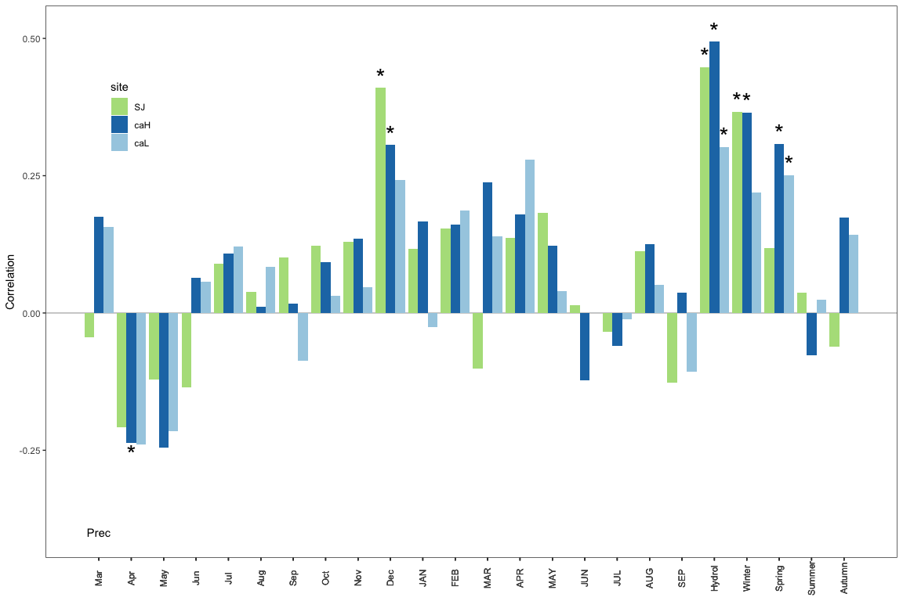

``` r
machine <- 'ajpelu'
# machine <- 'ajpeluLap'
di <- paste0('/Users/', machine, '/Dropbox/phd/phd_repos/qpyr_dendro/', sep = '')
```

Read and prepare data
=====================

``` r
eobs <- read.csv(file=paste0(di, "data/eobs/eobs_formatted.csv"), header=TRUE, sep=',')
crono <- read.csv(file=paste(di, "data/cronos_medias/cronos_sites_rwi.csv", sep=""), header=TRUE, sep=',')
```

-   Utilizamos la crono residual no la estandar :red\_circle: DUDA

``` r
cro_sj <- crono %>% filter(site == 'sj') %>% dplyr::select(-site, -std) %>% column_to_rownames(var = "year") %>% na.omit()
cro_caL <- crono %>% filter(site == 'caL') %>% dplyr::select(-site, -std) %>% column_to_rownames(var = "year") %>% na.omit()
cro_caH <- crono %>% filter(site == 'caH') %>% dplyr::select(-site, -std) %>% column_to_rownames(var = "year") %>% na.omit()
```

Create subsets data for eobs
============================

``` r
eobsN <- eobs %>% filter(year < 2017) %>% filter(loc == 'N') 
prec_N <- eobsN %>% dplyr::select(year, month, prec) 
tmean_N <- eobsN %>% dplyr::select(year, month, tmean) 
tmin_N <- eobsN %>% dplyr::select(year, month, tmin) 
tmax_N <- eobsN %>% dplyr::select(year, month, tmax) 

eobsS <- eobs %>% filter(year < 2017) %>% filter(loc == 'S') 
prec_S <- eobsS %>% dplyr::select(year, month, prec) 
tmean_S <- eobsS %>% dplyr::select(year, month, tmean) 
tmin_S <- eobsS %>% dplyr::select(year, month, tmin) 
tmax_S <- eobsS %>% dplyr::select(year, month, tmax) 
```

Some useful functions
---------------------

``` r
# for join dccs 
join_dccs <- function(dfs){ 
  out <- c() 
  for (i in dfs){
    # Get object dcc
    aux <- get(i)
    # Get coeffs 
    aux_coef <- aux$coef
    # remove rownames
    row.names(aux_coef) <- NULL
    
    # # Add loc variable
    # name_site <- sub(".*_", "", i)
    # aux_coef$site <- name_site
    
    # Add variable sig (asterisk) and site 
    aux_coef <- aux_coef %>% 
      mutate(site = sub(".*_", "", i), 
            sig = case_when(
              significant == "TRUE" ~ "*", 
              significant == "FALSE" ~ ""))
    
    # rbind
    out <- rbind(out, aux_coef)
 
  } 
  return(out)
}


## PLOTs functions 
theme_cor <- function(){
  theme_bw() %+replace%
    theme(axis.title.x = element_blank(),
          panel.grid = element_blank(),
          axis.text.x = element_text(angle = 90))
}
# http://joeystanley.com/blog/custom-themes-in-ggplot2

custom_gg <- list(theme_cor(), 
                  geom_hline(yintercept = 0, colour="gray"),
                  ylab('Correlation'), 
                  geom_bar(aes(fill=site), stat="identity", position = "dodge"),
                  geom_text(aes(label = sig, 
                                x = id, 
                                y = (coef + ifelse(coef >= 0, 0.02, -0.02))), 
                            position = position_dodge(.9), size = 10),
                  scale_fill_manual(values = c("#B2DF8A","#1F78B4","#A6CEE3")))
                  # scale_fill_brewer(palette = 'Paired', type='qual'))


# "#A6CEE3" azul clarito
# "#B2DF8A" verde 
```

Precipitation
=============

-   Correlación entre Marzo del mes anterior y hasta Sep del mes en curso
-   Correlación con datos de Pp acumulada

``` r
set.seed(3333)
rprec_SJ <- dcc(chrono = cro_sj, climate = prec_N, 
         method = "correlation",  boot = "std",
        .range(-3:9) + .sum(-9:8))
```

    ## Running for timespan 1951 - 2016...

``` r
rprec_caL <- dcc(chrono = cro_caL, climate = prec_S, 
         method = "correlation",  boot = "std",
        .range(-3:9) + .sum(-9:8))
```

    ## Running for timespan 1951 - 2016...

``` r
rprec_caH <- dcc(chrono = cro_caH, climate = prec_S, 
         method = "correlation",  boot = "std",
        .range(-3:9) + .sum(-9:8))
```

    ## Running for timespan 1951 - 2016...

``` r
# Joins dccs 
rprecs <- c('rprec_SJ', 'rprec_caH', 'rprec_caL')
rprec_all <- join_dccs(rprecs)

# Add custom names for aggregation variables 

rprec_all <- rprec_all %>% 
  mutate(month_name = case_when(
      month == "sep...AUG" ~ "Hydrol", 
      TRUE ~ as.character(.$month)))
```

Plot precipitation
------------------

``` r
p_prec <- rprec_all %>% ggplot(aes(x=id, y=coef, group = site)) + 
  custom_gg +
  scale_x_continuous(breaks = rprec_all$id, labels = rprec_all$month_name) + 
  theme(legend.position = c(.1, .8)) +
  annotate("text", label = "Prec", x = 1, y= -0.4) 
p_prec
```



``` r
pdf(paste0(di, '/out/climate_rwi/prec.pdf'), width=9, height = 5)
p_prec
dev.off()
```

    ## quartz_off_screen 
    ##                 2

Tmean
=====

-   Correlación entre Marzo del mes anterior y hasta Sep del mes en curso
-   Correlación con tmean winter, summer, spring, autumn, tmean hydrol

``` r
set.seed(3333)
rtmean_SJ <- dcc(chrono = cro_sj, climate = tmean_N, 
         method = "correlation",  boot = "std", 
        .range(-3:9) + .mean(-9:8) + .mean(-12:2) + .mean(3:5) + .mean(6:8) + .mean(9:11))
```

    ## Running for timespan 1951 - 2016...

``` r
rtmean_caH <- dcc(chrono = cro_caH, climate = tmean_S, 
         method = "correlation",  boot = "std", 
        .range(-3:9) + .mean(-9:8) + .mean(-12:2) + .mean(3:5) + .mean(6:8) + .mean(9:11))
```

    ## Running for timespan 1951 - 2016...

``` r
rtmean_caL <- dcc(chrono = cro_caL, climate = tmean_S, 
         method = "correlation",  boot = "std", 
        .range(-3:9) + .mean(-9:8) + .mean(-12:2) + .mean(3:5) + .mean(6:8) + .mean(9:11))
```

    ## Running for timespan 1951 - 2016...

``` r
# Joins dccs 
rtmeans <- c('rtmean_SJ', 'rtmean_caH', 'rtmean_caL')
rtmean_all <- join_dccs(rtmeans)


# Add custom names for aggregation variables of Temperatures
customNames <- function(x){ 
  out <- x %>% 
    mutate(month_name = case_when(
      month == "sep...AUG" ~ "Hydrol",
      month == "dec...FEB" ~ "Winter",
      month == "MAR...MAY" ~ "Spring",
      month == "JUN...AUG" ~ "Summer",
      month == "SEP...NOV" ~ "Autumn",
      TRUE ~ as.character(.$month)))
  
  return(out)
  }

rtmean_all <- customNames(rtmean_all) 
```

Plot Tmean
----------

``` r
p_tmean <- rtmean_all %>% ggplot(aes(x=id, y=coef, group = site)) + 
  custom_gg +
  scale_x_continuous(breaks = rtmean_all$id, labels = rtmean_all$month_name) + 
  theme(legend.position ="top") + 
  annotate("text", label = "Tmean", x = 1, y= -0.4) + ylim(-.4, .4)
p_tmean 
```


``` r
pdf(paste0(di, '/out/climate_rwi/tmean.pdf'), width=9, height = 5)
p_tmean
dev.off()
```

    ## quartz_off_screen 
    ##                 2

Tmin
====

-   Correlación entre Marzo del mes anterior y hasta Sep del mes en curso
-   Correlación con tmin winter, summer, spring, autumn, tmean hydrol

``` r
set.seed(3333)
rtmin_SJ <- dcc(chrono = cro_sj, climate = tmin_N, 
         method = "correlation",  boot = "std", 
        .range(-3:9) + .mean(-9:8) + .mean(-12:2) + .mean(3:5) + .mean(6:8) + .mean(9:11))
```

    ## Running for timespan 1951 - 2016...

``` r
rtmin_caH <- dcc(chrono = cro_caH, climate = tmin_S, 
         method = "correlation",  boot = "std", 
        .range(-3:9) + .mean(-9:8) + .mean(-12:2) + .mean(3:5) + .mean(6:8) + .mean(9:11))
```

    ## Running for timespan 1951 - 2016...

``` r
rtmin_caL <- dcc(chrono = cro_caL, climate = tmin_S, 
         method = "correlation",  boot = "std", 
        .range(-3:9) + .mean(-9:8) + .mean(-12:2) + .mean(3:5) + .mean(6:8) + .mean(9:11))
```

    ## Running for timespan 1951 - 2016...

``` r
# Join dccs 
rtmins <- c('rtmin_SJ', 'rtmin_caH', 'rtmin_caL')
rtmin_all <- join_dccs(rtmins)

# Rename variable 
rtmin_all <- customNames(rtmin_all) 
```

Plot Tmin
---------

``` r
p_tmin <- rtmin_all %>% ggplot(aes(x=id, y=coef, group = site)) + 
  custom_gg +
  scale_x_continuous(breaks = rtmin_all$id, labels = rtmin_all$month_name) + 
  theme(legend.position = "none") +
  annotate("text", label = "Tmin", x = 1, y= -0.4) + ylim(-.4, .4)
p_tmin
```


``` r
pdf(paste0(di, '/out/climate_rwi/tmin.pdf'), width=9, height = 5)
p_tmin
dev.off()
```

    ## quartz_off_screen 
    ##                 2

Tmax
====

-   Correlación entre Marzo del mes anterior y hasta Sep del mes en curso
-   Correlación con tmax winter, summer, spring, autumn, hydrol, may-jul, june-july

``` r
set.seed(3333)
rtmax_SJ <- dcc(chrono = cro_sj, climate = tmax_N, 
         method = "correlation",  boot = "std", 
        .range(-3:9) + .mean(-9:8) + .mean(-12:2) + .mean(3:5) + .mean(6:8) + .mean(9:11) + .mean(5:7) + .mean(6:7))
```

    ## Running for timespan 1951 - 2016...

``` r
rtmax_caH <- dcc(chrono = cro_caH, climate = tmax_S, 
         method = "correlation",  boot = "std", 
         .range(-3:9) + .mean(-9:8) + .mean(-12:2) + .mean(3:5) + .mean(6:8) + .mean(9:11) + .mean(5:7) + .mean(6:7))
```

    ## Running for timespan 1951 - 2016...

``` r
rtmax_caL <- dcc(chrono = cro_caL, climate = tmax_S, 
         method = "correlation",  boot = "std", 
         .range(-3:9) + .mean(-9:8) + .mean(-12:2) + .mean(3:5) + .mean(6:8) + .mean(9:11) + .mean(5:7) + .mean(6:7))
```

    ## Running for timespan 1951 - 2016...

``` r
# Join dccs 
rtmaxs <- c('rtmax_SJ', 'rtmax_caH', 'rtmax_caL')
rtmax_all <- join_dccs(rtmaxs)

# Rename variable 
rtmax_all <- customNames(rtmax_all) 
```

Plot Tmax
---------

``` r
p_tmax <- rtmax_all %>% ggplot(aes(x=id, y=coef, group = site)) + 
  custom_gg +
  scale_x_continuous(breaks = rtmin_all$id, labels = rtmin_all$month_name) +
  theme(legend.position = "none") +
  annotate("text", label = "Tmax", x = 1, y= -0.4) + ylim(-.4, .4)
p_tmax
```


``` r
pdf(paste0(di, '/out/climate_rwi/tmax.pdf'), width=9, height = 5)
p_tmax
dev.off()
```

    ## quartz_off_screen 
    ##                 2

``` r
p_temp <- p_tmean + p_tmax + p_tmin + plot_layout(ncol=1)
pdf(paste0(di, '/out/climate_rwi/temp.pdf'), width=9, height = 12)
p_temp
dev.off()
```

    ## quartz_off_screen 
    ##                 2

``` r
p <- p_tmean + p_tmax + p_tmin + p_prec + plot_layout(ncol=2)
pdf(paste0(di, '/out/climate_rwi/all.pdf'), width=13, height = 8)
p
dev.off()
```

    ## quartz_off_screen 
    ##                 2

Correlations RUNNING
====================

Para explorar la variabilidad temporal (estabilidad) en la relación entre clima y crecimiento, utilizamos una correlación con window size de 30 años

Prec
----

``` r
set.seed(3333)
mprec_SJ <- dcc(chrono = cro_sj, climate = prec_N, selection =.sum(-9:8) + .range(3,12), 
         dynamic = "moving", win_size = 10, win_offset = 5, sb = FALSE, method = "cor", boot = 'std')
plot(mprec_SJ)
```


``` r
set.seed(3333)
mprec_caH <- dcc(chrono = cro_caH, climate = prec_S, selection =.sum(-9:8) + .range(3,12), 
         dynamic = "moving", win_size = 10, win_offset = 5, sb = FALSE, method = "cor", boot = 'std')
plot(mprec_caH)
```


``` r
set.seed(3333)
mprec_caL <- dcc(chrono = cro_caL, climate = prec_S, selection =.sum(-9:8) + .range(3,12), 
         dynamic = "moving", win_size = 10, win_offset = 5, sb = FALSE, method = "cor", boot = 'std')
plot(mprec_caL)
```


The relationships between monthly climatic variables (mean maximum and minimum temperatures and total precipitation) and the chronologies of the ring-width indices were calculated using bootstrapped correlation functions in the treeclim package in R (Zang & Biondi, 2015).
