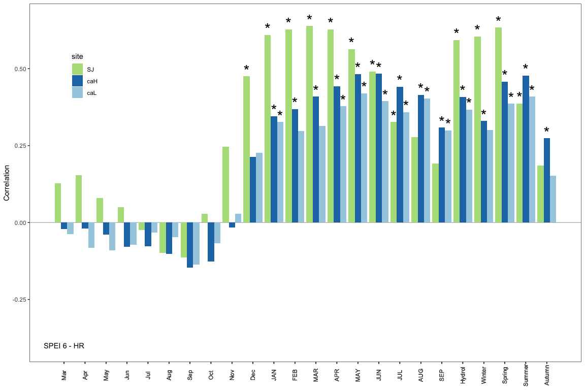
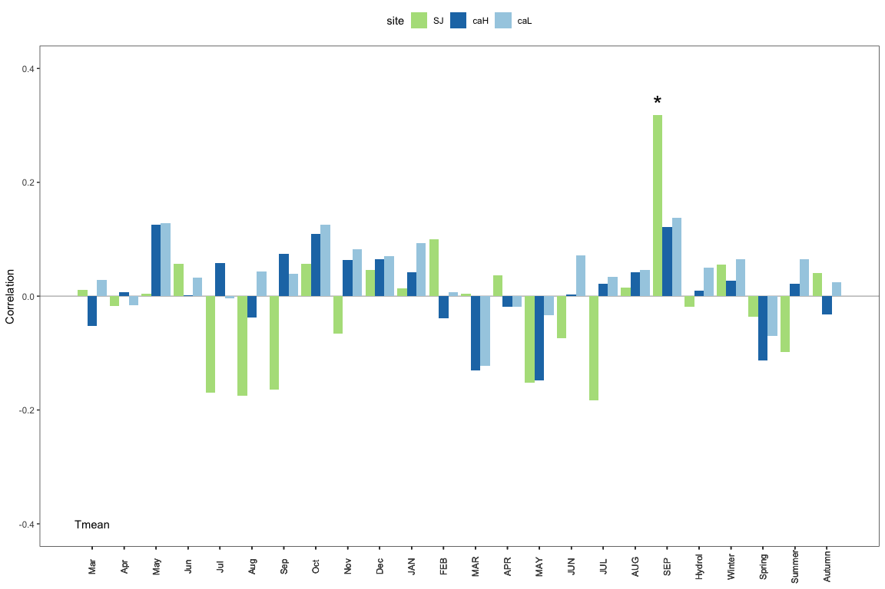
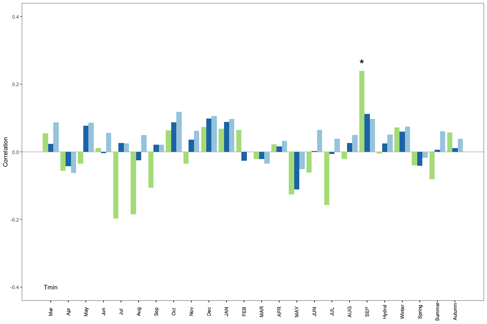
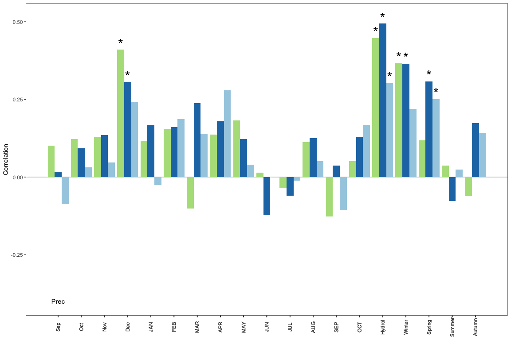
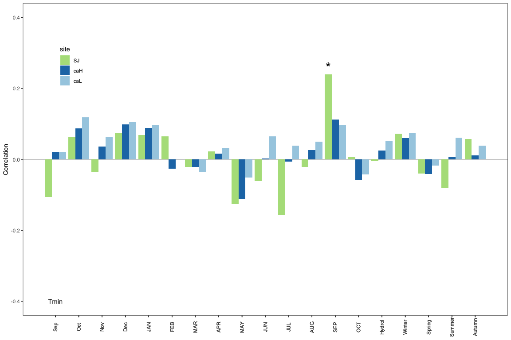

``` r
machine <- 'ajpelu'
# machine <- 'ajpeluLap'
di <- paste0('/Users/', machine, '/Dropbox/phd/phd_repos/qpyr_dendro/', sep = '')
```

Read and prepare data
=====================

``` r
eobs <- read.csv(file=paste0(di, "data/eobs/eobs_formatted.csv"), header=TRUE, sep=',')
crono <- read.csv(file=paste(di, "data/cronos_medias/cronos_sites_rwi.csv", sep=""), header=TRUE, sep=',')
```

-   Utilizamos la crono residual no la estandar :red\_circle: DUDA

``` r
cro_sj <- crono %>% filter(site == 'sj') %>% dplyr::select(-site, -std) %>% column_to_rownames(var = "year") %>% na.omit()
cro_caL <- crono %>% filter(site == 'caL') %>% dplyr::select(-site, -std) %>% column_to_rownames(var = "year") %>% na.omit()
cro_caH <- crono %>% filter(site == 'caH') %>% dplyr::select(-site, -std) %>% column_to_rownames(var = "year") %>% na.omit()
```

Create subsets data for eobs
============================

``` r
eobsN <- eobs %>% filter(year < 2017) %>% filter(loc == 'N') 
prec_N <- eobsN %>% dplyr::select(year, month, prec) 
tmean_N <- eobsN %>% dplyr::select(year, month, tmean) 
tmin_N <- eobsN %>% dplyr::select(year, month, tmin) 
tmax_N <- eobsN %>% dplyr::select(year, month, tmax) 

eobsS <- eobs %>% filter(year < 2017) %>% filter(loc == 'S') 
prec_S <- eobsS %>% dplyr::select(year, month, prec) 
tmean_S <- eobsS %>% dplyr::select(year, month, tmean) 
tmin_S <- eobsS %>% dplyr::select(year, month, tmin) 
tmax_S <- eobsS %>% dplyr::select(year, month, tmax) 
```

Spei data: 0.5 º - 1950
=======================

``` r
# sanjuan: 37.133, -3.382 = spei_-3.25_37.25.csv 
# canar: 36.957, -3.4284 = spei_-3.25_36.75.csv

spei_sj <- read.csv(file=paste0(di, "data_raw/spei/single_location/SPEI_37.25_-3.25.csv"), header=TRUE)
spei_ca <- read.csv(file=paste0(di, "data_raw/spei/single_location/SPEI_36.75_-3.25.csv"), header=TRUE)  

# Prepare data 
spei_N <- spei_sj %>% 
  mutate(date = as.Date(paste0('01', DATA), format =  '%d%b%Y'),
         year = lubridate::year(date),
         month = lubridate::month(date)) %>% 
  dplyr::select(year, month, spei6 = SPEI_6) %>% 
  filter(year > 1950) %>% 
  filter(year < 2017)

spei_S <- spei_ca %>% 
  mutate(date = as.Date(paste0('01', DATA), format =  '%d%b%Y'),
         year = lubridate::year(date),
         month = lubridate::month(date)) %>% 
  dplyr::select(year, month, spei6 = SPEI_6) %>% 
  filter(year > 1950) %>% 
  filter(year < 2017)
```

Spei data: 1.1 km º - 1961 (4 for months )
==========================================

``` r
# http://monitordesequia.csic.es/ 
# sanjuan: 37.13, -3.37 = DATA_37.13_-3.37.csv
# canar Low: 36.956, -3.424 = DATA_36.96_-3.42.csv
# canar High: 36.966, -3.421 = DATA_36.97_-3.42.csv

spei_sjD <- read.csv(file=paste0(di, "data_raw/spei/monitor_sequia/DATA_37.13_-3.37.csv"), header=TRUE)
spei_caHD <- read.csv(file=paste0(di,  "data_raw/spei/monitor_sequia/DATA_36.97_-3.42.csv"), header=TRUE)  
spei_caLD <- read.csv(file=paste0(di,  "data_raw/spei/monitor_sequia/DATA_36.96_-3.42.csv"), header=TRUE)  


# Prepare data 
sequia_sj <- spei_sjD %>% 
  mutate(date = parse_date(DATA, format='%d-%B-%Y', locale = locale('es')),
         year = lubridate::year(date),
         month = lubridate::month(date)) %>% 
  dplyr::select(year, month, spei6 = spei_6) %>% 
  filter(year > 1961) %>% 
  group_by(year, month) %>% 
  summarise(spei6 = mean(spei6)) %>% as.data.frame()


sequia_caH <- spei_caHD %>% 
  mutate(date = parse_date(DATA, format='%d-%B-%Y', locale = locale('es')),
         year = lubridate::year(date),
         month = lubridate::month(date)) %>% 
  dplyr::select(year, month, spei6 = spei_6) %>% 
  filter(year > 1961) %>% 
  group_by(year, month) %>% 
  summarise(spei6 = mean(spei6)) %>% as.data.frame()

sequia_caL <- spei_caLD %>% 
  mutate(date = parse_date(DATA, format='%d-%B-%Y', locale = locale('es')),
         year = lubridate::year(date),
         month = lubridate::month(date)) %>% 
  dplyr::select(year, month, spei6 = spei_6) %>% 
  filter(year > 1961) %>% 
  group_by(year, month) %>% 
  summarise(spei6 = mean(spei6)) %>% as.data.frame()
```

Some useful functions
---------------------

``` r
# for join dccs 
join_dccs <- function(dfs){ 
  out <- c() 
  for (i in dfs){
    # Get object dcc
    aux <- get(i)
    # Get coeffs 
    aux_coef <- aux$coef
    # remove rownames
    row.names(aux_coef) <- NULL
    
    # # Add loc variable
    # name_site <- sub(".*_", "", i)
    # aux_coef$site <- name_site
    
    # Add variable sig (asterisk) and site 
    aux_coef <- aux_coef %>% 
      mutate(site = sub(".*_", "", i), 
            sig = case_when(
              significant == "TRUE" ~ "*", 
              significant == "FALSE" ~ ""))
    
    # rbind
    out <- rbind(out, aux_coef)
 
  } 
  return(out)
}


## PLOTs functions 
theme_cor <- function(){
  theme_bw() %+replace%
    theme(axis.title.x = element_blank(),
          panel.grid = element_blank(),
          axis.text.x = element_text(angle = 90))
}
# http://joeystanley.com/blog/custom-themes-in-ggplot2

custom_gg <- list(theme_cor(), 
                  geom_hline(yintercept = 0, colour="gray"),
                  ylab('Correlation'), 
                  geom_bar(aes(fill=site), stat="identity", position = "dodge"),
                  geom_text(aes(label = sig, 
                                x = id, 
                                y = (coef + ifelse(coef >= 0, 0.02, -0.02))), 
                            position = position_dodge(.9), size = 8),
                  scale_fill_manual(values = c("#B2DF8A","#1F78B4","#A6CEE3")))
                  # scale_fill_brewer(palette = 'Paired', type='qual'))


# "#A6CEE3" azul clarito
# "#B2DF8A" verde 
```

Precipitation
=============

-   Correlación entre Marzo del mes anterior y hasta Sep del mes en curso
-   Correlación con datos de Pp acumulada

``` r
set.seed(3333)
rprec_SJ <- dcc(chrono = cro_sj, climate = prec_N, 
         method = "correlation",  boot = "std",
        .range(-3:9) + .sum(-9:8))
```

    ## Running for timespan 1951 - 2016...

``` r
rprec_caL <- dcc(chrono = cro_caL, climate = prec_S, 
         method = "correlation",  boot = "std",
        .range(-3:9) + .sum(-9:8))
```

    ## Running for timespan 1951 - 2016...

``` r
rprec_caH <- dcc(chrono = cro_caH, climate = prec_S, 
         method = "correlation",  boot = "std",
        .range(-3:9) + .sum(-9:8))
```

    ## Running for timespan 1951 - 2016...

``` r
# Joins dccs 
rprecs <- c('rprec_SJ', 'rprec_caH', 'rprec_caL')
rprec_all <- join_dccs(rprecs)

# Add custom names for aggregation variables 

rprec_all <- rprec_all %>% 
  mutate(month_name = case_when(
      month == "sep...AUG" ~ "Hydrol", 
      TRUE ~ as.character(.$month)))

write.csv(rprec_all, here("/data/rwi_climate", "rprec_all.csv"), row.names = FALSE)
```

    ## Error in write.table(rprec_all, here("/data/rwi_climate", "rprec_all.csv"), : could not find function "here"

Plot precipitation
------------------

``` r
p_prec <- rprec_all %>% ggplot(aes(x=id, y=coef, group = site)) + 
  custom_gg +
  scale_x_continuous(breaks = rprec_all$id, labels = rprec_all$month_name) + 
  theme(legend.position = c(.1, .8)) +
  annotate("text", label = "Prec", x = 1, y= -0.4) 
p_prec
```


``` r
pdf(paste0(di, '/out/climate_rwi/prec.pdf'), width=9, height = 5)
p_prec
dev.off()
```

    ## quartz_off_screen 
    ##                 2

SPEI
====

-   Correlación entre Marzo del mes anterior y hasta Sep del mes en curso
-   Correlación con datos de spei6 hydrol, winter, summer, spring, autumn,

``` r
set.seed(3333)
rspei_SJ <- dcc(chrono = cro_sj, climate = spei_N, 
         method = "correlation",  boot = "std", var_names = 'spei6',
        .range(-3:9) + .mean(-9:8) + .mean(-12:2) + .mean(3:5) + .mean(6:8) + .mean(9:11))
```

    ## Running for timespan 1952 - 2016...

``` r
rspei_caL <- dcc(chrono = cro_caL, climate = spei_N, 
         method = "correlation",  boot = "std", var_names = 'spei6',
        .range(-3:9) + .mean(-9:8) + .mean(-12:2) + .mean(3:5) + .mean(6:8) + .mean(9:11))
```

    ## Running for timespan 1952 - 2016...

``` r
rspei_caH <- dcc(chrono = cro_caH, climate = spei_N, 
         method = "correlation",  boot = "std", var_names = 'spei6',
        .range(-3:9) + .mean(-9:8) + .mean(-12:2) + .mean(3:5) + .mean(6:8) + .mean(9:11))
```

    ## Running for timespan 1952 - 2016...

``` r
# Joins dccs 
rspeis <- c('rspei_SJ', 'rspei_caH', 'rspei_caL')
rspei_all <- join_dccs(rspeis)

# Add custom names for aggregation variables of  and / or SPEI
customNames <- function(x){ 
  out <- x %>% 
    mutate(month_name = case_when(
      month == "sep...AUG" ~ "Hydrol",
      month == "dec...FEB" ~ "Winter",
      month == "MAR...MAY" ~ "Spring",
      month == "JUN...AUG" ~ "Summer",
      month == "SEP...NOV" ~ "Autumn",
      TRUE ~ as.character(.$month)))
  
  return(out)
}

rspei_all <- customNames(rspei_all) 

write.csv(rspei_all, here("/data/rwi_climate", "rspei_all.csv"), row.names = FALSE)
```

    ## Error in write.table(rspei_all, here("/data/rwi_climate", "rspei_all.csv"), : could not find function "here"

Plot SPEI
---------

``` r
p_spei <- rspei_all %>% ggplot(aes(x=id, y=coef, group = site)) + 
  custom_gg +
  scale_x_continuous(breaks = rspei_all$id, labels = rspei_all$month_name) + 
  theme(legend.position = c(.1, .8)) +
  annotate("text", label = "SPEI 6", x = 1, y= -0.4) 
p_spei 
```


``` r
pdf(paste0(di, '/out/climate_rwi/spei.pdf'), width=9, height = 5)
p_spei
dev.off()
```

    ## quartz_off_screen 
    ##                 2

SPEI High-resol
===============

-   Correlación entre Marzo del mes anterior y hasta Sep del mes en curso
-   Correlación con datos de spei6 hydrol, winter, summer, spring, autumn,

``` r
set.seed(3333)
rsequia_SJ <- dcc(chrono = cro_sj, climate = sequia_sj, 
         method = "correlation",  boot = "std", var_names = 'spei6',
        .range(-3:9) + .mean(-9:8) + .mean(-12:2) + .mean(3:5) + .mean(6:8) + .mean(9:11))
```

    ## Running for timespan 1963 - 2015...

``` r
rsequia_caL <- dcc(chrono = cro_caL, climate = sequia_caL, 
         method = "correlation",  boot = "std", var_names = 'spei6',
        .range(-3:9) + .mean(-9:8) + .mean(-12:2) + .mean(3:5) + .mean(6:8) + .mean(9:11))
```

    ## Running for timespan 1963 - 2015...

``` r
rsequia_caH <- dcc(chrono = cro_caH, climate = sequia_caH, 
         method = "correlation",  boot = "std", var_names = 'spei6',
        .range(-3:9) + .mean(-9:8) + .mean(-12:2) + .mean(3:5) + .mean(6:8) + .mean(9:11))
```

    ## Running for timespan 1963 - 2015...

``` r
# Joins dccs 
rsequias <- c('rsequia_SJ', 'rsequia_caH', 'rsequia_caL')
rsequia_all <- join_dccs(rsequias)

rsequia_all <- customNames(rsequia_all) 

write.csv(rsequia_all, here("/data/rwi_climate", "rsequia_all.csv"), row.names = FALSE)
```

    ## Error in write.table(rsequia_all, here("/data/rwi_climate", "rsequia_all.csv"), : could not find function "here"

Plot SPEI HR
------------

``` r
p_sequia <- rsequia_all %>% ggplot(aes(x=id, y=coef, group = site)) + 
  custom_gg +
  scale_x_continuous(breaks = rsequia_all$id, labels = rsequia_all$month_name) + 
  theme(legend.position = c(.1, .8)) +
  annotate("text", label = "SPEI 6 - HR", x = 1, y= -0.4) 
p_sequia 
```



``` r
pdf(paste0(di, '/out/climate_rwi/sequia.pdf'), width=9, height = 5)
p_sequia
dev.off()
```

    ## quartz_off_screen 
    ##                 2

Tmean
=====

-   Correlación entre Marzo del mes anterior y hasta Sep del mes en curso
-   Correlación con tmean winter, summer, spring, autumn, tmean hydrol

``` r
set.seed(3333)
rtmean_SJ <- dcc(chrono = cro_sj, climate = tmean_N, 
         method = "correlation",  boot = "std", 
        .range(-3:9) + .mean(-9:8) + .mean(-12:2) + .mean(3:5) + .mean(6:8) + .mean(9:11))
```

    ## Running for timespan 1951 - 2016...

``` r
rtmean_caH <- dcc(chrono = cro_caH, climate = tmean_S, 
         method = "correlation",  boot = "std", 
        .range(-3:9) + .mean(-9:8) + .mean(-12:2) + .mean(3:5) + .mean(6:8) + .mean(9:11))
```

    ## Running for timespan 1951 - 2016...

``` r
rtmean_caL <- dcc(chrono = cro_caL, climate = tmean_S, 
         method = "correlation",  boot = "std", 
        .range(-3:9) + .mean(-9:8) + .mean(-12:2) + .mean(3:5) + .mean(6:8) + .mean(9:11))
```

    ## Running for timespan 1951 - 2016...

``` r
# Joins dccs 
rtmeans <- c('rtmean_SJ', 'rtmean_caH', 'rtmean_caL')
rtmean_all <- join_dccs(rtmeans)


# Add custom names for aggregation variables of Temperatures
customNames <- function(x){ 
  out <- x %>% 
    mutate(month_name = case_when(
      month == "sep...AUG" ~ "Hydrol",
      month == "dec...FEB" ~ "Winter",
      month == "MAR...MAY" ~ "Spring",
      month == "JUN...AUG" ~ "Summer",
      month == "SEP...NOV" ~ "Autumn",
      TRUE ~ as.character(.$month)))
  
  return(out)
  }

rtmean_all <- customNames(rtmean_all) 
write.csv(rtmean_all, here("/data/rwi_climate", "rtmean_all.csv"), row.names = FALSE)
```

    ## Error in write.table(rtmean_all, here("/data/rwi_climate", "rtmean_all.csv"), : could not find function "here"

Plot Tmean
----------

``` r
p_tmean <- rtmean_all %>% ggplot(aes(x=id, y=coef, group = site)) + 
  custom_gg +
  scale_x_continuous(breaks = rtmean_all$id, labels = rtmean_all$month_name) + 
  theme(legend.position ="top") + 
  annotate("text", label = "Tmean", x = 1, y= -0.4) + ylim(-.4, .4)
p_tmean 
```



``` r
pdf(paste0(di, '/out/climate_rwi/tmean.pdf'), width=9, height = 5)
p_tmean
dev.off()
```

    ## quartz_off_screen 
    ##                 2

Tmin
====

-   Correlación entre Marzo del mes anterior y hasta Sep del mes en curso
-   Correlación con tmin winter, summer, spring, autumn, tmean hydrol

``` r
set.seed(3333)
rtmin_SJ <- dcc(chrono = cro_sj, climate = tmin_N, 
         method = "correlation",  boot = "std", 
        .range(-3:9) + .mean(-9:8) + .mean(-12:2) + .mean(3:5) + .mean(6:8) + .mean(9:11))
```

    ## Running for timespan 1951 - 2016...

``` r
rtmin_caH <- dcc(chrono = cro_caH, climate = tmin_S, 
         method = "correlation",  boot = "std", 
        .range(-3:9) + .mean(-9:8) + .mean(-12:2) + .mean(3:5) + .mean(6:8) + .mean(9:11))
```

    ## Running for timespan 1951 - 2016...

``` r
rtmin_caL <- dcc(chrono = cro_caL, climate = tmin_S, 
         method = "correlation",  boot = "std", 
        .range(-3:9) + .mean(-9:8) + .mean(-12:2) + .mean(3:5) + .mean(6:8) + .mean(9:11))
```

    ## Running for timespan 1951 - 2016...

``` r
# Join dccs 
rtmins <- c('rtmin_SJ', 'rtmin_caH', 'rtmin_caL')
rtmin_all <- join_dccs(rtmins)

# Rename variable 
rtmin_all <- customNames(rtmin_all) 
write.csv(rtmin_all, here("/data/rwi_climate", "rtmin_all.csv"), row.names = FALSE)
```

    ## Error in write.table(rtmin_all, here("/data/rwi_climate", "rtmin_all.csv"), : could not find function "here"

Plot Tmin
---------

``` r
p_tmin <- rtmin_all %>% ggplot(aes(x=id, y=coef, group = site)) + 
  custom_gg +
  scale_x_continuous(breaks = rtmin_all$id, labels = rtmin_all$month_name) + 
  theme(legend.position = "none") +
  annotate("text", label = "Tmin", x = 1, y= -0.4) + ylim(-.4, .4)
p_tmin
```



``` r
pdf(paste0(di, '/out/climate_rwi/tmin.pdf'), width=9, height = 5)
p_tmin
dev.off()
```

    ## quartz_off_screen 
    ##                 2

Tmax
====

-   Correlación entre Marzo del mes anterior y hasta Sep del mes en curso
-   Correlación con tmax winter, summer, spring, autumn, hydrol

``` r
set.seed(3333)
rtmax_SJ <- dcc(chrono = cro_sj, climate = tmax_N, 
         method = "correlation",  boot = "std", 
        .range(-3:9) + .mean(-9:8) + .mean(-12:2) + .mean(3:5) + .mean(6:8) + .mean(9:11))
```

    ## Running for timespan 1951 - 2016...

``` r
rtmax_caH <- dcc(chrono = cro_caH, climate = tmax_S, 
         method = "correlation",  boot = "std", 
         .range(-3:9) + .mean(-9:8) + .mean(-12:2) + .mean(3:5) + .mean(6:8) + .mean(9:11))
```

    ## Running for timespan 1951 - 2016...

``` r
rtmax_caL <- dcc(chrono = cro_caL, climate = tmax_S, 
         method = "correlation",  boot = "std", 
         .range(-3:9) + .mean(-9:8) + .mean(-12:2) + .mean(3:5) + .mean(6:8) + .mean(9:11))
```

    ## Running for timespan 1951 - 2016...

``` r
# Join dccs 
rtmaxs <- c('rtmax_SJ', 'rtmax_caH', 'rtmax_caL')
rtmax_all <- join_dccs(rtmaxs)

# Rename variable 
rtmax_all <- customNames(rtmax_all) 
write.csv(rtmax_all, here("/data/rwi_climate", "rtmax_all.csv"), row.names = FALSE)
```

    ## Error in write.table(rtmax_all, here("/data/rwi_climate", "rtmax_all.csv"), : could not find function "here"

Plot Tmax
---------

``` r
p_tmax <- rtmax_all %>% ggplot(aes(x=id, y=coef, group = site)) + 
  custom_gg +
  scale_x_continuous(breaks = rtmin_all$id, labels = rtmin_all$month_name) +
  theme(legend.position = "none") +
  annotate("text", label = "Tmax", x = 1, y= -0.4) + ylim(-.4, .4)
p_tmax
```


``` r
pdf(paste0(di, '/out/climate_rwi/tmax.pdf'), width=9, height = 5)
p_tmax
dev.off()
```

    ## quartz_off_screen 
    ##                 2

``` r
p_temp <- p_tmean + p_tmax + p_tmin + plot_layout(ncol=1)
pdf(paste0(di, '/out/climate_rwi/temp.pdf'), width=9, height = 12)
p_temp
dev.off()
```

    ## quartz_off_screen 
    ##                 2

``` r
p_prec_spei <- p_prec + p_spei + p_sequia + plot_layout(ncol=1)
pdf(paste0(di, '/out/climate_rwi/prec_spei.pdf'), width=9, height = 8)
p_prec_spei
dev.off()
```

    ## quartz_off_screen 
    ##                 2

``` r
p_prec_sequia <- p_prec + p_sequia + plot_layout(ncol=1)
pdf(paste0(di, '/out/climate_rwi/prec_sequia.pdf'), width=9, height = 8)
p_prec_sequia
dev.off()
```

    ## quartz_off_screen 
    ##                 2

``` r
p <- p_tmean + p_tmax + p_tmin + p_prec + plot_layout(ncol=2)
pdf(paste0(di, '/out/climate_rwi/all.pdf'), width=13, height = 8)
p
dev.off()
```

    ## quartz_off_screen 
    ##                 2

SELECTED MONTHS
===============

-   Tras comentar con GGea, decidimos, poner desde sep-1 hasta oct1
-   quitar tmean

``` r
set.seed(3333)
rprec_SJ <- dcc(chrono = cro_sj, climate = prec_N, 
         method = "correlation",  boot = "std",
        .range(-9:10) + .sum(-9:8))
```

    ## Running for timespan 1951 - 2016...

``` r
rprec_caL <- dcc(chrono = cro_caL, climate = prec_S, 
         method = "correlation",  boot = "std",
        .range(-9:10) + .sum(-9:8))
```

    ## Running for timespan 1951 - 2016...

``` r
rprec_caH <- dcc(chrono = cro_caH, climate = prec_S, 
         method = "correlation",  boot = "std",
        .range(-9:10) + .sum(-9:8))
```

    ## Running for timespan 1951 - 2016...

``` r
# Joins dccs 
rprecs <- c('rprec_SJ', 'rprec_caH', 'rprec_caL')
rprec_all <- join_dccs(rprecs)

# Add custom names for aggregation variables 

rprec_all <- rprec_all %>% 
  mutate(month_name = case_when(
      month == "sep...AUG" ~ "Hydrol", 
      TRUE ~ as.character(.$month)))

write.csv(rprec_all, file=paste(di, "data/rwi_climate/rprec_selected.csv", sep=""), row.names = TRUE)
```

Plot precipitation
------------------

``` r
p_prec <- rprec_all %>% ggplot(aes(x=id, y=coef, group = site)) + 
  custom_gg +
  scale_x_continuous(breaks = rprec_all$id, labels = rprec_all$month_name) + 
  theme(legend.position = "none") + 
  annotate("text", label = "Prec", x = 1, y= -0.4) 
p_prec
```



``` r
pdf(paste0(di, '/out/climate_rwi/prec_selec.pdf'), width=9, height = 5)
p_prec
dev.off()
```

    ## quartz_off_screen 
    ##                 2

SPEI High-resol
===============

``` r
set.seed(3333)
rsequia_SJ <- dcc(chrono = cro_sj, climate = sequia_sj, 
         method = "correlation",  boot = "std", var_names = 'spei6',
        .range(-9:10) + .mean(-9:8) + .mean(-12:2) + .mean(3:5) + .mean(6:8) + .mean(9:11))
```

    ## Running for timespan 1963 - 2015...

``` r
rsequia_caL <- dcc(chrono = cro_caL, climate = sequia_caL, 
         method = "correlation",  boot = "std", var_names = 'spei6',
        .range(-9:10) + .mean(-9:8) + .mean(-12:2) + .mean(3:5) + .mean(6:8) + .mean(9:11))
```

    ## Running for timespan 1963 - 2015...

``` r
rsequia_caH <- dcc(chrono = cro_caH, climate = sequia_caH, 
         method = "correlation",  boot = "std", var_names = 'spei6',
        .range(-9:10) + .mean(-9:8) + .mean(-12:2) + .mean(3:5) + .mean(6:8) + .mean(9:11))
```

    ## Running for timespan 1963 - 2015...

``` r
# Joins dccs 
rsequias <- c('rsequia_SJ', 'rsequia_caH', 'rsequia_caL')
rsequia_all <- join_dccs(rsequias)

rsequia_all <- customNames(rsequia_all) 
write.csv(rsequia_all, file=paste(di, "data/rwi_climate/rsequia_selected.csv", sep=""), row.names = TRUE)
```

Plot SPEI HR
------------

``` r
p_sequia <- rsequia_all %>% ggplot(aes(x=id, y=coef, group = site)) + 
  custom_gg +
  scale_x_continuous(breaks = rsequia_all$id, labels = rsequia_all$month_name) + 
  theme(legend.position = "none") + 
  annotate("text", label = "SPEI 6 - HR", x = 1.5, y= -0.4) 
p_sequia 
```


``` r
pdf(paste0(di, '/out/climate_rwi/sequia_selec.pdf'), width=9, height = 5)
p_sequia
dev.off()
```

    ## quartz_off_screen 
    ##                 2

Tmin
====

``` r
set.seed(3333)
rtmin_SJ <- dcc(chrono = cro_sj, climate = tmin_N, 
         method = "correlation",  boot = "std", 
        .range(-9:10) + .mean(-9:8) + .mean(-12:2) + .mean(3:5) + .mean(6:8) + .mean(9:11))
```

    ## Running for timespan 1951 - 2016...

``` r
rtmin_caH <- dcc(chrono = cro_caH, climate = tmin_S, 
         method = "correlation",  boot = "std", 
        .range(-9:10) + .mean(-9:8) + .mean(-12:2) + .mean(3:5) + .mean(6:8) + .mean(9:11))
```

    ## Running for timespan 1951 - 2016...

``` r
rtmin_caL <- dcc(chrono = cro_caL, climate = tmin_S, 
         method = "correlation",  boot = "std", 
        .range(-9:10) + .mean(-9:8) + .mean(-12:2) + .mean(3:5) + .mean(6:8) + .mean(9:11))
```

    ## Running for timespan 1951 - 2016...

``` r
# Join dccs 
rtmins <- c('rtmin_SJ', 'rtmin_caH', 'rtmin_caL')
rtmin_all <- join_dccs(rtmins)

# Rename variable 
rtmin_all <- customNames(rtmin_all) 
write.csv(rtmin_all, file=paste(di, "data/rwi_climate/rtmin_selected.csv", sep=""), row.names = TRUE)
```

Plot Tmin
---------

``` r
p_tmin <- rtmin_all %>% ggplot(aes(x=id, y=coef, group = site)) + 
  custom_gg +
  scale_x_continuous(breaks = rtmin_all$id, labels = rtmin_all$month_name) + 
  theme(legend.position = c(.1, .8)) +
  annotate("text", label = "Tmin", x = 1, y= -0.4) + ylim(-.4, .4)
p_tmin
```



``` r
pdf(paste0(di, '/out/climate_rwi/tmin_selec.pdf'), width=9, height = 5)
p_tmin
dev.off()
```

    ## quartz_off_screen 
    ##                 2

Tmax
====

``` r
set.seed(3333)
rtmax_SJ <- dcc(chrono = cro_sj, climate = tmax_N, 
         method = "correlation",  boot = "std", 
        .range(-9:10) + .mean(-9:8) + .mean(-12:2) + .mean(3:5) + .mean(6:8) + .mean(9:11))
```

    ## Running for timespan 1951 - 2016...

``` r
rtmax_caH <- dcc(chrono = cro_caH, climate = tmax_S, 
         method = "correlation",  boot = "std", 
         .range(-9:10) + .mean(-9:8) + .mean(-12:2) + .mean(3:5) + .mean(6:8) + .mean(9:11))
```

    ## Running for timespan 1951 - 2016...

``` r
rtmax_caL <- dcc(chrono = cro_caL, climate = tmax_S, 
         method = "correlation",  boot = "std", 
         .range(-9:10) + .mean(-9:8) + .mean(-12:2) + .mean(3:5) + .mean(6:8) + .mean(9:11))
```

    ## Running for timespan 1951 - 2016...

``` r
# Join dccs 
rtmaxs <- c('rtmax_SJ', 'rtmax_caH', 'rtmax_caL')
rtmax_all <- join_dccs(rtmaxs)

# Rename variable 
rtmax_all <- customNames(rtmax_all) 
write.csv(rtmax_all, file=paste(di, "data/rwi_climate/rtmax_selected.csv", sep=""), row.names = TRUE)
```

Plot Tmax
---------

``` r
p_tmax <- rtmax_all %>% ggplot(aes(x=id, y=coef, group = site)) + 
  custom_gg +
  scale_x_continuous(breaks = rtmin_all$id, labels = rtmin_all$month_name) +
  theme(legend.position = "none") +
  annotate("text", label = "Tmax", x = 1, y= -0.4) + ylim(-.4, .4)
p_tmax
```


``` r
pdf(paste0(di, '/out/climate_rwi/tmax_selec.pdf'), width=9, height = 5)
p_tmax
dev.off()
```

    ## quartz_off_screen 
    ##                 2

``` r
p <- grid.arrange(p_tmin, p_tmax, p_prec, p_sequia, ncol=2)
```

    ## Error in eval(expr, envir, enclos): could not find function "grid.arrange"

``` r
pdf(paste0(di, '/out/climate_rwi/rwi_cli_relation.pdf'), width=9, height = 12)
p
dev.off()
```

    ## quartz_off_screen 
    ##                 2

Correlations RUNNING
====================

Para explorar la variabilidad temporal (estabilidad) en la relación entre clima y crecimiento, utilizamos una correlación con window size de 30 años

Prec
----

``` r
set.seed(3333)
mprec_SJ <- dcc(chrono = cro_sj, climate = prec_N, selection =.sum(-9:8) + .range(3,12), 
         dynamic = "moving", win_size = 10, win_offset = 5, sb = FALSE, method = "cor", boot = 'std')
plot(mprec_SJ)
```


``` r
set.seed(3333)
mprec_caH <- dcc(chrono = cro_caH, climate = prec_S, selection =.sum(-9:8) + .range(3,12), 
         dynamic = "moving", win_size = 10, win_offset = 5, sb = FALSE, method = "cor", boot = 'std')
plot(mprec_caH)
```


``` r
set.seed(3333)
mprec_caL <- dcc(chrono = cro_caL, climate = prec_S, selection =.sum(-9:8) + .range(3,12), 
         dynamic = "moving", win_size = 10, win_offset = 5, sb = FALSE, method = "cor", boot = 'std')
plot(mprec_caL)
```


The relationships between monthly climatic variables (mean maximum and minimum temperatures and total precipitation) and the chronologies of the ring-width indices were calculated using bootstrapped correlation functions in the treeclim package in R (Zang & Biondi, 2015).
