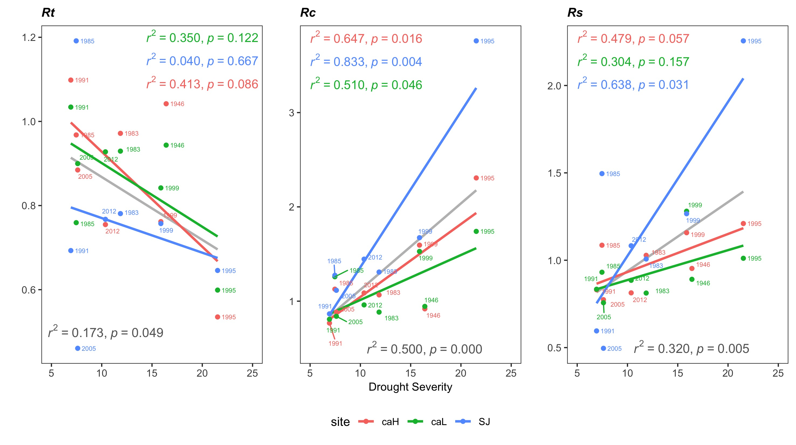
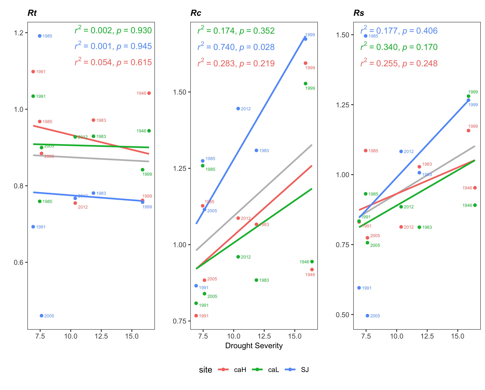

---
output:
  word_document:
    fig_caption: yes
    highlight: null
    reference_docx: ../../templates/template_pagebreak.docx
bibliography: ../../refs/references.bib
csl: ../../refs/ecology.csl
---


```{r, include=FALSE}
options(knitr.duplicate.label = 'allow')
```

```{r child = 'location_map.Rmd'}
```

##### 

```{r child = 'std_anomalies.Rmd'}
```

#####

```{r child = 'browning.Rmd'}
```

##### 

```{r child = 'bai_cronos.Rmd'}
```

##### 

```{r child = 'growth_changes.Rmd'}
```

#####

**Figure 6.** Resilience metrics of the tree-growth for severe drought events since 1950. *Left*: Resistance (*Rt*); *Center*: Recovery (*Rc*); *Right*: Resilience (*Rs*). Points indicate resilience metrics for oak populations: SJ (*blue*), CA-High (*red*) and CA-Low (*green*). Resilience metrics were computed for each population (sample depth > 10) and drought event. Gray line represents overall relationship for each Resilience metrics.

{height=750px} 

#####

```{r child = 'resilience_metrics.Rmd'}
```


#####

```{r child = 'ring_climate.Rmd'}
```


##### 

```{r child = 'cumulative_prec.Rmd'}
```

##### 

```{r child = 'plot_spei12.Rmd'}
```


#####

```{r child = 'residual_chronos.Rmd'}
```


##### 

```{r child = 'gc_perc_trees.Rmd'}
```


##### 

```{r child = 'corr_plot_years.Rmd'}
```


##### 

```{r child = 'correla_boot_sites.Rmd'}
```


##### 

```{r child = 'evi_vs_severe_droughts.Rmd'}
```


##### 

**Figure S8.** Resilience metrics of the tree-growth for severe drought events since 1950 (excluding 1995 drought event). *Left*: Resistance (*Rt*); *Center*: Recovery (*Rc*); *Right*: Resilience (*Rs*). Points indicate resilience metrics for oak populations: SJ (*blue*), CA-High (*red*) and CA-Low (*green*). Resilience metrics were computed for each population (sample depth > 10) and drought event. Gray line represents overall relationship for each Resilience metrics.

{height=750px} 