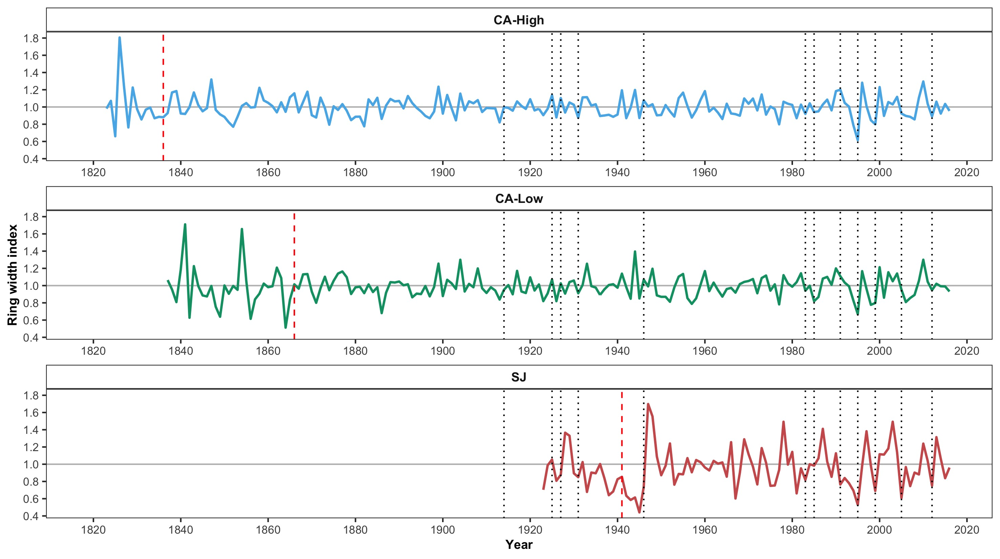
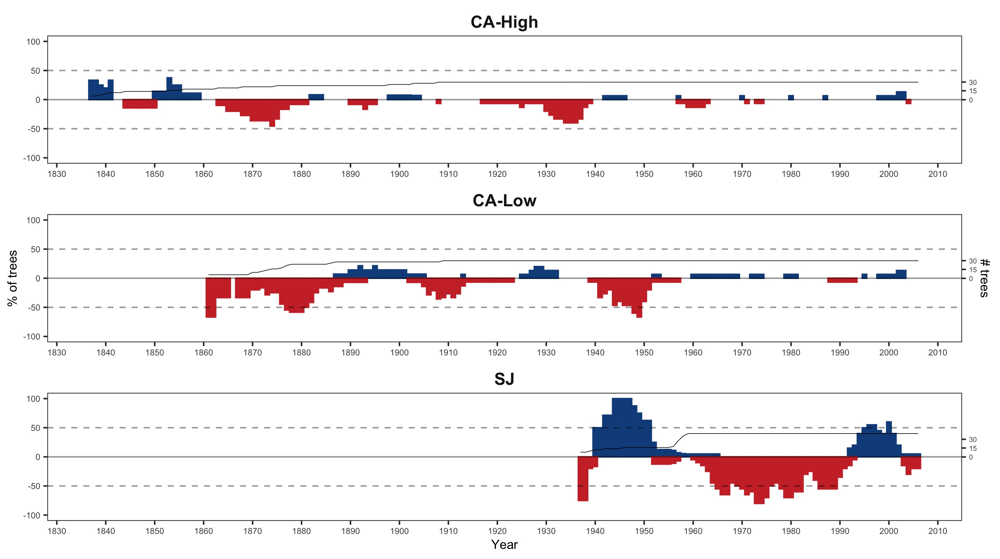

---
output:
  word_document:
    fig_caption: yes
    highlight: null
    reference_docx: ../../templates/template_pagebreak.docx
bibliography: ../../refs/references.bib
csl: ../../refs/ecology.csl
---


```{r, include=FALSE}
options(knitr.duplicate.label = 'allow')
```

**Figure 1**. Distribution of *Quercus pyrenaica* forests in the Iberian Peninsula (a) and in Sierra Nevada mountain range (b). Different colours indicate oak population cluster's identified in Sierra Nevada [@PerezLuque2015]. For each population, a grid with the MODIS pixels is shown (see material and methods). Detailed location of the dendroecological sampling sites: northern (San Juan, SJ) (c), and southern ones (Cáñar: CA-Low and CA-High) (d). Colour orthophotography of 2009 from Regional Ministry of the Environment.

{height=750px}

##### 

**Figure 2.** ***a*** EVI standardized anomaly during the period 2000-2016 for northern and southern populations. Error bars show standard error. See main text for details on EVI calculation. ***b*** Percentage of pixels showing browning, greening or no-changes during the 2005 and 2012 drought events according to EVI standardized anomalies. See main text for an explanation of greening and browning. 


##### 

**Figure 3.** Basal Area Increment (BAI) chronologies of *Q. pyrenaica* for northern population (SJ; *red*) and southern ones: low-elevation (CA-Low; *green*) and high-elevation (CA-High, *blue*) sites. Shading areas correspond to standard error of the mean. Number of series is displayed in the upper plot. We only show years replicated with # series > 5. Linear trends since 1975 are shown all sites (numbers indicate $r^2$ values; asterisks indicate significant linear trend, *p < 0.001*).


##### 

**Figure 4.** Comparison of median growth change ($GC$) following @Nowacki1997 for *Q. pyrenaica* sites. Dashed black lines indicate a threshold of 50 % of GC (see material and methods). Note that y-axes do not correspond in all of the three panels for the sake of clarity. Error bars indicate standard error. 


#####

**Figure 5.** Resilience metrics of tree-growth for eigth severe drought events since 1950 (see main text for details) as a function of drought severity. *Left*: Resistance (*Rt*); *Center*: Recovery (*Rc*); *Right*: Resilience (*Rs*). Points indicate resilience metrics for oak populations: SJ (*red*), CA-High (*blue*) and CA-Low (*green*). Resilience metrics were computed for each population (sample depth > 10) and drought event. Gray lines represent overall relationships for each Resilience metrics.


#####

**Figure 6.** Comparison of the response of  *Q. pyrenaica* forests to drought in terms of resistance, recovery and resilience of greenness (a) and tree-growth (b). For EVI we compared northern populations (*red circle*) with southern ones (*green circle*). For BAI we compared the more xeric northern population (San Juan, SJ; *red circle*) with the two southerns populations: Cáñar-High (CA-High; *blue circle*) and Cáñar-Low (CA-Low; *green circle*). Different letters indicate significant *post hoc* differences between groups (see material and methods for details). 


#####

**Figure 7.** Correlation coefficients obtained by relating tree-ring residual chronologies (RWI) of *Q. pyrenaica* and monthly climatic data: precipitation and 6-month SPEI (a), minimun (b) and maximun (c) temperatures. *green* bars: northern site (SJ); *light blue* bars: low-elevation southern site (CA-Low); and *dark blue* bars: high-elevation shouthern site (CA-High). Asteriks indicate significant ($P < 0.05$) correlation coefficients. 


##### 

**Figure S1.** Temporal evolution of cumulative precipitation (hydrological year) during the period 1950-2017. Points represent mean and errorbars standard error. *Black* line indicates mean for the whole period (585 mm). *Red* lines represent -1 and -2 standard deviation (*dotted* and *dashed* lines respectively). *Blue* lines represent +1 and +2 standard deviation (*dotted* and *dashed* lines respectively). Years with average values below -1SD are labelled. Data from 28 meteorological stations distributed around Sierra Nevada area (from National Spanish Meteorological Services, AEMET). ***Inset plot***: cumulative precipitation during the hydrological years 2004-2005 (*blue line*) and 2011-2012 (*red line*). The boxplot representing the average from 1950-2015 period. Data from meteorological station Granada, Base Aérea. ***B*** Drought severity in Sierra Nevada for the 1901-2016 period based on the Standardised Precipitation-Evapotranspiration Index (SPEI). Data from Global SPEI database (http://spei.csic.es/database.html). We obtanied the SPEI data for a 12 month scale and for all 0.5º grid cells covering Sierra Nevada. Horizontal gray bars indicate 2005 and 2012 year. 


##### 

**Figure S2.** Residual tree-ring chronologies obtained for the *Q. pyrenaica* sites. Dashed red lines indicate the start of the reliable period (EPS > 0.85). Dotted black lines showing the severe drought years identified in our climatic data (Table S3 and Figure S1). 




##### 

**Figure S3.** Percentage of *Q. pyrenaica* trees affected by GC > 50 % by site. *Black* line shows number of trees (rigth-axis). Data for number of trees > 2 is shown. 




##### 

**Figure S4.** ***A*** Correlation among site chronologies (CA-High, CA-Low and SJ) in different time-domains after pre-filtering the time-series with increasing size of the moving-average window (1 to 40 years). Each site chronology was smoothed using centred moving averages with different window sizes (1 to 40 years), and then Pearson's correlation coefficient between the each pair chronologies were calculated. Significance was tested using 1000 boostrap replicates and with 95 % confidence intervals built using the R packgae `boot`. ***B*** Correlation between indices of resilience (*Rt*, resistance; *Rc*, recovery; *Rs*, Resilience) using periods of several lengths (2, 3 and 4 years after a drought).


##### 
**Figure S5.** EVI annual profile (average of the period 2000-2016) for *Q. pyrenaica* forests in Sierra Nevada and drought events. Horizontal bars correspond to the most severe droughts for Sierra Nevada since 1900 (computed as in Table S3). Their position indicate the start and end months of each drought event. Bars length show the duration of the drought event (number of consecutive months with SPEI lower than -1.28, see [@Pascoa2017]). 


##### 

**Figure S6.** Resilience metrics of the tree-growth for severe drought events since 1950 (excluding 1995 drought event). *Left*: Resistance (*Rt*); *Center*: Recovery (*Rc*); *Right*: Resilience (*Rs*). Points indicate resilience metrics for oak populations: SJ (*blue*), CA-High (*red*) and CA-Low (*green*). Resilience metrics were computed for each population (sample depth > 10) and drought event. Gray line represents overall relationship for each Resilience metrics.

