---
output:
  word_document: 
    fig_caption: yes
    highlight: null
    reference_docx: ../../templates/template_pagebreak.docx
bibliography: ../../refs/references.bib
csl: ../../refs/ecology.csl
---

```{r, include=FALSE}
options(knitr.duplicate.label = 'allow')
```

**Figure 1**. Distribution of *Quercus pyrenaica* forests in the Iberian Peninsula (a) and in Sierra Nevada mountain range (b). Different colors indicate oak-population clusters identified in Sierra Nevada [@PerezLuque2015]. For each population, a grid with the MODIS pixels is shown (see Material and methods). Detailed location of the dendroecological sampling sites: northern (San Juan, SJ) (c), and southern ones (Cáñar: CA-Low and CA-High) (d). Color orthophotography of 2009 from Regional Ministry of the Environment.

**Figure 2**. Schema of the metrics and analysis used in the manuscript (see Material and methods for details) and their relation with the aims (numbers in grey circles) of our study (see Introduction). The severe drought events since 1901 were identified using SPEI-12 and regional climatic data. They were characterized in terms of duration, severity, intensity. Resilience metrics of BAI were computed for the most severe drought events since 1950, and the relationship of them to the severity of the drought were explored. For 2005 and 2012 drought events we also compute resilience metrics. A comparison of EVI and BAI resilience metrics for the 2005 and 2012 drought events was conducted among Q. pyrenaica populations.

**Figure 3.** ***a)*** EVI standardized anomaly during the period 2000-2016 for northern and southern populations. Error bars show standard error. See main text for details on EVI calculation. ***b)*** Percentage of pixels showing browning, greening or no changes during the 2005 and 2012 drought events according to EVI standardized anomalies. See main text for an explanation of greening and browning. 

**Figure 4.** ***a)*** Basal Area Increment (BAI) chronologies of *Q. pyrenaica* for northern population (SJ; *red*) and southern ones: low-elevation (CA-Low; *green*) and high-elevation (CA-High, *blue*) sites. Shading areas correspond to standard error of the mean. Number of series is displayed in the upper plot. Only years replicated with # series > 5 are shown. Linear trends since 1975 are indicated for all sites (numbers indicate $r^2$ values; asterisks indicate significant linear trend, *p < 0.001*). ***b)*** Comparison of median growth change ($GC$) following @Nowacki1997 for *Q. pyrenaica* sites. Dashed black lines indicate a threshold of 50% of GC (see Material and methods). Note that y-axes do not correspond in all of the three panels for the sake of clarity. Error bars indicate standard error. 

**Figure 5.** ***a)*** Resilience metrics of tree-growth for eight severe drought events since 1950 (see main text for details) as a function of drought severity. Points indicate resilience metrics for oak populations: SJ (*red*), CA-High (*blue*) and CA-Low (*green*). Resilience metrics were computed for each population (sample depth > 10) and drought event. Gray lines represent overall relationships for each Resilience metrics. ***b)*** Comparison of the response of  *Q. pyrenaica* forests to drought in terms of resistance, recovery, and resilience of greenness (b) and tree growth (c). For EVI, northern populations (*red circle*) were compared with southern ones (*green circle*). For BAI, the more xeric northern population (San Juan, SJ; *red circle*) was compared with the two southern populations, Cáñar-High (CA-High; *blue circle*) and Cáñar-Low (CA-Low; *green circle*). Different letters indicate significant *post hoc* differences between groups (see Material and methods for details). 


#####
**Figure 1**
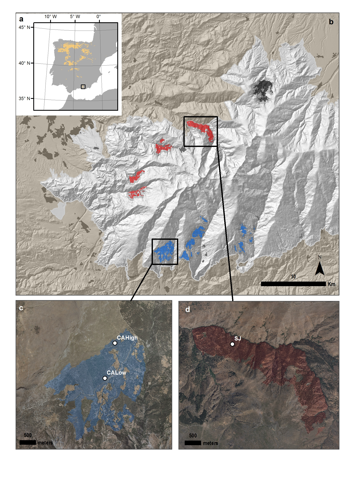{height=750px} 
##### 
**Figure 2.**
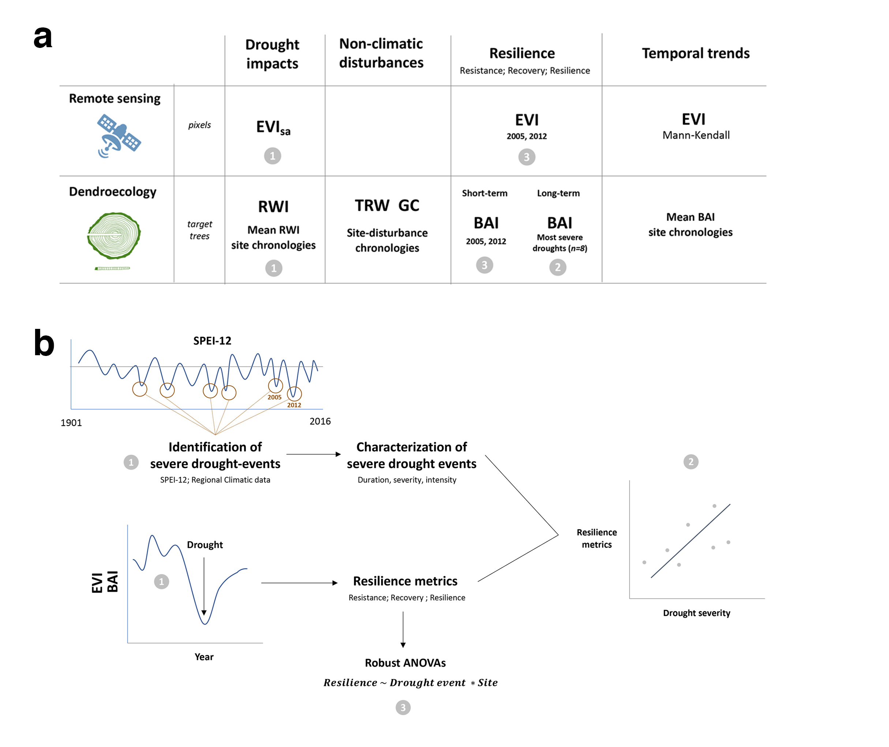

#####
**Figure 3.**
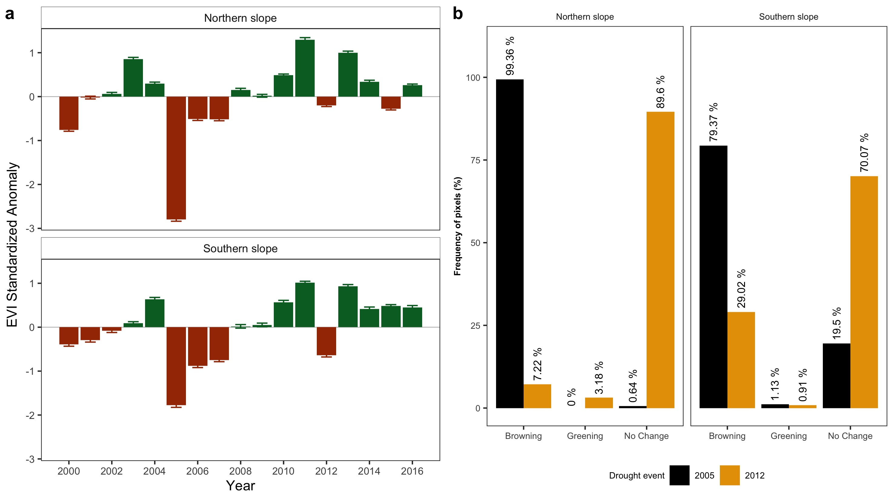

#####
**Figure 4**

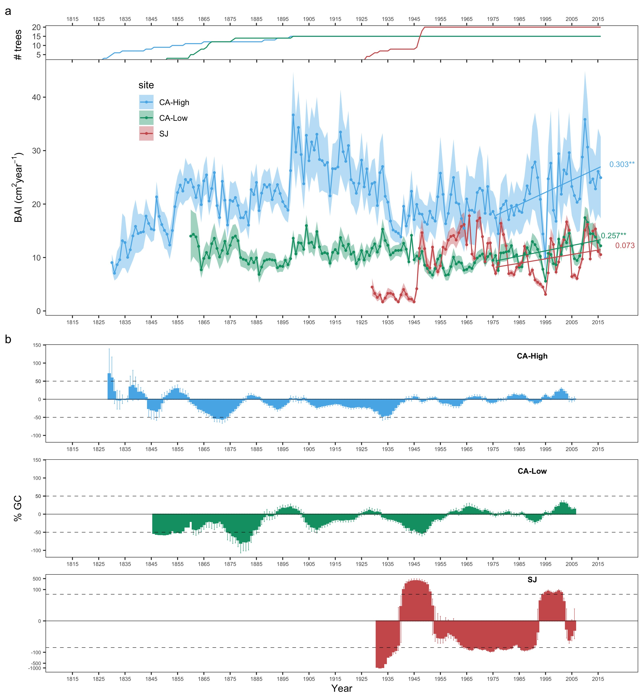

#####
**Figure 5**
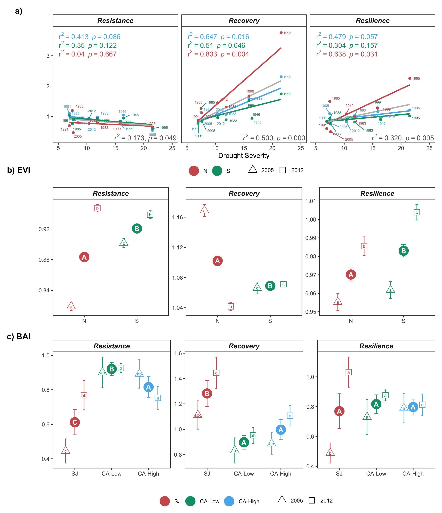


##### 

**Figure S1.** ***a)*** Temporal evolution of cumulative precipitation (hydrological year) during the period 1950-2017. Points represent the mean, and error bars the standard error. The black line indicates mean for the entire period (585 mm). The red lines represent -1 and -2 standard deviation (dotted and dashed lines, respectively). The blue lines represent +1 and +2 standard deviation (dotted and dashed lines, respectively). Years with average values below -1SD are labeled. Data from 28 meteorological stations distributed around the Sierra Nevada area (from the National Spanish Meteorological Services, AEMET). ***Inset plot***: cumulative precipitation during the hydrological years 2004-2005 (blue line) and 2011-2012 (red line). The boxplot representing the average from 1950-2015 period. Data from meteorological station Granada, Base Aérea. ***b)*** Drought severity in Sierra Nevada for the 1901-2016 period based on the Standardized Precipitation-Evapotranspiration Index (SPEI). Data from Global SPEI database (http://spei.csic.es/database.html). We took the SPEI data for a 12-month scale and for all 0.5º grid cells covering Sierra Nevada. Horizontal gray bars indicate the years 2005 and 2012. 

**Figure S2.** ***a)*** Residual tree-ring chronologies determined for the *Q. pyrenaica* sites. Dashed red lines indicate the start of the reliable period (EPS > 0.85). Dotted black lines show the severe drought years identified in our climatic data (Table S3 and Figure S1). ***b)*** Percentage of *Q. pyrenaica* trees affected by GC > 50 % by site. *Black* line shows number of trees (right-axis). Data for number of trees > 2 is shown. 

**Figure S3.** ***a)*** Correlation among site chronologies (CA-High, CA-Low and SJ) in different time domains after pre-filtering the time series with increasing size of the moving-average window (1 to 40 years). Each site chronology was smoothed using centered moving averages with different window sizes (1 to 40 years), and then Pearson's correlation coefficient between the each pair of chronologies was calculated. Significance was tested using 1000 bootstrap replicates and with 95% confidence intervals built using the R package `boot`. ***b)*** Correlation between indices of resilience (*Rt*, resistance; *Rc*, recovery; *Rs*, Resilience) using periods of several lengths (2, 3 and 4 years after a drought).

**Figure S4.** EVI annual profile (average of the period 2000-2016) for *Q. pyrenaica* forests in Sierra Nevada and drought events. Horizontal bars correspond to the most severe droughts for Sierra Nevada since 1900 (computed as in Table S3). Their position indicates the start and end months of each drought event. Bars lengths show the duration of the drought event (number of consecutive months with SPEI lower than -1.28, see [@Pascoa2017]. 

**Figure S5.** Resilience metrics of the tree growth for severe drought events since 1950 (excluding 1995 drought event). *Left*: Resistance; *Center*: Recovery; *Right*: Resilience. Points indicate resilience metrics for oak populations: SJ (*blue*), CA-High (*red*) and CA-Low (*green*). Resilience metrics were computed for each population (sample depth > 10) and drought event. The gray line represents overall relationship for each Resilience metrics.

**Figure S6.** Correlation coefficients found by relating tree-ring residual chronologies (RWI) of *Q. pyrenaica* and monthly climatic data: precipitation and 6-month SPEI (a), minimum (b) and maximum (c) temperatures. *green* bars: northern site (SJ); *light blue* bars: low-elevation southern site (CA-Low); and *dark blue* bars: high-elevation southern site (CA-High). Asterisks indicate significant ($P < 0.05$) correlation coefficients. 

**Figure S1**
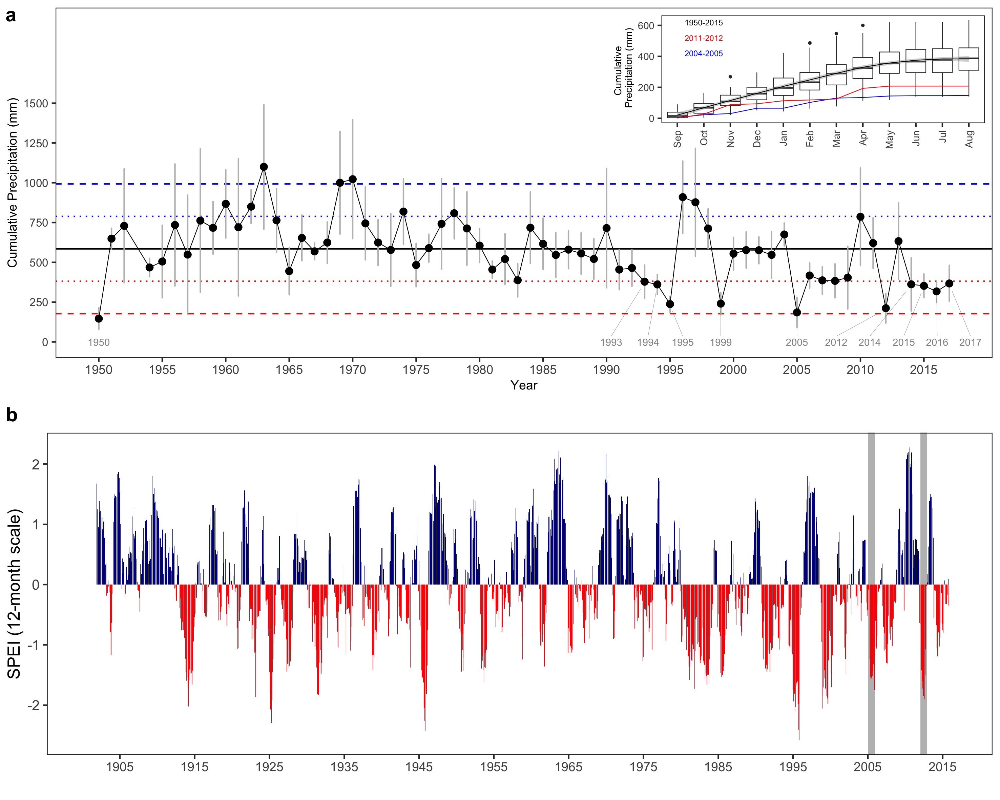

##### 
**Figure S2**
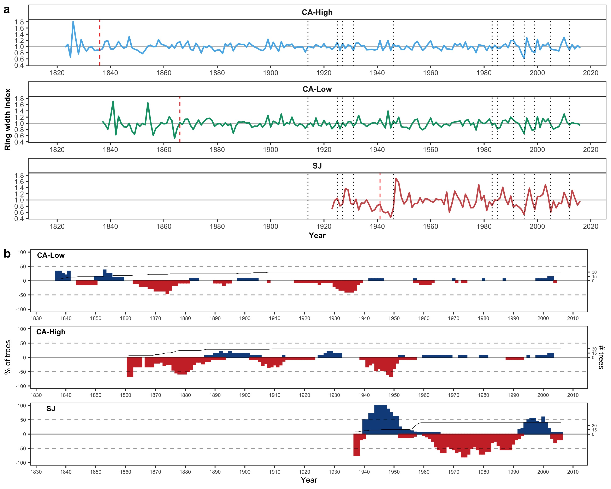

##### 
**Figure S3**
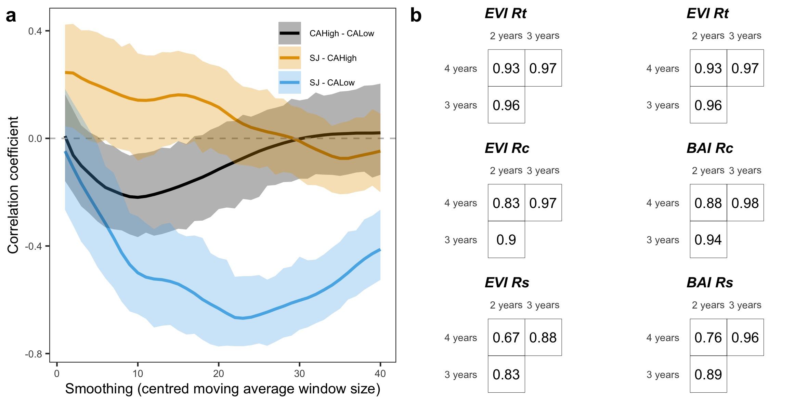

##### 
**Figure S4**


##### 
**Figure S5**
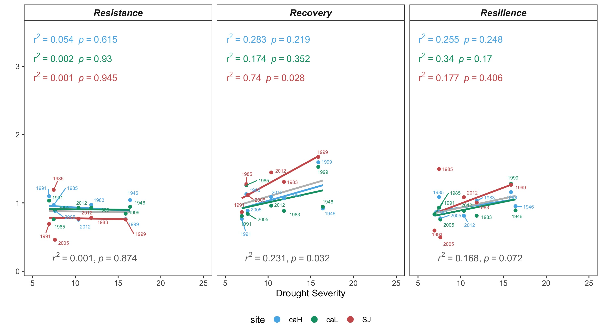

#####
**Figure S6**
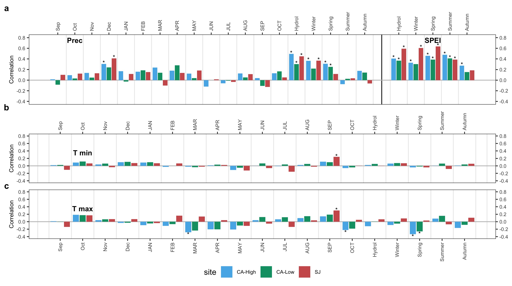


```{r, eval=FALSE, echo=FALSE}

OLD 


**Figure 1**. Distribution of *Quercus pyrenaica* forests in the Iberian Peninsula (a) and in Sierra Nevada mountain range (b). Different colors indicate oak-population clusters identified in Sierra Nevada [@PerezLuque2015]. For each population, a grid with the MODIS pixels is shown (see Material and methods). Detailed location of the dendroecological sampling sites: northern (San Juan, SJ) (c), and southern ones (Cáñar: CA-Low and CA-High) (d). Color orthophotography of 2009 from Regional Ministry of the Environment.

{height=750px}

##### 

**Figure 2.** ***a)*** EVI standardized anomaly during the period 2000-2016 for northern and southern populations. Error bars show standard error. See main text for details on EVI calculation. ***b)*** Percentage of pixels showing browning, greening or no changes during the 2005 and 2012 drought events according to EVI standardized anomalies. See main text for an explanation of greening and browning. 


##### 

**Figure 3.** Basal Area Increment (BAI) chronologies of *Q. pyrenaica* for northern population (SJ; *red*) and southern ones: low-elevation (CA-Low; *green*) and high-elevation (CA-High, *blue*) sites. Shading areas correspond to standard error of the mean. Number of series is displayed in the upper plot. Only years replicated with # series > 5 are shown. Linear trends since 1975 are indicated for all sites (numbers indicate $r^2$ values; asterisks indicate significant linear trend, *p < 0.001*).


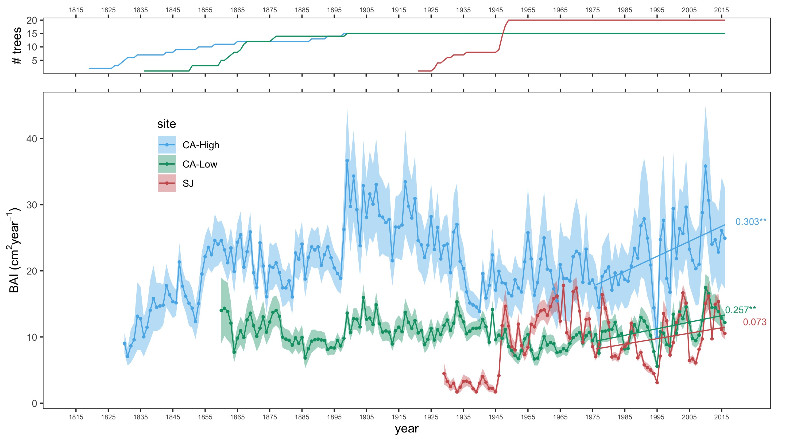

##### 

**Figure 4.** Comparison of median growth change ($GC$) following @Nowacki1997 for *Q. pyrenaica* sites. Dashed black lines indicate a threshold of 50% of GC (see Material and methods). Note that y-axes do not correspond in all of the three panels for the sake of clarity. Error bars indicate standard error. 

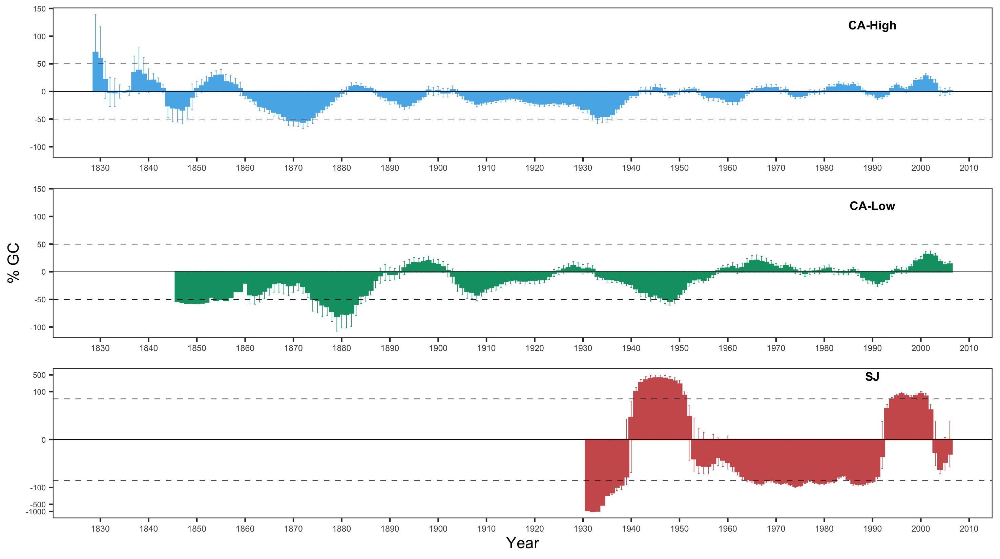

#####

**Figure 5.** Resilience metrics of tree-growth for eight severe drought events since 1950 (see main text for details) as a function of drought severity. *Left*: Resistance (*Rt*); *Center*: Recovery (*Rc*); *Right*: Resilience (*Rs*). Points indicate resilience metrics for oak populations: SJ (*red*), CA-High (*blue*) and CA-Low (*green*). Resilience metrics were computed for each population (sample depth > 10) and drought event. Gray lines represent overall relationships for each Resilience metrics.

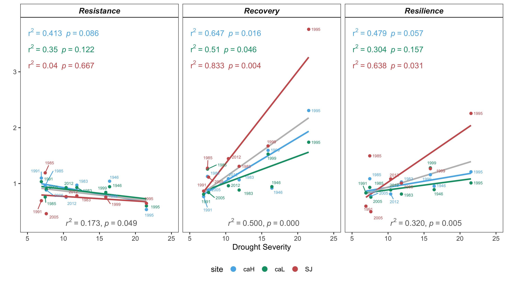


#####

**Figure 6.** Comparison of the response of  *Q. pyrenaica* forests to drought in terms of resistance, recovery, and resilience of greenness (a) and tree growth (b). For EVI, northern populations (*red circle*) were compared with southern ones (*green circle*). For BAI, the more xeric northern population (San Juan, SJ; *red circle*) was compared with the two southern populations, Cáñar-High (CA-High; *blue circle*) and Cáñar-Low (CA-Low; *green circle*). Different letters indicate significant *post hoc* differences between groups (see Material and methods for details). 

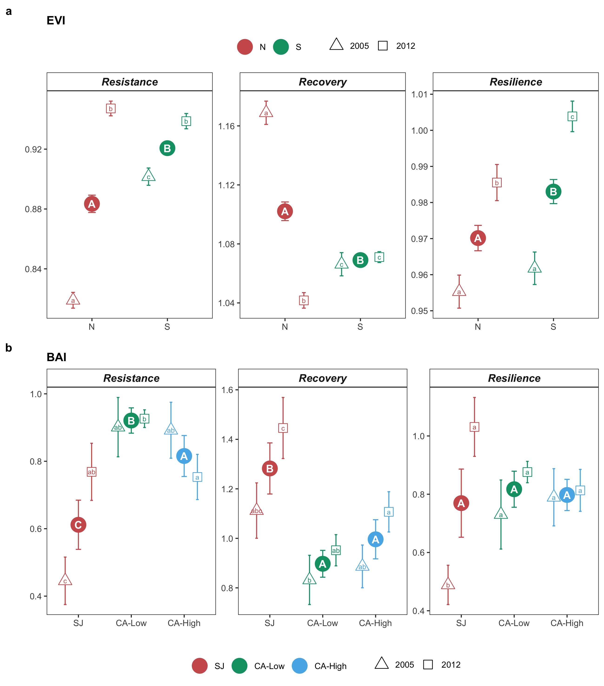
```

