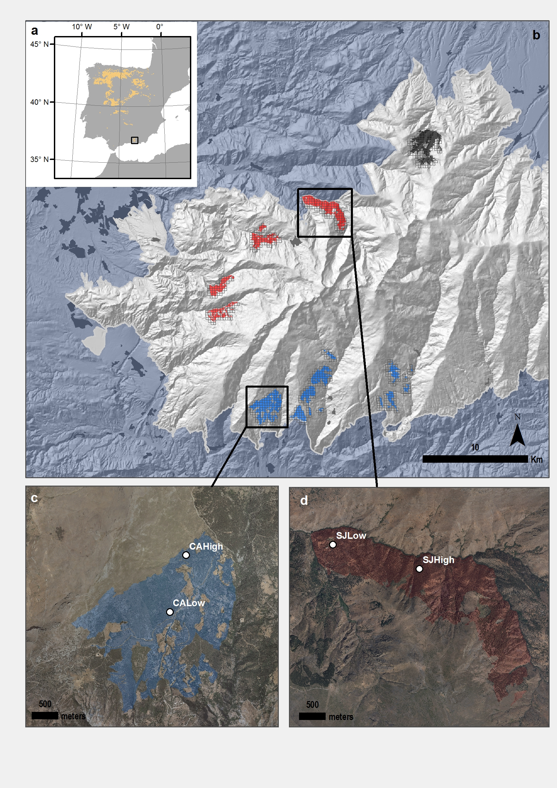

```{r, include=FALSE}
knitr::opts_chunk$set(echo = FALSE, message=FALSE, warning = FALSE)
```

```{r}
library("tidyverse")
library("here")
library("dplyr")
library("ggrepel")
library("scales")

library("grid")
library("gridExtra")
library("patchwork")
```

```{r, echo=FALSE}
show_text <- FALSE
```

```{r echo=FALSE, results='asis', eval=show_text}
cat("
# Lista de figuras 

## Figure 1 Location map 
- [X] La figura 1 puede tener un mapa de localización de SN, otro de las poblaciones de roble (clasificadas por colores: cluster; y señalando las dos poblaciones muestradas en dendro). Ver MIGRAME dataset. 

    - [] Ver https://github.com/ajpelu/qpyr_dendro/blob/master/out/fig/geomap/mapa_situacion.pdf 
    - Ojo con los nombres SJ (Que hacemos?)

## Figure 2. Plot combinado con EVI profile (a) y anomalías (b)
")
```


### Figure 1

{height=600px}

Figure 1. Distribution of *Quercus pyrenaica* forests in Iberian Peninsula (a) and in Sierra Nevada mountain range, where three cluster of oak populations have been identified [@PerezLuque2015] (showed in different colour) (b). A grid of with the MODIS pixels for each population is shown (see material and methods). Detailed location of the sampling sites: northern (San Juan, SJ) (c) and southern ones (Cáñar: CALow and CAHigh)(d). Colour Orthophotography of 2009 from Regional Ministry of the Environment, Regional Government of Andalusia.

### Figure 2 

```{r}
iv <- read.csv(here("data/evi", "iv_composite.csv"), header = TRUE, sep = ',')

drought_years <- c(2005, 2012)

evi_profile_dat_ref <- iv %>% 
  filter(!year %in% drought_years) %>% 
  group_by(composite) %>% 
  dplyr::summarise(mean=mean(evi, na.rm=TRUE),
            sd = sd(evi, na.rm=TRUE),
            se = sd/sqrt(length(evi))) %>% 
  mutate(composite_dates = 
           plyr::mapvalues(composite,
                           c(1,2,3,4,5,6,7,8,9,10,11,12,13,14,15,16,17,18,19,20,21,22,23),
                           c('01-01','01-17','02-02','02-18','03-06','03-22','04-07','04-23',
                             '05-09','05-25','06-10','06-26','07-12','07-28','08-13','08-29',
                             '09-14','09-30','10-16','11-01','11-17','12-03','12-19'))) %>%
  mutate(cd = as.Date(composite_dates, format = '%m-%d')) %>% 
  mutate(period = 'reference')

evi_profile_dat_2005 <- iv %>% 
  filter(year == 2005) %>% 
  group_by(composite) %>% 
  dplyr::summarise(mean=mean(evi, na.rm=TRUE),
            sd = sd(evi, na.rm=TRUE),
            se = sd/sqrt(length(evi))) %>% 
  mutate(composite_dates = 
           plyr::mapvalues(composite,
                           c(1,2,3,4,5,6,7,8,9,10,11,12,13,14,15,16,17,18,19,20,21,22,23),
                           c('01-01','01-17','02-02','02-18','03-06','03-22','04-07','04-23',
                             '05-09','05-25','06-10','06-26','07-12','07-28','08-13','08-29',
                             '09-14','09-30','10-16','11-01','11-17','12-03','12-19'))) %>%
  mutate(cd = as.Date(composite_dates, format = '%m-%d')) %>% 
  mutate(period = '2005')

evi_profile_dat_2012 <- iv %>% 
  filter(year == 2012) %>% 
  group_by(composite) %>% 
  dplyr::summarise(mean=mean(evi, na.rm=TRUE),
            sd = sd(evi, na.rm=TRUE),
            se = sd/sqrt(length(evi))) %>% 
  mutate(composite_dates = 
           plyr::mapvalues(composite,
                           c(1,2,3,4,5,6,7,8,9,10,11,12,13,14,15,16,17,18,19,20,21,22,23),
                           c('01-01','01-17','02-02','02-18','03-06','03-22','04-07','04-23',
                             '05-09','05-25','06-10','06-26','07-12','07-28','08-13','08-29',
                             '09-14','09-30','10-16','11-01','11-17','12-03','12-19'))) %>%
  mutate(cd = as.Date(composite_dates, format = '%m-%d')) %>% 
  mutate(period = '2012')

# Join the three dataframes
evi_profile_compara_dat <- rbind(evi_profile_dat_ref, evi_profile_dat_2005, evi_profile_dat_2012)

# colref <- '#455883'
# colref2 <- '#10253F'
# col2005 <- '#00BA38'
# col2012 <- '#F8766D'

col2012 <- '#0700fe'
col2005 <- '#19e00b'
colref <- '#7b7b7b'


profile_compara <- ggplot(evi_profile_compara_dat, aes(cd, y=mean, color=period)) + 
  geom_errorbar(aes(ymin = mean - 2*se, ymax= mean + 2*se), width=3, size=.5) + 
  #geom_errorbar(aes(ymin = mean - sd, ymax= mean + sd), width=4, colour='black') + 
  geom_line(size=.9) + 
  geom_point(size=1.5, fill='white', shape=21) +
  scale_x_date(labels = function(x) format(x, "%b"),
               breaks = date_breaks('month')) + 
  ylab('EVI') + xlab('Date') + 
  theme_bw() +
  theme_classic() + 
  theme(panel.grid.major=element_blank(),
        panel.grid.minor=element_blank(),
        legend.position = c(0.1,.9),
        plot.title = element_text(hjust = -0.05, size = 16, 
                                    margin = margin(t=-5, b=1))) +
  scale_color_manual(values=c(col2005, col2012, colref))

# profile_compara 
```


```{r}
# From explore_anomalies.Rmd 
# Read data 
anomalias_evimean <- read.csv(here("data/anomalies", "anomalias_evimean.csv"),header = TRUE, sep = ',')

anomalias_evimean <- anomalias_evimean %>% 
  mutate(
    clu_pop = as.factor(case_when(
      pop == 1 ~ "Camarate",
      pop %in% c(2,3,4,5) ~ 'Northern slope',
      pop %in% c(6,7,8) ~ 'Southern slope',
      pop == 9 ~ 'out')),
    clu_pop2 = as.factor(case_when(
      pop %in% c(1,2,3,4,5) ~ 'Northern slope',
      pop %in% c(6,7,8) ~ 'Southern slope',
      pop == 9 ~ 'out'))) %>% 
  filter(clu_pop != 'out')


# colours 
color_neg <- '#a63603'
color_pos <- '#006d2c'

# Standardized Anomalies 
avg_sa_clu <- anomalias_evimean %>% 
  group_by(clu_pop2, y) %>% 
  dplyr::summarise(mean=mean(sa, na.rm=T),
            sd = sd(sa, na.rm=T),
            se = sd/sqrt(length(sa))) %>% 
 mutate(signo = ifelse(mean >= 0, 'pos', 'neg'))

myylab <- 'EVI Standardized Anomaly'

plot_sa_clu  <- avg_sa_clu %>%  
  ggplot(aes(x=y, y=mean, fill=signo)) + 
  geom_bar(stat = "identity") + 
  geom_errorbar(aes(ymin = mean - se, ymax = mean + se, colour=signo), width=.5) +
  facet_wrap(~clu_pop2, nrow = 2) + 
  scale_fill_manual(values = c("pos" = color_pos, "neg" =  color_neg)) +
  scale_color_manual(values = c("pos" = color_pos, "neg" =  color_neg)) +
  ylab(myylab) + xlab('') +
  theme_bw() +
  theme(text = element_text(size=16),
        legend.position = "none",
        panel.grid.major.x = element_blank(),
        panel.grid.minor = element_blank(),
        strip.background = element_rect(fill = "white"),
        plot.title = element_text(hjust = -0.05, size = 16, 
                                    margin = margin(t=-5, b=1)))

# plot_sa_clu
```


```{r, fig.height=9} 
# grid.arrange(profile_compara, plot_sa_clu)
```


```{r, fig.height=7}
a_profile_compara <- profile_compara + labs(title = "a")
b_plot_sa_clu <- plot_sa_clu + labs(title = "b")
a_profile_compara + b_plot_sa_clu + plot_layout(ncol=1)
```

Figure 2. Comparison of EVI profile for the reference period (*gray*) and during the 2005 (*green*) and 2012 (*blue*) drought events (a). EVI standardized anomaly ($EVI~sa$) during the period 2000-2016 for northern and southern populations (b). Error bars show standard error. 

### Figure 3 

```{r}
mhuber <- read.csv(here("/out/anovas_resilience/huber_evi", "robust_mhuber.csv"), header = TRUE)
mhuberbai <- read.csv(here("/out/anovas_resilience/huber_bai", "robust_mhuber.csv"), header = TRUE)

# NO plot rrs 
mhuber_filter <- mhuber %>% filter(var != 'rrs') %>% mutate(disturb_year = as.factor(disturb_year))
mhuberbai_filter <- mhuberbai %>% filter(var != 'rrs') %>% mutate(disturb_year = as.factor(disturb_year))

pd <- position_dodge(.2)
line_lwd <- .8 

aes_disturb <- aes(x = disturb_year, y = M.Huber, 
                   color = site, group = site, 
                   fill = site, linetype=site,
                   shape = site, 
                   ymin = lower.ci, ymax = upper.ci)
aes_site <- aes(x = site, y = M.Huber, 
                color = disturb_year, group=disturb_year, 
                fill=disturb_year, linetype=disturb_year,
                shape = disturb_year, 
                ymin = lower.ci, ymax = upper.ci)


theme_res <- list(
  geom_errorbar(width=.2, position=pd, lwd=line_lwd), 
  geom_line(position = pd, lwd=line_lwd),
  geom_point(size = 2.5, position = pd), 
  facet_wrap(
    ~var_sorted, nrow = 1, scales="free_y",
    labeller = as_labeller(c(
      "0_rt" = "Resistance",
      "1_rc" = "Recovery",
      "2_rs" = "Resilience"))),
  geom_text_repel(aes(label=Letter), 
                  nudge_x = - 0.5,
                  nudge_y = 0.01,
                  direction="both", 
                  size = 3.5, show.legend = FALSE,
                  segment.size = 0.5, 
                  segment.alpha = 0.5),
  theme_bw(), 
  theme(
    panel.grid.minor = element_blank(),
    strip.background = element_rect(
      colour = "black",
      fill = "white"),
    plot.title = element_text(hjust = -0.05, size = 16, margin = margin(t=-5, b=1))),  
  ylab("Response value"), 
  xlab("")
)

theme_evi <-  list(
  scale_color_manual(values = c("black", "blue")),
  scale_shape_manual(values=c(19, 22)),
  scale_fill_manual(values = c("black", "blue")),
  scale_linetype_manual(values = c("solid", "solid"))
)

theme_bai <- list(
  scale_color_manual(values=c('black','blue','blue')), 
  scale_shape_manual(values=c(19, 22, 15)),
  scale_fill_manual(values=c('black','white','blue')),  
  scale_linetype_manual(values=c("solid", "solid", 'solid'))
)
```

```{r}
# EVI_drought 
res_evi_drought <-
  ggplot(mhuber_filter, aes_disturb) + 
  theme_res + theme_evi + theme(legend.position='top') + 
  ggtitle("a) EVI")


# BAI_drought 
res_bai_drought <-
  ggplot(mhuberbai_filter, aes_disturb) + 
  theme_res + theme_bai + theme(legend.position='bottom') + 
  xlab('Drought event') + 
  ggtitle("b) BAI") 

```

```{r, fig.height=7}
res_evi_drought  + res_bai_drought + plot_layout(ncol=1)
```

Figure 3. Response of northern (*black*) and southern (*blue*) populations of *Q. pyrenaica* forests to drought in terms of resistance, recovery and resilience of greenness (EVI; a) and tree growth (BAI; b) for the years 2005 and 2012. Different letters above bars indicate significant post hoc differences between groups (see material and methods). 

### Figure 4
```{r}
theme_de <- list(
  scale_color_manual(values=c('black','red')), 
  scale_shape_manual(values=c(19, 15)),
  scale_fill_manual(values=c('black','red')),  
  scale_linetype_manual(values=c("solid", "solid")),
  labs(color = 'Drougth event', fill='Drougth event', linetype='Drougth event', shape='Drougth event')
  
)

# EVI_site
res_evi_site <-
  ggplot(mhuber_filter, aes_site) + 
  theme_res + theme_de + theme(legend.position='top') + 
  ggtitle("a) EVI") 


# BAI_site
res_bai_site <-
  ggplot(mhuberbai_filter, aes_site) + 
  theme_res + theme_de + theme(legend.position='bottom') + 
  xlab('Site') + 
  ggtitle("b) BAI") 
```

```{r}
res_evi_site  + res_bai_site + plot_layout(ncol=1)
```

Figure 4. Response of *Q. pyrenaica* forests to 2005 (*black*) and 2012 (*red*) drought events in terms of resistance, recovery and resilience of greenness (EVI; a) and tree growth (BAI; b) by site. Different letters above bars indicate significant post hoc differences between groups (see material and methods). 


