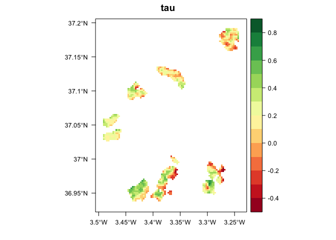

```{r, include=FALSE}
knitr::opts_chunk$set(echo = FALSE, message=FALSE, warning = FALSE, dpi = 200)
```

```{r}
library("tidyverse")
library("here")
library("dplyr")
library("ggrepel")
library("scales")

library("grid")
library("gridExtra")
library("patchwork")
library("ggcorrplot")
library("stringr")
library("pander")
library("lemon")
```

```{r, echo=FALSE}
show_text <- FALSE
```

```{r echo=FALSE, results='asis', eval=show_text}
cat("
# Lista de figuras 

## Figure 1 Location map 
- [X] La figura 1 puede tener un mapa de localización de SN, otro de las poblaciones de roble (clasificadas por colores: cluster; y señalando las dos poblaciones muestradas en dendro). Ver MIGRAME dataset. 

    - [] Ver https://github.com/ajpelu/qpyr_dendro/blob/master/out/fig/geomap/mapa_situacion.pdf 
    - Ojo con los nombres SJ (Que hacemos?)

## Figure 2. Plot de anomalias
- [X] Solamente Anomalias estandarizadas

## Figure 3. 
")
```

**Figure 1**. Distribution of *Quercus pyrenaica* forests in Iberian Peninsula (a) and in Sierra Nevada mountain (b). Different colours indicate oak population cluster's identified in Sierra Nevada [@PerezLuque2015]. For each population, a grid with the MODIS pixels is shown (see material and methods). Detailed location of the dendroecological sampling sites: northern (San Juan, SJ) (c), and southern ones (Cáñar: CA-Low and CA-High) (d). Colour orthophotography of 2009 from Regional Ministry of the Environment, Regional Government of Andalusia.

{height=600px}

##### 
**Figure 2.** EVI standardized anomaly during the period 2000-2016 for northern and southern populations. Error bars show standard error. 

```{r, eval=FALSE}
iv <- read.csv(here("data/evi", "iv_composite.csv"), header = TRUE, sep = ',')

drought_years <- c(2005, 2012)

evi_profile_dat_ref <- iv %>% 
  filter(!year %in% drought_years) %>% 
  group_by(composite) %>% 
  dplyr::summarise(mean=mean(evi, na.rm=TRUE),
            sd = sd(evi, na.rm=TRUE),
            se = sd/sqrt(length(evi))) %>% 
  mutate(composite_dates = 
           plyr::mapvalues(composite,
                           c(1,2,3,4,5,6,7,8,9,10,11,12,13,14,15,16,17,18,19,20,21,22,23),
                           c('01-01','01-17','02-02','02-18','03-06','03-22','04-07','04-23',
                             '05-09','05-25','06-10','06-26','07-12','07-28','08-13','08-29',
                             '09-14','09-30','10-16','11-01','11-17','12-03','12-19'))) %>%
  mutate(cd = as.Date(composite_dates, format = '%m-%d')) %>% 
  mutate(period = 'reference')

evi_profile_dat_2005 <- iv %>% 
  filter(year == 2005) %>% 
  group_by(composite) %>% 
  dplyr::summarise(mean=mean(evi, na.rm=TRUE),
            sd = sd(evi, na.rm=TRUE),
            se = sd/sqrt(length(evi))) %>% 
  mutate(composite_dates = 
           plyr::mapvalues(composite,
                           c(1,2,3,4,5,6,7,8,9,10,11,12,13,14,15,16,17,18,19,20,21,22,23),
                           c('01-01','01-17','02-02','02-18','03-06','03-22','04-07','04-23',
                             '05-09','05-25','06-10','06-26','07-12','07-28','08-13','08-29',
                             '09-14','09-30','10-16','11-01','11-17','12-03','12-19'))) %>%
  mutate(cd = as.Date(composite_dates, format = '%m-%d')) %>% 
  mutate(period = '2005')

evi_profile_dat_2012 <- iv %>% 
  filter(year == 2012) %>% 
  group_by(composite) %>% 
  dplyr::summarise(mean=mean(evi, na.rm=TRUE),
            sd = sd(evi, na.rm=TRUE),
            se = sd/sqrt(length(evi))) %>% 
  mutate(composite_dates = 
           plyr::mapvalues(composite,
                           c(1,2,3,4,5,6,7,8,9,10,11,12,13,14,15,16,17,18,19,20,21,22,23),
                           c('01-01','01-17','02-02','02-18','03-06','03-22','04-07','04-23',
                             '05-09','05-25','06-10','06-26','07-12','07-28','08-13','08-29',
                             '09-14','09-30','10-16','11-01','11-17','12-03','12-19'))) %>%
  mutate(cd = as.Date(composite_dates, format = '%m-%d')) %>% 
  mutate(period = '2012')

# Join the three dataframes
evi_profile_compara_dat <- rbind(evi_profile_dat_ref, evi_profile_dat_2005, evi_profile_dat_2012)

# colref <- '#455883'
# colref2 <- '#10253F'
# col2005 <- '#00BA38'
# col2012 <- '#F8766D'

col2012 <- '#0700fe'
col2005 <- '#19e00b'
colref <- '#7b7b7b'


profile_compara <- ggplot(evi_profile_compara_dat, aes(cd, y=mean, color=period)) + 
  geom_errorbar(aes(ymin = mean - 2*se, ymax= mean + 2*se), width=3, size=.5) + 
  #geom_errorbar(aes(ymin = mean - sd, ymax= mean + sd), width=4, colour='black') + 
  geom_line(size=.9) + 
  geom_point(size=1.5, fill='white', shape=21) +
  scale_x_date(labels = function(x) format(x, "%b"),
               breaks = date_breaks('month')) + 
  ylab('EVI') + xlab('Date') + 
  theme_bw() +
  theme_classic() + 
  theme(panel.grid.major=element_blank(),
        panel.grid.minor=element_blank(),
        legend.position = c(0.1,.9),
        plot.title = element_text(hjust = -0.05, size = 16, 
                                    margin = margin(t=-5, b=1))) +
  scale_color_manual(values=c(col2005, col2012, colref))

# profile_compara 
```

```{r}
# From explore_anomalies.Rmd 
# Read data 
anomalias_evimean <- read.csv(here("data/anomalies", "anomalias_evimean.csv"),header = TRUE, sep = ',')

anomalias_evimean <- anomalias_evimean %>% 
  mutate(
    clu_pop = as.factor(case_when(
      pop == 1 ~ "Camarate",
      pop %in% c(2,3,4,5) ~ 'Northern slope',
      pop %in% c(6,7,8) ~ 'Southern slope',
      pop == 9 ~ 'out')),
    clu_pop2 = as.factor(case_when(
      pop %in% c(1,2,3,4,5) ~ 'Northern slope',
      pop %in% c(6,7,8) ~ 'Southern slope',
      pop == 9 ~ 'out'))) %>% 
  filter(clu_pop != 'out')


# colours 
color_neg <- '#a63603'
color_pos <- '#006d2c'

# Standardized Anomalies 
avg_sa_clu <- anomalias_evimean %>% 
  group_by(clu_pop2, y) %>% 
  dplyr::summarise(mean=mean(sa, na.rm=T),
            sd = sd(sa, na.rm=T),
            se = sd/sqrt(length(sa))) %>% 
 mutate(signo = ifelse(mean >= 0, 'pos', 'neg'))

myylab <- 'EVI Standardized Anomaly'

plot_sa_clu  <- avg_sa_clu %>%  
  ggplot(aes(x=y, y=mean, fill=signo)) + 
  geom_bar(stat = "identity") + 
  geom_errorbar(aes(ymin = mean - se, ymax = mean + se, colour=signo), width=.5) +
  facet_wrap(~clu_pop2, nrow = 2) + 
  scale_fill_manual(values = c("pos" = color_pos, "neg" =  color_neg)) +
  scale_color_manual(values = c("pos" = color_pos, "neg" =  color_neg)) +
  ylab(myylab) + xlab('') +
  theme_bw() +
  theme(text = element_text(size=16),
        legend.position = "none",
        panel.grid.major.x = element_blank(),
        panel.grid.minor = element_blank(),
        strip.background = element_rect(fill = "white"),
        plot.title = element_text(hjust = -0.05, size = 16, 
                                    margin = margin(t=-5, b=1)))

# plot_sa_clu
```


```{r, fig.height=9} 
# grid.arrange(profile_compara, plot_sa_clu)
```


```{r, fig.height=7, eval=FALSE}
a_profile_compara <- profile_compara + labs(title = "a")
b_plot_sa_clu <- plot_sa_clu + labs(title = "b")
a_profile_compara + b_plot_sa_clu + plot_layout(ncol=1)
```

```{r, fig.height=5}
plot_sa_clu 
```

##### 
**Figure 3.** Response *Q. pyrenaica* forests to drought in terms of resistance, recovery and resilience of greenness (EVI; left-plots) and tree radial growth (BAI; right-plots) for the years 2005 and 2012. For EVI we compared northern populations (*black fill circle*) with southern ones (*blue empty circle*). For BAI we compared northern population (San Juan, SJ; *black triangle*) with southerns populations: Cáñar-High (CA-High; *blue empty squares*) and Cáñar-Low (CA-Low; *blue fill squares*). Different letters above error bars indicate significant *post hoc* differences between groups (see material and methods).

```{r, eval=FALSE, echo=FALSE}
mhuber <- read.csv(here("/out/anovas_resilience/huber_evi", "robust_mhuber.csv"), header = TRUE)
mhuberbai <- read.csv(here("/out/anovas_resilience/huber_bai", "robust_mhuber.csv"), header = TRUE)

# NO plot rrs 
mhuber_filter <- mhuber %>% filter(var != 'rrs') %>% mutate(disturb_year = as.factor(disturb_year))
mhuberbai_filter <- mhuberbai %>% filter(var != 'rrs') %>% mutate(disturb_year = as.factor(disturb_year))

pd <- position_dodge(.2)
line_lwd <- .8 

aes_disturb <- aes(x = disturb_year, y = M.Huber, 
                   color = site, group = site, 
                   fill = site, linetype=site,
                   shape = site, 
                   ymin = lower.ci, ymax = upper.ci)
aes_site <- aes(x = site, y = M.Huber, 
                color = disturb_year, group=disturb_year, 
                fill=disturb_year, linetype=disturb_year,
                shape = disturb_year, 
                ymin = lower.ci, ymax = upper.ci)


theme_res <- list(
  geom_errorbar(width=.2, position=pd, lwd=line_lwd), 
  geom_line(position = pd, lwd=line_lwd),
  geom_point(size = 2.5, position = pd), 
  facet_wrap(
    ~var_sorted, nrow = 1, scales="free_y",
    labeller = as_labeller(c(
      "0_rt" = "Resistance",
      "1_rc" = "Recovery",
      "2_rs" = "Resilience"))),
  geom_text_repel(aes(label=Letter), 
                  nudge_x = - 0.5,
                  nudge_y = 0.01,
                  direction="both", 
                  size = 3.5, show.legend = FALSE,
                  segment.size = 0.5, 
                  segment.alpha = 0.5),
  theme_bw(), 
  theme(
    panel.grid.minor = element_blank(),
    strip.background = element_rect(
      colour = "black",
      fill = "white"),
    plot.title = element_text(hjust = -0.05, size = 16, margin = margin(t=-5, b=1))),  
  ylab("Response value"), 
  xlab("")
)

theme_evi <-  list(
  scale_color_manual(values = c("black", "blue")),
  scale_shape_manual(values=c(19, 22)),
  scale_fill_manual(values = c("black", "blue")),
  scale_linetype_manual(values = c("solid", "solid"))
)

theme_bai <- list(
  scale_color_manual(values=c('black','blue','blue')), 
  scale_shape_manual(values=c(19, 22, 15)),
  scale_fill_manual(values=c('black','white','blue')),  
  scale_linetype_manual(values=c("solid", "solid", 'solid'))
)
```

```{r, eval=FALSE, echo=FALSE}
# EVI_drought 
res_evi_drought <-
  ggplot(mhuber_filter, aes_disturb) + 
  theme_res + theme_evi + theme(legend.position='top') + 
  ggtitle("a) EVI")


# BAI_drought 
res_bai_drought <-
  ggplot(mhuberbai_filter, aes_disturb) + 
  theme_res + theme_bai + theme(legend.position='bottom') + 
  xlab('Drought event') + 
  ggtitle("b) BAI") 

```

```{r, eval=FALSE, fig.height=7}
res_evi_drought  + res_bai_drought + plot_layout(ncol=1)
```


```{r, fig.height=9}
mhuber <- read.csv(here("/out/anovas_resilience/huber_evi", "robust_mhuber.csv"), header = TRUE)
mhuberbai <- read.csv(here("/out/anovas_resilience/huber_bai", "robust_mhuber.csv"), header = TRUE)


# NO plot rrs 
mhuber_filter <- mhuber %>% filter(var != 'rrs') %>% mutate(disturb_year = as.factor(disturb_year))
mhuberbai_filter <- mhuberbai %>% filter(var != 'rrs') %>% mutate(disturb_year = as.factor(disturb_year))


aux <- mhuber_filter %>% mutate(vari = '0_EVI')
aux2 <- mhuberbai_filter %>% mutate(vari = '1_BAI')
m <- bind_rows(aux2, aux)

pd <- position_dodge(width = 0.6)

aes_disturb <- aes(x = disturb_year, y = M.Huber, 
                   color = site_sorted, group = site_sorted,  
                   fill = site_sorted, linetype=site_sorted,
                   shape = site_sorted, 
                   ymin = lower.ci, ymax = upper.ci)

variables  <- c("0_EVI" = "EVI", "1_BAI" = "BAI")

# orden <- c("N", "S", "SJ", "CA-High","CA-Low")
item_site <- c("0_N" = "N", "1_S" = "S", "2_SJ" = "SJ", "3_CA-High" = "CA-High", "4_CA-Low" = "CA-Low")

tl <- guide_legend(title = "Site")

themeR <- list(
  geom_errorbar(width=.1, position = pd),
  geom_point(position = pd),
  theme_bw(),
  facet_wrap(~vari, labeller = labeller(vari = variables), scales="free"),
  xlab(''), 
  theme(
    panel.grid.minor = element_blank(),
    strip.background = element_rect(
      colour = "black",
      fill = "white"),
    strip.text = element_text(face="bold", size = 14),
    axis.title.y = element_text(face="bold", size = 14),
    plot.title = element_text(hjust = -0.05, size = 16, margin = margin(t=-5, b=1))),
  scale_shape_manual(labels = item_site, guide = guide_legend(title = "Site"),
    values=c("0_N" = 19, "1_S" = 21, "3_CA-High" = 22, "4_CA-Low" = 15, "2_SJ" = 17)), 
  scale_color_manual(labels = item_site, guide = tl,
    values=c("0_N" = 'black', "1_S" = "blue", "3_CA-High" = 'blue', "4_CA-Low" = 'blue', "2_SJ" = 'black')),
  scale_fill_manual(labels = item_site, guide = tl,
    values=c("0_N" = 'black', "1_S" = "white", "3_CA-High" = 'white', "4_CA-Low" = 'blue', "2_SJ" = 'black')),
  scale_linetype_manual(labels = item_site, guide = tl,
                        values=c("solid","solid","solid","solid", "solid")),
  scale_size_manual(labels = item_site, guide = tl,
    values=c("0_N" = "2", "1_S" = "2", "3_CA-High" = 2.5, "4_CA-Low" = 2.5, "2_SJ" = 2.5)),

  geom_text(aes(label=Letter, y=postext), 
            position=pd, 
            show.legend = FALSE, size = 3)
  # , position_jitterdodge(dodge.width = 0.6, jitter.width = .2)
  # geom_text_repel( 
  #                 nudge_x = - 0.5,
  #                 nudge_y = 0.01,
  #                 direction="both", 
  #                 size = 3.5, show.legend = FALSE,
  #                 segment.size = 0.5, 
  #                 segment.alpha = 0.5) 
)


m <- m %>% mutate(postext = case_when(
  vari == "0_EVI" ~
    case_when(var_sorted == "0_rt" ~ 0.97,
              var_sorted == "1_rc" ~ 1.19,
              var_sorted == "2_rs" ~ 1.02),
  vari == "1_BAI" ~
     case_when(var_sorted == "0_rt" ~ 1.1,
              var_sorted == "1_rc" ~ 1.7,
              var_sorted == "2_rs" ~ 1.2)))


m <- m %>% mutate(site = as.factor(
  case_when(
  site == "caH" ~ "CA-High",
  site == "caL" ~ "CA-Low",
  TRUE ~ site
)))


m <- m %>% mutate(site_sorted = as.factor(
  case_when(
  site == "N" ~ "0_N",
  site == "S" ~ "1_S",
  site == "SJ" ~ "2_SJ",
  site == "CA-High" ~ "3_CA-High",
  site == "CA-Low" ~ "4_CA-Low"
)))

rt <- m %>% filter(var == "rt") %>% 
  ggplot(aes_disturb) + themeR + 
  ylab("Resistance") 
# + geom_text(aes(label=Letter), position=position_jitterdodge(jitter.width = .2, dodge.width = 0.6), show.legend = FALSE) 

rc <- m %>% filter(var == "rc") %>% 
  ggplot(aes_disturb) + themeR + 
  ylab("Recovery")
# + geom_text(aes(label=Letter, y = 1.65), position=pd, show.legend = FALSE) 

rs <- m %>% filter(var == "rs") %>% 
  ggplot(aes_disturb) + themeR + 
  ylab("Resilience") + xlab('Drought event') 
# + geom_text(aes(label=Letter, y = 1.2), position=pd, show.legend = FALSE) 
```

```{r, fig.height=6}
grid_arrange_shared_legend(rt, rc, rs,ncol = 1, nrow = 3, position='top') 
```
  
```{r, eval=FALSE}
### Figure 4

theme_de <- list(
  scale_color_manual(values=c('black','red')), 
  scale_shape_manual(values=c(19, 15)),
  scale_fill_manual(values=c('black','red')),  
  scale_linetype_manual(values=c("solid", "solid")),
  labs(color = 'Drougth event', fill='Drougth event', linetype='Drougth event', shape='Drougth event')
  
)

# EVI_site
res_evi_site <-
  ggplot(mhuber_filter, aes_site) + 
  theme_res + theme_de + theme(legend.position='top') + 
  ggtitle("a) EVI") 


# BAI_site
res_bai_site <-
  ggplot(mhuberbai_filter, aes_site) + 
  theme_res + theme_de + theme(legend.position='bottom') + 
  xlab('Site') + 
  ggtitle("b) BAI") 
```

```{r, eval=FALSE}
res_evi_site  + res_bai_site + plot_layout(ncol=1)

**Figure 4.** Response of *Q. pyrenaica* forests to 2005 (*black*) and 2012 (*red*) drought events in terms of resistance, recovery and resilience of greenness (EVI; a) and tree radial growth (BAI; b) by site. Different letters above bars indicate significant post hoc differences between groups (see material and methods). 
```

##### 
```{r, warning=FALSE}
cro_sites <- read.csv(here("data/cronos_medias", "cronos_sites.csv"), header = TRUE, sep = ',')

colores <- c('#7570b3','#e7298a','#1b9e77')
# colores <- c('#33a02c', '#984ea3', '#a65628')

cro_sites <- cro_sites %>% mutate(site = 
  case_when(
    site == "CA_Low" ~ "CA-Low", 
    site == "CA_High" ~ "CA-High",
    site == "SJ" ~ "SJ",
  )
)

# Lm CA-High
df <- cro_sites %>% 
  filter(year >= 1975) %>% 
  filter(site == 'CA-High')

m1 <- lm(bai_mean ~ year, df)
# summary(m1)
myr2 <- format(summary(m1)$r.squared, digits = 3)

```

**Figure 4.** Basal Area Increment (BAI) chronologies of *Q. pyrenaica* for northern population (SJ; *green*) and southern ones: low-elevation (CA-Low; *pink*) and high-elevation (CA-High, *purple*) sites. Shading areas coorespond to standard error of the mean. Number of series are displayed in the upper plot. We only show chronologies with # trees > 5. Linear trend since 1975 is shown for southern high-elevation site (CA-High) ($r_2$ = `r myr2`). 

```{r, warning=FALSE, out.extra='angle=90'}

# cores 
cronos_bai <- cro_sites %>% filter(n_trees >5) %>% 
  ggplot(aes(x=year, y=bai_mean/100, colour=site)) + 
  theme_bw() + ylab('BAI') + 
  geom_ribbon(aes(ymin = (bai_mean - bai_se)/100,
                  ymax = (bai_mean + bai_se)/100,
                  fill=site), alpha=.2, colour=NA) +
  geom_line() + 
  geom_point(size=.8) + 
  theme(panel.grid = element_blank(),
        axis.text.x=element_text(size=6),
        legend.position = c(0.1,.8),
        strip.background = element_blank()) + 
  scale_colour_manual(values = colores) +
  scale_fill_manual(values = colores) +
  ylab(expression(paste("BAI (", cm^2, year^-1, ")", sep=''))) +
  scale_x_continuous(breaks = seq(1815, 2020, by=10), limits=c(1815,2020)) +
  geom_smooth(data = subset(cro_sites, year > 1975 & site == 'CA-High'), 
              aes(x=year, y=bai_mean/100, colour=site), method = 'lm', se=FALSE) 
  # scale_y_continuous(sec.axis = sec_axis(~ ., name = '# trees', breaks = c(0,15,30))) +
  # geom_line(aes(x=year, y=n_trees+40, colour=site)) 
samp <- cro_sites %>% ggplot(aes(x=year, y=n_trees, colour=site)) + 
  theme_bw() + ylab('# trees') + 
  geom_line() + 
  theme(panel.grid = element_blank(),
        legend.position = "none", 
        axis.title.x=element_blank(),
        axis.text.x=element_text(size=6),
        # axis.text.x=element_blank(),
        # axis.ticks.x=element_blank(), 
        # plot.margin = margin(t = 5, r = 0, b = -5, l = 0, unit = "pt")
        ) + 
  scale_colour_manual(values = colores) +
  scale_fill_manual(values = colores) +
  scale_x_continuous(breaks = seq(1815, 2020, by=10))  
  # theme(plot.margin = unit(c(1,5,-30,6),units="points"),
  #       axis.title.y = element_text(vjust =0.25))


plot_bai_s <- samp + cronos_bai + plot_layout(ncol=1, heights = c(0.15, 0.85))
plot_bai_s
```

##### 
**Figure 5.** Residual tree-ring chronologies obtained for the *Q. pyrenaica* sites. Dashed red lines indicate the start of the reliable period (EPS > 0.85). Dotted black lines showing the three of most recent severe drought years (1995, 2005 and 2012). 

```{r}
cro_rwi <- read.csv(here("data/cronos_medias", "cronos_sites_rwi.csv"), header = TRUE, sep = ',')
year_cutoffs <- read.csv(here("data/cronos_medias", "cronos_sites_rwi_year_cutoffs.csv"), header = TRUE, sep = ',')
year_sampledepth <- read.csv(here("data/cronos_medias", "cronos_sites_rwi_year_sampledepth.csv"), header = TRUE, sep = ',')

# peores sequias 
dy <- read.csv(file=here::here('data/sequias', 'severe_spei12.csv'), header=TRUE)
dy <- dy %>% arrange(desc(d_duration))
# solamente aquellos mayor de 2 meses 
dys <- dy %>% filter(d_duration > 2) %>% filter(maxyear > 1940 ) %>% as.data.frame() 
dys <- dys[,'maxyear'] 
```

```{r}
# top10  
top10pos50 <- cro_rwi %>% filter(year > 1950) %>% arrange_(~desc(res)) %>% group_by_(~site) %>%  slice(1:10)
top10neg50 <- cro_rwi %>% filter(year > 1950) %>% arrange_(~res) %>% group_by_(~site) %>%  slice(1:10)
top10pos <- cro_rwi %>% arrange_(~desc(res)) %>% group_by_(~site) %>%  slice(1:10)
top10neg <- cro_rwi %>% arrange_(~res) %>% group_by_(~site) %>%  slice(1:10)
```

```{r}
label_site <- c("0_sj" = "SJ",
                "1_caH" = "CA-High",
                "2_caL" = "CA-Low")


cro_rwi <- cro_rwi %>% 
  mutate(siteF = case_when(
    site_sorted == "0_sj" ~ "Northern (SJ)",
    site_sorted == "1_caH" ~ "Southern (Ca-High)",
    site_sorted == "2_caL" ~ "Southern (Ca-Low)"))

# 
plot_rwi_crono <- ggplot(cro_rwi, aes(x=year, y=res)) +
  theme_bw() + 
  theme(panel.grid = element_blank(), 
        strip.background = element_rect(fill = "white"),
        strip.text = element_text(face="bold", size=12), 
        # strip.text = element_blank(), 
        axis.text = element_text(face="bold", size=8), 
        axis.title = element_text(face="bold", size=12)) + 
  geom_hline(yintercept = 1, colour = "grey") + 
  geom_line(size=.8) + scale_y_continuous(breaks = seq(0.4,1.8, 0.2)) +
  facet_wrap(~site_sorted, scales = "free_x", ncol = 1,
             labeller = as_labeller(label_site)) + 
  ylab("Ring width index") + xlab("Year") + 
  geom_vline(aes(xintercept = year), data = year_cutoffs,  linetype = "dashed", colour='red') + 
  # geom_vline(aes(xintercept = year), data = year_sampledepth,  linetype = "dashed", colour='blue') +
  geom_vline(xintercept = c(1995, 2005, 2012), linetype = "dotted") + 
  # geom_vline(xintercept = dys, linetype = "dotted") + 
  scale_x_continuous(limits = c(1819, 2016), 
                     breaks= seq(1820, 2020, by=20)) 


plot_rwi_crono  
```

##### 
**Figure 6.** Correlation coefficients obtained by relating tree-ring residual chronologies (RWI) of *Q. pyrenaica* and monthly climatic data: precipitation (a), SPEI (b), maximun (c) and minimun (d) temperatures. *green* bars: northern site (SJ); *light blue* bars: low-elevation southern site (CA-Low); and *dark blue* bars: high-elevation shouthern site (CA-High). Asteriks indicate significant ($P < 0.05$) correlation coefficients. 

```{r}
rtmax <- read.csv(here("data/rwi_climate", "rtmax_selected.csv"), header = TRUE, sep = ',')
rtmin <- read.csv(here("data/rwi_climate", "rtmin_selected.csv"), header = TRUE, sep = ',')
rsequia <- read.csv(here("data/rwi_climate", "rsequia_selected.csv"), header = TRUE, sep = ',')
rprec <- read.csv(here("data/rwi_climate", "rprec_selected.csv"), header = TRUE, sep = ',')


rtmax <- rtmax %>% mutate(v_name = 'T max')
rtmin <- rtmin %>% mutate(v_name = 'T min')
rsequia <- rsequia %>% mutate(v_name ='SPEI')
rprec <- rprec %>% mutate(v_name = 'Prec')

df <- rbind(rtmax, rtmin, rsequia, rprec)

# cutre solucion para el problema de PREC 
exdf <- data.frame(
  id = c(16:19),
  varname = rep("prec", 4), 
  month = c('dec...FEB', 'MAR...MAY', 'JUN...AUG', 'SEP...NOV'),
  coef = rep(0, 4), 
  significant = rep('FALSE', 4),
  ci_lower = rep(0, 4),
  ci_upper = rep(0, 4), 
  sig = rep("", 4), 
  month_name = c("Winter", "Spring", "Summer", "Autumn"), 
  v_name = rep("Prec", 4))


exdf <- rbind(exdf, exdf, exdf)
exdf$X <- c(46:57)
exdf$site <- c(rep("SJ", 4), rep("caL", 4), rep("caH", 4))
  
  
ddf <- rbind(df, exdf) 


label_var <- c("Prec" = "(a) Prec", "SPEI" = "(b) SPEI", 
               "T max" = "(c) T max", "T min" = "(d) T min") 

label_site <- c("SJ" = "SJ",
                "caH" = "CA-High",
                "caL" = "CA-Low")

clima_ring <- ddf %>% ggplot(aes(x=id, y=coef, group = site)) + 
  geom_hline(yintercept = 0, colour="gray") +
  geom_bar(aes(fill=site), stat="identity", position = "dodge") +
  facet_wrap(~v_name, labeller = as_labeller(label_var)) + 
  geom_text(aes(label = sig, x = id, y = ifelse(coef > 0, (coef + 0.02), (coef - 0.05))), 
            position = position_dodge(.9), size = 6) + 
  theme_bw() + 
  theme(axis.title.x = element_blank(),
        panel.grid.major = element_blank(),
        panel.grid.minor.y = element_blank(),
        axis.text.x = element_text(angle = 90, vjust = 0.3),
        legend.position = "bottom",
        strip.background = element_rect(fill=NA, colour=NA),
        strip.text.x = element_text(size = 10, face = "bold")) + 
  scale_x_continuous(breaks = unique(ddf$id), labels = unique(ddf$month_name)) +
  scale_y_continuous(limits = c(-0.4, 0.8), 
                     breaks = c(-0.4, -0.2, 0, 0.2, 0.4, 0.6,0.8)) + 
  scale_fill_manual(values = c("#B2DF8A","#1F78B4","#A6CEE3"), labels = label_site) + 
  ylab('Correlation')  

clima_ring 
```

#####
**Figure 7.** Comparison of median growth change ($GC$) following @Nowacki1997 for *Q. pyrenaica* sites. Dashed black lines indicate a threshold of 50 % of GC (see material and methods). 

```{r}
gc_todos <- read.csv(here("data/disturbance", "disturbance_gc.csv"), header = TRUE, sep = ',')

# customize plot (corrected scale)
pos_neg_log <- scales::trans_new('signed_log', 
                                 transform = function(x) sign(x)*log(abs(x)),
                                 inverse = function(x) sign(x)*exp(abs(x)))

custom_ylab <- '% GC'
micolor <- c("#838B8B")


# solution for arrange
# http://felixfan.github.io/stacking-plots-same-x/

custom_corrected_gc <- list(
  geom_bar(stat='identity', fill=micolor, colour=micolor),
  theme_bw(), 
  geom_hline(yintercept=c(50, -50), linetype=2, colour='black'),
  theme(panel.grid.minor = element_blank(), 
        strip.background = element_rect(colour='black',fill='white'))
  )

c <- gc_todos %>% 
  filter(site != 'gc_sj') %>% 
  ggplot(aes(x=year, y=gc_md)) + 
  geom_hline(yintercept = 0, colour = 'black', lwd = 0.3) + 
  geom_errorbar(aes(ymin = gc_md - gc_md_se, ymax = gc_md + gc_md_se), colour='gray', width=.3, size=.2) + 
  # scale_y_continuous(trans = pos_neg_log) +
  facet_wrap(~site_sorted, nrow = 2,
             labeller=as_labeller(c("1_caH" = "CA-High", "2_caL" = "CA-Low"))) + 
    ylab(custom_ylab) + custom_corrected_gc

d <- gc_todos %>% 
  filter(site == 'gc_sj') %>% 
  ggplot(aes(x=year, y=gc_md)) + 
  xlim(layer_scales(c)$x$range$range[1],layer_scales(c)$x$range$range[2]) +
  geom_hline(yintercept = 1, colour = 'gray', lwd = 0.3) + 
  geom_errorbar(aes(ymin = gc_md - gc_md_se, ymax = gc_md + gc_md_se), colour=micolor, width=.3, size=.2) +
  facet_wrap(~site_sorted, nrow = 2,
             labeller=as_labeller(c("0_sj" = "SJ"))) + 
  custom_corrected_gc + ylab('') + 
  scale_y_continuous(trans = pos_neg_log, 
                     breaks=c(-1000, -500, -100, 0, 100, 500)) +
  theme(axis.title.x = element_blank(),
        axis.text.x = element_blank()) 


plot_medians_corregido <- d + c + plot_layout(ncol=1, heights = c(1, 2))
plot_medians_corregido

```


##### 
**Figure 8**. Percentage of *Q. pyrenaica* trees affected by GC > 50 % by site. *Black* line shows number of trees (rigth-axis). 

```{r}
gc_treesMed <- read.csv(here("data/disturbance", "disturbance_trees_gc_treshold_median.csv"), header = TRUE, sep = ',')
gc_treesMed50 <- read.csv(here("data/disturbance", "disturbance_trees_gc_treshold_median50.csv"), header = TRUE, sep = ',')

colorpositivo <- c("#104E8B")
colornegativo <- c("#CD3333")

pgc_median50 <- gc_treesMed50 %>% ggplot() +
  geom_bar(aes(x=year, y=per_pos), fill=colorpositivo, colour=colorpositivo, stat = "identity", position = "dodge") + 
  geom_bar(aes(x=year, y=(-1)*per_neg), fill=colornegativo, colour=colornegativo, stat = "identity", position = "dodge") +
  facet_wrap(~site_sorted, nrow = 3, labeller = as_labeller(label_site)) + 
  scale_y_continuous(sec.axis = sec_axis(~ ., name = '# trees', breaks = c(0,15,30))) +
  geom_line(aes(x=year, y=total_tree), colour = 'black') + 
  theme_bw() + ylab('% trees') +
  geom_hline(yintercept=c(50, -50), linetype=2, alpha=.4) +
  theme(panel.grid.minor = element_blank(), 
        strip.background = element_rect(colour='black', 
                                        fill='white')) 
pgc_median50

```
##### 
**Appendix S1.** Temporal evolution of cumulative precipitation (hydrological year) during the period 1950-2017. Points represent mean and errorbars standard error. *Black* line indicates mean for all period. *Red* lines represent -1 and -2 standard deviation (*dotted* and *dashed* lines respectively). *Blue* lines represent +1 and +2 standard deviation (*dotted* and *dashed* lines respectively). Years with average values below -1SD are labelled. Data from 28 meteorological stations distributed around Sierra Nevada area (from National Spanish Meteorological Services, AEMET). ***Inset plot***: cumulative precipitation during the hydrological years 2004-2005 (*blue line*) and 2011-2012 (*red line*). The boxplot representing the average from 1950-2015 period. Data from meteorological station Granada, Base Aérea. 

```{r, fig.height=5}
ltdf <- read.table(file=here("/data_raw/meteo", "long_term_data_rediam_data.txt"), header=T, sep=';', dec=',')

source(here("/script/R/", "hydro_year.R"))

ltdf <- ltdf %>% 
  dplyr::select(cod = INDICATIVO, VARIABLE, FECHA, VALOR) %>% 
  dplyr::mutate(fecha = as.Date(FECHA, format='%d/%m/%Y'),
         month = lubridate::month(fecha),
         hmonth = ifelse(month <= 8, month + 4, month -8), 
         hyear = hydro_year(fecha),
         hyear_f = paste0(hyear-1,'-', hyear))


# We used only the 5514 station (the most long term)
# Filter by station and prec 
# Filter from 1950 
st5514 <- ltdf %>% 
  filter(VARIABLE == 'PM1') %>% 
  filter(cod == '5514') %>% 
  filter(hyear >= 1950) %>% 
  dplyr::select(fecha, month, hmonth, hyear, hyear_f, pre=VALOR)

st5514_pro <- st5514 %>% 
  group_by(hyear_f, hmonth) %>% 
  dplyr::summarise(pre = sum(pre)) %>%
  dplyr::mutate(csum = cumsum(pre)) %>% as.data.frame()

df <- st5514_pro  %>% 
  filter(!(hyear_f %in% c('2004-2005', '2011-2012')))
  
cp <- ggplot(df, aes(x=as.factor(hmonth), y=csum)) + 
  geom_boxplot(aes(x=as.factor(hmonth))) +  
  geom_smooth(aes(group=1), se=TRUE, level=0.95, colour='black') + 
  geom_line(data=subset(st5514_pro, hyear_f == '2004-2005'),
            aes(x=as.factor(hmonth), y=csum, group=1), colour='blue') +
  geom_line(data=subset(st5514_pro, hyear_f == '2011-2012'),
            aes(x=as.factor(hmonth), y=csum, group=1),
            colour='red') +
  theme_bw() + 
  theme(strip.background = element_rect(fill = NA, color = "black"),
        axis.text.x = element_text(angle = 90, hjust = 1, size=7),
        axis.text.y = element_text(size=7),
        axis.title.y = element_text(size = 7)) + 
  ylab('Cumulative Precipitation (mm)')  + xlab('') + 
  # ggtitle('Granada Base Aerea, 1950-2015') + 
  scale_x_discrete(labels=c("1"="Sep", "2"="Oct", "3"="Nov", "4"="Dec", "5"="Jan", "6"="Feb",
                            "7"="Mar", "8"="Apr", "9"="May", "10"="Jun", "11"="Jul", "12"="Aug")) +
  annotate("text", label = "2004-2005", x = 2, y = 500, size = 2, colour = "blue") + 
  annotate("text", label = "2011-2012", x = 2, y = 550, size = 2, colour = "red") + 
  annotate("text", label = "1950-2015", x = 3, y = 600, size = 2, colour = "black") +
  theme(panel.grid = element_blank())
```


```{r}
prec_files <- list.files(here::here('data_raw/meteo/prec_subclima/'), pattern="*.csv")

dfpre <- c() 

for (i in prec_files){
  
  auxdf <- read.csv(here::here('data_raw/meteo/prec_subclima', i), header = TRUE, sep=";")
  auxdf$code <- gsub(x=i, pattern = ".csv", replacement = "")
  
  dfpre <- rbind(dfpre, auxdf)
} 
  

dfpre$date <- as.Date(dfpre$date, format = "%d/%m/%Y")

dfpre <- dfpre %>% 
  dplyr::mutate(fecha = as.Date(date, format='%d/%m/%Y'),
         month = lubridate::month(fecha),
         hmonth = ifelse(month <= 8, month + 4, month -8), 
         hyear = hydro_year(fecha),
         hyear_f = paste0(hyear-1,'-', hyear))


aux <- dfpre %>% 
  group_by(hyear_f, code) %>% 
  dplyr::mutate(csum = cumsum(prec)) %>% 
  filter(hmonth == 12) %>% 
  dplyr::select(-month, -prec, -date, -fecha) %>% as.data.frame()


presn <- aux %>% group_by(hyear) %>% 
     dplyr::summarise(
     csum_mean = mean(csum, na.rm = TRUE),
     csum_sd = sd(csum, na.rm = TRUE), 
     csum_se = csum_sd/sqrt(length(csum_sd)), 
     n = n())  

meandf <- mean(presn$csum_mean)
sddf <- sd(presn$csum_mean)

prec_hydrol_sn <- ggplot(presn, aes(x=hyear, y=csum_mean)) + 
  geom_hline(yintercept = meandf) + 
  geom_hline(yintercept = meandf + 2*sddf, color ='blue', linetype = 'dashed') +
  geom_hline(yintercept = meandf - 2*sddf, color ='red', linetype = 'dashed') +
  geom_hline(yintercept = meandf + 1*sddf, color ='blue', linetype = 'dotted') +
  geom_hline(yintercept = meandf  - 1*sddf, color ='red', linetype = 'dotted') +
  geom_errorbar(aes(ymin = csum_mean - csum_se, ymax= csum_mean + csum_se), width=.1, colour='gray') +
  geom_point(size=2) + theme_bw() +
  scale_x_continuous(breaks=seq(1950,2020, by=5)) +
  scale_y_continuous(breaks=seq(0,1500, by=250)) +
  geom_text_repel(
    data = subset(presn, csum_mean < (meandf - 1*sddf)),
    aes(label = hyear), 
    size = 3) +
  theme(panel.grid.minor = element_blank()) +
  ylab('Cumulative Precipitation (hydrological year)') + xlab('year')


prec_hydrol_sn + annotation_custom(ggplotGrob(cp), xmin = 1990, xmax = 2020, ymin = 1050)
```


##### 

```{r, echo=FALSE}
# Get file names
myfiles <- list.files(path = here("/data_raw/spei_all/"), pattern = "\\.csv$")

mydf <- data.frame() 

# Loop to read files and prepare data
for (j in myfiles){ 
  aux <- read.csv(file=paste0(here("/data_raw/spei_all/"), j), header = TRUE, sep = ',')
  
  # Remove csv and get name 
  name_aux <- str_replace(j, ".csv", "") 
  
  # Get lat long
  latlong <- str_replace(name_aux, "SPEI_", "")
  
  mylat <- as.numeric(str_split_fixed(latlong, "_", 2))[1]
  mylong <- as.numeric(str_split_fixed(latlong, "_", 2))[2]
  
  aux$lat <- mylat
  aux$long <- mylong 

  # Split time 
  # Get year 
  aux$year <- as.numeric(str_extract(aux$DATA, "[0-9]+"))
  
  # Get month 
  aux$month <- str_extract(aux$DATA, "[aA-zZ]+")
  
  # Variable month in number 
  aux$months <- match(aux$month, month.abb)

  # assign(name_aux, aux)
  
  mydf <- rbind(mydf, aux)
}

spei <- mydf %>% select(SPEI_12, year, months) %>% 
  group_by(year,months) %>% 
  summarise(spei6 = mean(SPEI_12),
            spei6_sd = sd(SPEI_12)) %>% 
  mutate(date = lubridate::ymd(paste(year, months, "01")))

spei <- spei %>% 
  mutate(sign = case_when(
    spei6 > 0 ~ "pos",
    TRUE ~ "neg"))
```

**Appendix S2**. Drought severity in the Sierra Nevada for the 1950-2016 period based on the Standardised Precipitation-Evapotranspiration Index (SPEI). Data from Global SPEI database (http://spei.csic.es/database.html). We obtanied the SPEI data for a 12 month scale and for all 0.5º grid cells covering Sierra Nevada.  

```{r, fig.height=5}
limits <- as.Date(c("1949-01-01", "2015-12-01"))
spei %>% 
  ggplot(aes(x=date, y=spei6, fill=sign)) +  
  geom_bar(stat = "identity") + 
  scale_fill_manual(values = c("pos" = "darkblue", "neg" = "red")) +
  theme_bw()  + 
  labs(title= 'Drought evolution for Sierra Nevada',
    x= '',
    y='SPEI (12-month scale)') +
  theme(strip.background = element_rect(fill = "white"),
        legend.position = "none") +
  scale_x_date(date_breaks = "5 year", date_labels = "%Y", limits=limits) 
```


```{r, echo=FALSE, eval=FALSE}
**Figure S2**. Spatial distribution of the EVI-annual trends ($\tau$) for the period 2000-2016. Negative values (*red* values) indicate negative trends and positive values (*green* values) indicate positive trends. 

{width=150%}
```


##### 
**Appendix S3.** Drought events for Sierra Nevada based on SPEI index. A drought event starts in the month when SPEI falls below the threshold of -1.28 [@Pascoa2017]. A drought event is considered only when SPEI value are below threshold for at least two consecutive months [*e.g.* @Spinoni2015; @Spinoni2017a; @Pascoa2017]. The ***duration*** of a drought event is the number of consecutive months with the SPEI lower than a certain threshold. ***Severity*** of a drought event is the sum of the SPEI values (absolute values) during the duration of the drought event. ***Intensity*** and ***Lowest SPEI*** refer to the mean and lowest value of SPEI respectively during the drought event duration. 

```{r}
# peores sequias 
dy <- read.csv(file=here::here('data/sequias', 'severe_spei12.csv'), header=TRUE)
dy <- dy %>% arrange(desc(d_duration))
# solamente aquellos mayor de 2 meses 
dys <- dy %>% 
  filter(d_duration > 2) %>%  
  mutate(year = ifelse(minyear == maxyear, 
                       minyear, 
                       paste0(minyear, '-', maxyear))) %>% 
  dplyr::select(-minyear, -maxyear, -cat, -month_peak) %>% 
  as.data.frame() 


colnames(dys) <- c("Duration (months)", "Intensity", "Severity", "Lowest SPEI", "Year")

pander(dys)
```

##### 
**Appendix S4.** Percentage of pixels showing browning, greenning or no-changes during the 2005 and 2012 droguht events according to EVI standardized anomalies.  

```{r}
df <- read.csv(file=here::here('/out/anomalies/evi' ,'percen_browing_greening.csv'), header=TRUE)

df <- df %>% add_row(clu_pop2 = 'Northern slope',
                             type = 'greening',
                             count_clu = 0, per = 0.00, y = 2005)

per_pixels_green <- df %>% 
  ggplot(aes(x=type, y=per, fill=as.factor(y))) + 
  geom_bar(stat='identity', position = "dodge") + 
  geom_text(aes(label = paste0(per, " %")), position=position_dodge(width=0.9), hjust=-.1, size=3, angle = 90) + 
  facet_wrap(~clu_pop2) + 
  theme_bw() + xlab('') + ylab('Frequency of pixels (%)') +
  theme(strip.background = element_rect(colour = "black", fill = "white")
        ) + labs(fill = 'Drought event') + scale_fill_manual(values = c("#DAA520", "#104E8B")) +
  scale_y_continuous(expand=c(.1,0))


per_pixels_green
```

##### 
**Appendix S5.** Resilience metrics of the tree-growth for the most severe drought events. *Left*: Resistance (*Rt*); *Center*: Recovery (*Rc*); *Right* Resilience (*Rs*). Points indicate average of resilience metrics for all populations. Error bar corresponds standard error. Resilience metrics were computed for each population (sample depth > 10) and drought event.

```{r, warning=FALSE, out.extra='angle=90', fig.height=5}
# see trends-resilience_bai.Rmd 
df <- read.csv(file=here::here('/out/bai_resiliences_severes' ,'resiliences_bai_droughts.csv'), header=TRUE)

#https://gist.github.com/ottadini/6882677 
lm_eqn = function(m) {
  # Displays regression line equation and R^2 value on plot
  # Usage:
  # p + annotate("text", x=25, y=300, label=lm_eqn(lm(y ~ x, df)), parse=TRUE)
  
  l <- list(#a = format(coef(m)[1], digits = 2),
            # b = format(abs(coef(m)[2]), digits = 2),
            r2 = format(summary(m)$r.squared, digits = 3));
  
  if (coef(m)[2] >= 0)  {
    # eq <- substitute(italic(y) == a + b %.% italic(x)*","~~italic(r)^2~"="~r2,l)
    eq <- substitute(~~italic(r)^2~"="~r2,l)
  } else {
    # eq <- substitute(italic(y) == a - b %.% italic(x)*","~~italic(r)^2~"="~r2,l) 
    eq <- substitute(~~italic(r)^2~"="~r2,l)
  }
  
  as.character(as.expression(eq));                 
}


sdf <- df %>% 
  filter(samps >= 10) %>% 
  group_by(disturb_year) %>% 
  summarise_at(c("rt_mean", "rs_mean", "rc_mean", "rrs_mean"), 
               funs(mean(., na.rm = TRUE), sd(., na.rm=TRUE),se=sd(., na.rm=TRUE)/sqrt(n()))) %>% 
  inner_join(dy, by=c("disturb_year" = "maxyear")) 


plotrel <- function(df, v, x, label, XLab, YLab, coordX_eq, coordY_eq, titulo){
  require(ggplot2)
  require(ggrepel)

  formulita <- as.formula(paste0(v, "_mean_mean ~", x)) 
  
  yerrbar <- aes_string(ymin = paste0(v, "_mean_mean - ",  v, "_mean_se"), 
                        ymax = paste0(v, "_mean_mean + ",  v, "_mean_se")) 
  
  ggplot(df, aes_string(y=paste0(v, "_mean_mean"), x=x, label=label)) + 
    geom_smooth(method='lm', se=FALSE, colour="black") +
    geom_errorbar(mapping = yerrbar) + 
    geom_point(size=4, pch = 21, colour="black", fill="white") + 
    theme_bw() + 
    xlab(XLab) + ylab(YLab) + 
    geom_text_repel() + 
    annotate("text", x=coordX_eq, y = coordY_eq, 
             label=lm_eqn(lm(formulita, df)), parse=TRUE) +
    ggtitle(titulo) + 
    theme(plot.title = element_text(size = 14, 
                                    face = "bold.italic",
                                    margin = margin(b = -15)), 
          axis.title.y = element_blank())
  }

sevRs <- plotrel(sdf, v = "rs", x = 'd_severity', label = 'disturb_year',
        XLab = "Drought Severity", YLab = "Resilience (Rs) (3year window size)", 
        coordX_eq = 7, coordY_eq = 0.5, titulo = "Rs") 


sevRt <- plotrel(sdf, v = "rt", x = 'd_severity', label = 'disturb_year',
        XLab = "Drought Severity", YLab = "Resistance (Rt) (3year window size)",
        coordX_eq = 7, coordY_eq = 0.5, titulo = "Rt") 

sevRc <- plotrel(sdf, v = "rc", x = 'd_severity', label = 'disturb_year',
        XLab = "Drought Severity", YLab = "Recovery (Rc) (3year window size)",
        coordX_eq = 7, coordY_eq = 0.5, titulo = "Rc")

sevRt + sevRc + sevRs + plot_layout(ncol = 1)

```

##### 
**Appendix S6.** Correlation between indices of resilience (*Rt*, resistance; *Rc*, recovery; *Rs*, Resilience) using periods of several lengths (2, 3 and 4 years after a drought). Top plots (a, b and c) showing the resilience indices of greenness (EVI) to drought; and bottom plots (d, e, f) the resilience indices of tree-growth (BAI) to drought. 

```{r}

corBai <- read.csv(file=here("/out/correla_resilience/", "correla_window_size.csv"), header = TRUE)
corEvi <- read.csv(file=here("/out/correla_resilience/", "correla_window_size_evi.csv"), header = TRUE)
corRwi <- read.csv(file=here("/out/correla_resilience/", "correla_window_size_rwi.csv"), header = TRUE)

generaMatrix <- function(cordf, variable){ 
  m <- cordf %>% filter(var == variable) %>% 
    dplyr::select(-var, -window_size) %>% 
    mutate(w1 = c(2, 2, 3), 
           w2 = c(3,4,4)) 
  mf <- m %>% 
    dplyr::select(r2, w2, w1) %>% rename(w1 = w2, w2 = w1)
  
  df <- m %>% rbind(mf) %>% 
    add_row(r2 = 1, w1=2, w2=2) %>% 
    add_row(r2 = 1, w1=3, w2=3) %>% 
    add_row(r2 = 1, w1=4, w2=4) 
  
    df <- df %>% 
    mutate(w1 = case_when(
      w1 == 2 ~ '2 years',
      w1 == 3 ~ '3 years',
      w1 == 4 ~ '4 years'),
      w2 = case_when(
      w2 == 2 ~ '2 years',
      w2 == 3 ~ '3 years',
      w2 == 4 ~ '4 years'))

      cor_df <- as.data.frame.matrix(xtabs(r2 ~., df))

return(cor_df)
}

cor_rt <- generaMatrix(corBai, 'rt')
cor_rc <- generaMatrix(corBai, 'rc')
cor_rs <- generaMatrix(corBai, 'rs') 

cor_rte <- generaMatrix(corEvi, 'rt')
cor_rce <- generaMatrix(corEvi, 'rc')
cor_rse <- generaMatrix(corEvi, 'rs')


g_rt <- ggcorrplot(cor_rt, type='upper', lab=TRUE, title='BAI Rt', show.legend = FALSE)
g_rc <- ggcorrplot(cor_rc, type='upper', lab=TRUE, title='BAI Rc', show.legend = FALSE)
g_rs <- ggcorrplot(cor_rs, type='upper', lab=TRUE, title='BAI Rs', show.legend = FALSE)
g_rte <- ggcorrplot(cor_rte, type='upper', lab=TRUE, title='EVI Rt', show.legend = FALSE)
g_rce <- ggcorrplot(cor_rce, type='upper', lab=TRUE, title='EVI Rc', show.legend = FALSE)
g_rse <- ggcorrplot(cor_rse, type='upper', lab=TRUE, title='EVI Rs', show.legend = TRUE)

(g_rte + g_rce + g_rse) / (g_rt + g_rc + g_rs) + plot_layout(nrow=2) + plot_annotation(tag_levels = c('a'))
```


##### 
**Appendix S7.** Correlation among site chronologies (CA-High, CA-Low and SJ) in different time-domains after pre-filtering the time-series with increasing size of the moving-average window (1 to 40 years). Each site chronology was smoothed using centred moving averages with different window sizes (1 to 40 years), and then Pearson's correlation coefficient between the each pair chronologies were calculated. Significance was tested using 1000 boostrap replicates and with 95 % confidence intervals built using the R packgae `boot` [@Canty2016]. 

```{r}
correla  <- read.csv(file=here("/data/correla_ventanas_temporales/", "correla_chronos.csv"), header = TRUE)

correla <- correla %>% 
  mutate(
    name_comparison = as.factor(case_when(
      name_comparison == "caH-caL" ~ "CAHigh - CALow",
      name_comparison == "sj-caL" ~ "SJ - CALow",
      name_comparison == "sj-caH" ~ "SJ - CAHigh")))


correla_sitesSJCALH  <- correla %>% 
  filter(metodo_correla == 'pearson') %>%
  ggplot(aes(x=size, y=estimate, colour=name_comparison)) + 
  geom_line()+ theme_bw() + ylab('Correlation coefficient') +
  xlab('Smoothing (centred moving average window size)') + 
  # geom_smooth(method = 'loess', se=FALSE) + 
  theme(panel.grid = element_blank()) +
  geom_hline(yintercept = 0, colour='gray', linetype=2) + 
  geom_line(aes(x=size, y=ci_lower, colour=name_comparison), linetype = 2) +
  geom_line(aes(x=size, y=ci_upper, colour=name_comparison), linetype = 2) +
  theme(legend.position = c(.8,.9), legend.title = element_blank())

correla_sitesSJCALH
```

##### 
**Appendix S8.** Tabla S1

##### 
**Appendix S9.** Tabla S2

#####
**Appendix S10.** Comparison EVI previous and post 

```{r}
df <- read.csv(file=here::here("data/evi", "evi_globalmeans_drouhgt.csv"), header = TRUE, sep = ',')

ggplot(df, 
       aes(x=disturb, y=mean, colour=site)) + 
  geom_point(size=2) + 
  geom_errorbar(aes(ymin = mean - se, ymax = mean + se), width = .1) +
  geom_line(aes(group=site)) + 
  facet_wrap(~disturb_year) + 
  scale_x_discrete(labels = c("1_dr" = "Drought", "0_pre" = "Previous", "2_post" = "Posterior")) + 
  theme_bw() +
  xlab("") + ylab("EVI") + 
  theme(
    strip.background = element_rect(fill = "white"),
    strip.text = element_text(face="bold", size=12),
    axis.title.y = element_text(face="bold", size=12)
  ) +
  scale_color_manual(values=c('black', 'blue', 'gray'))
```
