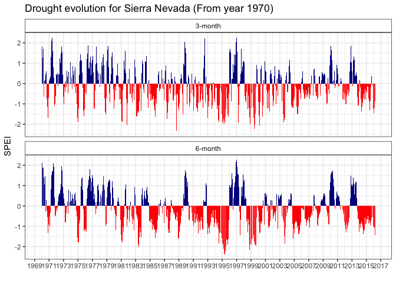

```{r setup, include=FALSE}
knitr::opts_chunk$set(echo = TRUE)
```

# Introduccion 

- Item 1 
    - sub 

--- 

# Sequía

- Aumento en la **severidad** y **frecuencia** de los eventos de sequías en las últimas décadas, especialmente para el sur de Europa [@VicenteSerrano2014; @Spinoni2015; @Stagge2017]
- Eventos extremos P. Ibérica: 1981, 1995, 2000, **2005**, **2012**  [@GarciaHerrera2007; @Gouveia2015; @Trigo2013]

## Análisis adicionales
 
- SPEI (Standardised Precipitation-Evapotranspiration Index) para datos regionales procedentes de SPEI Global Drought Monitor. 
  
    - spatial resolution of 0.5º


--- 

Sequía (análisis adicionales): SPEI 


- Escala **regional**:
    - Datos de [SPEI Global Drought Monitor](http://sac.csic.es/spei/database.html) para Sierra Nevada (spatial resolution of 0.5º) Ver [esto](https://github.com/ajpelu/qpyr_resilience/blob/master/analysis/drought/explore_drought_spei_regional.md) 
  
--- 



---


  
--- 


## Including Plots

You can also embed plots, for example:


Note that the `echo = FALSE` parameter was added to the code chunk to prevent printing of the R code that generated the plot.
