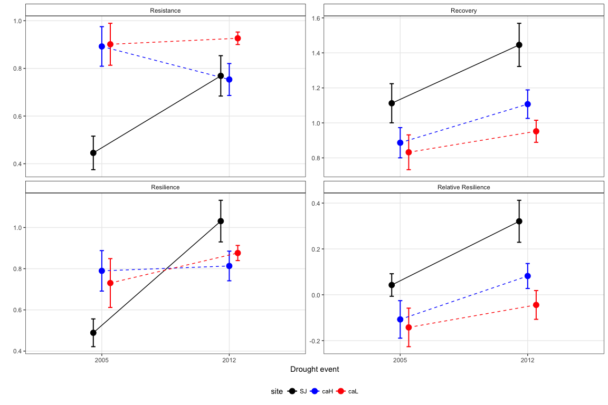

```{r setup, include=FALSE}
knitr::opts_chunk$set(echo = TRUE)
library(tidyverse)
library(here)
library(pander)
library(kableExtra)
```

# Introduccion 

--- 

# Sequía

- Aumento en la **severidad** y **frecuencia** de los eventos de sequías en las últimas décadas, especialmente para el sur de Europa [@VicenteSerrano2014; @Spinoni2015; @Stagge2017]
- Eventos extremos P. Ibérica: 1981, 1995, 2000, **2005**, **2012**  [@GarciaHerrera2007; @Gouveia2015; @Trigo2013]

## Análisis adicionales
 
- SPEI (Standardised Precipitation-Evapotranspiration Index) para datos regionales y locales
- Precipitación acumulada del año hidrológico en curso 
- Long term (>1950) y short-term (>2000)

--- 

Sequía (análisis adicionales): SPEI 

- Escala **regional**:
    - Datos de [SPEI Global Drought Monitor](http://sac.csic.es/spei/database.html) para Sierra Nevada (spatial resolution of 0.5º) Ver [esto](https://github.com/ajpelu/qpyr_resilience/blob/master/analysis/drought/explore_drought_spei_regional.md) 

- Escala **local**:
    - Calcular datos SPEI para tres estaciones de la [red RIA](http://www.juntadeandalucia.es/agriculturaypesca/ifapa/ria/servlet/FrontController) durante el periodo 2000 - 2016: [Cadiar](http://www.juntadeandalucia.es/agriculturaypesca/ifapa/ria/servlet/FrontController?action=Static&url=coordenadas.jsp&c_provincia=18&c_estacion=7), [Padul](http://www.juntadeandalucia.es/agriculturaypesca/ifapa/ria/servlet/FrontController?action=Static&url=coordenadas.jsp&c_provincia=18&c_estacion=10) y [Jerez del Marquesado](http://www.juntadeandalucia.es/agriculturaypesca/ifapa/ria/servlet/FrontController?action=Static&url=coordenadas.jsp&c_provincia=18&c_estacion=6)
    - Curvas de precipitación acumulada RIA y datos base Aérea (obtenidos de la REDIAM) (desde 1950) 
    - Ver [flexdashboard drought](https://rawgit.com/ajpelu/qpyr_dendro/master/analysis/drought/drought_dashboard.html) 
    
--- 


---

- Para la caracterización de los dos periodos de sequía ¿Incluir alguna referencia a estos análisis (quizá como *supplementary materials*) o solamente referencias bibliofrágicas?

--- 

Aquí deberíamos incluir los objetivos del paper y las preguntas 

* Utilizar RS information and tree ring to evaluate el efecto de la sequía
* Resiliencia ..

--- 

# Species study 

{height=300px}

---

# Greenness data 

Para caracterizar el verdor de la vegetación utilizamos *Enhanced Vegetation Index* (**EVI**) [@Huete2002; @Krapivin2015; @Cabello2012]:

  * Mas sensible que NDVI en áreas con mucha biomasa
  * La influencia de las condiciones atmosféricas en el cálculo del índice de vegetación es menor en EVI que en NDVI
  * EVI corrige las señales de fondo del dosel


## Dataset 
* 2000-2016: Una imagen cada 16 días (23 imágenes por año) 
* 250 x 250 m 
* Pixels cubriendo la distribución de los robledales en Sierra Nevada (*n* = 928 pixels) 
* MODIS MOD13Q1 Collection 6 

--- 

## Filtrado de datos EVI 

Quality Assesment (QA band) & VI Usefulness Indices 
 

928 x 20 x 1 + 928 x 23 x 16 = 360064

* 208437 (57.89 %) Good Data 
* Filter out: snow/ice (9268) + cloudy (25504) + NA (44) = 35176 (9.77 %)
* Marginal Data (32.33 %)
    
    * Explorar distribución temporal y analizar banda QA Detailed [@Reyes2015] 
    * En zonas montañosas poner especial atención a datos de sombras [@Reyes2015] 
  
Mas info del [filtrado de datos](https://github.com/ajpelu/qpyr_dendro/blob/master/analysis/prepare_modis_qa.md) 
  
  
Tras el filtrado, nos quedamos con **286825 (79.65 %)**

--- 

## EVI anual medio 

* Además del filtrado, EVI medio es estable frente a la pérdida de datos [@Reyes2015]

{height=200px}
--- 
# Anomalías estandarizadas EVI

* Computo pixel a pixel 
* Proporcionan mas información sobre la magnitud de la anomalía [@Samanta2012, @Gao2016]

$$\mathrm{EVI_{sa,\mathit{i}}}= \frac{\mathrm{EVI_{mean,\mathit{i}}-EVI_{mean,ref}}}{\sigma_{\mathrm{ref}}}$$ 

--- 

# FieldWork

* 2 localidades: SJ (norte) y CA (sur)
* 2 elevaciones por sitio (High-Low) 

* Focal trees: 
    
    * 10 - 15  árboles dominantes por cada sitio
    * 2 cores 5mm 
    * dbh, altura

* Competencia:
    
    * Recuento todos los árboles (dbh > 7.5) dentro de un radio de 10 metros 
    * dbh, altura, distancia árbol focal, rumbo 
    * Índices de competencia dependientes e independientes de la distancia [@GeaIzquierdo2009] 
    * [Resultados](https://github.com/ajpelu/qpyr_dendro/blob/master/analysis/analysis_competence.md)

--- 

 

---


---

# Resilience metrics 

To evaluate the effects of the disturbance events on greeennes and tree growth we used four resilience indices [@Lloret2011]

* **Resistance (*Rt*)** quantifies the severity of the impact of the disturbance in the year it occurred. $$Resistance = Drought / Predrought$$
* **Recovery index (*Rc*)** is the ability to recover from disturbance relative to its severity. 
$$Recovery  = Postdrought / Drought$$
* **Resilience index (*Rs*)** is the capacity to reach pre-disturbance performance levels. 
$$Resilience = Postdrought / Predrought$$
* **Relative Resilience (*RRs*)** is the resilience weighted by the severity of the disturbance. 
$$Relative Resilience = (Postdrought - Drought) / Predrought$$

--- 

* Se calcularon los valores de cada índice de resilience para las variables EVI medio y Tree growth en cada evento de sequía 
* Consideramos 2005 y 2012 como dos eventos de sequía
* Los valores *PreDrought* y *PostDrought* de cada variable (EVI medio y tree growth) se calcularon como la media durante un periodo de tres años antes y despues respectivamente del evento de sequía. Probamos con periodos de 2,3 y 4 años y obtuvimos resultados similares (Elegimos 3 años) 

    * Ver [gráficas](https://github.com/ajpelu/qpyr_dendro/blob/master/analysis/analysis_resilience_bai.md) para BAI
    * Ver [gráficas](https://github.com/ajpelu/qpyr_dendro/blob/master/analysis/evi/compute_resilience_evi.md) para EVI

--- 


--- 


--- 

# Analyses 

--- 

# EVI profile comparison 

 

---

# EVI anomalies 

{width=90%}

---

# Notas anomalias 

* EVI sa menores en 2005 *** (lowest) que en 2012, sobre todo para poblaciones del norte
* Criterio Samanta et al. > + 1 greening | < -1 bronwing 
* [Más info anomalias](https://github.com/ajpelu/qpyr_dendro/blob/master/analysis/evi/explore_anomalies.md ) EVI
* Heterogeneidad de anomalias estandarizadas

--- 

# Mapa de anomalias estandarizadas 

{width=90%}

--- 

# Trayectorias anomalias estandarizadas 

{width=90%}

--- 

# Browing 

{width=90%}

---

```{r, echo=FALSE}
library(knitr)
df <- read.csv(file='../out/anomalies/evi/percen_browing_greening.csv', header=TRUE)

kable(df)
```

--- 

# Patrones generales del EVI medio anual 

* El 78.95 % de los pixeles mostraron una tendencia positiva en cuanto al EVI medio anual (siendo significativa para el 31.67 % de los pixeles). 

* Esta tendencia positiva fué sobre todo mayor en algunas de las poblaciones del suroeste

* Concuerda con datos de ontología (TODO comentar)

--- 

{width=150%}

--- 

{width=150%}

--- 

Trayectorias EVI medio anual 


---

# EVI Resilience metrics


---

```{r, echo=FALSE}
df <- read.csv(here("/out/anovas_resilience/huber_evi", "trimmed_anovas.csv"), header = TRUE)
names(df) <- c('factores', 'F', 'p', 'variables')

dff <- df  %>%  
  filter(variables != "rrs") %>% 
  gather(temp, numeros, F, p) %>% 
  unite(temp1, variables, temp) %>% 
  spread(temp1, numeros) %>% 
  mutate(factores = recode(factores, 
                           "disturb_year" = "Disturb", 
                           "disturb_year:site" = "Disturb X Site", 
                           "site" = "Site")) %>% 
  arrange(match(factores, c("Disturb", "Site", "Disturb X Site")))

kable(dff, format = "latex", booktabs = T,
      col.names = c("", "F", "p", "F", "p", "F", "p"),
      digits=c(0,2,3,2,3,2,3,2,3)) %>% 
  kable_styling(font_size = 8) %>% 
  add_header_above(c("", "rc" = 2, "rs" = 2, "rt" = 2))


```

---

```{r, echo=FALSE}
library(knitr)
df <- read.csv(file='../out/anovas_resilience/huber_evi/robust_mhuber_agg.csv', header=TRUE)

kable(df)
```

--- 

```{r, echo=FALSE}
library(knitr)
df <- read.csv(file='../out/anovas_resilience/huber_evi/robust_mhuber_agg_a.csv', header=TRUE)

kable(df)
```

--- 

```{r, echo=FALSE}
library(knitr)
df <- read.csv(file='../out/anovas_resilience/huber_evi/robust_mhuber_agg_b.csv', header=TRUE)

kable(df)
```

---

# BAI Resilience metrics



--- 

```{r, echo=FALSE}
df <- read.csv(here("/out/anovas_resilience/huber_bai", "trimmed_anovas.csv"), header = TRUE)
names(df) <- c('factores', 'F', 'p', 'variables')

dff <- df  %>%  
  filter(variables != "rrs") %>% 
  gather(temp, numeros, F, p) %>% 
  unite(temp1, variables, temp) %>% 
  spread(temp1, numeros) %>% 
  mutate(factores = recode(factores, 
                           "disturb_year" = "Disturb", 
                           "disturb_year:site" = "Disturb X Site", 
                           "site" = "Site")) %>% 
  arrange(match(factores, c("Disturb", "Site", "Disturb X Site")))

kable(dff, format = "latex", booktabs = T,
      col.names = c("", "F", "p", "F", "p", "F", "p"),
      digits=c(0,2,3,2,3,2,3,2,3)) %>% 
  kable_styling(font_size = 8) %>% 
  add_header_above(c("", "rc" = 2, "rs" = 2, "rt" = 2))


```

---

```{r, echo=FALSE}
dffs <- read.csv(here("/out/anovas_resilience", "trimmed_anovas_joined.csv"), header = TRUE)

kable(dffs, format = "latex", booktabs = T,
      col.names = c("", "F", "p", "F", "p", "F", "p", "variable"),
      digits=c(0,2,3,2,3,2,3,2,3,0)) %>% 
  kable_styling(font_size = 8) %>% 
  add_header_above(c("", "rc" = 2, "rs" = 2, "rt" = 2))

```

--- 

# OJO CON ESTA TABLA (revisar Tabla RS2)

```{r, echo = FALSE, warning = FALSE}
mraw <- df <- read.csv(here("/out/anovas_resilience/huber_bai", "robust_mhuber_agg.csv"), header = TRUE)

m <- mraw %>% 
  filter(var != 'rrs') %>% 
  rename(variables = var)  %>% 
  dplyr::select(c(-n, -Letter)) 


# Datos agrupados para todos los sitios 
mraw_a <- df <- read.csv(here("/out/anovas_resilience/huber_bai", "robust_mhuber_agg_a.csv"), header = TRUE)

m_a <- mraw_a %>% 
  filter(var != 'rrs') %>% 
  rename(variables = var)  %>% 
  dplyr::select(c(-n, -Letter)) %>%  
  mutate(site = "z_all") 

# Datos agrupados para todos los sitios 
mraw_b <- df <- read.csv(here("/out/anovas_resilience/huber_bai", "robust_mhuber_agg_b.csv"), header = TRUE)

m_b <- mraw_b %>% 
  filter(var != 'rrs') %>% 
  rename(variables = var)  %>% 
  dplyr::select(c(-n, -Letter)) %>%  
  mutate(disturb_year = 2099) 


mm <- m %>% 
  bind_rows(m_a) %>%
  bind_rows(m_b) %>% 
  gather(temp, numeros, c(M.Huber, ci)) %>% 
  unite(temp1, c(variables, disturb_year), temp) %>% 
  spread(temp1, numeros, fill = "") 

mm <- mm %>% 
  dplyr::select(site, 
                rc_2005_M.Huber, rc_2005_ci, rt_2005_M.Huber, rt_2005_ci, rs_2005_M.Huber, rs_2005_ci,
                rc_2012_M.Huber, rc_2012_ci, rt_2012_M.Huber, rt_2012_ci, rs_2012_M.Huber, rs_2012_ci,
                rc_2099_M.Huber, rc_2099_ci, rt_2099_M.Huber, rt_2099_ci, rs_2099_M.Huber, rs_2099_ci)


mmt <- mm %>%
   rownames_to_column %>% 
   gather(var, value, -rowname) %>% 
   spread(rowname, value) 

colnames(mmt) <- c("var", "SJ", "caH", "caL", "z_all") 
mmt <- mmt[-19,] 
mmt <- mmt %>% 
  mutate(vars = c(rep("Rc",6), rep("Rt",6), rep("Rs",6)),
         year = c(rep(
           c(rep("2005", 2), 
             rep("2012", 2),
             rep(" ", 2)), 3))) %>% 
  dplyr::select(vars, year, SJ, caH, caL, var)


kable(mmt, 
      format = "latex", booktabs = T) %>% 
  kable_styling(font_size = 7) %>% 
  add_header_above(c("", "", "Northern", "Southern" = 2, "")) 
```

--- 

# References 

--- 

