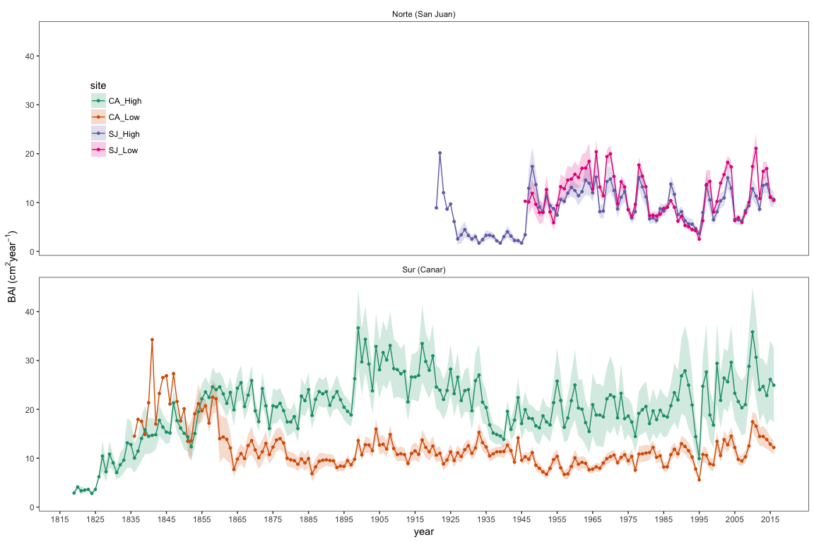
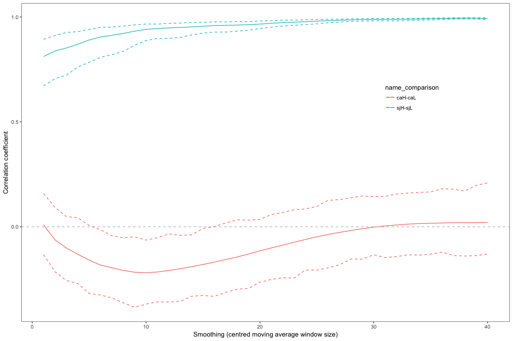

```{r, include=FALSE}
knitr::opts_chunk$set(echo = TRUE)
```

```{r setup, echo=FALSE}
show_text <- FALSE
```


# Long-term growth response 

## BAI 
Computamos el BAI

## Cronologias

* Para cada sitio construimos una cronología utilizando las series de BAI de cada árbol  
* Hemos utilizado la media aritmética

En los siguientes gráficos se muestran las cronologías medias para cada sitio (mean ± se) 

#### Figura 1. Cronologías por sitio

  
### Comparación cronologías 
Las cronologías de la cara norte (SJ) (SJ-High y SJ-Low) son muy similares. Además en cada sitio de SJ, muestreamos solamente 15 árboles, frente a los 20 de cad sitio de Cáñar (sur). Por tanto consideramos incluir solamente dos sitios en cara sur (CA-Low y CA-High) y un solo sitio en cara norte. Adicionalmente a la comparación visual de chronos se realizó el siguiente análisis: 

* Se estudió la similitud de las series de cada sitio dentro de cada localidad, es decir, CA-High vs. CA-Low  y SJ-High vs. SJ-Low. 
* Cada cronología se suavizó utilizando centred moving averages con diferentes tamaño de ventana (entre 1 y 40)
* Posteriormente se calculó la correlación entre las cronologías de cada sitio suavizadas con una misma ventana temporal, por ejemplo: SJ-High suavidaza con window size 5 años vs. SJ-Low suavidaza con window size de 5 años.
* Además se obtuvieron los intervalos de confianza de dichos coeficientes de correlación mediante boostrap. 

En el siguiente gráfico se muestran los resultados de dicha comparación. 



Parece claro que en SJ debemos hacer solo una chrono. La duda aquí es la siguiente, en Material y methods decimos que hemos muestreado dos sitios dentro de cada localidad y que posteriormente nos quedamos con dos en el sur y uno en el norte basados en este análisis anterior, o directamente decimos que hemos muestreado solo tres sitios. Esto también repercutirá en algunas tablas (la de característica de stand, age, etc.) 

### Cronologías por sitio 


Algunas cosas que observamos: 

... 

# Short-term response 

* Usamos pre-withened residual chronologies (growth index, GI res) calculated from biweight means of ratios between raw growth measurements and cubic splines with a frequency cutoff at 30 years [@Fritts1976]


